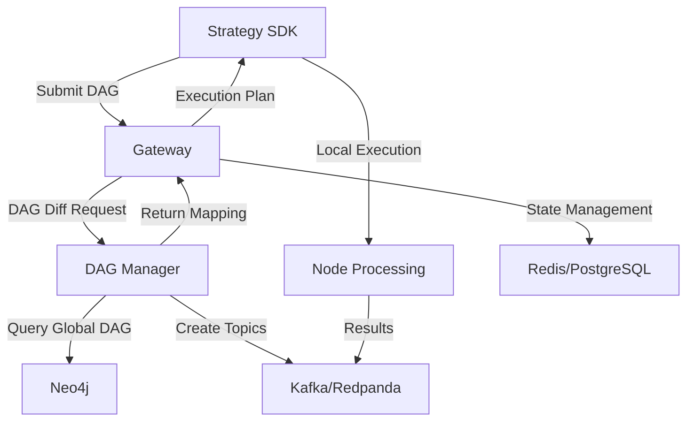
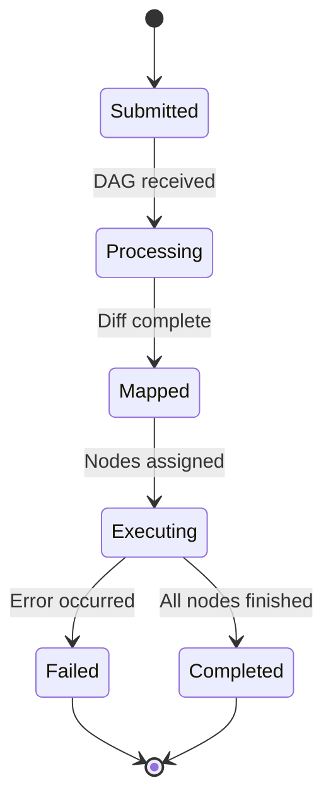

# Design Document

## Overview

The DAG-based strategy execution system implements a distributed architecture where trading strategies are represented as directed acyclic graphs (DAGs) with intelligent computation deduplication. The system consists of four main components: SDK (strategy development), Gateway (state management), DAG Manager (global storage), and supporting infrastructure (Kafka, Neo4j, Redis).

The core innovation is the deterministic NodeID generation that enables computation reuse across strategies. When multiple strategies contain identical nodes, the system executes the computation once and shares results via message queues, significantly reducing resource consumption in multi-strategy environments.

## Architecture

### System Flow



### Component Interaction

1. **SDK → Gateway**: Submits serialized DAG with node metadata
2. **Gateway → DAG Manager**: Requests DAG diff operation via gRPC
3. **DAG Manager → Neo4j**: Queries global DAG for existing nodes
4. **DAG Manager → Kafka**: Creates topics for new nodes (idempotent)
5. **Gateway → SDK**: Returns execution mapping (reuse vs. compute)
6. **SDK**: Executes only required nodes locally with Ray parallelization

## Components and Interfaces

### SDK Component

**Purpose**: Strategy development framework and local execution engine

**Key Classes**:
- `Strategy`: Base class for strategy definition
- `Node`: Represents computation units with deterministic IDs
- `StreamInput`: Input nodes for external data streams
- `TagQueryNode`: Dynamic upstream discovery via tags
- `Runner`: Execution engine supporting backtest/dry-run/live modes

**Interfaces**:
```python
class Node:
    def __init__(self, compute_fn, interval: str, period: int, **kwargs)
    def generate_node_id(self) -> str  # SHA-256 of (type, code, config, schema)
    def feed(self, data) -> bool  # Returns True when period satisfied

class Runner:
    @staticmethod
    def backtest(strategy_class, start_time, end_time, **kwargs)
    @staticmethod
    def live(strategy_class, **kwargs)
    @staticmethod
    def dryrun(strategy_class, **kwargs)
```

### Gateway Component

**Purpose**: State management and DAG forwarding service with FSM-based execution control

**Key Modules**:
- `api.py`: FastAPI HTTP endpoints for DAG submission
- `fsm.py`: Finite state machine for strategy lifecycle
- `dagmanager_client.py`: gRPC client for DAG Manager communication
- `database.py`: PostgreSQL/SQLite abstraction for persistent state
- `redis_client.py`: Redis interface for caching and session state

**State Machine**:


### DAG Manager Component

**Purpose**: Global DAG storage and queue orchestration

**Key Modules**:
- `server.py`: gRPC and HTTP server implementation
- `node_repository.py`: Neo4j-based node storage with APOC queries
- `diff_service.py`: DAG comparison and deduplication logic
- `kafka_admin.py`: Kafka topic management with idempotent operations
- `gc.py`: Garbage collection for unused nodes and topics

**Neo4j Schema**:
```cypher
CREATE (n:Node {
    node_id: String,
    node_type: String,
    code_hash: String,
    config_hash: String,
    schema_hash: String,
    interval: String,
    period: Integer,
    tags: [String],
    created_at: DateTime
})

CREATE (q:Queue {
    topic_name: String,
    node_id: String,
    partition_count: Integer,
    replication_factor: Integer
})

CREATE (n)-[:PRODUCES]->(q)
CREATE (n1)-[:DEPENDS_ON]->(n2)
```

## Data Models

### NodeID Generation

```python
def generate_node_id(node_type: str, code_hash: str, config_hash: str, schema_hash: str) -> str:
    """Generate deterministic NodeID using SHA-256"""
    combined = f"{node_type}:{code_hash}:{config_hash}:{schema_hash}"
    return hashlib.sha256(combined.encode()).hexdigest()
```

### 4-D Tensor Cache Structure

The system uses a 4-dimensional tensor for time-series data caching:

- **u (upstream_id)**: Queue or tag identifier
- **i (interval)**: Data reception interval (60s, 5m, 1h)
- **p (period_slot)**: Rolling window index (0 to P-1)
- **f (feature_index)**: "t" (timestamp) or "v" (value)

```python
class NodeCache:
    def __init__(self):
        self.cache: Dict[str, Dict[int, CircularBuffer]] = {}  # C[u,i,p,f]
    
    def feed(self, upstream_id: str, interval: int, data: Dict) -> bool:
        """Returns True when period requirement satisfied"""
        buffer = self.cache[upstream_id][interval]
        buffer.append(data)
        return len(buffer) >= self.required_period
```

### DAG Diff Response

```python
@dataclass
class DiffResponse:
    new_nodes: List[str]  # Nodes requiring computation
    reuse_nodes: Dict[str, str]  # NodeID -> Topic mapping
    queue_mappings: Dict[str, QueueInfo]
    execution_plan: ExecutionPlan
```

## Error Handling

### Missing Data Policy

```python
class MissingDataPolicy(Enum):
    SKIP = "skip"  # Skip missing intervals
    FAIL = "fail"  # Fail strategy execution
    INTERPOLATE = "interpolate"  # Fill with interpolated values
```

### Retry Mechanisms

1. **Kafka Topic Creation**: 5-step retry with exponential backoff
2. **Neo4j Queries**: Circuit breaker pattern with 3 retries
3. **Redis Operations**: Automatic failover to PostgreSQL
4. **gRPC Communication**: Retry with jitter up to 30 seconds

### Recovery Procedures

1. **Gateway State Loss**: Restore from PostgreSQL WAL + Redis AOF
2. **Neo4j Failure**: Read-only mode with cached DAG data
3. **Kafka Metadata Corruption**: Topic recreation from Neo4j records
4. **Complete System Failure**: Documented runbook with priority order

## Testing Strategy

### Unit Testing

- **SDK**: Node creation, NodeID generation, cache operations
- **Gateway**: FSM transitions, DAG diff logic, API endpoints
- **DAG Manager**: Neo4j queries, Kafka admin operations, GC logic

### Integration Testing

- **End-to-End**: Complete strategy submission and execution flow
- **Multi-Strategy**: Computation deduplication verification
- **Failure Scenarios**: Component failure and recovery testing
- **Performance**: Load testing with concurrent DAG submissions

### Test Data

- **Synthetic Strategies**: Generated DAGs with known overlap patterns
- **Historical Market Data**: Real price feeds for backtesting validation
- **Chaos Engineering**: Controlled failure injection

### Monitoring and Observability

**Prometheus Metrics**:
- `qmtl_diff_duration_ms`: DAG diff operation latency
- `qmtl_nodecache_resident_bytes`: Memory usage per node cache
- `qmtl_sentinel_gap_count`: Version boundary inconsistencies
- `qmtl_queue_reuse_ratio`: Computation deduplication effectiveness

**Grafana Dashboards**:
- Strategy execution overview with node status
- Resource utilization and performance metrics
- Error rates and recovery statistics
- Queue topology and data flow visualization

**CloudEvents Integration**:
```json
{
  "specversion": "1.0",
  "type": "qmtl.dag.submitted",
  "source": "gateway",
  "id": "dag-123",
  "time": "2025-01-16T10:00:00Z",
  "data": {
    "strategy_id": "momentum-strategy",
    "node_count": 5,
    "reuse_count": 3
  }
}
```

This design ensures scalable, reliable, and efficient execution of DAG-based trading strategies while maintaining system integrity and providing comprehensive observability.