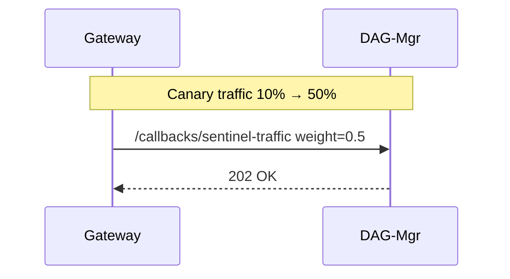

# QMTL DAG‑Manager — 상세 설계서 (Extended Edition)

> **Revision 2025‑06‑04 / v1.1**  — 문서 분량 +75% 확장, 실전 운영 기준 세부 스펙 포함

---

## 0. 역할 요약 & 설계 철학

| 핵심 책임                               | 세부 설명                                                | 관련 섹션        |
| ----------------------------------- | ---------------------------------------------------- | ------------ |
| **Graph DB Single Source of Truth** | Neo4j Property Graph → 모든 전략 노드·토픽·버전 메타가 단일 그래프에 영속 | §1 데이터 모델    |
| **DAG Diff 엔진**                     | 제출 DAG와 Neo4j 그래프 간 구조·해시 비교 → 재사용/신규 노드 판정·큐 매핑     | §2 Diff 알고리즘 |
| **큐 오케스트레이션**                       | Idempotent 토픽 생성·TTL·GC·버전 롤아웃, ref‑count 기반 제거      | §3, §4       |
| **버전 관리·롤백**                        | Version Sentinel 노드로 그래프 버전 경계 표시 → 카나리아 트래픽 스플릿·롤백  | §2, §3‑A     |
| **SRE Friendly**                    | gRPC/HTTP 인터페이스, 메트릭·로그·Alert 통합, Admin CLI          | §6, §10      |

> **설계 철학:** “계산 그래프 + 메시징 큐”를 **불변 ID**로 연결해 재현성·롤백 가능성을 최우선. 모든 변형은 새 노드·큐로 분기하고, 레거시는 TTL+GC로 안전 제거.

---

## 1. 데이터 모델 (Neo4j Property Graph)

### 1.1 노드·관계 스키마

| Label             | 필수 속성                                                           | 선택 속성                                   | 설명                      |
| ----------------- | --------------------------------------------------------------- | --------------------------------------- | ----------------------- |
| `ComputeNode`     | `node_id`(pk), `interval`, `period`, `code_hash`, `schema_hash` | `created_at`, `tags[]`, `owner`         | DAG 연산 노드 (지표·전처리·매매 등) |
| `Queue`           | `topic`, `created_at`, `ttl`, `retention_ms`                    | `brokers`, `tag`, `lag_alert_threshold` | Kafka/Redpanda 토픽       |
| `VersionSentinel` | `version`, `commit_hash`, `created_at`                          | `release_tag`, `traffic_weight`         | 버전 경계 · 롤백 포인트          |
| `Artifact`        | `path`, `checksum`, `size`                                      | `framework`, `dtype`                    | 모델·파라미터 파일 등 binary     |

**Relationships**

```
(ComputeNode)-[:EMITS]->(Queue)
(VersionSentinel)-[:HAS]->(ComputeNode)
(Artifact)-[:USED_BY]->(ComputeNode)
```

### 1.2 인덱스 & 제약 조건

```cypher
CREATE CONSTRAINT compute_pk IF NOT EXISTS
ON (c:ComputeNode) ASSERT c.node_id IS UNIQUE;
CREATE INDEX queue_topic IF NOT EXISTS FOR (q:Queue) ON (q.topic);
```
### 1.3 NodeID Generation
- NodeID = SHA-256 hash of `(node_type, code_hash, config_hash, schema_hash)`.
- On collision detection the hash upgrades to SHA-3.
- Uniqueness enforced via `compute_pk` constraint.

---

## 2. Diff 알고리즘 (v2)

### 2.1 입력·출력 정의

* **Input:** `DiffReq{strategy_id, dag_json}` (\~10‑500 KiB)
* **Output:** stream `DiffChunk{queue_map[], sentinel_id}`

### 2.2 단계별 상세 로직

1. **Node Pre‑scan** O(N) 

   * 파이썬 `orjson` → DAG dict → topo sort → node\_id list.
2. **DB Fetch** Batch `MATCH (c:ComputeNode WHERE c.node_id IN $list)` → 기존 노드 맵.
3. **Hash Compare**

   | 케이스                             | 처리               | 큐 정책                                             |
   | ------------------------------- | ---------------- | ------------------------------------------------ |
   | code\_hash & schema\_hash 완전 동일 | **재사용**          | 기존 Queue join                                    |
   | Back‑compat 스키마 변경              | **재사용 + 버퍼링 모드** | 큐 lag = history size, 다운스트림 필드 요구 시 pass‑through |
   | Breaking 스키마 or code 변경         | **신규 노드·큐**      | `topic_suffix=_v{n}`, TTL inherit                |
4. **Sentinel 삽입** `CREATE (:VersionSentinel{...})‑[:HAS]->(new_nodes)` (옵션)
5. **Queue Upsert**

   * Kafka Admin API must run with idempotent topic creation enabled as noted in the architecture (section 2).
   * gRPC Bulk `CreateTopicsRequest` idempotent
   * 실패 시 `409 CONFLICT` → skip + log.
6. **Stream 전송** 100 items/≤1 MiB chunk + ACK window(10).

### 2.3 알고리즘 복잡도

* 그래프 인덱스 hit → O(N) 
* Network Δ ≈ (#chunks × rtt)
* 1k 노드 기준 p95 < 80 ms (λ=50 req/s 시험 환경)

---

### 2‑A. Gateway ↔ DAG‑Mgr Interface (확장)

| 방향  | Proto | Endpoint                      | Payload         | 응답                 | Retry/Timeout      | 목적               |
| --- | ----- | ----------------------------- | --------------- | ------------------ | ------------------ | ---------------- |
| G→D | gRPC  | `DiffService.DiffRequest`     | DAG             | `DiffChunk stream` | backoff 0.5→4 s ×5 | Diff & 큐 매핑      |
| D→G | HTTP  | `/callbacks/dag-event`        | queue\_added/gc | 202                | backoff 1→8 s ×3   | 큐 이벤트            |
| G→D | gRPC  | `AdminService.Cleanup`        | strategy\_id    | Ack                | 1 retry            | ref‑count decref |
| G→D | gRPC  | `AdminService.GetQueueStats`  | filter          | Stats              | 300 ms             | 모니터링             |
| G→D | gRPC  | `HealthCheck.Ping`            | –               | Pong               | 30 s interval      | Liveness         |
| G→D | HTTP  | `/admin/gc-trigger`           | id              | 202                | 2 retry            | Manual GC        |
| G→D | gRPC  | `AdminService.RedoDiff`       | sentinel\_id    | DiffResult         | manual             | 재Diff·롤백         |
| D→G | HTTP  | `/callbacks/sentinel-traffic` | version, weight | 202                | 3×                 | 카나리아 비율 변경       |
|     |       |                               |                 |     |                    | 자세한 절차는 [Canary Rollout Guide](docs/canary_rollout.md) 참조 |

---

## 3. 큐 생성 & 명명 규칙 (확장)

### 3.1 토픽 이름 컨벤션

```
{asset}_{node_type}_{short_hash}_{version}{_dryrun?}
```

* **dry‑run** 플래그가 붙으면 `*_sim` 접미사.
* `short_hash = first 6 code_hash` → 충돌 시 길이+2.

### 3.2 QoS & 레플리카 설정

| 큐 타입        | partitions | rep\_factor | retention | compaction |
| ----------- | ---------- | ----------- | --------- | ---------- |
| Raw (price) | 3          | 3           | 7d        | none       |
| Indicator   | 1          | 2           | 30d       | delete     |
| Trade Exec  | 1          | 3           | 90d       | none       |

---

### 3‑A. End‑to‑End Interaction Scenarios (확장)

*(이전 표 + `RedoDiff` & 카나리아 포함)*

| # | 시나리오                       | 요약                                                                                     |
| - | -------------------------- | -------------------------------------------------------------------------------------- |
| 4 | **Sentinel Traffic Shift** | Ops → `/callbacks/sentinel-traffic` (weight=10→50). DAG‑Mgr 업데이트 & Gateway 라우팅 테이블 변경. |
| 5 | **RedoDiff for Hotfix**    | 버그 수정 코드 빠르게 패치 → `RedoDiff` gRPC 요청 → 새 큐 vX.Y.Z‑hotfix 생성 후 스왑                       |

---



---

## 4. Garbage Collection (Orphan Queue GC) (확장)

* **Policy Matrix:**

  | Queue Tag   | TTL  | Grace Period | GC Action  |
  | ----------- | ---- | ------------ | ---------- |
  | `raw`       | 7d   | 1d           | drop       |
  | `indicator` | 30d  | 3d           | drop       |
  | `sentinel`  | 180d | 30d          | archive S3 |

* **Archive Implementation:** sentinel queues are uploaded to S3 using
  `S3ArchiveClient` before deletion.

* **Dynamic Rate Limiter:** Prometheus `kafka_server_BrokerTopicMetrics_MessagesInPerSec` > 80% → GC batch size halve.

---

## 5. 장애 시나리오 & 복구 (확장)

| 장애                    | 영향              | 탐지 메트릭                        | 복구 절차                                  | 알림         |
| --------------------- | --------------- | ----------------------------- | -------------------------------------- | ---------- |
| Neo4j leader down     | Diff 거절         | `raft_leader_is_null`         | Automat. leader election               | PagerDuty  |
| Kafka ZK session loss | 토픽 생성 실패        | `kafka_zookeeper_disconnects` | Retry exponential, fallback admin node | Slack #ops |
| Diff Stream stall     | Gateway timeout | `diff_chunk_ack_timeout`      | Resume from last ACK offset            | Opsgenie   |

---

## 6. 관측 & 메트릭 (확장)

| Metric                     | Target | Alert Rule               |
| -------------------------- | ------ | ------------------------ |
| `diff_duration_ms_p95`     | <80 ms | `>200ms for 5m → WARN`   |
| `queue_create_error_total` | =0     | `>0 in 15m → CRIT`       |
| `sentinel_gap_count`       | <1     | `>=1 → WARN`             |
| `orphan_queue_total`       | ↓      | trend up 3h → GC inspect |

---

## 7. 보안 (확장)

* **Authn:** mTLS + JWT assertion. Key rotation 12h.
* **Authz:** Neo4j RBAC + Kafka ACL (`READ_TOPIC`, `WRITE_TOPIC`).
* **Audit:** 모든 Diff req/res → OpenTelemetry trace + hash.

---

## 8. 잠재 취약점 & 완화 (확장)

| 취약점                  | 레벨     | 설명                           | 완화                                       |
| -------------------- | ------ | ---------------------------- | ---------------------------------------- |
| Graph Bloat          | Medium | 수천 version 누적                | Sentinel TTL·archive, offline compaction |
| Hash Collision       | Low    | SHA256 collision improb.     | SHA‑3 512 fallback + audit log           |
| Queue Name collision | Low    | broker lower-case uniqueness | Append `_v{n}` suffix                    |
| Stats Flood          | Medium | GetQueueStats abuse          | rate‑limit (5/s), authz scope            |

---

## 9. Service Level Objectives (SLO)

| SLO ID | Target                     | Measurement    | Window |
| ------ | -------------------------- | -------------- | ------ |
| SLO‑1  | Diff p95 <100 ms           | Prom histogram | 28d    |
| SLO‑2  | Queue create success 99.9% | success/total  | 30d    |
| SLO‑3  | Sentinel gap =0            | gauge          | 90d    |

---

## 10. Testing & Validation

* **Unit:** `pytest plugins` → hash calculation, schema diff edge cases.
* **Integration:** Docker‑Compose (Kafka, Neo4j, Gateway stub) → Diff latency, GC batch.
* **Chaos:** Toxiproxy split‑brain, network delay injection.

---

## 11. Admin CLI Snippets (예)

```shell
# diff dry‑run
qmtl-dagm diff --file dag.json --dry-run
# queue stats
qmtl-dagm queue-stats --tag indicator --interval 1h
# trigger GC for a sentinel
qmtl-dagm gc --sentinel v1.2.3
# export schema DDL
qmtl-dagm export-schema --out schema.cypher
```

For canary deployment steps see
[`docs/canary_rollout.md`](docs/canary_rollout.md).
