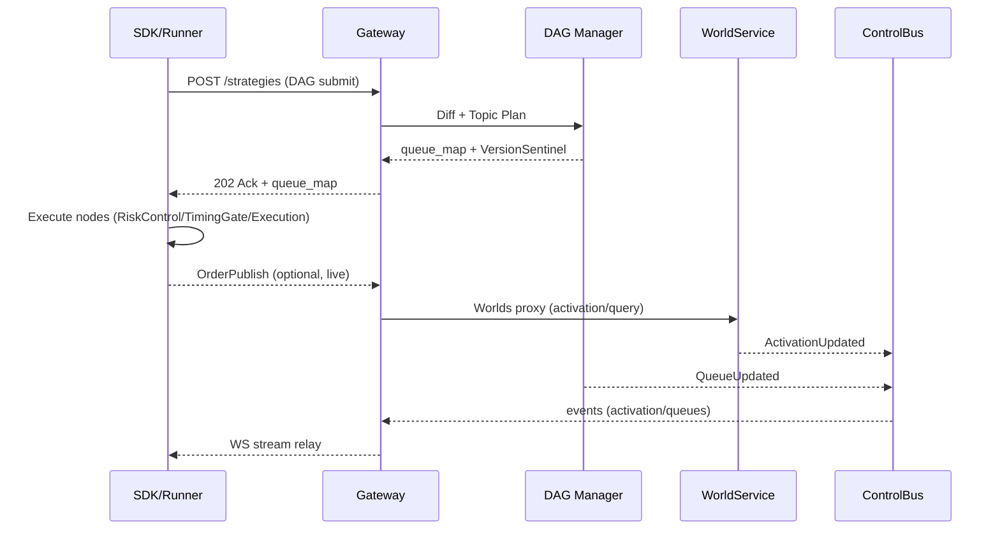
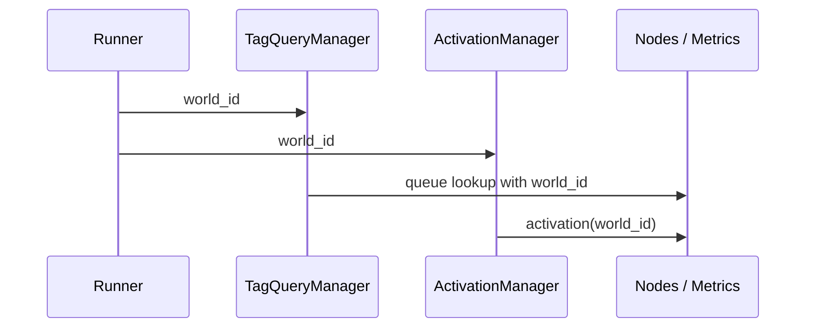
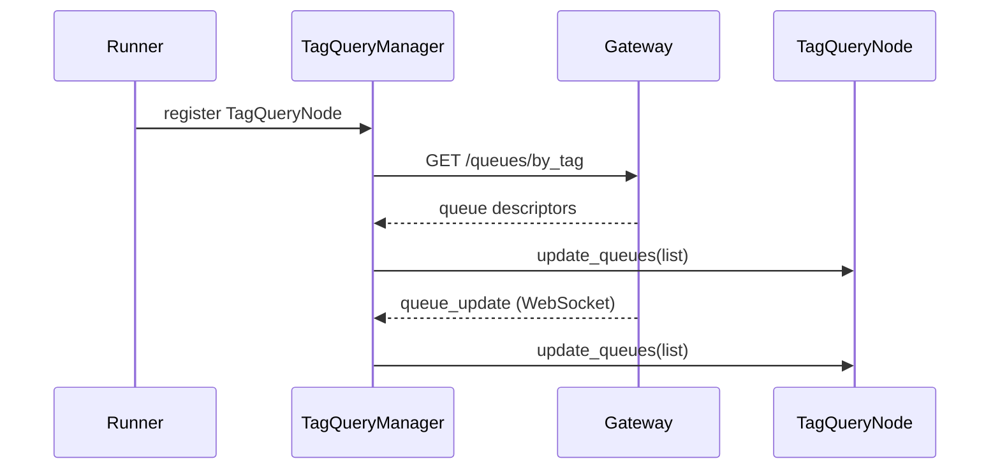

{{ nav_links() }}

# QMTL 고급 아키텍처 및 시스템 구현 계획서

## 관련 문서
- [Architecture Overview](README.md)
- [Gateway](gateway.md)
- [DAG Manager](dag-manager.md)
- [Lean Brokerage Model](lean_brokerage_model.md)
- [WorldService](worldservice.md)
- [ControlBus](controlbus.md)
- [Exchange Node Sets](exchange_node_sets.md)

!!! tip "빠른 시작: 검증 → 환경 → 기동"
    운영용 YAML을 작성했다면 `uv run qmtl config validate --config <파일> --offline`
    으로 구조를 확인하고, `uv run qmtl config env export --config <파일> > .env.qmtl`
    후 `source .env.qmtl` + `export QMTL_CONFIG_FILE=<파일>` 을 실행하라. 그러면
    `qmtl service gateway` / `qmtl service dagmanager server` 가 동일한 설정으로
    부팅되며, 누락된 섹션이 있을 때 `QMTL_CONFIG_EXPORT` 메타데이터와 함께 경고가
    출력된다.

---

## 0. 개요: 이론적 동기와 시스템화의 목적

QMTL은 전략 기반 데이터 흐름 처리 시스템으로, 복잡한 계산 DAG(Directed Acyclic Graph)를 효율적으로 실행하고, 반복적 계산을 피하면서 재사용 가능한 컴퓨팅 자원을 최대한 활용하는 것을 주요 목표로 한다. 특히 DAG의 구성요소를 연산 단위로 분해하고 이를 전역적으로 식별·재활용할 수 있도록 함으로써, 유사하거나 동일한 전략 간에 불필요한 계산 자원 낭비를 최소화할 수 있다. 예를 들어 A 전략과 B 전략이 공통적으로 사용하는 가격 신호 처리 노드가 있다면, 해당 노드는 한 번만 실행되고 그 결과는 두 전략에서 모두 참조할 수 있게 된다. 이는 고빈도 실행 환경 또는 다중 전략 포트폴리오 환경에서 시간 복잡도와 메모리 사용량을 획기적으로 줄이는 데 기여한다.

본 문서는 이러한 구조적 재사용성을 달성하기 위한 QMTL 아키텍처의 설계 철학, 계층 구조 정의, 컴포넌트 간의 통신 프로토콜, 상태 복원 메커니즘, 큐 오케스트레이션에 필요한 결정론적 조건들을 이론적·실무적 관점에서 조망하며, 전체 시스템 구현을 위한 종합적 로드맵을 제시한다.

---

## 1. 시스템 구성: 계층 간 상호작용과 처리 흐름

```mermaid
graph LR
  subgraph Client
    SDK[SDK / Runner]
  end
  subgraph Edge
    GW[Gateway]
  end
  subgraph Core
    WS[WorldService (SSOT Worlds)]
    DM[DAG Manager (SSOT Graph)]
    CB[(ControlBus — internal)]
    GDB[(Graph DB)]
    KQ[(Kafka/Redpanda)]
  end

  SDK -- HTTP submit/queues/worlds --> GW
  GW -- proxy --> WS
  GW -- proxy --> DM
  DM --> GDB
  DM --> KQ
  WS -- publish --> CB
    DM -- publish --> CB
    GW -- subscribe --> CB
    GW -- WS (opaque) --> SDK
```

1. **SDK**는 전략을 DAG로 직렬화하고 Gateway에 제출/질의한다. 실행 중에는 Gateway의 WS로부터 불투명(ControlBus 기반) 이벤트 스트림을 전달받아 활성/큐 변경을 반영한다.
2. **Gateway**는 외부 단일 접점으로서 WorldService/DAG Manager를 프록시하고, 캐시/서킷/관측을 담당한다. 또한 ControlBus를 구독하여 SDK로 이벤트를 재전송한다.
3. **WorldService**는 월드/정책/결정/활성의 SSOT이며, 결정·활성 업데이트를 ControlBus에 발행한다.
4. **DAG Manager**는 그래프/노드/큐의 SSOT이며, Diff와 큐 오케스트레이션을 수행하고 QueueUpdated 이벤트를 ControlBus에 발행한다.
5. **SDK**는 반환된 큐 매핑에 따라 로컬에서 필요한 노드만 실행하며, 활성 게이트(OrderGateNode)로 주문 발동을 제어한다.

이 구조는 DAG의 구성요소 단위 재사용을 통해 시간복잡도와 자원 소비를 최소화하며, DAG 전체가 아닌 부분 연산 재활용을 통해 글로벌 최적화를 달성한다.

### 1.1 노드 계열 개요: 리스크 · 타이밍 · 실행 · 오더 퍼블리싱

아래 다이어그램은 최신 노드군의 역할과 실행 시퀀스를 요약한다. 리스크/타이밍 게이트는 실행 전단에서 신호를 억제하거나 지연하며, 실행/퍼블리싱 단계는 브로커리지 모델·커밋 로그를 통해 주문을 기록·전달한다.

```mermaid
flowchart LR
    subgraph Inputs
        D1[StreamInput/Features]
    end
    subgraph Pre‑Trade Controls
        R[RiskControlNode\n(portfolio/position limits)]
        T[TimingGateNode\n(session/time rules)]
    end
    subgraph Execution Layer
        X[ExecutionNode\n(order type, TIF, slippage/fees)]
        P[OrderPublishNode\n(commit‑log / gateway proxy)]
    end

    D1 --> R --> T --> X --> P
```

참고 문서
- 운영 가이드: [리스크 관리](../operations/risk_management.md), [타이밍 컨트롤](../operations/timing_controls.md)
- 레퍼런스: [Brokerage API (실행/슬리피지/수수료)](../reference/api/brokerage.md), [Commit‑Log 설계](../reference/commit_log.md), [World/Activation API](../reference/api_world.md), [Order & Fill Event Schemas](../reference/api/order_events.md)

### 1.2 시퀀스: SDK/Runner ↔ Gateway ↔ DAG Manager ↔ WorldService

SDK/Runner가 전략을 제출하고, Gateway가 DAG Manager/WorldService를 중개하며, ControlBus 이벤트를 통해 활성/큐 변경이 실시간 반영되는 전체 플로우를 도식화한다.



관련 구현·사양은 아래 문서를 참고한다: [Gateway 사양](gateway.md), [DAG Manager 사양](dag-manager.md), [WorldService](worldservice.md). 운영·사용 관점의 예시는 [operations/](../operations/README.md) 및 [reference/](../reference/README.md) 하위 문서에 정리되어 있다.

### 1.3 Execution Domains & Isolation (new)

- Domains: `backtest | dryrun | live | shadow`. ExecutionDomain은 WorldService가 소유·결정하는 1급 개념이며, 게이팅과 프로모션은 2‑Phase Apply(Freeze/Drain → Switch → Unfreeze)로 백엔드에서 구동한다. SDK/Runner는 도메인을 “선택”하지 않으며, 오직 월드 결정의 결과를 반영한다.
- NodeID vs ComputeKey: NodeID는 전역·월드무관 식별자다. 실행/캐시 격리를 위해 DAG Manager와 런타임은 `ComputeKey = blake3(NodeHash ⊕ world_id ⊕ execution_domain ⊕ as_of ⊕ partition)`를 사용한다. 교차 컨텍스트 캐시 적중은 정책 위반이며 SLO=0이다. SDK는 ComputeKey를 “제안”하거나 “주입”하지 않는다 — 런타임/서비스가 WS 결정과 제출 메타를 근거로 도출·검증한다.
- WVG 확장: `WorldNodeRef = (world_id, node_id, execution_domain)`로 도메인별 상태/검증이 분리된다. `WvgEdgeOverride`로 기본 교차‑도메인 경로(예: backtest→live)를 비활성화하고, 프로모션 후 정책으로만 활성화한다.
- Envelope 매핑: Gateway/SDK는 `DecisionEnvelope.effective_mode`를 ExecutionDomain으로 “표시만” 하여 ControlBus/WebSocket 사본에 `execution_domain` 필드를 덧붙여 중계한다(WS의 정규 스키마에는 포함되지 않는다). SDK/Runner는 이를 입력으로만 취급하며 도메인을 자의적으로 변경하지 않는다. 매핑은 `validate→backtest(주문 게이트 OFF)`, `compute-only→backtest`, `paper→dryrun`, `live→live`이며, `shadow`는 운영자 전용이다.
- Queue 네임스페이스: 프로덕션 배포에서는 `{world_id}.{execution_domain}.<topic>` 프리픽스로 토픽을 분리해야 한다(SHALL). 교차 도메인 구독·발행은 ACL로 금지하며, 운영 환경에서만 예외를 명시적으로 허용한다. 기본 도메인 표기는 운영적 네임스페이스 목적의 “live”를 따른다. 단, 실행 모드 기본값은 WS 결정 부재·만료 시 “compute‑only(backtest, 주문 게이트 OFF)”이다.
- WorldNodeRef 독립성: 서로 다른 `execution_domain` 조합은 상태·큐·검증 결과를 공유할 수 없다(SHALL). 공유가 필요한 경우 Feature Artifact Plane(§1.4)처럼 불변 아티팩트만 사용한다.
- Promotion guard: WVG의 `WvgEdgeOverride`는 기본적으로 backtest→live 경로를 비활성화하며(SHALL), 2‑Phase Apply 완료 후 정책에 따라 명시적으로만 해제한다.

### 1.4 Feature Artifact Plane (Dual-Plane)

- 목표: Feature Plane(불변)과 Strategy/Execution Plane(도메인 스코프)을 분리하여 안전하게 재사용하면서 격리를 유지한다.
- Feature Artifact Key (SHALL): `(factor, interval, params, instrument, t, dataset_fingerprint)`.
- 저장소: 파일 시스템, 객체 스토리지, RocksDB 등 불변 백엔드 중 하나를 사용하고, 라이브에서는 읽기 전용으로 마운트한다(SHOULD).
- 공유 원칙: 도메인 간 공유는 Feature Artifact 파일만 읽기 전용으로 허용한다(SHALL). 런타임 캐시(ComputeKey 기반)나 상태는 도메인 간 공유가 금지된다.
- Retention/Backfill: 아티팩트는 버전 관리되며, 백테스트/리플레이 요구에 맞춰 보존 정책과 백필 경로를 문서화한다(SHOULD). 삭제 전에는 소비자 영향도를 평가한다.
- ComputeKey 연계: 런타임에서 캐시 히트가 발생하면 `ComputeKey`는 현 도메인의 값만 참조해야 하며, Feature Artifact는 입력 창구로만 사용한다.
- 구현 상태: SDK Runner는 `qmtl.runtime.sdk.feature_store` 계층(FileSystem 기본 어댑터, `QMTL_FEATURE_ARTIFACT_DIR` · `QMTL_FEATURE_ARTIFACT_VERSIONS` 환경변수 지원)을 통해 백테스트/드라이런 도메인에서 자동으로 아티팩트를 기록하고, `CacheView.feature_artifacts()`로 라이브/섀도우 도메인에서 읽기 전용 소비를 보장한다.
- Dataset Fingerprint: 모든 아티팩트·스냅샷은 `dataset_fingerprint`에 고정된다. Fingerprint가 일치하지 않으면 하이드레이션/조회가 차단되어 프로모션 경로에서 데이터 혼합을 방지한다.
- CLI/Backfill 워크플로: 로컬 백필 시 `QMTL_FEATURE_ARTIFACT_DIR=/mnt/artifacts`처럼 경로를 고정하고, 필요 시 `QMTL_FEATURE_ARTIFACT_WRITE_DOMAINS`로 쓰기 허용 도메인을 제한하여 리플레이와 검증 파이프라인을 분리한다.

### 1.5 Clock & Input Guards

- 백테스트/드라이런은 VirtualClock을 사용하고(as_of 필수) 라이브는 WallClock을 사용한다(SHALL). 혼용 호출은 빌드/정적 검증 단계에서 실패해야 한다.
- 모든 백테스트 입력 노드는 `as_of`(dataset commit)를 명시해야 하며(SHALL), Gateway는 누락 시 거부하거나 안전 모드로 강등한다.
- SDK는 노드/런너 레벨에서 클록 타입을 “주석 수준으로 선언”할 수 있으나, 최종 권한은 백엔드(WS/GW)에 있다. 정책과 결정과 상충할 경우 WS/GW는 요청을 거부하거나 안전 모드(backtest, 주문 게이트 OFF)로 강등한다.

### 전역-로컬 분리와 불변식 (GSG/WVG)

본 문서에서는 약어를 다음과 같이 사용한다.
- Global Strategy Graph (GSG): 내용 주소화된 전역 DAG로, 동일 내용 노드의 전역 유일성(uniqueness)을 보장하는 불변/append‑only 그래프. DAG Manager가 SSOT이다. 상세 용어는 Architecture Glossary를 참조한다(architecture/glossary.md).
- World View Graph (WVG): 각 월드(World)가 GSG를 참조하여 구성하는 월드‑로컬 오버레이 그래프. 유효성/상태/결정 등 월드 의존 메타데이터를 보관하며 WorldService가 SSOT이다. 상세 용어는 Architecture Glossary를 참조한다(architecture/glossary.md).

- SSOT 경계: GSG(전역 DAG)는 DAG Manager(불변/append‑only), WVG(월드 오버레이)는 WorldService(가변)가 소유한다. Gateway는 프록시/캐시이며 SSOT가 아니다.
- 불변식
  - 전역 유일성: 동일 내용의 노드는 하나의 NodeID만 존재(MUST).
  - 월드‑로컬 격리: 유효성·중단 결정은 기본 world‑local로 독립(MUST).
  - 명시적 전파만 허용: 전파는 scope/규칙/TTL 명시 시에만 허용(MUST).
  - 재현성: Validation은 컨텍스트 해시(EvalKey)로 캐시(SHOULD).
- 월드-로컬 에지 오버라이드: 특정 월드에서 비활성화할 에지는 **WVG**의 `WvgEdgeOverride`로 기록(MAY).
- EvalKey (BLAKE3, namespaced)
```
EvalKey = blake3:(NodeID || WorldID || ContractID || DatasetFingerprint || CodeVersion || ResourcePolicy)
```
같은 노드여도 월드/데이터/정책/코드/자원이 다르면 재평가한다.

### World ID 전달 흐름

`world_id`는 전략 실행 시 `Runner`로부터 `TagQueryManager`와 `ActivationManager`로 전달되어 큐 조회와 활성 이벤트 구독에 사용됩니다. 이 값은 다시 각 노드의 `world_id` 속성과 메트릭 레이블에 주입되어 월드별 데이터가 명확히 구분됩니다.



```python
from qmtl.runtime.sdk import Strategy, StreamInput, Runner

class FlowExample(Strategy):
    def setup(self):
        price = StreamInput(tags=["BTC", "price"], interval="1m", period=30)
        self.add_nodes([price])

Runner.run(FlowExample, world_id="arch_world", gateway_url="http://gw")
```

위 호출에서 `TagQueryManager`는 `GET /queues/by_tag` 요청에 `world_id`를 포함하고, `ActivationManager`는 `/worlds/{world_id}/activation`을 주기적으로 조회하여 주문 게이트와 메트릭에 반영합니다.

#### WorldStrategyBinding (WSB)

- **정의:** `WSB = (world_id, strategy_id)` 바인딩 레코드. 제출 시 각 월드에 대해 멱등적으로 생성된다.
- **제출 방식:** Gateway의 `/strategies`는 이제 `world_ids[]`(복수) **또는** `world_id`(단수, 하위호환)를 받는다. SDK는 여전히 단일 `world_id` 실행을 권장하며, 다중 월드 운용 시에는 월드마다 프로세스를 분리한다.
- **동작:** Gateway는 DAG Diff 이후 WorldService에 **WSB upsert**를 호출하여 해당 월드의 WVG에 `WorldNodeRef(root)`를 생성/갱신한다. Activation 및 Decision은 **항상 WVG(월드-로컬)** 에 기록된다.

---

---

## 2. 전략 상태 전이 시나리오와 원인-결과 연쇄

| 시나리오 유형 | 1차 원인                | 2차 시스템 반응                | 3차 결과 및 해석                                    |
| ------- | -------------------- | ------------------------ | --------------------------------------------- |
| **낙관적** | 동일 연산 해시 재사용 가능      | DAG Diff 결과 일부 노드 실행 불필요 | 리소스 최적화, 전략 처리 시간 단축                          |
| **중립적** | 동시 큐 생성 요청           | Kafka의 Idempotent API 동작 | 중복 큐 생성 회피, 트랜잭션 정합성 유지                       |
| **비관적** | Gateway의 Redis 상태 유실 | 복구 불가능한 상태 손실 위험         | AOF 및 PostgreSQL Write-Ahead Logging 활용 복구 수행 |

---

## 3. 구조적 기술 설계 및 메타 모델링 개선 제안

1. **결정적 노드 식별자(NodeID)** — *GSG Canonical ID*

   - **정의:** NodeID = `blake3:<digest>` of the **canonical serialization** of  
     `(node_type, interval, period, params(split & canonical), dependencies(sorted by node_id), schema_compat_id, code_hash)`.
   - **규칙:** 비결정적 필드(타임스탬프/난수 시드/환경변수 등)는 **입력에서 제외**. 모든 분리 가능한 파라미터는 `params`에서 **개별 필드**로 분리하고 키 정렬·정밀도 고정(JSON canonical form).
   - **네임스페이스:** 해시 문자열은 반드시 `blake3:` **접두사**를 갖는다. 충돌 방지·강화를 위해 필요 시 **BLAKE3 XOF**로 길이 확장하고, 도메인 분리를 유지한다.
   - **구현:** SDK와 Gateway는 `CanonicalNodeSpec` 빌더를 사용해 노드 페이로드를 구성한다. 빌더는 필드 순서를 고정하고 `schema_compat_id` 기본값과 월드/도메인 파라미터 배제를 보장하며, `.from_payload()` / `.to_payload()` 브리지로 기존 DAG JSON과 상호 변환된다.
   - **스키마 호환성:** NodeID 입력에는 `schema_compat_id`(Schema Registry의 major‑compat 식별자)를 사용한다. Minor/Patch 수준 변경에서는 동일 `schema_compat_id`를 유지하므로 Back‑compat 스키마 변경 시에도 `node_id`는 보존된다.
2. **버전 감시 노드(Version Sentinel)** : Gateway가 DAG를 수신한 직후 **자동으로 1개의 메타 노드**를 삽입해 "버전 경계"를 표시한다. SDK·전략 작성자는 이를 직접 선언하거나 관리할 필요가 없으며, 오로지 **운영·배포 레이어**에서 롤백·카나리아 트래픽 분배, 큐 정합성 검증을 용이하게 하기 위한 인프라 내부 기능이다. Node‑hash만으로도 큐 재사용 판단은 가능하므로, 소규모·저빈도 배포 환경에서는 Sentinel 삽입을 비활성화(옵션)할 수 있다.
   자세한 카나리아 트래픽 조절 방법은 [Canary Rollout Guide](../operations/canary_rollout.md)에서 설명한다.
3. **CloudEvents 기반 이벤트 스펙 도입** : 표준 이벤트 정의를 통해 시스템 확장성과 언어 독립성을 확보
4. **상태 머신 기반 실행 제어(xState)** : 전략 상태 흐름을 Finite-State-Machine으로 모델링하여 이론 검증 가능성과 시각화 용이성 확보
5. **Ray 기반 병렬 처리** : 병렬 실행 시 Python multiprocessing을 Ray로 대체하여 메모리 격리성과 클러스터 확장성을 보장
6. **관측성(Observability) 강화** : Prometheus, Grafana, Kafka Exporter, Neo4j APOC 프로파일러 기반의 지표 수집 및 병목 분석

---

### 3.1 다중 업스트림을 갖는 노드의 시간 기반 데이터 처리 모델

#### 이론적 배경

노드가 수신하는 다수의 업스트림 큐는 각기 다른 시간 해상도(interval)를 갖는다. 이로 인해 노드는 일정 기간(period) 동안의 데이터 윈도우를 유지하며 연산을 수행해야 한다.

#### 구조 정의 (4‑D Tensor Model)

| 축 (axis)                | 의미                                 | 예시                                       |
| ----------------------- | ---------------------------------- | ---------------------------------------- |
| **u – upstream\_id**    | 태그 또는 큐 ID (인터벌 포함)                | `btc_price_binance`, `eth_price_binance` |
| **i – interval**        | 데이터 수신 간격 (초·분·시) **– 노드 필수**      | `60s`, `5m`, `1h`                        |
| **p – period slot**     | 롤링 윈도우 인덱스 $0 … P<sub>i</sub>−1$   | `0‑29` (30 bars)                         |
| **f – feature index**   | `"t"`(버킷 타임스탬프) 또는 `"v"`(값)        | `"t"`, `"v"`                            |

* **데이터 구조**: 4‑D xarray 또는 PyArrow Tensor `C[u,i,p,f]` 로 구현.
* **메모리 가드레일**: period × interval 초과 영역은 슬라이스 단위로 즉시 evict하며,
  Tensor 슬라이스는 Apache Arrow chunk로 매핑해 zero‑copy 전달한다. GC 작업은 Ray
  Actor로 분리 스케줄링한다.
* **Arrow 캐시 백엔드 옵션**: 환경 변수 `QMTL_ARROW_CACHE=1`을 설정하면 PyArrow 기반
  캐시가 활성화됩니다. `QMTL_CACHE_EVICT_INTERVAL` 값으로 만료 슬라이스를 검사하는
  주기를 조정하며, Ray가 설치되어 있으면 eviction 로직이 Ray Actor로 실행됩니다.
  CLI의 `--no-ray` 옵션으로 비활성화할 수 있습니다.
* **다중 인터벌·다중 업스트림 지원**: `u` 축 (업스트림)과 `i` 축 (인터벌)을 분리함으로써 1m·5m·1h 등 다양한 간격과 여러 태그 큐를 동시에 저장·검색 가능.
* **캐시 채우기 규칙**: 노드는 `∀(u,i) : |C[u,i]| ≥ Pᵢ` 조건을 만족할 때에만 프로세싱 함수가 호출된다.
* **타임스탬프 정렬 예시**: interval = 1 m, period = 10, 시스템 UTC = 10:10:30 ⇒ `f="t"` 슬롯에는 10:01 … 10:10(10개 캔들)이 저장된다.
* **결측 처리**: 캔들 누락 시 `missing_flag` ↦ 재동기화 요청 또는 `on_missing` 정책(`skip`/`fail`) 적용.
* **타임스탬프 버킷팅**: NodeCache는 타임스탬프 입력 전에 `timestamp - (timestamp % interval)` 값을 적용해 저장하며 gap 검출도 버킷 값에 기반한다.

#### 설계 요구사항 요약

1. **필수 `interval` 필드** — 모든 `Node` 메타 정의에 `interval`을 **필수 (primary key)** 로 포함한다. 예) `interval: 1m`, `5m`, `1h`. 정수(초)나 문자열 형식(`"1h"`, `"30m"`, `"45s"`) 모두 허용된다.
2. **업스트림 데이터 캐시** — 3‑D 맵 대신 4‑D Tensor `C[u,i,p,f]` 구조를 사용한다. 축 정의는 위 표를 참조하며, 큐 인서트는 벡터 단위·만료는 FIFO pop으로 수행된다.
3. **프로세싱 함수(Compute-Fn) 규약** — 노드의 계산 함수는 순수 함수로, `data_cache` 외부 상태를 읽거나 쓰지 않는다. 모든 `compute_fn`은 `NodeCache.view()`이 반환하는 **read-only CacheView** 한 개만을 인자로 받으며, I/O(큐 publish, DB write) 역시 금지.

   ```python
   def fn(view) -> pd.DataFrame:
           ...
   ```
4. **Period 충족 조건** — 노드 트리거 공식: `∀ u ∈ upstreams : len(view[u][interval]) ≥ period`.
5. **시간축 정의** — 타임스탬프 인덱스 `t = floor(epoch / interval)` 로 정규화한다. 예) interval = 1 m, period = 10, 시스템 시각 10:10:30 → 요구 인덱스 10:01 … 10:10.
6. **데이터 유효성 체크** — 삽입 시 Δt ≠ interval 이면 `missing_flag` 설정 후 재동기화 요청(`on_missing`).
7. **설정 DSL 스케치** — YAML 예시:

   ```yaml
   nodes:
     - id: rsi_1m
       interval: 1m
       period: 14
       compute: ta.rsi
     - id: corr_1h
       interval: 1h
       period: 10
       upstream_query:
         tags: ["ta-indicator"]
       compute: stats.corr
   ```

8. **실행 흐름 분리** — ``Node.feed`` 는 데이터를 캐시에 저장만 하고,
   필요한 데이터가 모이면 ``True`` 를 반환해 Runner 에게 계산을 위임한다.
   이로써 ``Node`` 는 ``Runner`` 에 의존하지 않으므로 테스트가 한층 용이하다.

#### 런타임 처리 절차


1. Gateway는 DAG 제출 시 각 노드에 대해 interval/period 세팅을 판단
2. SDK는 지정된 upstream별로 CircularBuffer를 생성
3. 큐로부터 FIFO 방식으로 데이터를 수신하며, period 범위 내에서 평균(mean), 표준편차(std), 이동 최소값(min), 상관계수 계산(corr), 사용자 정의 지표 연산 등 다양한 시계열 통계 처리를 수행

#### 전략 설정 예시 (YAML)

```yaml
upstream_settings:
  - interval: 60
    period: 30
  - interval: 300
    period: 12
```

#### 설계 영감

TimeScaleDB의 Continuous Aggregates 원리를 연산 캐시 계층에 적용하여, 정해진 시간 해상도에서 미리 정의된 집계 쿼리를 지속적으로 갱신하는 방식과 유사하게, QMTL에서도 interval 및 period에 따라 각 노드가 사용하는 데이터를 미리 캐시하고 업데이트하여 연산 효율성을 높이는 구조를 구현하였다. 특히 TimeScaleDB가 materialized view에 기반해 결과를 지속적으로 갱신하는 것처럼, QMTL은 각 전략 노드가 필요로 하는 데이터 범위를 미리 지정된 기간 동안 유지·갱신함으로써 연산 지연을 줄이고 처리 속도를 극대화한다. 이때 '지정된 기간'은 각 노드의 업스트림별로 설정된 `period × interval` 계산에 기반하여 결정되며, 사용자는 전략 구성 시 노드 단위로 별도의 period 값을 지정하거나, 시스템이 interval별로 제공하는 기본값 테이블에 따라 자동 보간된다. 또한 QMTL은 런타임 중 전략의 상태나 데이터 도달률에 따라 해당 기간의 설정을 제한 범위 내에서 동적으로 조정할 수 있는 기능도 제공하여, 네트워크나 데이터 품질 변화에 적응할 수 있는 유연성을 확보한다. 다만 QMTL은 데이터베이스 기반이 아닌 실시간 메시지 큐 기반으로 동작하며, View 대신 메모리 기반 캐시 구조와 사용자 정의 연산 엔진을 통해 처리된다는 점에서 구현 계층이 다르다. 이러한 차이에도 불구하고, 시간 기반 데이터 집계 성능을 소프트웨어 레벨에서 유사하게 재현하고자 하는 점에서 설계 철학은 구조적으로 유사하다고 볼 수 있다.

#### Tag‑based Multi‑Upstream 큐 자동 매핑

* **Tags 필드**: 각 노드는 하나 이상의 `tags` 배열을 가질 수 있으며, 이는 데이터 성격(예: `price`, `orderbook`, `flow`)이나 자산(`BTC`, `ETH`) 등을 표현한다.
* **전략 작성 시 사용 방식**:

  ```python
  price_stream = StreamInput(
            tags=["BTC", "price"],  # 다중 태그로 큐 자동 매핑
            interval="60s",         # 1분 간격 데이터
            period=30                 # 최소 30개 필요
        )
  ```
* **큐 해석 규칙**

  1. Gateway는 `(tags, interval)` 조합으로 DAG Manager에 질의하여 **전역 DAG에 존재하는 모든 토픽** 중 조건을 만족하는 큐 ID 집합을 가져온다.
  2. SDK는 반환된 큐 리스트를 업스트림으로 등록하며, 필요 시 각 큐별로 독립된 CircularBuffer를 초기화한다.
  3. 노드 실행 시 여러 큐를 **concatenate / align** 처리하여 하나의 시계열 데이터프레임으로 전달하거나, 사용자 정의 집계 함수를 통해 병합한다.
* **장점**: 전략 코드는 자산(sym) 추가 시 태그만 확장하면 되므로 **동형 전략의 대량 배치**에 용이하며, 큐 이름 변경·증가에 대한 민감도가 낮다.
### 3.2 운영 신뢰성과 결정성 강화 (P0 제안 요약)

1. **단일 실행 보장(Once-and-Only-Once)**  
   NodeID와 시간 버킷을 파티션 키로 삼아 Kafka 파티션 및 리스(lease) 기반 오너십을 부여하고, 트랜잭셔널 커밋 로그로 중복 산출물을 제거한다.
2. **이벤트-타임 워터마크와 지연 허용**  
   NodeCache가 워터마크를 유지하며 허용 지연 이내의 역행 데이터는 재계산하고, 초과 데이터는 정책에 따라 무시하거나 별도 처리한다.
3. **런타임 지문(runtime fingerprint)**  
   Python, NumPy 등 런타임 버전을 fingerprint로 기록하고, `runtime_compat` 정책에 따라 재사용 여부를 결정한다.
4. **스냅샷 상태 하이드레이션**  
   주기적으로 NodeCache를 Arrow/Parquet 스냅샷으로 저장해 재기동 시 하이드레이션함으로써 웜업 시간을 크게 단축한다.
5. **Schema Registry 및 CloudEvents 사용**  
   데이터 토픽은 Avro/Proto와 Schema Registry로 버전 호환성을 확보하고, 컨트롤 토픽은 CloudEvents over Protobuf로 통일한다.

---

## 4. 실행 모델 및 구성요소 역할

### 4.1 월드 주도 실행 (World‑Driven)

QMTL 실행은 월드(WorldService)의 결정에 의해 제어된다. Runner는 단일 진입점으로 실행되며, 호출자는 `world_id`만 제공한다. Runner/SDK는 자체적으로 실행 모드를 선택하지 않고, WS가 산출하는 결정(DecisionEnvelope)과 활성(ActivationEnvelope)을 따르며, 결정이 신선하지 않거나 활성 정보가 부재한 경우에는 compute‑only(주문 게이트 OFF)를 기본으로 한다.

Warmup 규칙은 동일하다. 각 노드는 종속 업스트림 큐로부터 `period × interval` 데이터가 충족될 때까지 pre‑warmup 상태이며, 해당 조건 충족 이후에만 결과가 생성된다.

핵심 동작 원칙:
- 제출 시 `(world_id, strategy_id)` 바인딩(WSB)이 WorldService에 생성/보장된다.
- 호출자는 `Runner.run(strategy_cls, world_id=..., gateway_url=...)`만 사용한다.
- WS의 `effective_mode`는 내부 정책 결과이며, Runner는 이를 입력으로만 취급한다.
- 활성 정보가 미상·만료 상태이거나 결정 TTL이 만료되면, Runner는 안전기본(compute‑only, 주문 게이트 OFF)로 유지한다.
- 검증→프로모션(실전 활성화)은 WS의 히스테리시스·게이트 정책과 2‑Phase Apply에 의해 수행된다.

---

## 부록: 일반 전략 예시 코드 (Runner API 적용)

다음은 QMTL 아키텍처의 핵심 요구사항을 모두 충족하는 일반 전략 예시이다. 이 전략은 사용자 정의 연산 함수를 사용하고, 노드 간 직접 참조를 기반으로 DAG을 구성하며, interval/period 기반 캐싱, 실행 모드 구분, pre-warmup 제약 조건 등을 모두 반영한다.

```python
from qmtl.runtime.sdk import Strategy, Node, StreamInput, Runner
import pandas as pd

# 사용자 정의 시그널 생성 함수
def generate_signal(view) -> pd.DataFrame:
    price = pd.DataFrame([v for _, v in view[price_stream][60]])
    momentum = price["close"].pct_change().rolling(5).mean()
    signal = (momentum > 0).astype(int)
    return pd.DataFrame({"signal": signal})

# 전략 정의
class GeneralStrategy(Strategy):
    def setup(self):
        price_stream = StreamInput(
            interval="60s",    # 1분 간격 데이터
            period=30       # 최소 30개 필요
        )

        signal_node = Node(
            input=price_stream,
            compute_fn=generate_signal,
            name="momentum_signal"
        )

        self.add_nodes([price_stream, signal_node])

---

## Seamless Data Provider (SDK)

Seamless DP는 히스토리 데이터의 단일 진입점이며, 캐시/스토리지/백필/라이브 소스를 우선순위에 따라 결합해 투명한 읽기를 제공합니다. 구현은 `qmtl/runtime/sdk/seamless_data_provider.py`에 있으며, 다음 보강 모듈과 연계됩니다.

- 정합성(Conformance): `qmtl/runtime/sdk/conformance.py` — 스키마/타임라인 정규화 인터페이스(초기 no‑op)
- 단일 비행(Coordinator): `qmtl/runtime/sdk/backfill_coordinator.py` — in‑memory 스텁(분산형으로 대체 가능)
- SLA: `qmtl/runtime/sdk/sla.py` — 전략/요청 레벨 제한(옵션)

기본 동작은 변경하지 않으며, 보강 모듈은 옵셔널로 주입됩니다. `history_coverage` 유틸리티는 여전히 커버리지 SSOT로 사용되어 누락 구간 탐지와 병합을 담당합니다.

# 실행 예시 (월드 주도)
if __name__ == "__main__":
    Runner.run(
        GeneralStrategy,
        world_id="general_demo",
        gateway_url="http://gateway.local"
    )
```

---

### 부록: Tag Query Strategy 예시 (다중 Upstream 자동 선택)

아래 예시는 글로벌 DAG에 이미 존재하는 1시간 단위 RSI, MFI 지표 노드들이 `tags=["ta-indicator"]` 로 태깅되어 있을 때, 이를 **TagQueryNode** 를 통해 한 번에 업스트림으로 끌어와 상관계수를 계산(correlation)하는 전략이다.

```python
from qmtl.runtime.sdk import Strategy, Node, TagQueryNode, run_strategy, MatchMode
import pandas as pd

# 사용자 정의 상관계수 계산 함수
def calc_corr(view) -> pd.DataFrame:
    indicator_df = pd.concat([pd.DataFrame([v for _, v in view[u][3600]]) for u in view], axis=1)
    # 컬럼 간 피어슨 상관계수 행렬 반환
    corr = indicator_df.corr(method="pearson")
    return corr

class CorrelationStrategy(Strategy):
    def setup(self):
        # TagQueryNode: 지정 태그+interval에 매칭되는 모든 업스트림 자동 수집
        indicators = TagQueryNode(
            query_tags=["ta-indicator"],  # RSI, MFI 등 사전 계산 지표 노드들과 매칭
            interval="1h",               # 1시간 바 기준
            period=24,                    # 24시간 캐시(24개)
            match_mode=MatchMode.ANY,     # 기본값은 OR 매칭
            compute_fn=calc_corr          # 병합 후 바로 상관계수 계산
        )

        corr_node = Node(
            input=indicators,
            compute_fn=calc_corr,
            name="indicator_corr"
        )

        self.add_nodes([indicators, corr_node])

        # match_mode=MatchMode.ANY 는 하나 이상의 태그가 일치하면 매칭되며,
        # MatchMode.ALL 로 지정하면 모든 태그가 존재하는 큐만 선택된다.

# 실시간 실행 예시 (월드 주도)
if __name__ == "__main__":
    Runner.run(CorrelationStrategy, world_id="corr_demo", gateway_url="http://gateway.local")
```


**TagQueryNode 동작 요약**

1. Runner가 생성한 **TagQueryManager**가 Gateway에 `(query_tags, interval)` 조건을 조회한다.
2. Gateway는 글로벌 DAG을 탐색한 후 매칭되는 큐 목록을 반환하고, TagQueryManager가 이를 ``TagQueryNode`` 에 전달한다.
3. TagQueryNode는 받은 큐 ID만 보관하며, 실제 Kafka 구독과 WebSocket 갱신 역시 TagQueryManager가 담당한다.
4. SDK는 각 큐의 데이터를 수집해 read-only **CacheView** 하나로 묶어 `compute_fn`에 전달한다. `compute_fn`은 반드시 이 뷰 단일 인자만을 받아야 하며, 병합 방식 역시 함수 내부에서 정의한다.
5. 각 큐가 설정된 period를 만족하지 않으면 노드는 ‘pre-warmup’ 상태에 머물며, Gateway가 새로운 큐를 발견하면 TagQueryManager가 `update_queues()`를 호출해 런타임 중에도 업스트림 목록을 확장한다.



이 구조로 전략 작성자는 **큐 이름이나 위치를 몰라도 태그 기반으로 지표 집합을 참조**할 수 있으며, 지표가 추가될 때마다 전략 수정 없이 자동 반영된다.

---

## 부록: 교차 시장 전략 예시 (Cross‑Market Lag Strategy)

비트코인 가격(Binance) 상승이 일정 시차(예: 90분) 후 마이크로스트레티지(MSTR, Nasdaq) 주가 상승으로 이어진다는 가설을 검증·운용하는 전략 예시이다. 입력·출력 시장이 서로 다르므로, **데이터 수집(암호화폐)** 과 **매매 판단(주식)** 노드를 분리하고, 실시간에서는 먼저 `dry-run`으로 성과를 확인한 뒤 `live`로 전환한다.

```python
from qmtl.runtime.sdk import Strategy, Node, StreamInput, Runner
import pandas as pd

def lagged_corr(view) -> pd.DataFrame:
    btc = pd.DataFrame([v for _, v in view[btc_price][60]])
    mstr = pd.DataFrame([v for _, v in view[mstr_price][60]])
    btc_shift = btc["close"].shift(90)
    corr = btc_shift.corr(mstr["close"])
    return pd.DataFrame({"lag_corr": [corr]})

class CrossMarketLagStrategy(Strategy):
    def setup(self):
        btc_price = StreamInput(tags=["BTC", "price", "binance"], interval="60s", period=120)
        mstr_price = StreamInput(tags=["MSTR", "price", "nasdaq"], interval="60s", period=120)

        corr_node = Node(
            input=[btc_price, mstr_price],
            compute_fn=lagged_corr,
            name="btc_mstr_corr"
        )

        self.add_nodes([btc_price, mstr_price, corr_node])

# 실시간 실행: 월드 결정에 따른 게이팅/활성
Runner.run(CrossMarketLagStrategy, world_id="cross_market_lag", gateway_url="http://gateway.local")
```

> **동작 요약**
>
> 1. Binance 1분 BTC 가격과 Nasdaq 1분 MSTR 가격 큐를 각각 태그로 매핑.
> 2. 90분(90샘플) 시차 상관계수를 지속 계산하여 `lag_corr` ≥ 임계값이면 별도 매매 DAG(주식 매수)로 신호 전달 가능.
> 3. 월드의 결정이 검증(Validate)에서 활성(Active)로 승격되면, 동일 전략은 별도 코드 변경 없이 주문 게이트가 ON으로 전환된다.

---

## 5. 구성요소 역할 및 기술 스택

| 컴포넌트        | 기능                                   | 주 기술 스택                               |
| ----------- | ------------------------------------ | ------------------------------------- |
| SDK         | DAG 생성, 전략 코드 실행, 로컬 연산 병렬 처리        | Python 3.11, Ray, Pydantic            |
| Gateway     | 상태 FSM, 전략 전이 로직, DAG diff 수행, 콜백 전송 | FastAPI, Redis, PostgreSQL, xstate-py |
| DAG Manager | Neo4j 기반 전역 DAG 저장 및 증분 쿼리, 큐 생성 판단  | Neo4j 5.x, APOC, Kafka Admin Client   |
| Infra       | 메시지 중개 및 운영 관측 지표 수집                 | Redpanda, Prometheus, Grafana, MinIO  |

---

## Ownership Model

- **SDK** — 로컬에서 DAG를 실행하고 결과를 캐시하지만 전역 상태는 소유하지 않는다.
- **Gateway** — 제출 요청의 수명주기와 Redis 기반 FSM을 관리하나, 그래프·월드·큐의 SSOT는 아니다.
- **DAG Manager** — 전역 ComputeNode와 Queue 메타데이터의 단일 소스이며 토픽 생성·GC를 전담한다.
- **WorldService** — 월드/정책/결정/활성 상태의 소유자이며, 해당 변경을 ControlBus에 발행한다.
- **Infra(Redpanda/Kafka)** — 데이터·컨트롤 평면 스트림의 영속성을 제공하는 커밋 로그 저장소.

---

## Commit-Log Design

QMTL은 **append-only commit log** 설계를 채택하여 모든 상태 변화를 재생 가능한 이벤트로 남긴다.

1. 각 ComputeNode의 출력은 고유 Kafka 토픽(큐)에 append되어, 과거 데이터를 필요 시 재생(replay)할 수 있다.
2. DAG Manager는 큐 생성/갱신과 `QueueUpdated`, `sentinel_weight`와 같은 컨트롤 이벤트를 ControlBus 토픽에 발행한다.
3. Gateway는 전략 제출을 `gateway.ingest` 로그에 기록한 뒤 Diff 결과를 처리하고, 오프셋을 Redis에 저장해 최소 한 번(at-least-once) 처리 보장한다.
4. WorldService 역시 활성/결정 이벤트를 동일한 커밋 로그에 남겨 감사(audit)와 롤백을 지원한다.

이와 같은 로그 기반 설계는 서비스별 **소유권 경계**를 명확히 하며, 장애 발생 시 정확한 시점으로 상태를 복원할 수 있는 토대를 제공한다.

---

## 6. Deterministic Checklist (v0.9)

아래 항목들은 전역 DAG 일관성 및 고신뢰 큐 오케스트레이션을 보장하기 위해 실무에서
검증해야 하는 세부 사항이다.

1. **Gateway ↔ SDK CRC 검증** — Gateway가 계산한 `node_id`와 SDK가 사전 계산한
   값이 `crc32` 필드로 상호 검증된다.
2. **NodeCache 가드레일 & GC** — period × interval 초과 슬라이스를 즉시 evict하고
   Arrow chunk 기반 zero‑copy 전달을 보장한다.
3. **Kafka Topic Create 재시도** — `CREATE_TOPICS→VERIFY→WAIT→BACKOFF` 5단계로
   재시도하며, VERIFY 단계에서 broker metadata를 조회해 유사 이름 충돌을 제거한다.
4. **Sentinel Traffic Shift 확인** — `traffic_weight` 변경 시 Gateway와 SDK가 5초
   이내 동기화되었는지 측정한다.
5. **TagQueryNode 동적 확장** — Gateway가 새 `(tags, interval)` 큐를 발견하면
   `tagquery.upsert` CloudEvent를 발행하고, Runner의 **TagQueryManager**가 이를
   수신해 각 노드의 버퍼를 자동 초기화한다.
6. **Minor‑schema 버퍼링** — `schema_minor_change`는 재사용하되 7일 후 자동
   full‑recompute가 실행된다.
7. **GSG Canonicalize & SSA DAG Lint** — DAG를 canonical JSON + SSA로 변환해 **NodeID 재계산**이 일치하는지 검증한다(분리 가능한 파라미터 개별 필드화 포함).
8. **Golden‑Signal Alert** — Prometheus Rule CRD로 `diff_duration_ms_p95`,
   `nodecache_resident_bytes`, `sentinel_gap_count`에 대한 Alert가 관리된다.
9. **극단 장애 플레이북** — Neo4j 전체 장애, Kafka 메타데이터 손상, Redis AOF
   손실 시나리오별 Runbook과 Grafana 대시보드를 교차 링크한다.
10. **4‑단계 CI/CD Gate** — Pre‑merge SSA Lint와 빠른 백테스트, 24h 카나리아,
    50% 프로모션, 한 줄 롤백 명령으로 이어지는 파이프라인을 구축한다.

11. **NodeID 월드 배제 확인** — NodeID 입력에 `world_id`가 포함되지 않는지 정적/동적 검증. 동일 코드/파라미터/의존에서 월드만 달라져도 NodeID가 변하지 않아야 한다.
12. **TagQueryNode 안정성 검사** — 신규 큐 발견 전/후에 TagQueryNode의 NodeID가 동일함을 확인한다. `query_tags`/`match_mode`/`interval`이 같다면 런타임 해석 결과(업스트림 증가)에 따라 NodeID가 변하면 안 된다.

위 목록이 모두 충족된 시점을 QMTL v0.9 “Determinism” 마일스톤으로 삼는다.


{{ nav_links() }}
