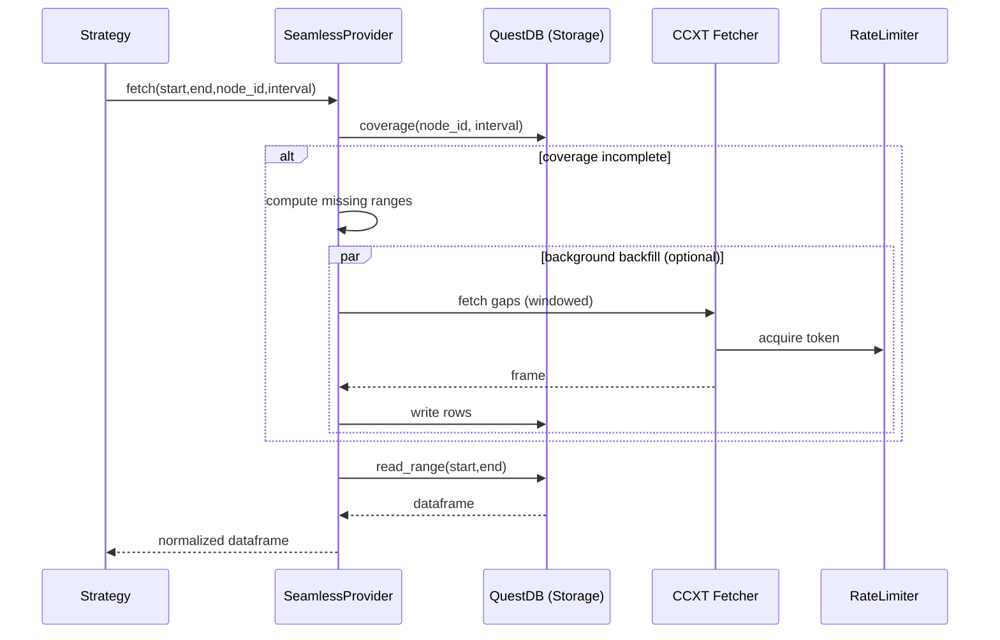

# CCXT × Seamless Provider Design (GPT5-High)

This document proposes a unified architecture to consume crypto market data from multiple exchanges via CCXT while presenting it “as if always available” to strategy code. It composes storage, auto‑backfill, and live feeds behind a single seamless interface.

Related:
- Seamless v2: architecture/seamless_data_provider_v2.md
- DAG Manager: architecture/dag-manager.md
- Gateway: architecture/gateway.md
- CCXT × QuestDB (IO): io/ccxt-questdb.md

## Objectives

- Transparent data access: strategies only depend on a `HistoryProvider` facade.
- Always‑ready illusion: storage + auto‑backfill + (optional) live feed are orchestrated under the hood.
- Multi‑exchange support: configurable per exchange, symbol, timeframe using CCXT.
- Deterministic coverage: strict, interval‑aware gap detection and merging.
- Operational controls: SLA budgets, retries, rate limits, single‑flight, and distributed coordination.

## High‑Level Overview

```mermaid
flowchart LR
    subgraph Strategy/Nodes
      S[Strategy] -->|fetch/coverage| P((Seamless Provider))
    end

    P --> C[Cache Source]
    P --> ST[Storage Source (QuestDB)]
    P --> BF[Auto Backfiller (CCXT)]
    P --> LV[Live Feed (poll/WS)]

    BF --> RL[Rate Limiter]
    BF --> CCXT[CCXT async_support]
    ST --> QDB[(QuestDB)]

    subgraph Control
      SLA[SLA Policy]
      CO[Backfill Coordinator]
      CONF[Conformance Pipeline]
    end

    P --- SLA
    P --- CO
    P --- CONF
```

## Components

- Seamless core: `qmtl/runtime/sdk/seamless_data_provider.py`
  - Strategies: `FAIL_FAST | AUTO_BACKFILL | PARTIAL_FILL | SEAMLESS`
  - SLA: `qmtl/runtime/sdk/sla.py` phase budgets (storage/backfill/live/total)
  - Coverage math: `qmtl/runtime/sdk/history_coverage.py` (merge, gaps)

- Storage (DataSource: STORAGE): `QuestDBHistoryProvider`
  - Backend: `qmtl/runtime/io/historyprovider.py` (read_range/write_rows/coverage)

- Backfill (AutoBackfiller): `CcxtOHLCVFetcher`
  - Module: `qmtl/runtime/io/ccxt_fetcher.py`
  - Windowed pagination, retries, interval normalization
  - Rate limiting: `qmtl/runtime/io/ccxt_rate_limiter.py` (process/cluster Redis)

- Live (LiveDataFeed)
  - Baseline polling: `LiveDataFeedImpl` (bar boundary polling)
  - Optional WS (future): ccxt.pro wrapper (see Extensions)

- Seamless wiring for QuestDB: `EnhancedQuestDBProvider`
  - File: `qmtl/runtime/io/seamless_provider.py`
  - Composes Storage/Backfill/Live into a single provider

## Data Model

- Node identity (recommended): `ohlcv:{exchange_id}:{symbol}:{timeframe}`
  - Example: `ohlcv:binance:BTC/USDT:1m`
- Columns: `ts, open, high, low, close, volume`
- Interval semantics: `timeframe` → seconds via fetcher; coverage/gap math uses interval‑aware rules.

## Control Planes

### SLA

- Phases measured: storage_wait, backfill_wait, live_wait, total.
- Violation throws `SeamlessSLAExceeded` (fail‑fast) or returns partial (PARTIAL_FILL).

### Backfill Coordination

- Single‑flight per process + optional distributed lease via `BackfillCoordinator`.
- Background backfills (fire‑and‑forget) or synchronous ensure/fill flows.

### Rate Limiting

- Process scope: shared semaphore + min interval.
- Cluster scope: Redis token bucket; key partitioned by exchange and optional account suffix.

### Conformance

- `ConformancePipeline`: dtype casts, `ts` normalization, duplicate drop, gap flags.

## Request Flow



## Configuration & Recipes

Minimal seamless provider (Binance 1m OHLCV):

```python
from qmtl.runtime.io import EnhancedQuestDBProvider
from qmtl.runtime.io import CcxtOHLCVFetcher, CcxtBackfillConfig
from qmtl.runtime.sdk.sla import SLAPolicy

fetcher = CcxtOHLCVFetcher(CcxtBackfillConfig(
    exchange_id="binance",
    symbols=["BTC/USDT"],
    timeframe="1m",
))

provider = EnhancedQuestDBProvider(
    dsn="postgresql://localhost:8812/qdb",
    fetcher=fetcher,
    strategy=...  # SEAMLESS (default), AUTO_BACKFILL, PARTIAL_FILL, FAIL_FAST
    conformance=None,
    partial_ok=True,
)

# Optional SLA
provider_with_sla = EnhancedQuestDBProvider(
    dsn="postgresql://localhost:8812/qdb",
    fetcher=fetcher,
    sla=SLAPolicy(
        max_wait_storage_ms=300,
        max_wait_backfill_ms=5000,
        total_deadline_ms=1500,
        max_sync_gap_bars=2,
    ),
)
```

Multi‑symbol/timeframe helper (alternate path): `CcxtQuestDBProvider.from_config_multi(...)` for quick scaffolding; for SLA/partial/live orchestration, prefer `EnhancedQuestDBProvider`.

## Operational Guidance

- Coordinator URL: `QMTL_SEAMLESS_COORDINATOR_URL`
- Redis DSN (cluster RL): `QMTL_CCXT_RATE_LIMITER_REDIS`
- Metrics: backfill requests/rows/duration, SLA phase durations, coverage bounds
- Health/Monitoring: operations/monitoring.md, operations/seamless_sla_dashboards.md

## Testing

- Preflight hang scan: see guides/testing.md
- Unit: fetcher normalization, coverage/gap, SLA boundaries
- Integration (optional/slow): mark `slow`, prefer recorded responses or sandbox exchanges

## Extensions (Future Work)

- ccxt.pro live feed module implementing `LiveDataFeed` (watchOHLCV, reconnect, dedupe)
- Cross‑exchange synthetic series: weighted midprice aggregation as a separate Node
- Advanced gap repair: trades→bar resampling when OHLCV gaps persist

