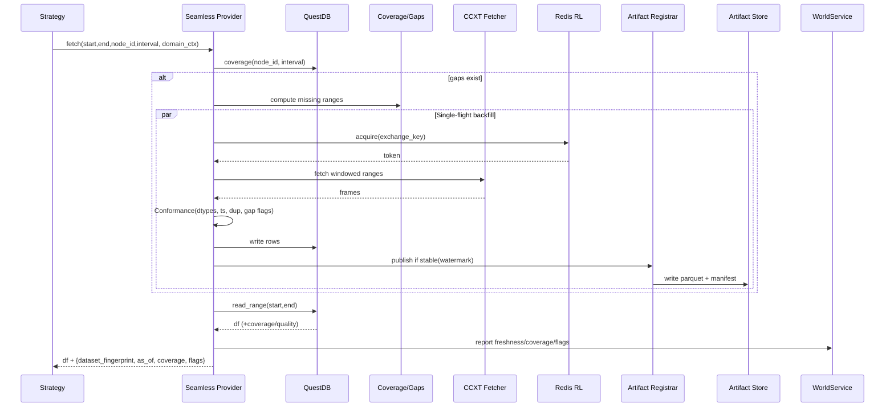

 
---
title: "CCXT × Seamless Provider 하이브리드 통합 설계 (High + Codex)"
tags:
  - architecture
  - design
  - ccxt
  - data-provider
  - reproducibility
  - sla
  - artifact
author: "QMTL Team"
last_modified: 2025-09-25
---

{{ nav_links() }}

# CCXT × Seamless Provider 하이브리드 통합 설계 (High + Codex)

Related:
- Seamless v2: seamless_data_provider_v2.md
- DAG Manager: dag-manager.md
- Gateway: gateway.md
- CCXT × QuestDB (IO): ../io/ccxt-questdb.md

본 문서는 **CCXT**와 **Seamless Data Provider**를 결합하여, 전략 코드에는 **항상 준비된(Always‑ready)** 데이터 환상을 제공하면서도 **완전 재현성**과 **운영 가시성**을 동시에 보장하는 하이브리드 통합 설계를 정의한다.  
핵심은 gpt5‑high의 **Coverage/Gaps + SLA + Backfill Coordinator + (Redis) Cluster Rate‑limit + Conformance**와 gpt5‑codex의 **`dataset_fingerprint` + `as_of` 고정 + World/Execution 도메인 격리 + Gateway 컨텍스트**를 단일 아키텍처로 합치는 것이다.

---

## 1) 목표(Objectives)

- **투명한 데이터 접근**: 전략은 `HistoryProvider` 파사드만 의존.
- **Always‑ready 환상**: Storage + Auto‑Backfill + (옵션) Live feed를 내부에서 오케스트레이션.
- **정밀 커버리지**: 인터벌 인지 gap 탐지/병합과 부분충족 정책.
- **멀티 거래소/심볼/타임프레임 지원**: CCXT 구성으로 표준화 지원(교환소별 레이트리밋·재시도·윈도우 정책 분리).
- **운영 통제**: SLA(phase budget), 재시도, 분산 레이트리밋, single‑flight 백필, 관찰성.
- **완전 재현성**: `dataset_fingerprint` + `as_of` 기반 불변 아티팩트와 도메인 격리.
- **표준화 규약**: 단일 NodeID 규약과 Conformance 파이프라인.

---

## 2) 한눈에 보는 결론

- **데이터 평면**: gpt5‑high 구성요소 유지(coverage, SLA, backfill coordinator, Redis RL, conformance).
- **거버넌스 평면**: gpt5‑codex 원칙(`dataset_fingerprint`, `as_of`, World/Execution Domain, Gateway 컨텍스트).
- **식별자 분리**:  
  - **요청 키**: `NodeID = ohlcv:{exchange}:{symbol}:{timeframe}`  
  - **버전 키**: `dataset_fingerprint`(내용 주소) + `as_of`(스냅샷 시점)
- **도메인 규칙**(강제):
  - Backtest/Research Lab: `as_of` **필수**, **Artifact‑only**.
  - Dry‑run: `as_of` **필수**, Artifact 우선(저장소 읽기 시 즉시 Artifact화).
  - Live: 신선도 게이팅(`now − data_end ≤ max_lag`), 세션 중 `as_of` **단조↑**(후퇴 금지).

---

## 3) 아키텍처 개요

```mermaid
flowchart LR
  subgraph Strategy/Nodes
    STG[Strategy / Nodes]
  end

  subgraph Seamless Provider
    SP[(Seamless Core)]
    SLA[SLA Policy]
    COV[Coverage & Gap Math]
    CONF[Conformance Pipeline]
    COORD[Backfill Coordinator]
    LIVE[Live Feed (poll/WS)]
    CA[Cache Source (in-mem/LRU\nworld_id/as_of keyed)]
  end

  subgraph IO
    ST[(QuestDB Storage - Hot)]
    AF[(Artifact Store - Cold<br/>Parquet+Zstd+Manifest)]
    RL[(Redis Token Bucket)]
    FET[CCXT Fetcher (async)]
  end

  subgraph Governance/Control
    REG[Artifact Registrar<br/>(dataset_fingerprint, as_of)]
    WLD[WorldService]
    DOM[ExecutionDomain Gate]
  end

  STG -->|fetch(start,end,node_id,interval)| SP
  SP --- SLA
  SP --- COV
  SP --- CONF
  SP --- COORD
  SP --> CA
  SP -->|coverage/read_range| ST
  SP -->|fill gaps| FET --> RL
  SP --> LIVE
  SP -->|publish stable| REG --> AF
  ST -->|manifest sync| REG
  SP -->|quality/freshness| WLD --- DOM
```

---

## 4) 컴포넌트

* **Seamless Core**: `EnhancedQuestDBProvider` 기반, Storage/Backfill/Live를 단일 API로 노출.
* **Coverage & Gap Math**: 인터벌 인지 병합/부족 구간 산출, 부분충족/백필 경계 계산.
* **SLA Policy**: `storage/backfill/live/total` phase budget과 위반 처리(PARTIAL_FILL 또는 FAIL_FAST).
* **Backfill Coordinator**: 프로세스 단 single‑flight + (옵션) 분산 리스.
* **Rate Limiter**: 로컬 세마포어 + **Redis 토큰버킷**(교환소/계정 키 분할).
  - 키 규칙: `key_template = "ccxt:{exchange}:{account?}"`
  - 공정성/안전성: `burst_tokens`, `min_interval_ms`, `penalty_backoff_ms` 지원.
* **Conformance Pipeline**: dtype 캐스팅, `ts` 정렬·정규화, 중복 제거, gap flags, TZ 규격화.
* **Artifact Registrar**: 안정화 수위(watermark) 이후 **불변 세그먼트**를 Parquet로 게시, Manifest 관리.
* **World/Execution 도메인 게이트**: 도메인별 `as_of`·신선도 규칙 적용, Gateway 컨텍스트와 연동.
* **Cache Source**: in‑mem LRU 캐시.
  - 키: `(node_id, [start,end), interval, conformance_version, world_id, as_of)`
  - 정책: LRU + TTL + max_shards. 히트 시 storage/backfill 경로 우회.
* **Live Feed**: 폴링/WS 통합. WS는 지수 백오프(reconnect_backoff) 및 seq/idempotency 키 기반 중복 캔들 제거.

---

## 5) 데이터 & 메타데이터 모델

### 5.1 요청(런타임) 식별자

* **NodeID(표준)**: `ohlcv:{exchange_id}:{symbol}:{timeframe}`
  예) `ohlcv:binance:BTC/USDT:1m`

### 5.2 버전(데이터) 식별자

* **`dataset_fingerprint`**: Canonical Frame(정렬/정규화/중복제거/고정 포맷) +
  `(node_id, [start,end), conformance_version, toolchain_version)`을 입력으로 한 SHA‑256.
* **`as_of`**: 생산 스냅샷 시각/커밋 해시. 한 세션에서 **단조 증가만 허용**(후퇴 금지).
* **Manifest**(불변 메타데이터): 세그먼트 경계(일/시간), 각 `fingerprint`, `row_count`, `conformance_version`, `as_of`, `producer`.

> **요점**: **요청 키(NodeID)**와 **버전 키(fingerprint/as_of)**를 분리해 **운영 유연성 + 완전 재현성**을 동시에 확보.

---

## 6) 요청 흐름(시퀀스)



---

## 7) 도메인 격리·게이팅(강제 규칙)

| 도메인      | as_of                     | 허용 소스                                      | 신선도 제한                     | 위반 시 동작                                   |
| -------- | ------------------------- | ------------------------------------------ | -------------------------- | ----------------------------------------- |
| Backtest | **필수(고정)**                | **Artifact‑only**                          | 무관                         | 즉시 실패(설계상)                                |
| Research(Lab) | **필수(고정)**                | **Artifact‑only**                          | 무관                         | Artifact 미존재 시 실패                         |
| Dry‑run  | **필수(고정)**                | Artifact 우선, Storage 읽기 시 **즉시 Artifact화** | 무관                         | Artifact 미존재 시 실패                         |
| Live     | 선택(세션 시작 시 고정, **후퇴 금지**) | Storage + Backfill + Live                  | `now − data_end ≤ max_lag` | **HOLD/Compute‑only** 또는 **PARTIAL_FILL** |

* **Gateway/WorldService 컨텍스트**:
  `world_id`, `execution_domain`, `as_of`, `max_lag`, `min_coverage`, `policy=FAIL_FAST|PARTIAL|AUTO_BACKFILL|SEAMLESS`

> 캐시/커버리지 메타도 `world_id/as_of` 기준으로 분리 저장하여 혼합을 금지한다.

### 7.1 Codex 원칙 강제(Backtest/Research Lab)

- 입력은 반드시 `as_of` 커밋을 명시하고, Storage 직접 읽기를 금지(Artifact‑only 소비).
- `dataset_fingerprint`가 포함된 불변 세그먼트만 소비하며, 동일 `as_of`에 대해 재실행 시 결과가 바이트 단위로 동일해야 한다.
- 캐시/커버리지/품질 메타는 `world_id/as_of`로 분리 저장하여 다른 도메인과 혼합 금지.
- Gateway/WorldService는 `execution_domain ∈ {backtest, research}`에서 상기 규칙을 강제하고, 컨텍스트 누락 시 즉시 실패한다.

---

## 8) 구성 스키마(파라미터 완전 분리)

```yaml
seamless:
  node_id_format: "ohlcv:{exchange}:{symbol}:{timeframe}"

  conformance:
    version: v2
    dtype_policy: strict
    dup_policy: drop_keep_last
    timezone: UTC
    gap_flagging: true

  sla:
    max_wait_storage_ms: 300
    max_wait_backfill_ms: 5000
    max_wait_live_ms: 800
    total_deadline_ms: 1500
    max_sync_gap_bars: 2
    on_violation: PARTIAL_FILL   # or FAIL_FAST

  backfill:
    mode: background           # or sync
    max_concurrent_requests: 8
    distributed_lease_ttl_ms: 120000
    window_bars: 900
    retry:
      max_retries: 6
      base_backoff_ms: 500
      jitter: true
    single_flight_ttl_ms: 60000

  rate_limit:
    redis_dsn: "redis://localhost:6379/0"
    key_template: "ccxt:{exchange}:{account?}"
    tokens_per_interval: 1200
    interval_ms: 60000
    local_semaphore: 10
    burst_tokens: 200
    min_interval_ms: 25
    penalty_backoff_ms: 5000

  artifact:
    enable: true
    object_store_uri: "s3://qmtl-artifacts"
    format: "parquet"
    compression: "zstd"
    partitioning: "node_id/date=YYYY-MM-DD"
    stabilization_bars: 2
    fingerprint:
      algo: sha256
      include_columns: [ts, open, high, low, close, volume]
      normalize_nan: zero

  cache:
    enable: true
    ttl_ms: 60000
    max_shards: 512
    key: "{node_id}:{start}:{end}:{interval}:{conf_ver}:{world_id}:{as_of}"

  live:
    ws:
      enabled: false           # true to enable ccxt.pro wrapper
      reconnect_backoff_ms: [500, 1000, 2000, 5000]
      dedupe_by: "ts"          # or ts+symbol

  metrics:
    prometheus:
      histograms:
        - seamless_sla_deadline_seconds
      gauges:
        - seamless_backfill_completion_ratio
        - seamless_rl_tokens_available
      counters:
        - seamless_rl_dropped_total

  domains:
    backtest:
      require_as_of: true
      source: artifact_only
    research:
      require_as_of: true
      source: artifact_only
    dryrun:
      require_as_of: true
      source: artifact_prefers
    live:
      max_lag_sec: 120
      allow_partial: true
      monotonic_as_of: true

exchanges:
  binance:
    sandbox: false
    rate_limit_rps: 20
    symbols: ["BTC/USDT", "ETH/USDT"]
  coinbase:
    sandbox: true
    rate_limit_rps: 10
```

> **분리 원칙**: 교환소, SLA, 백필, 레이트리밋, 아티팩트, 도메인 정책을 **완전히 독립 파라미터**로 분리해 튜닝 가능성을 극대화한다.

---

## 9) 참조 구현 스케치

### 9.1 Conformance → Fingerprint → Artifact 게시

```python
def conform_frame(df, interval_s) -> pd.DataFrame:
    df = df.sort_values("ts")
    df["ts"] = (df["ts"] // interval_s) * interval_s  # bar 정렬
    df = df.drop_duplicates(subset=["ts"], keep="last")
    # dtype/NaN/범위 검증 등 추가 규칙...
    return df

def compute_fingerprint(df, meta: dict) -> str:
    payload = serialize_canonical(df, meta)  # 고정 직렬화(열 순서/포맷 고정)
    return sha256(payload).hexdigest()

def maybe_publish_artifact(df, node_id, start, end, conf_ver, as_of, store):
    stable_df = drop_tail(df, bars=2)  # watermark 안정화
    if stable_df.empty:
        return None
    meta = {"node_id": node_id, "range": [start, end], "conformance": conf_ver}
    fp = compute_fingerprint(stable_df, meta)
    write_parquet_with_manifest(stable_df, fp, as_of, meta, store)
    return fp
```

옵션(생성 시점 정책):

- `early_fingerprint: true` → CCXT 워커 스냅샷 시 계산(실험/디버깅에 유리)
- `publish_fingerprint: true` → watermark 안정화 후 계산(운영 불변성 강화)
  - 기본값은 publish 단계에서의 생성(본 문서의 표준 경로)

### 9.2 도메인 정책 적용(Seamless 내부)

```python
def fetch_with_domain_policy(req, domain_ctx, provider):
    df, meta = provider.fetch_raw(req)  # coverage+backfill+storage
    if domain_ctx.domain == "live":
        freshness_ok = (now() - meta["data_end"]) <= domain_ctx.max_lag
        if not freshness_ok:
            return hold_or_partial(meta)  # 게이팅: HOLD 또는 PARTIAL_FILL
    if domain_ctx.require_as_of and not meta.get("as_of"):
        raise AsOfRequiredError()
    return df, meta  # meta: dataset_fingerprint, as_of, coverage, flags
```

_구현 참고_: 기본 `EnhancedQuestDBProvider` 는 데이터프레임만 반환한다. Gateway/WorldService 에 전달하기 전에 위 `maybe_publish_artifact` 경로로 `{dataset_fingerprint, as_of}` 메타데이터를 계산해 응답 메타에 포함시켜야 한다.
SDK 측에서는 `SeamlessFetchMetadata` (`qmtl/runtime/sdk/seamless_data_provider.py`) 로 커버리지, 컨포먼스 플래그, 발행된 fingerprint를 한 번에 조회할 수 있으므로, Gateway 연동 시 이 객체를 사용해 메타를 전달한다.

---

## 10) 운영·관찰성(필수 메트릭 & 알림)

* **SLA 페이즈**: `seamless_storage_wait_ms`, `seamless_backfill_wait_ms`, `seamless_live_wait_ms`, `seamless_total_ms`, `seamless_sla_deadline_seconds{hist}`
* **커버리지/갭**: `coverage_ratio`, `gap_bars`, `gap_repair_latency_ms`
* **레이트리밋**: `seamless_rl_tokens_available`, `seamless_rl_dropped_total`, `per_exchange_rps`
* **아티팩트**: `artifact_publish_latency_ms`, `artifact_bytes_written`, `as_of_advancement_events`, `fingerprint_collisions(should=0)`
* **도메인 게이트**: `domain_gate_holds`, `live_staleness_seconds`, `partial_fill_returns`

ENV 키(운영 런북 연계):

- `QMTL_SEAMLESS_COORDINATOR_URL` — 분산 백필 코디네이터 엔드포인트
- `QMTL_CCXT_RATE_LIMITER_REDIS` — 클러스터 레이트리밋 Redis DSN
- Gateway/World 컨텍스트는 `StrategyComputeContext` (`qmtl/foundation/common/compute_context.py`)가 주입하므로 추가 ENV 토글이 필요하지 않음

> **알림 예시**
>
> * `coverage_ratio < 0.98` 5분 지속 → 경고
> * `live_staleness_seconds > max_lag` 1분 지속 → 라이브 게이트/HOLD 알림
> * `fingerprint_collisions > 0` → 즉시 심각 알림

---

## 11) 스토리지 전략(Hot/Cold 이중화)

* **Hot(QuestDB)**: 최신·가변 데이터, 빠른 조회/백필 쓰기.
* **Cold(Artifact Store)**: 안정화된 불변 세그먼트(Parquet + Zstd + Manifest).
* **Watermark 승격**: `stabilization_bars` 이후 REG→AF 게시, Manifest 갱신.
* **롤백/재현성**: `as_of`로 Manifest 스냅샷 고정 → Backtest/Dry‑run 완전 재현.

---

## 12) 마이그레이션 경로(낮은 리스크 → 높은 효과)

1. **NodeID 규약 통일**: `ohlcv:{exchange}:{symbol}:{timeframe}`
2. **Conformance v2 적용**: 정렬/중복 제거/갭 플래그/타입 캐스팅
3. **SLA 배포**: PARTIAL/FAIL_FAST 정책 명시
4. **Redis RL 도입**: 클러스터 토큰버킷, 로컬 세마포어 하한 유지
5. **Artifact Registrar 추가**: `dataset_fingerprint`/`as_of` 생성 및 Manifest 게시
6. **World/Domain 게이팅**: Gateway 컨텍스트 연동 및 강제 규칙 적용
7. **라이브 신선도 게이트** + **Monotonic as_of**

---

## 13) 수용 기준(테스트)

* 동일 `world_id/as_of`로 두 번 실행 시 **바이트 동일 결과**.
* 라이브 세션 동안 `as_of` **후퇴 불가**(Monotonic).
* `coverage_ratio ≥ 0.98` 유지(1m/5m 기준, 장애 시 10분 내 자동 회복).
* SLA 위반 시 정책대로 **PARTIAL_FILL** 또는 **FAIL_FAST** 반환, 메트릭 기록.
* 동일 NodeID 구간을 다른 시점에 조회해도 **Artifact 경로 고정 시 결과 불변**.

---

## 14) 크로스 도메인 인사이트

* **내용주소형 아티팩트**는 Git/LakeFS/DVC 등 데이터 버저닝의 **사실상 표준** 접근과 합치.
* **Deadline‑aware SLA**는 스트림/서버리스 스케줄링의 표준적 페이즈 예산 모델을 데이터 IO에 이식.
* **Redis 토큰버킷**은 멀티테넌시 API 보호의 **de facto** 레이트리밋 패턴.

---

## 15) 부록

### A. 빠른 시작(단일 심볼)

```python
fetcher = CcxtOHLCVFetcher(CcxtBackfillConfig(
    exchange_id="binance", symbols=["BTC/USDT"], timeframe="1m",
))
provider = EnhancedQuestDBProvider(
    dsn="postgresql://localhost:8812/qdb",
    fetcher=fetcher,
    strategy=...,
    sla=SLAPolicy(...),
)
# ArtifactRegistrar(또는 위 maybe_publish_artifact 경로)를 통해 안정화된 프레임을 게시하고
# Gateway 응답에 `{dataset_fingerprint, as_of}` 메타를 첨부한다.
```

### B. Manifest JSON 스키마(요약)

```json
{
  "node_id": "ohlcv:binance:BTC/USDT:1m",
  "segments": [
    {
      "start": 1719878400,
      "end": 1719964800,
      "dataset_fingerprint": "sha256:...",
      "row_count": 1440,
      "conformance_version": "v2",
      "as_of": "2025-09-25T07:00:00Z",
      "producer": "seamless@qmtl"
    }
  ]
}
```

### C. 기존 문서 대비 변경점 맵

* [`ccxt-seamless-integrated.md`](ccxt-seamless-integrated.md)의 SLA/coverage/backfill/RL/Conformance **및** `dataset_fingerprint/as_of` 거버넌스 지침을 단일 참조로 채택.
* `ccxt-seamless-sonnet4` 설계는 폐기됨(Deprecated/Removed). 관련 편의 API가 필요할 경우에도 본 하이브리드 설계의 NodeID 규약·클러스터 RL·도메인 게이팅·아티팩트 규칙을 따라야 한다.

---
