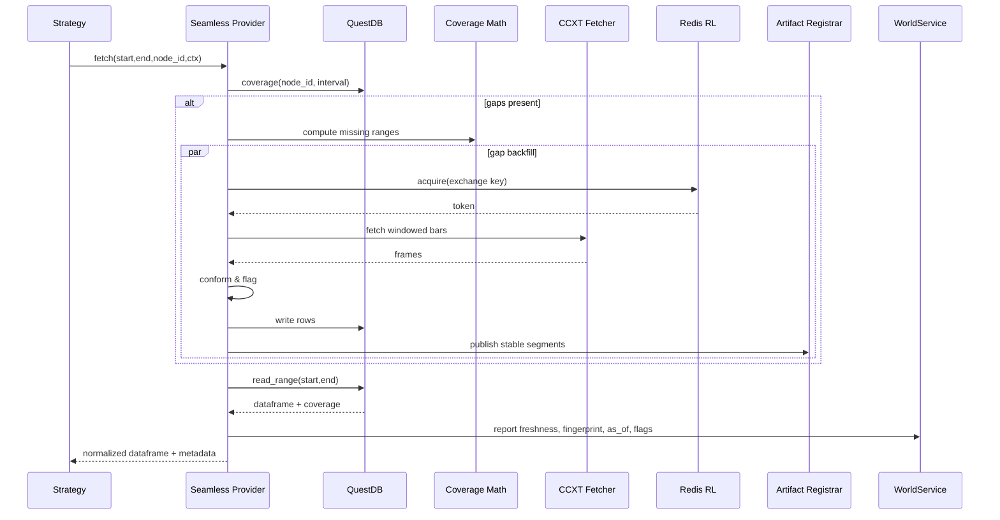

# CCXT × Seamless Integrated Architecture (High + Codex)

## Related Documents
- [Seamless Data Provider v2](seamless_data_provider_v2.md)
- [DAG Manager](dag-manager.md)
- [Gateway](gateway.md)
- [CCXT × QuestDB IO Recipe](../io/ccxt-questdb.md)
- [CCXT × Seamless (GPT5-Codex)](ccxt-seamless-gpt5codex.md)
- [CCXT × Seamless Hybrid Summary](ccxt-seamless-hybrid.md)
- Archived runtime notes previously published as `ccxt-seamless-gpt5high.md` now resolve to this integrated blueprint.

## Scope and Status

This document supersedes earlier split narratives and formalizes the integrated architecture for CCXT-backed Seamless data access. The Sonnet proposal is deprecated and intentionally excluded. Teams should converge on this blueprint when implementing, evolving, or auditing the CCXT + Seamless stack.

## Objectives

- Provide an "always ready" history interface built on existing Seamless runtime primitives.
- Preserve deterministic reproducibility through dataset fingerprints, `as_of` discipline, and domain isolation.
- Support multi-exchange, multi-symbol orchestration with consistent node identities and coverage guarantees.
- Offer explicit operational levers for SLA budgets, backfill coordination, rate limiting, and conformance reporting.
- Maintain compatibility with Gateway, WorldService, and DAG Manager workflows without introducing parallel stacks.

## Architectural Overview

```mermaid
flowchart LR
  subgraph Strategy Layer
    STRAT[Strategies / Node Sets]
  end

  subgraph Seamless Data Plane
    CORE[(Seamless Core)]
    COV[Coverage \n & Gap Math]
    SLA[SLA Policy]
    CONF[Conformance]
    COORD[Backfill Coordinator]
    CACHE[World/AsOf Keyed Cache]
    LIVE[Live Feed (poll/WS)]
  end

  subgraph IO & Storage
    QDB[(QuestDB Storage)]
    FETCH[CCXT Fetcher]
    RL[(Redis Token Bucket)]
    ARTIFACT[(Artifact Store\nParquet + Manifest)]
  end

  subgraph Governance Plane
    REG[Artifact Registrar]
    WLD[WorldService]
    GATE[Gateway / Execution Domain]
  end

  STRAT -->|fetch(start,end,node_id,ctx)| CORE
  CORE --- SLA
  CORE --- COV
  CORE --- CONF
  CORE --- COORD
  CORE --> CACHE
  CORE -->|coverage/read_range| QDB
  CORE -->|fill gaps| FETCH --> RL
  CORE --> LIVE
  CORE -->|publish stable| REG --> ARTIFACT
  REG -->|manifest sync| QDB
  CORE -->|freshness, flags| WLD --- GATE
```

The overview retains the Hybrid document's dual-plane split: the Seamless data plane adopts GPT5-High mechanics, while governance policies trace back to GPT5-Codex. No new provider classes are introduced; the runtime reuses `qmtl/runtime/io/seamless_provider.py` and `qmtl/runtime/sdk` modules.

## Data Plane (GPT5-High Lineage)

### Runtime Composition Overview

```mermaid
flowchart LR
    subgraph Strategy/Nodes
      S[Strategy] -->|fetch/coverage| P((Seamless Provider))
    end

    P --> C[Cache Source]
    P --> ST[Storage Source (QuestDB)]
    P --> BF[Auto Backfiller (CCXT)]
    P --> LV[Live Feed (poll/WS)]

    BF --> RL[Rate Limiter]
    BF --> CCXT[CCXT async_support]
    ST --> QDB[(QuestDB)]

    subgraph Control
      SLA[SLA Policy]
      CO[Backfill Coordinator]
      CONF[Conformance Pipeline]
    end

    P --- SLA
    P --- CO
    P --- CONF
```

### Seamless Core
- Implementation: `EnhancedQuestDBProvider` (`qmtl/runtime/io/seamless_provider.py`).
- Exposed strategies: `FAIL_FAST`, `AUTO_BACKFILL`, `PARTIAL_FILL`, `SEAMLESS`.
- Coordinates cache, storage reads, backfills, and optional live feeds behind a `HistoryProvider` facade.

### Coverage & Gap Accounting
- Deterministic gap detection powered by `qmtl/runtime/sdk/history_coverage.py`.
- Node identity convention: `ohlcv:{exchange_id}:{symbol}:{timeframe}` (e.g. `ohlcv:binance:BTC/USDT:1m`).
- Interval-aware merges ensure every delivered frame is aligned to timeframe boundaries.

#### Coverage Math Quick Reference

| Step | Responsibility | Notes |
| --- | --- | --- |
| Coverage fetch | `QuestDBHistoryProvider.coverage` | Returns contiguous segments with `start`, `end`, and `interval_seconds` metadata. |
| Gap derivation | `HistoryCoverage.compute_missing_ranges` | Produces inclusive/exclusive window tuples respecting timeframe cadence (no partial bars). |
| Merge | `HistoryCoverage.merge_ranges` | Coalesces storage + freshly backfilled spans before readback. |
| Validation | `ConformancePipeline` | Drops duplicates, enforces monotonic timestamps, and flags remaining coverage deltas. |

### Data Model & Interval Semantics
- Canonical OHLCV schema: `ts`, `open`, `high`, `low`, `close`, `volume`.
- `ts` values are stored in nanoseconds; coverage math converts the configured timeframe to seconds to guarantee integer multiples.
- Node identities should include exchange, symbol, and CCXT timeframe. When downstream resampling is required, publish a new node identifier rather than mutating the base cadence.

### Backfill Orchestration
- Backfills driven by `CcxtOHLCVFetcher` and `CcxtBackfillConfig` (`qmtl/runtime/io/ccxt_fetcher.py`).
- Background fills are preferred; synchronous `ensure_coverage` remains available when strategies need deterministic completion.
- Distributed single-flight coordination using `BackfillCoordinator` (process scope) plus the `QMTL_SEAMLESS_COORDINATOR_URL` HTTP endpoint for cross-worker leases.
- Each backfill batch records attempt/complete/fail events to structured logs so operations dashboards can expose fill throughput.

### Rate Limiting
- Process-level throttles rely on asyncio semaphores and minimum-interval guards to prevent CCXT burst bans.
- Cluster-level budgets are enforced via Redis token buckets (`qmtl/runtime/io/ccxt_rate_limiter.py`). Keys should partition on `exchange_id` and optional account suffix.

| Parameter | Purpose | Default Source |
| --- | --- | --- |
| `QMTL_CCXT_RATE_LIMITER_REDIS` | Connection string for cluster token bucket state | Environment variable |
| `tokens_per_interval` | Allowance per rolling window | Provider configuration |
| `interval_ms` | Shared window duration | Provider configuration |
| `burst_tokens` | Extra headroom before throttling | Provider configuration |
| `local_semaphore` | Concurrency cap inside a single process | Provider configuration |

### Provider Recipes

```python
from qmtl.runtime.io import EnhancedQuestDBProvider
from qmtl.runtime.io import CcxtOHLCVFetcher, CcxtBackfillConfig
from qmtl.runtime.sdk.sla import SLAPolicy

fetcher = CcxtOHLCVFetcher(CcxtBackfillConfig(
    exchange_id="binance",
    symbols=["BTC/USDT"],
    timeframe="1m",
))

provider = EnhancedQuestDBProvider(
    dsn="postgresql://localhost:8812/qdb",
    fetcher=fetcher,
    strategy="SEAMLESS",
    conformance=None,
    partial_ok=True,
)

provider_with_sla = EnhancedQuestDBProvider(
    dsn="postgresql://localhost:8812/qdb",
    fetcher=fetcher,
    sla=SLAPolicy(
        max_wait_storage_ms=300,
        max_wait_backfill_ms=5000,
        total_deadline_ms=1500,
        max_sync_gap_bars=2,
    ),
)
```

When scaling to multi-symbol or multi-timeframe coverage, prefer `CcxtQuestDBProvider.from_config_multi(...)` for scaffolding while retaining the enhanced provider for SLA orchestration.

### Live Data Integration
- Default polling `LiveDataFeedImpl` with bar-boundary scheduling that respects timeframe cadence and waits for bar completion before publishing.
- Optional ccxt.pro wrapper (WebSocket) retained as a future extension; enable only when ccxt.pro is present and conformance hooks can deduplicate late frames.
- Live extensions should emit the same coverage metadata as historical reads so Gateway can enforce lag windows.

### SLA & Conformance
- SLA budgets sourced from `qmtl/runtime/sdk/sla.py`; phases include storage_wait, backfill_wait, live_wait, total.
- Conformance pipeline (`qmtl/runtime/sdk/conformance.py`) enforces dtype normalization, timestamp sorting, duplicate drop, and gap flag emission.
- Violations raise `SeamlessSLAExceeded` or return partial fills according to strategy settings.

#### SLA Budget Reference

| Phase | Description | Typical Budget |
| --- | --- | --- |
| `storage_wait` | Time spent waiting on QuestDB responses (read + coverage) | ≤ 300 ms |
| `backfill_wait` | CCXT fetch latency plus stabilization writes | ≤ 5000 ms |
| `live_wait` | Optional live feed wait for most recent bar | ≤ 800 ms |
| `total_deadline` | Aggregate ceiling across phases | ≤ 1500 ms |

Budgets should be tuned per exchange; exceeding any threshold flips the provider into fail-fast or partial modes depending on the selected strategy. Persist SLA outcomes to metrics for alerting.

## Governance Plane (GPT5-Codex Lineage)

### Dataset Identity
- **Runtime key**: `node_id` as defined above.
- **Version key**: `dataset_fingerprint` (SHA-256 over canonicalized frame + metadata) and `as_of` (snapshot or commit instant).
- Artifact manifests record `{fingerprint, as_of, node_id, range, conformance_version, producer}` and live alongside Parquet data in object storage.

### Domain Isolation Rules
- **Backtest**: `as_of` required; data must originate from artifacts only. Absence of artifacts is a hard failure.
- **Dry-run**: `as_of` required; storage reads must be artifactized immediately before reuse.
- **Live**: `as_of` fixed at session start (monotonic non-decreasing). Source stack may use storage, backfill, and live feeds provided `now - data_end ≤ max_lag`. Breaches trigger HOLD/compute-only or PARTIAL_FILL pathways.

### Gateway & WorldService Integration
- Gateway supplies `world_id`, `execution_domain`, `as_of`, `max_lag`, `min_coverage`, and Seamless policy selection per session.
- Seamless responses return coverage metadata, conformance flags, and the `{dataset_fingerprint, as_of}` pair so WorldService can log freshness and gate execution modes.
- Cache entries must key on `(node_id, interval, start, end, conformance_version, world_id, as_of)` to prevent cross-domain leakage.

## Request Lifecycle



This sequence combines the original GPT5-High runtime flow with governance notifications so readers no longer need to consult legacy diagrams.

## Configuration Blueprint

```yaml
seamless:
  node_id_format: "ohlcv:{exchange}:{symbol}:{timeframe}"
  strategy: SEAMLESS
  conformance:
    version: v2
    dtype_policy: strict
    gap_flagging: true
  sla:
    max_wait_storage_ms: 300
    max_wait_backfill_ms: 5000
    max_wait_live_ms: 800
    total_deadline_ms: 1500
    on_violation: PARTIAL_FILL
  backfill:
    mode: background
    window_bars: 900
    single_flight_ttl_ms: 60000
    distributed_lease_ttl_ms: 120000
  rate_limit:
    redis_dsn: "redis://redis.service.local:6379/0"
    key_template: "ccxt:{exchange}:{account?}"
    tokens_per_interval: 1200
    interval_ms: 60000
    burst_tokens: 200
    local_semaphore: 10
  artifact:
    object_store_uri: "s3://qmtl-artifacts"
    format: parquet
    compression: zstd
    stabilization_bars: 2
cache:
  ttl_ms: 60000
  max_shards: 512
  key_template: "{node_id}:{start}:{end}:{interval}:{conf_ver}:{world_id}:{as_of}"
domains:
  backtest:
    require_as_of: true
    source: artifact_only
  dryrun:
    require_as_of: true
    source: artifact_prefers
  live:
    max_lag_sec: 120
    allow_partial: true
    monotonic_as_of: true
exchanges:
  binance:
    sandbox: false
    symbols: ["BTC/USDT", "ETH/USDT"]
    rate_limit_rps: 20
  coinbase:
    sandbox: true
    symbols: ["BTC/USDT"]
    rate_limit_rps: 10
```

The blueprint aligns configuration knobs with existing runtime modules. Teams should implement validation that cross-checks domain policies, rate-limit settings, and artifact destinations during startup.

## Implementation Guidance

1. **Reuse existing providers** – compose `EnhancedQuestDBProvider`, `CcxtOHLCVFetcher`, `BackfillCoordinator`, and SLA policies rather than creating new wrappers.
2. **Artifact publication** – adopt the `maybe_publish_artifact` pattern from the Hybrid doc; Parquet segments must be stabilized (tail bars dropped) before fingerprinting.
3. **World-aware caching** – extend cache layers to include `world_id` and `as_of` components; purge entries on domain switch.
4. **Gateway contract** – ensure each fetch response surfaces `{dataset_fingerprint, as_of, coverage_bounds, conformance_flags}` for Gateway logging and enforcement.
5. **Testing** – follow the documented preflight hang scan, then execute `uv run -m pytest -W error -n auto` with recorded ccxt fixtures or sandbox exchanges. Long-running end-to-end scenarios should be marked `slow` and excluded from the preflight run.

## Operational Practices

- **Environment coordination**: configure `QMTL_SEAMLESS_COORDINATOR_URL` for distributed leases and `QMTL_CCXT_RATE_LIMITER_REDIS` for shared throttles.
- **Metrics**: export `seamless_sla_deadline_seconds`, `seamless_conformance_flag_total`, `seamless_conformance_warning_total`, rate-limit gauges, and coverage counters such as `seamless_backfill_rows_total`.
- **Alerting**: trigger warnings for SLA breaches, persistent coverage gaps, or Redis rate-limit saturation.
- **Backfill visibility**: monitor coordinator claim/complete/fail events via structured logs; integrate into dashboards already defined in `operations/seamless_sla_dashboards.md`.
- **Runbooks**: reference `operations/backfill.md` for manual remediation and `operations/monitoring.md` for Prometheus setup.

## Testing Guidance

- Run the hang-preflight documented in `guides/testing.md` before the full suite to surface import hangs.
- Prefer recorded CCXT responses or sandbox exchanges to keep tests deterministic and classify network-backed tests as `slow`.
- Validate coverage merges with representative gap fixtures (missing first bar, trailing partials, discontinuous mid-range) before enabling Seamless in production.

## Risk Considerations

- Misaligned node IDs or missing `as_of` values can leak mutable data across domains; enforce validation at DAG compile time.
- Redis outages should degrade gracefully by falling back to process-level rate limiting while emitting alerts.
- Artifact publication latency impacts replay reproducibility; monitor stabilization lag and scale orchestration workers accordingly.

---

Adhering to this integrated design guarantees a single, reusable CCXT + Seamless implementation that satisfies runtime performance targets and reproducibility requirements without resuscitating the deprecated Sonnet architecture.

## Extensions

- Implement a ccxt.pro-based `LiveDataFeed` that mirrors polling semantics while leveraging WebSockets for tighter SLAs.
- Explore cross-exchange synthetic series (for example, weighted midprice aggregations) as separate nodes that continue to honor coverage guarantees.
- Evaluate trades-to-bar repair workflows when upstream OHLCV feeds exhibit persistent gaps, emitting provenance metadata for downstream audits.
