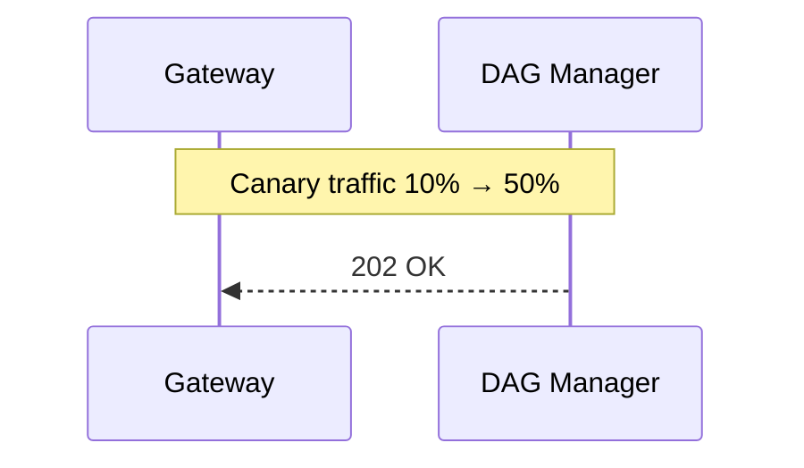

{{ nav_links() }}

# QMTL DAG Manager — 상세 설계서 (Extended Edition)

> **Revision 2025‑06‑04 / v1.1**  — 문서 분량 +75% 확장, 실전 운영 기준 세부 스펙 포함

## 관련 문서
- [Architecture Overview](README.md)
- [QMTL Architecture](architecture.md)
- [Gateway](gateway.md)
- [Lean Brokerage Model](lean_brokerage_model.md)

---

## 0. 역할 요약 & 설계 철학

| 핵심 책임                               | 세부 설명                                                | 관련 섹션        |
| ----------------------------------- | ---------------------------------------------------- | ------------ |
| **Graph DB Single Source of Truth** | Neo4j Property Graph → 모든 전략 노드·토픽·버전 메타가 단일 그래프에 영속 | §1 데이터 모델    |
| **DAG Diff 엔진**                     | 제출 DAG와 Neo4j 그래프 간 구조·해시 비교 → 재사용/신규 노드 판정·토픽 매핑     | §2 Diff 알고리즘 |
| **토픽 오케스트레이션**                       | Idempotent 토픽 생성·TTL·GC·버전 롤아웃, ref‑count 기반 제거      | §3, §4       |
| **버전 관리·롤백**                        | Version Sentinel 노드로 그래프 버전 경계 표시 → 카나리아 트래픽 스플릿·롤백  | §2, §3‑A     |
| **SRE Friendly**                    | gRPC/HTTP 인터페이스, 메트릭·로그·Alert 통합, Admin CLI          | §6, §10      |

> **설계 철학:** “계산 그래프 + 메시징 큐”를 **불변 ID**로 연결해 재현성·롤백 가능성을 최우선. 모든 변형은 새 노드·토픽으로 분기하고, 레거시는 TTL+GC로 안전 제거.
> SDK 측에서 실행되는 모든 `compute_fn`은 `NodeCache.view()`가 반환하는 read-only `CacheView` 한 개만을 인자로 받는다.

---

## 0-A. Ownership & Commit-Log Design

- **Ownership** — DAG Manager는 ComputeNode와 Queue 메타데이터의 단일 소스로서 토픽 생성·버전 롤아웃·GC를 전담한다. Gateway는 제출 파이프라인을 조정하지만 그래프 상태를 소유하지 않으며, WorldService는 월드·결정 상태를 유지한다.
- **Commit Log** — 모든 큐는 Redpanda/Kafka의 append-only 토픽으로 구현되며, DAG Manager는 `QueueUpdated` 등 제어 이벤트를 ControlBus 토픽에 발행한다. 토픽 생성·삭제 이력도 관리 로그에 기록되어 장애 시점 복원과 감사(audit)을 지원한다.

> Terminology / SSOT boundary: "GSG(전역 DAG)"의 SSOT는 DAG Manager이며 불변(append‑only)이다. 월드‑로컬 객체(WVG: WorldNodeRef, Validation, DecisionEvent)는 WorldService의 SSOT이며 DAG Manager는 저장하지 않는다(읽기/쓰기 금지).

### 0-A.1 Commit-Log Message Keys and Partitioning

- Partitioning key derives from `partition_key(node_id, interval, bucket_ts)`; the full Kafka message key used by Gateway is:

  `"{partition_key(node_id, interval, bucket_ts)}:{input_window_hash}"`

  This allows log compaction across all input windows for the same execution key while keeping per‑window uniqueness.

- Consumers must deduplicate based on `(node_id, bucket_ts, input_window_hash)`.


---

## 1. 데이터 모델 (Neo4j Property Graph)

### 1.1 노드·관계 스키마

| Label             | 필수 속성                                                           | 선택 속성                                   | 설명                      |
| ----------------- | --------------------------------------------------------------- | --------------------------------------- | ----------------------- |
| `ComputeNode`     | `node_id`(pk), `interval`, `period`, `code_hash`, `schema_hash`, `schema_id` | `created_at`, `tags[]`, `owner`         | DAG 연산 노드 (지표·전처리·매매 등) |
| `Queue`           | `topic`, `created_at`, `ttl`, `retention_ms`                    | `brokers`, `tag`, `lag_alert_threshold` | Kafka/Redpanda 토픽       |
| `VersionSentinel` | `version`, `commit_hash`, `created_at`                          | `release_tag`, `traffic_weight`         | 버전 경계 · 롤백 포인트          |
| `Artifact`        | `path`, `checksum`, `size`                                      | `framework`, `dtype`                    | 모델·파라미터 파일 등 binary     |

**Relationships**

```
(ComputeNode)-[:EMITS]->(Queue)
(VersionSentinel)-[:HAS]->(ComputeNode)
(Artifact)-[:USED_BY]->(ComputeNode)
```

### 1.2 인덱스 & 제약 조건

```cypher
CREATE CONSTRAINT compute_pk IF NOT EXISTS
ON (c:ComputeNode) ASSERT c.node_id IS UNIQUE;
CREATE INDEX kafka_topic IF NOT EXISTS FOR (q:Queue) ON (q.topic);
```
### 1.3 NodeID Generation
- NodeID = BLAKE3 hash of `(node_type, code_hash, config_hash, schema_hash)`.
- On collision detection increase digest strength via BLAKE3 XOF (longer output) and maintain domain separation.
- Uniqueness enforced via `compute_pk` constraint.
- `schema_id` references the Schema Registry entry for the node's message format.

---

## 2. Diff 알고리즘 (v2)

### 2.1 입력·출력 정의

* **Input:** `DiffReq{strategy_id, dag_json}` (\~10‑500 KiB)
* **Output:** stream `DiffChunk{queue_map[], sentinel_id}`

### 2.2 단계별 상세 로직

1. **Node Pre‑scan** O(N) 

   * 파이썬 `orjson` → DAG dict → topo sort → node\_id list.
2. **DB Fetch** Batch `MATCH (c:ComputeNode WHERE c.node_id IN $list)` → 기존 노드 맵.
3. **Hash Compare**

   | 케이스                             | 처리               | 큐 정책                                             |
   | ------------------------------- | ---------------- | ------------------------------------------------ |
   | code\_hash & schema\_hash 완전 동일 | **재사용**          | 기존 Queue join                                    |
   | Back‑compat 스키마 변경              | **재사용 + 버퍼링 모드** | 큐 lag = history size, 7일 이후 자동 full‑recompute |
   | Breaking 스키마 or code 변경         | **신규 노드·큐**      | `topic_suffix=_v{n}`, TTL inherit                |
4. **Sentinel 삽입** `CREATE (:VersionSentinel{...})‑[:HAS]->(new_nodes)` (옵션)
5. **Queue Upsert**

   * Kafka Admin API must run with idempotent topic creation enabled as noted in the architecture (section 2).
   * gRPC Bulk `CreateTopicsRequest` idempotent.
   * 실패 시 `CREATE_TOPICS→VERIFY→WAIT→BACKOFF` 5단계 재시도를 수행하고,
     VERIFY 단계에서 broker metadata를 조회하여 유사 이름 충돌 여부를 확인한다.
6. **Stream 전송** 100 items/≤1 MiB chunk + ACK window(10).

### 2.3 알고리즘 복잡도

* 그래프 인덱스 hit → O(N) 
* Network Δ ≈ (#chunks × rtt)
* 1k 노드 기준 p95 < 80 ms (λ=50 req/s 시험 환경)

---

### 2‑A. Gateway ↔ DAG Manager Interface (확장)

| 방향  | Proto | Endpoint                      | Payload         | 응답                 | Retry/Timeout      | 목적               |
| --- | ----- | ----------------------------- | --------------- | ------------------ | ------------------ | ---------------- |
| G→D | gRPC  | `DiffService.DiffRequest`     | DAG             | `DiffChunk stream` | backoff 0.5→4 s ×5 | Diff & 토픽 매핑      |
| G→D | gRPC  | `AdminService.Cleanup`        | strategy\_id    | Ack                | 1 retry            | ref‑count decref |
| G→D | gRPC  | `AdminService.GetQueueStats`  | filter          | Stats              | 300 ms             | 모니터링             |
| G→D | gRPC  | `HealthCheck.Ping`            | –               | Pong               | 30 s interval      | Liveness         |
| G→D | HTTP  | `/admin/gc-trigger`           | id              | 202                | 2 retry            | Manual GC        |
| G→D | gRPC  | `AdminService.RedoDiff`       | sentinel\_id    | DiffResult         | manual             | 재Diff·롤백         |
| D→G | CB    | `queue` topic                 | queue_update/gc | at-least-once      | –                  | 큐 이벤트         |
|     |       |                               |                 |     |                    | 자세한 절차는 [Canary Rollout Guide](../operations/canary_rollout.md) 참조 |

### 2-B. Sentinel Traffic

Sentinel weight updates are published as `sentinel_weight` events on the ControlBus. See the [Canary Rollout Guide](../operations/canary_rollout.md) for details.

---

## 3. 토픽 생성 & 명명 규칙 (확장)

### 3.1 토픽 이름 컨벤션

```
{asset}_{node_type}_{short_hash}_{version}
```

* `short_hash = first 6 code_hash` → 충돌 시 길이+2.
* 기본 토픽 설정은 코드의 ``_TOPIC_CONFIG`` 에서 관리되며 ``get_config(topic_type)`` 으로 조회한다.

### 3.2 QoS & 레플리카 설정

| 토픽 타입        | partitions | rep\_factor | retention | compaction |
| ----------- | ---------- | ----------- | --------- | ---------- |
| Raw (price) | 3          | 3           | 7d        | none       |
| Indicator   | 1          | 2           | 30d       | delete     |
| Trade Exec  | 1          | 3           | 90d       | none       |

---

### 3‑A. End‑to‑End Interaction Scenarios (확장)

*(이전 표 + `RedoDiff` & 카나리아 포함)*

| # | 시나리오                       | 요약                                                                                     |
| - | -------------------------- | -------------------------------------------------------------------------------------- |
| 5 | **RedoDiff for Hotfix**    | 버그 수정 코드 빠르게 패치 → `RedoDiff` gRPC 요청 → 새 토픽 vX.Y.Z‑hotfix 생성 후 스왑                       |

---

### 3‑B. Control Events (QueueUpdated) (New)

DAG Manager publishes control‑plane updates about queue availability and tag resolution so that Gateways can update SDKs in real time without polling.

- Publisher: DAG Manager → ControlBus (internal)
- Event: ``QueueUpdated`` with schema

```json
{
  "type": "QueueUpdated",
  "tags": ["BTC", "price"],
  "interval": 60,
  "queues": ["q1", "q2"],
  "etag": "q:BTC.price:60:77",
  "ts": "2025-08-28T09:00:00Z"
}
```

Semantics
- Partition key: ``hash(tags, interval)``; ordering within partition only
- At‑least‑once delivery; consumers must deduplicate by ``etag``
- Gateways subscribe and rebroadcast via WS to SDK; SDK TagQueryManager heals via periodic HTTP reconcile on divergence



---

Note: Control updates (e.g., queue/tag changes, traffic weights) are published to the internal ControlBus. Gateways relay these updates to SDKs via WebSocket; no callback interface is supported.

## 4. Garbage Collection (Orphan Queue GC) (확장)

* **Policy Matrix:**

  | Queue Tag   | TTL  | Grace Period | GC Action  |
  | ----------- | ---- | ------------ | ---------- |
  | `raw`       | 7d   | 1d           | drop       |
  | `indicator` | 30d  | 3d           | drop       |
  | `sentinel`  | 180d | 30d          | archive S3 |

* **Archive Implementation:** sentinel queues are uploaded to S3 using
  `S3ArchiveClient` before deletion.

* **Dynamic Rate Limiter:** Prometheus `kafka_server_BrokerTopicMetrics_MessagesInPerSec` > 80% → GC batch size halve.

---

## 5. 장애 시나리오 & 복구 (확장)

| 장애                    | 영향              | 탐지 메트릭                        | 복구 절차                                  | 알림         |
| --------------------- | --------------- | ----------------------------- | -------------------------------------- | ---------- |
| Neo4j leader down     | Diff 거절         | `raft_leader_is_null`         | Automat. leader election               | PagerDuty  |
| Kafka ZK session loss | 토픽 생성 실패        | `kafka_zookeeper_disconnects` | Retry exponential, fallback admin node | Slack #ops |
| Diff Stream stall     | Gateway status polling failure | `ack_status=timeout`          | Resume from last ACK offset            | Opsgenie |
---

각 행은 Runbook 마크다운 파일과 대응되는 ID를 가지며, Grafana Dashboard URL과
교차 링크된다. 이를 통해 "재현 가능 사고 대응" 절차를 문서화한다.

## 6. 관측 & 메트릭 (확장)

| Metric                     | Target | Alert Rule               |
| -------------------------- | ------ | ------------------------ |
| `diff_duration_ms_p95`     | <80 ms | `>200ms for 5m → WARN`   |
| `queue_create_error_total` | =0     | `>0 in 15m → CRIT`       |
| `sentinel_gap_count`       | <1     | `>=1 → WARN`             |
| `nodecache_resident_bytes` | stable | `>5e9 for 5m → WARN`     |
| `orphan_queue_total`       | ↓      | trend up 3h → GC inspect |
| `compute_nodes_total`      | <50k   | `>50k for 10m → WARN`    |
| `queues_total`             | <100k  | `>100k for 10m → WARN`   |

Clusters should scale before approaching these limits: expand Neo4j memory or
add Kafka brokers to sustain ingest throughput.

---

## 7. 보안 (확장)

* **Authn:** mTLS + JWT assertion. Key rotation 12h.
* **Authz:** Neo4j RBAC + Kafka ACL (`READ_TOPIC`, `WRITE_TOPIC`).
* **Audit:** 모든 Diff req/res → OpenTelemetry trace + hash.

---

## 8. 잠재 취약점 & 완화 (확장)

| 취약점                  | 레벨     | 설명                           | 완화                                       |
| -------------------- | ------ | ---------------------------- | ---------------------------------------- |
| Graph Bloat          | Medium | 수천 version 누적                | Sentinel TTL·archive, offline compaction |
| Hash Collision       | Low    | SHA256 collision improb.     | SHA‑3 512 fallback + audit log           |
| Queue Name collision | Low    | broker lower-case uniqueness | Append `_v{n}` suffix                    |
| Stats Flood          | Medium | GetQueueStats abuse          | rate‑limit (5/s), authz scope            |

---

## 9. Service Level Objectives (SLO)

| SLO ID | Target                     | Measurement    | Window |
| ------ | -------------------------- | -------------- | ------ |
| SLO‑1  | Diff p95 <100 ms           | Prom histogram | 28d    |
| SLO‑2  | Queue create success 99.9% | success/total  | 30d    |
| SLO‑3  | Sentinel gap =0            | gauge          | 90d    |

---

## 10. Testing & Validation

* **Unit:** `pytest plugins` → hash calculation, schema diff edge cases.
* **Integration:** Docker‑Compose (Kafka, Neo4j, Gateway stub) → Diff latency, GC batch.
* **Chaos:** Toxiproxy split‑brain, network delay injection.
* **CI/CD Gate:** SSA DAG Lint와 20종 백테스트 → 24h 카나리아 → 50% 프로모션
  이후 자동 배포, `dagmanager redo-diff --sentinel <id> --rollback`으로 역방향 롤백.

---

## 11. Admin CLI Snippets (예)

```shell
# Diff example (non-destructive read)
qmtl dagmanager diff --file dag.json
# queue stats
qmtl dagmanager queue-stats --tag indicator --interval 1h
# trigger GC for a sentinel
qmtl dagmanager gc --sentinel v1.2.3
# export schema DDL
qmtl dagmanager export-schema --out schema.cypher
```

For canary deployment steps see
[`docs/canary_rollout.md`](../operations/canary_rollout.md).

## 12. 서버 설정 파일 사용법

`qmtl dagmanager-server` 서브커맨드는 YAML 형식의 설정 파일 하나만 받는다.
아래 예시와 같이 모든 서버 옵션을 YAML에 작성하고 필요하다면 ``--config`` 옵션으로 경로를 지정한다.

예시:

```yaml
neo4j_dsn: bolt://db:7687
neo4j_user: neo4j
neo4j_password: secret
kafka_dsn: localhost:9092
```

The sample file installed by ``qmtl init`` instead defaults to in-memory
repositories and queues for local development. Uncommenting the DSN lines above
enables Neo4j and Kafka integrations respectively.

```
# 기본값으로 실행
qmtl dagmanager-server

# YAML 설정 파일로 실행
qmtl dagmanager-server --config qmtl/examples/qmtl.yml
```

해당 명령은 `qmtl/examples/qmtl.yml` 의 ``dagmanager`` 섹션을 읽어 서버를 실행한다.
``--config`` 옵션을 생략하면 DSN이 제공되지 않으므로 메모리 레포지토리와 큐가
사용된다. 샘플 파일에는 모든 필드를 주석과 함께 설명한다.

Available flags:

- ``--config`` – optional path to configuration file.

{{ nav_links() }}
