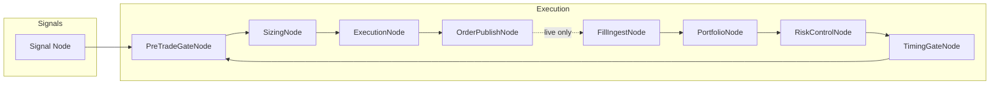
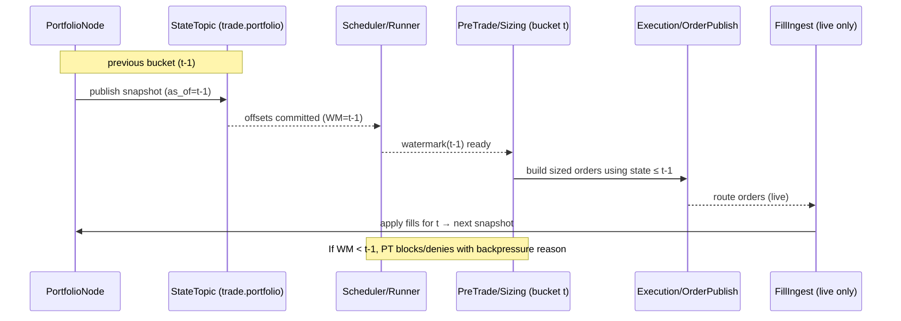
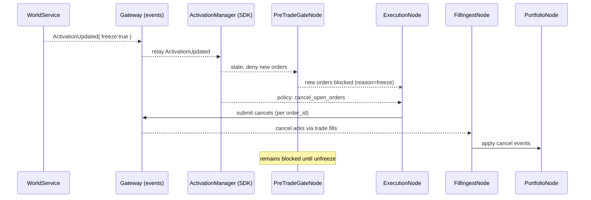
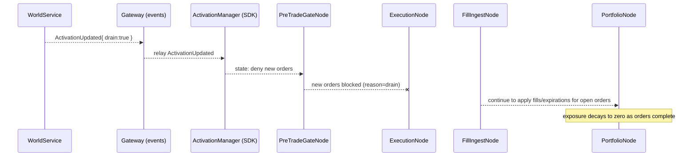

{{ nav_links() }}

# Exchange Node Sets — Execution Layer Composition

This document specifies how post-signal trade execution is composed as a reusable, exchange‑specific "Node Set" that can be attached behind a strategy’s signal node while preserving QMTL’s DAG semantics and the WS/DM responsibility boundaries.

Intent
- Provide ready‑made, exchange‑backed “trading system” recipes (e.g., CCXT spot) as black‑box Node Sets so strategies can attach execution quickly without re‑wiring common components. SDK composition remains available for custom pipelines.
- Treat Node Sets as true black boxes: expose only ports and metadata via `describe()`/`capabilities()`. Avoid accessing internal step nodes from strategies.

## Motivation

After a strategy emits trade signals, realistic execution requires feedback between multiple concerns (activation, pre‑trade checks, sizing, execution, fills, portfolio, risk, timing). Naively wiring these as a loop creates graph cycles. QMTL maintains DAG invariants by modeling feedback with delayed edges and event‑sourced state topics.

Goals
- Keep the DAG acyclic; express feedback via time‑shifted inputs.
- Encapsulate exchange nuances behind thin connectors; provide ready‑made Node Sets.
- Preserve responsibilities: DAG Manager (queues/graph), WorldService (activation/policy), SDK (execution wiring).

Non‑Goals
- WS does not own orders/fills/portfolio state; it remains an activation/policy SSOT.
- DM does not ingest broker webhooks; it manages queues and orchestrates compute.

## Composition Overview



Key
- The feedback is not a literal cycle: P consumes portfolio/risk snapshots at t−1 (or from a compacted state topic). This preserves acyclicity while enabling feedback.
- In simulate/paper modes, `ExecutionNode` produces fills directly; in live mode, fills arrive via `FillIngestNode` from the exchange/broker (webhook or polling).

Tip
- For crypto exchanges, a generic profile can be built from CCXT via `make_ccxt_brokerage()` to quickly wire an execution model with detected maker/taker fees. See Reference → Brokerage API.

## Usage

- Treat a Node Set as a convenience wrapper on top of the DAG: attach it behind your signal and add the returned set to your strategy. Do not cherry‑pick internal nodes; they are implementation details and may change.
- Example (scaffold):

```python
from qmtl.nodesets.base import NodeSetBuilder

nodeset = NodeSetBuilder().attach(signal, world_id="demo")
strategy.add_nodes([price, alpha, signal, nodeset])  # NodeSet accepted directly

# Optional: metadata (not internals)
info = nodeset.describe()        # { name, entry, exit, nodes[], ports? }
caps = nodeset.capabilities()    # { modes: [...], portfolio_scope: ... }
```

- Example (CCXT spot): see the guide at guides/ccxt_spot_recipe.md. You can
  instantiate via the registry:

```python
from qmtl.nodesets.registry import make
nodeset = make("ccxt_spot", signal, "demo-world", exchange_id="binance")
```

Branching inside
- Node Sets may contain internal branching/join nodes when needed (e.g., execution step joining sized orders with market data). Keep the Node Set a black box to the strategy; expose multi-input needs via an Adapter’s port specs.

Override components
- You can override any component when attaching to mix custom nodes:

```python
builder = NodeSetBuilder()
custom_exec = make_my_execution_node(...)
nodeset = builder.attach(signal, world_id="demo", execution=custom_exec)
```

## Node Contracts

- [PreTradeGateNode]({{ code_url('qmtl/transforms/execution_nodes.py#L34') }})
  - Inputs: Activation (from WS via Gateway), Symbol/Hours/Shortable providers, Account/BuyingPower
  - Output: Either a pass‑through order intent or a structured rejection with `RejectionReason`
  - Backed by: `qmtl/sdk/pretrade.py`, `qmtl/common/pretrade.py`, `qmtl/brokerage/*`

- [SizingNode]({{ code_url('qmtl/transforms/execution_nodes.py#L80') }})
  - Inputs: Order intent, Portfolio snapshot (t−1)
  - Output: Sized order (quantity) using helpers (value/percent/target_percent)
  - Soft Gating: optionally applies an activation weight (`0..1`) via a `weight_fn` callback; Node Sets pass a function backed by SDK `ActivationManager.weight_for_side(…)` using the intent’s inferred side.
  - Backed by: `qmtl/sdk/portfolio.py`, `qmtl/sdk/activation_manager.py`

- MicroBatchNode
  - Purpose: reduce per-item overhead by emitting a list of payloads for the latest bucket.
  - Usage: place after order publish (or fill ingest) to micro-batch downstream handling.
  - Backed by: `qmtl/pipeline/micro_batch.py`

- ExecutionNode
  - Inputs: Sized order, Market data (OHLCV/quotes), Brokerage profile
  - Outputs: Execution fills (simulate/paper) or OrderPayload (live)
  - Backed by: `qmtl/brokerage/*`, `qmtl/sdk/execution_modeling.py`

- OrderPublishNode
  - Inputs: OrderPayload
  - Outputs: Routed orders (HTTP/Kafka/custom service) via Runner hooks
  - Backed by: `qmtl/transforms/publisher.py`, `qmtl/sdk/runner.py`

- FillIngestNode
  - Inputs: Broker fill/partial/cancel events via webhook→Kafka or client polling
  - Outputs: Normalized fill stream

- PortfolioNode
  - Inputs: Fills stream
  - Outputs: Portfolio/positions snapshot stream (compacted), risk features
  - Backed by: `qmtl/sdk/portfolio.py`

- RiskControlNode
  - Inputs: Portfolio snapshots, per‑symbol metrics
  - Outputs: Limit/adjust decisions (e.g., clamp position size)
  - Backed by: `qmtl/sdk/risk_management.py`

- TimingGateNode
  - Inputs: Timestamp, calendar/hours policy
  - Outputs: Allow/deny with reason, next valid time hint
  - Backed by: `qmtl/sdk/timing_controls.py`

## Feedback Without Cycles

Two patterns are supported to keep the DAG acyclic:

1) Delayed Edge (t−1 snap)
- `PortfolioNode` publishes snapshots keyed by `(world_id, scope, symbol)`.
- `PreTradeGateNode` (and `SizingNode`) consume the latest snapshot strictly older than current bucket, i.e., `<= t−1`.

2) Event‑Sourced State Topic
- Use compacted topics (e.g., `trade.portfolio`, `trade.open_orders`) and rebuild state on node start.
- Consumers must handle duplicates and reorders within partition constraints.

Both options are compatible with the Commit‑Log design; they do not change DM’s SSOT or WS’s SSOT.

## Execution Semantics (Enhancements)

- DelayedEdge Contract
  - Nodes consuming portfolio/risk must declare an explicit time offset (e.g., `lag=1`) and only read snapshots from the previous bucket. This guarantees deterministic evaluation order at bucket barriers and prevents hidden cycles.
  - Scheduler Watermarks: Bucket processing advances only after upstream state topics commit up to a watermark for `t−1`. This can be implemented as a soft rule at the node/scheduler interface without changing DM invariants.

- Exactly‑Once Boundaries
- Order submission: at‑least‑once with idempotent keys on producer (client) and consumer (executor). Keys should include `(world_id|strategy_id|symbol|side|ts|client_order_id)`.
  - Fill ingestion: at‑least‑once with per‑partition monotonic `seq` (or `etag`) on events. Consumers de‑duplicate by `(order_id, seq)`.

- Activation Weights → Sizing (Soft Gating)
  - When WS publishes weights, `SizingNode` multiplies the desired size by the activation weight (e.g., 0.0..1.0) to smoothly scale exposure instead of binary ON/OFF.

## Bucket Watermark Sequence

The scheduler advances bucket processing only after state topics (e.g., `trade.portfolio`) have committed up to `t−1`. Nodes that consume feedback must respect the `lag=1` contract and read snapshots ≤ watermark.



## Freeze/Drain Scenarios

WorldService may signal temporary trading halts via activation decisions. Node Sets must enforce the mode while keeping data/portfolio state consistent.

### Freeze (Immediate Halt and Cancel)

Semantics
- Block new orders immediately.
- Cancel all open orders ASAP (best‑effort) and stop re‑entry until unfreeze.



### Drain (Natural Exit)

Semantics
- Block new orders.
- Do not force cancel; allow in‑flight orders to fill/expire naturally.



Notes
- Unfreeze: WS emits ActivationUpdated{ freeze:false, drain:false }; `PT` resumes, `EX` accepts new orders from next bucket (honoring the DelayedEdge contract).
- Late fills: Fills arriving after freeze/drain are still applied to maintain accounting integrity; they SHOULD be tagged for audit.
- Variants: A policy may specify `drain:"cancel"` to cancel all open orders but keep gates closed—operationally a softer freeze.

## WorldService and DAG Manager Boundaries

- WorldService
  - Owns activation/policy. Emits `ActivationUpdated` (and decisions) on ControlBus.
  - Does not store orders/fills/portfolio. Node Sets subscribe to activation and enforce gates.
- DAG Manager
  - Owns graph/queues. Diff/plan/assign queues; does not terminate into broker webhooks.
  - State topics for fills/portfolio are ordinary data streams the SDK nodes consume.

This preserves current responsibilities while enabling rich execution flows.

Freeze/Drain Semantics
- WS may signal `freeze` (block new orders) or `drain` (allow fills/cancellations only). Node Sets enforce these modes: PreTradeGateNode denies new orders; ExecutionNode cancels open orders when policy specifies.

## Portfolio Scoping

- Exchange Node Sets accept a ``portfolio_scope`` option controlling how
  portfolio state is keyed and shared.
- ``strategy`` (default): snapshots and fills are keyed by
  ``(world_id, strategy_id, symbol)`` and each strategy maintains isolated
  cash and risk limits.
- ``world``: snapshots and fills are keyed by ``(world_id, symbol)`` so all
  strategies in the same world draw from a shared portfolio.

When ``portfolio_scope="world"``, ``RiskControlNode`` evaluates leverage and
concentration across the combined positions of every participating strategy.
This enables cross‑strategy limits such as capping aggregate symbol exposure
or total leverage.

Example:

```python
builder = make_ccxt_node_set(portfolio_scope="world")
```

Deterministic key composition ensures snapshots and fills are unique under
either scope.

## Gateway Webhook & Security (Enhancements)

- CloudEvents Envelope: The optional `/fills` webhook SHOULD accept CloudEvents‑wrapped payloads for standardized metadata (`type`, `source`, `id`, `time`).
- Authentication & RBAC: JWT/HMAC with claims scoped to `world_id`/`strategy_id`; unauthorized or out‑of‑scope events are rejected.
- Replay Endpoint: Operators MAY request re‑delivery for a time window to reconstruct state safely.

## Operating Modes

- simulate: ExecutionNode simulates fills; OrderPublishNode is a no‑op.
- paper: ExecutionNode simulates, but OrderPublishNode may also post to a paper endpoint for parity.
- live: OrderPublishNode routes orders; FillIngestNode consumes real fills; PortfolioNode mirrors live PnL.

## API Stability

- Node Set internals (specific node classes and wiring) are not part of the public API surface; treat the Node Set as a black box. Prefer the builder/attach interface and add the whole set to your DAG. This allows us to evolve internal nodes without breaking strategies.

## Order & Fill Events (Reference)

See Reference → Order & Fill Events for JSON Schemas and topic guidance.

## Security & Idempotency

- Webhooks must be authenticated (JWT/HMAC) and validated by Gateway before producing to Kafka.
- Idempotency keys: compose `(world_id|strategy_id|symbol|side|ts|client_order_id)`; Runner provides a lightweight client‑side guard.

## Implementation Plan (Phased)

1) Add node wrappers: PreTradeGateNode, SizingNode, ExecutionNode, FillIngestNode, PortfolioNode, RiskControlNode, TimingGateNode.
2) Provide Node Set builders: CCXT‑Generic(spot), Binance‑Futures(USDT‑M), IBKR‑like.
3) Reference topics: `trade.orders`, `trade.fills`, `trade.portfolio` with JSON Schemas.
4) Gateway optional webhook `/fills` → Kafka producer with RBAC/signature checks.
5) Runner optional pre‑trade chain toggle for simple strategies.

## Reliability & Operations (Enhancements)

- Backpressure Guard: If FillIngest or PortfolioNode lag exceeds thresholds, PreTradeGateNode can temporarily deny new orders with a standardized reason code.
- DLQ/Quarantine: Schema validation failures or unauthorized events route to `trade.fills.dlq` for operator review and replay.
- Circuit Breakers: Node Set builders expose circuit breaker and retry options for BrokerageClient; degrade to `paper` when persistent failures occur.

## Observability & Dev Experience (Enhancements)

- Correlated Tracing: Propagate a single `correlation_id` (derived from `client_order_id`) across `order → publish → ack → fill → portfolio.apply` and emit OpenTelemetry spans.
- Standard Metrics: Counters for pre‑trade rejections (by `RejectionReason`), routing failures, webhook throughput/latency, portfolio apply lag, backpressure trips.
- Schema→Code Generation: Generate pydantic/dataclasses from JSON Schemas (Order/Fill/Portfolio) for connectors/nodes to ensure type safety.
- Node Set Test Kit: Provide deterministic golden tests for IOC/FOK, partial fills, reordering, downgrade/upgrade paths, and fake webhook simulation.
- Version Tagging: Include Node Set version in NodeID input hashing to ensure safe reuse boundaries across exchange API changes.

## Related Issues

- RFC: Exchange Node Sets and Feedback Without Cycles (#820)
- Implement Execution-Layer Nodes (PreTrade/Sizing/Execution/FillIngest/Portfolio/Risk/Timing) (#821)
- Node Set: CCXT Generic (Spot) (#822)
- Node Set: Binance Futures (USDT‑M) (#823)
- Gateway: /fills Webhook → Kafka (trade.fills) (#824)
- RFC: Delayed Edges, Watermarks, and Exactly-Once Boundaries (#828)
- Gateway Webhook: CloudEvents Envelope and Replay Endpoint (#829)
- Node Set Test Kit and Fake Webhook Simulator (#830)
- Schema → Code Generation for Order/Fill/Portfolio (#831)
- Observability — Order Lifecycle Tracing and Metrics (#832)
- Reliability — Backpressure Guard and DLQ for Fills (#833)
- RouterNode — Multi-Exchange/Symbol Routing (#834)
- Micro-batching for Order Publish and Fill Ingest (#835)
- Activation Weight Propagation and Sizing Integration (#836)
- Scaffold: Exchange Node Set Kit (Builders, Contracts, Stubs) (#837)
- Example Strategy: Signal → CCXT Generic Spot Node Set (#838)
- WS Activation Schema — Freeze/Drain/Weights/Effective Mode (#839)

Links: https://github.com/hyophyop/qmtl/issues

{{ nav_links() }}
