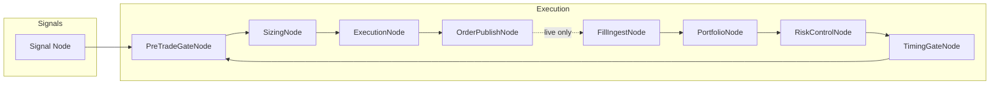

{{ nav_links() }}

# Exchange Node Sets — Execution Layer Composition

This document specifies how post-signal trade execution is composed as a reusable, exchange‑specific "Node Set" that can be attached behind a strategy’s signal node while preserving QMTL’s DAG semantics and the WS/DM responsibility boundaries.

## Motivation

After a strategy emits trade signals, realistic execution requires feedback between multiple concerns (activation, pre‑trade checks, sizing, execution, fills, portfolio, risk, timing). Naively wiring these as a loop creates graph cycles. QMTL maintains DAG invariants by modeling feedback with delayed edges and event‑sourced state topics.

Goals
- Keep the DAG acyclic; express feedback via time‑shifted inputs.
- Encapsulate exchange nuances behind thin connectors; provide ready‑made Node Sets.
- Preserve responsibilities: DAG Manager (queues/graph), WorldService (activation/policy), SDK (execution wiring).

Non‑Goals
- WS does not own orders/fills/portfolio state; it remains an activation/policy SSOT.
- DM does not ingest broker webhooks; it manages queues and orchestrates compute.

## Composition Overview

Key
- The feedback is not a literal cycle: P consumes portfolio/risk snapshots at t−1 (or from a compacted state topic). This preserves acyclicity while enabling feedback.
- In simulate/paper modes, `ExecutionNode` produces fills directly; in live mode, fills arrive via `FillIngestNode` from the exchange/broker (webhook or polling).

## Node Contracts

- PreTradeGateNode
  - Inputs: Activation (from WS via Gateway), Symbol/Hours/Shortable providers, Account/BuyingPower
  - Output: Either a pass‑through order intent or a structured rejection with `RejectionReason`
  - Backed by: `qmtl/sdk/pretrade.py`, `qmtl/common/pretrade.py`, `qmtl/brokerage/*`

- SizingNode
  - Inputs: Order intent, Portfolio snapshot (t−1)
  - Output: Sized order (quantity) using helpers (value/percent/target_percent)
  - Backed by: `qmtl/sdk/portfolio.py`

- ExecutionNode
  - Inputs: Sized order, Market data (OHLCV/quotes), Brokerage profile
  - Outputs: Execution fills (simulate/paper) or OrderPayload (live)
  - Backed by: `qmtl/brokerage/*`, `qmtl/sdk/execution_modeling.py`

- OrderPublishNode
  - Inputs: OrderPayload
  - Outputs: Routed orders (HTTP/Kafka/custom service) via Runner hooks
  - Backed by: `qmtl/transforms/publisher.py`, `qmtl/sdk/runner.py`

- FillIngestNode
  - Inputs: Broker fill/partial/cancel events via webhook→Kafka or client polling
  - Outputs: Normalized fill stream

- PortfolioNode
  - Inputs: Fills stream
  - Outputs: Portfolio/positions snapshot stream (compacted), risk features
  - Backed by: `qmtl/sdk/portfolio.py`

- RiskControlNode
  - Inputs: Portfolio snapshots, per‑symbol metrics
  - Outputs: Limit/adjust decisions (e.g., clamp position size)
  - Backed by: `qmtl/sdk/risk_management.py`

- TimingGateNode
  - Inputs: Timestamp, calendar/hours policy
  - Outputs: Allow/deny with reason, next valid time hint
  - Backed by: `qmtl/sdk/timing_controls.py`

## Feedback Without Cycles

Two patterns are supported to keep the DAG acyclic:

1) Delayed Edge (t−1 snap)
- `PortfolioNode` publishes snapshots keyed by `(world_id, scope, symbol)`.
- `PreTradeGateNode` (and `SizingNode`) consume the latest snapshot strictly older than current bucket, i.e., `<= t−1`.

2) Event‑Sourced State Topic
- Use compacted topics (e.g., `trade.portfolio`, `trade.open_orders`) and rebuild state on node start.
- Consumers must handle duplicates and reorders within partition constraints.

Both options are compatible with the Commit‑Log design; they do not change DM’s SSOT or WS’s SSOT.

## WorldService and DAG Manager Boundaries

- WorldService
  - Owns activation/policy. Emits `ActivationUpdated` (and decisions) on ControlBus.
  - Does not store orders/fills/portfolio. Node Sets subscribe to activation and enforce gates.
- DAG Manager
  - Owns graph/queues. Diff/plan/assign queues; does not terminate into broker webhooks.
  - State topics for fills/portfolio are ordinary data streams the SDK nodes consume.

This preserves current responsibilities while enabling rich execution flows.

## Portfolio Scoping

- Strategy‑Scoped (default): `scope = (world_id, strategy_id)`
- World‑Scoped (optional): `scope = (world_id)` to share cash/limits across strategies

Node Sets must declare scope explicitly. World‑scope increases coupling but enables cross‑strategy limits.

## Operating Modes

- simulate: ExecutionNode simulates fills; OrderPublishNode is a no‑op.
- paper: ExecutionNode simulates, but OrderPublishNode may also post to a paper endpoint for parity.
- live: OrderPublishNode routes orders; FillIngestNode consumes real fills; PortfolioNode mirrors live PnL.

## Order & Fill Events (Reference)

See Reference → Order & Fill Events for JSON Schemas and topic guidance.

## Security & Idempotency

- Webhooks must be authenticated (JWT/HMAC) and validated by Gateway before producing to Kafka.
- Idempotency keys: compose `(world_id|strategy_id|symbol|side|ts|client_order_id)`; Runner provides a lightweight client‑side guard.

## Implementation Plan (Phased)

1) Add node wrappers: PreTradeGateNode, SizingNode, ExecutionNode, FillIngestNode, PortfolioNode, RiskControlNode, TimingGateNode.
2) Provide Node Set builders: CCXT‑Generic(spot), Binance‑Futures(USDT‑M), IBKR‑like.
3) Reference topics: `trade.orders`, `trade.fills`, `trade.portfolio` with JSON Schemas.
4) Gateway optional webhook `/fills` → Kafka producer with RBAC/signature checks.
5) Runner optional pre‑trade chain toggle for simple strategies.

{{ nav_links() }}

