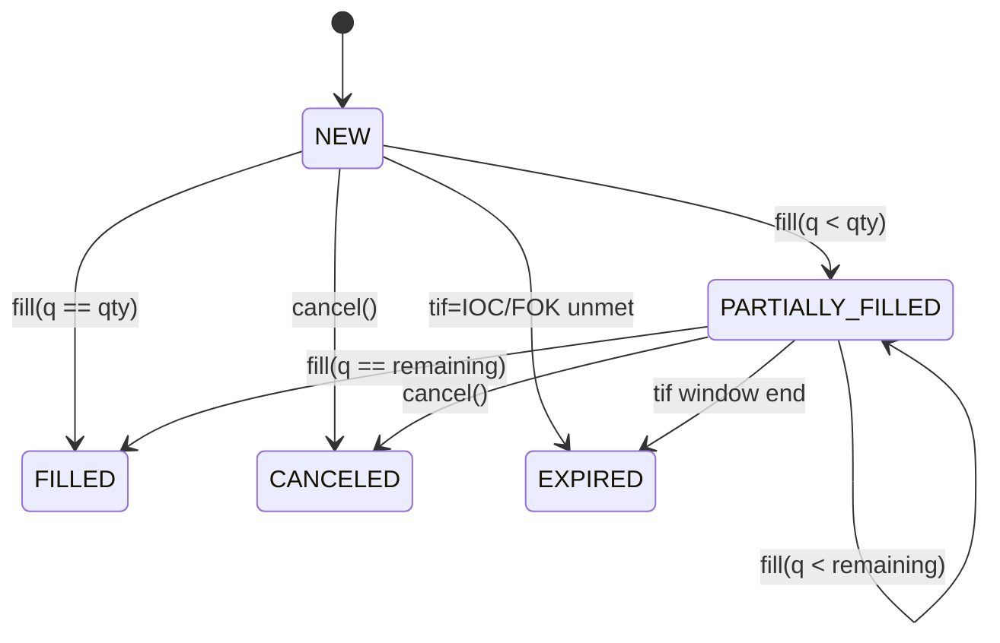

{{ nav_links() }}

# Execution State Machine and TIF Policies

This document sketches the execution state machine for backtests and paper trading, focusing on persistent open orders, partial fills, and Time-In-Force (GTC/IOC/FOK) semantics.

## State Machine

## State Transitions

| Current           | Event                     | Next              |
|-------------------|---------------------------|-------------------|
| NEW               | fill(q < qty)             | PARTIALLY_FILLED  |
| NEW               | fill(q == qty)            | FILLED            |
| NEW               | cancel()                  | CANCELED          |
| NEW               | tif unmet                 | EXPIRED           |
| PARTIALLY_FILLED  | fill(q < remaining)       | PARTIALLY_FILLED  |
| PARTIALLY_FILLED  | fill(q == remaining)      | FILLED            |
| PARTIALLY_FILLED  | cancel()                  | CANCELED          |
| PARTIALLY_FILLED  | tif window end            | EXPIRED           |

## TIF Examples

- GTC: Remaining quantity carries over across bars until filled or canceled.
- IOC: Immediately attempt to fill; any remainder is canceled and the order moves to **EXPIRED**.
- FOK: Fill entire order immediately or cancel the order; if not fully filled in one attempt the order transitions to **EXPIRED** with zero fills.

See also: [Brokerage API](../reference/api/brokerage.md) and [Lean Brokerage Model](lean_brokerage_model.md).

