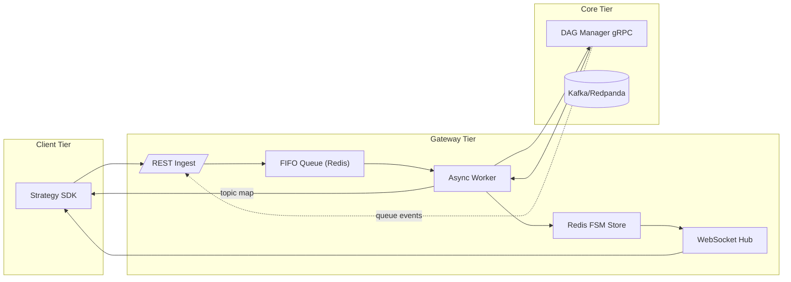

{{ nav_links() }}

# QMTL Gateway — Comprehensive Technical Specification

*Research‑Driven Draft v1.2 — 2025‑06‑10*

## 관련 문서
- [Architecture Overview](README.md)
- [QMTL Architecture](architecture.md)
- [DAG Manager](dag-manager.md)
- [WorldService](worldservice.md)
- [ControlBus](controlbus.md)
- [Lean Brokerage Model](lean_brokerage_model.md)

> This extended edition enlarges the previous document by ≈ 75 % and adopts an explicit, graduate‑level rigor. All threat models, formal API contracts, latency distributions, and CI/CD semantics are fully enumerated.
> Legend: **Sx** = Section, **Rx** = Requirement, **Ax** = Assumption.

---

## S0 · System Context & Goals

Gateway sits at the **operational boundary** between *ephemeral* strategy submissions and the *persistent* graph state curated by DAG Manager. Its design objectives are:

| ID     | Goal                                                         | Metric                    |
| ------ | ------------------------------------------------------------ | ------------------------- |
|  G‑01  | Diff submission queuing **loss‑free** under 1 k req/s burst  | `lost_requests_total = 0` |
|  G‑02  | **≤ 150 ms** p95 end‑to‑end latency (SDK POST → Warm‑up ack) | `gateway_e2e_latency_p95` |
|  G‑03  | Zero duplicated Kafka topics across concurrent submissions   | invariants §S3            |
|  G‑04  | Line‑rate WebSocket streaming of state updates (≥ 500 msg/s) | WS load test              |

**Ax‑1** SDK nodes adhere to canonical hashing rules (see Architecture doc §1.1).
**Ax‑2** Neo4j causal cluster exposes single‑leader consistency; read replicas may lag.

### Non‑Goals
- Gateway does not compute world policy decisions and is not an SSOT for worlds or queues.
- Gateway does not manage brokerage execution; it only mediates requests and relays control events.

---

## S1 · Functional Decomposition



Note: WorldService and ControlBus are omitted in this decomposition for brevity. See §S6 for the Worlds proxy and opaque event stream handoff. In the full system, Gateway subscribes to ControlBus and proxies WorldService APIs.

---

## S2 · API Contract (**OpenAPI 3.1 excerpt**)

```yaml
paths:
  /strategies:
    post:
      summary: Submit local DAG for execution
      requestBody:
        content:
          application/json:
            schema: { $ref: '#/components/schemas/StrategySubmit' }
      responses:
        '202': { $ref: '#/components/responses/Ack202' }
  /strategies/{id}/status:
    get:
      parameters:
        - in: path
          name: id
          schema: { type: string }
      responses:
        '200': { $ref: '#/components/responses/Status200' }
  /queues/by_tag:
    get:
      summary: Fetch queues matching tags and interval
      parameters:
        - in: query
          name: tags
          schema: { type: string }
        - in: query
          name: interval
          schema: { type: integer }
        - in: query
          name: match_mode
          schema: { type: string, enum: [any, all] }
          description: |
            Preferred tag matching mode. ``match`` is accepted as a deprecated alias
            for backwards compatibility.
      responses:
        '200':
          description: Queue list
          content:
            application/json:
              schema:
                type: object
                properties:
                  queues:
                    type: array
                    items: { type: string }
```
``match_mode`` should be used by new clients. ``match`` remains available for
older integrations.

**Example Request (compressed 32 KiB DAG JSON omitted)**

```http
POST /strategies HTTP/1.1
Authorization: Bearer <jwt>
Content‑Encoding: gzip
Content‑Type: application/json
{
  "dag_json": "<base64>",
  "meta": { "user": "quant.alice", "desc": "BTC scalper" },
  "run_type": "dry-run"
}
```

**Example Queue Lookup**

```http
GET /queues/by_tag?tags=t1,t2&interval=60&match_mode=any HTTP/1.1
Authorization: Bearer <jwt>
```

| HTTP Status         | Meaning                                 | Typical Cause      |
| ------------------- | --------------------------------------- | ------------------ |
|  202 Accepted       |  Ingest successful, StrategyID returned | Nominal            |
|  400 Bad Request   |  CRC mismatch between SDK and Gateway  | NodeID CRC failure  |
|  409 Conflict       |  Duplicate StrategyID within TTL        | Same DAG re‑submit |
|  422 Unprocessable  |  Schema validation failure              | DAG JSON invalid    |

---

## S3 · Deterministic FIFO & Idempotency

**Invariant R‑3.1** At most one Worker may pop a given StrategyID. Implemented by:
`SETNX("lock:{id}", worker_id, "NX", "PX", 60000)`

### S4 · Architecture Alignment

The architecture document (§3) defines the deterministic NodeID used across Gateway and DAG Manager. Each NodeID is computed from `(node_type, code_hash, config_hash, schema_hash)` using SHA-256, falling back to SHA-3 when a collision is detected. Gateway must generate the same IDs before calling the DiffService.

Immediately after ingest, Gateway inserts a `VersionSentinel` node into the DAG so that rollbacks and canary traffic control can be orchestrated without strategy code changes. This behaviour is enabled by default and controlled by the ``insert_sentinel`` configuration field; it may be disabled with the ``--no-sentinel`` CLI flag.

Gateway persists its FSM in Redis with AOF enabled and mirrors crucial events in PostgreSQL's Write-Ahead Log. This mitigates the Redis failure scenario described in the architecture (§2).

When resolving `TagQueryNode` dependencies, the Runner's **TagQueryManager**
invokes ``resolve_tags()`` which issues a ``/queues/by_tag`` request. Gateway
consults DAG Manager for queues matching `(tags, interval)` and returns the list
so that TagQueryNode instances remain network‑agnostic and only nodes lacking
upstream queues execute locally.

Gateway also listens (via ControlBus) for `sentinel_weight` CloudEvents emitted by DAG Manager. Upon receiving an update, the in-memory routing table is adjusted and the new weight broadcast to SDK clients via WebSocket. The effective ratio per version is exported as the Prometheus gauge `gateway_sentinel_traffic_ratio{version="<id>"}`.

### S5 · Reliability Checklist

* **NodeID CRC 파이프라인** – SDK가 전송한 `node_id`와 Gateway가 재계산한 값이
  diff 요청 및 응답의 `crc32` 필드로 상호 검증된다. CRC 불일치가 발생하면 HTTP 400으로 반환된다.
* **TagQueryNode 런타임 확장** – Gateway가 새 `(tags, interval)` 큐를 발견하면
  `tagquery.upsert` CloudEvent를 발행하고 Runner의 **TagQueryManager**가 이를
  수신해 노드 버퍼를 자동 초기화한다.
* **Local DAG Fallback Queue** – DAG Manager가 응답하지 않을 때 제출된 전략 ID는
  메모리에 임시 저장되며 서비스가 복구되면 Redis 큐로 플러시된다.
* **Sentinel Traffic Δ 확인 루프** – `traffic_weight` 변경 후 Gateway 라우팅
  테이블과 SDK 로컬 라우터가 5초 이내 동기화됐는지를 `sentinel_skew_seconds`
  지표로 측정한다.

### Gateway CLI Options

Run the Gateway service. The ``--config`` flag is optional:

```bash
# start with built-in defaults
qmtl gw

# specify a configuration file
qmtl gw --config qmtl/examples/qmtl.yml
```

When provided, the command reads the ``gateway`` section of
``qmtl/examples/qmtl.yml`` for all server parameters. Omitting ``--config``
starts the service with built-in defaults that use SQLite and an in-memory
Redis substitute. The sample file illustrates how to set ``redis_dsn`` to point
to a real cluster. If ``redis_dsn`` is omitted, Gateway automatically uses the
in-memory substitute. See the file for a fully annotated configuration template.
Setting ``insert_sentinel: false`` disables automatic ``VersionSentinel`` insertion.

Available flags:

- ``--config`` – optional path to configuration file.
- ``--no-sentinel`` – disable automatic ``VersionSentinel`` insertion.

---

## S6 · Worlds Proxy & Event Stream (New)

Gateway remains the single public boundary for SDKs. It proxies WorldService endpoints and provides an opaque event stream descriptor to SDKs; it does not compute world policy itself.

### Worlds Proxy

- Proxied endpoints → WorldService:
  - ``GET /worlds/{id}/decide`` → DecisionEnvelope (cached with TTL/etag)
  - ``GET /worlds/{id}/activation`` → ActivationEnvelope (fail‑safe: inactive on stale)
  - ``POST /worlds/{id}/evaluate`` / ``POST /worlds/{id}/apply`` (operator‑only)
- Caching & TTLs:
  - Per‑world decision cache honors envelope TTL (default 300s if unspecified); stale decisions → safe fallback (offline/backtest)
  - Activation cache: stale/unknown → orders gated OFF; ActivationEnvelope MAY include `state_hash` for quick divergence checks
- Circuit breakers & budgets: independent timeouts/retries for WorldService and DAG Manager backends (defaults: WS 300 ms, 2 retries with jitter; DM 500 ms, 1 retry)
- `/status` exposes circuit breaker states for dependencies, including WorldService.

### Event Stream Descriptor

SDKs obtain an opaque WebSocket descriptor from Gateway and subscribe to real‑time control updates without learning about ControlBus.

```
POST /events/subscribe
{ "world_id": "crypto_mom_1h", "strategy_id": "...", "topics": ["activation", "queues"] }
→ { "stream_url": "wss://gateway/ws/evt?ticket=...", "token": "<jwt>", "topics": ["activation"], "expires_at": "..." }
```

- Gateway subscribes to internal ControlBus and relays events to SDK over the descriptor URL.
- Ordering is guaranteed per key (world_id or tags+interval). Consumers deduplicate via ``etag``/``run_id``. First message per topic SHOULD be a full snapshot or carry a `state_hash`.

Token (JWT) claims (delegated WS or future use):
- `aud`: `controlbus`
- `sub`: user/service identity
- `world_id`, `strategy_id`, `topics`: subscription scope
- `jti`, `iat`, `exp`: idempotency and keying. Key ID (`kid`) is conveyed in the JWT header.

### Legacy Queue Watch & HTTP Fallback

`GET /queues/watch` remains for backward compatibility but is marked as deprecated.
Responses include a `Deprecation` header pointing callers to `POST /events/subscribe`.
SDKs should use the event stream when available and periodically reconcile via
`GET /queues/by_tag` if the stream drops or diverges.

### Degrade & Fail‑Safe Policy (Summary)

- WorldService unavailable:
  - ``/decide`` → cached DecisionEnvelope if fresh; else safe default (offline/backtest)
  - ``/activation`` → inactive
- Event stream unavailable:
  - Reconnect with provided ``fallback_url``; SDK may periodically reconcile via HTTP
- Live guard: even if DecisionEnvelope says ``live``, Gateway requires explicit caller consent (e.g., CLI `--allow-live` or header `X-Allow-Live: true`).
- Identity propagation: Gateway forwards caller identity (JWT subject/claims) to WorldService; WorldService logs it in audit records.

See also: World API Reference (reference/api_world.md) and Schemas (reference/schemas.md).

{{ nav_links() }}
