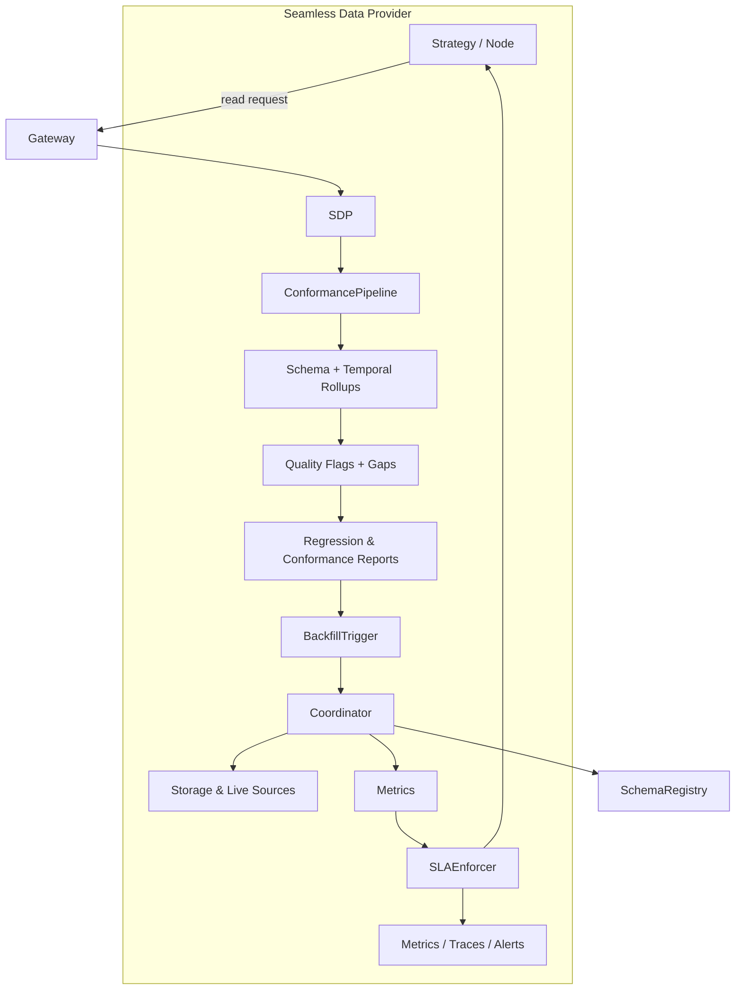

# Seamless Data Provider v2 Architecture

> **Status:** The Seamless Data Provider v2 architecture is now live in the
> runtime. The distributed backfill coordinator replaces the in-process stub,
> `SLAPolicy` budgets are enforced, and the observability surfaces referenced
> below are emitted by default. Remaining roadmap items focus on schema
> governance and dashboard polish rather than core service gaps.

The Seamless Data Provider (SDP) remains on the path from the prototype described
in the earlier design document toward a production system that enforces data
quality, backfill SLAs, and schema safety from the moment a request arrives. The
sections below call out where functionality is still forthcoming so that readers
do not over-estimate the guarantees made by today's runtime.

## High-level Flow

The request enters the gateway, is normalised by the Seamless Data Provider, and
then flows through the conformance pipeline before data is served back. Each
stage emits explicit artefacts (flags, reports, metrics) so that downstream
systems can reason about the completeness of a response.

## Conformance Pipeline

`ConformancePipeline` runs three distinct stages. Callers still opt in by
supplying an explicit `ConformancePipeline` instance, but the runtime now emits
structured reports alongside the data path. The stages are:

1. **Schema rollups** aggregate observations against the canonical
   registry schema, catching missing columns or invalid enumerations before the
   client ever sees them.
2. **Temporal rollups** compute completeness windows per symbol and granularity,
   allowing queries to blend storage and live data without misaligned bars.
3. **Quality flags and reports** generate regression digests that are published
   to `qmtl://observability/seamless/<node>` and archived for audit.

As of the September 2025 runtime update the pipeline is enabled by default via
`EnhancedQuestDBProvider`. Normalisation warnings continue to be surfaced via the
returned report. Any warnings or flags emitted by the pipeline raise a
`ConformancePipelineError` unless the provider is instantiated with
`partial_ok=True`. In partial-ok mode the normalized frame is returned while the
report remains accessible through `SeamlessDataProvider.last_conformance_report`,
so teams can defer blocking behaviour until the registry rollout completes.

## Distributed Backfill Coordinator

The distributed coordinator is now the default when
`QMTL_SEAMLESS_COORDINATOR_URL` is set. The SDK instantiates
`DistributedBackfillCoordinator`, negotiates leases with the Raft service, and
falls back to the legacy in-memory guard only when the URL is absent or the
service is unavailable. The production implementation provides:

- **Aligned leases** so overlapping requests share work instead of duplicating
  backfills.
- **Stale claim detection** via lease expiry telemetry and automatic failure
  signalling when a worker crashes mid-flight.
- **Partial completion tracking**, emitting the
  `backfill_completion_ratio{node_id,interval,lease_key}` gauge to Prometheus
  and structured logs under `seamless.backfill`.
- **Recovery hooks** that mark failed leases for reprocessing, guaranteeing that
  every shard either completes or raises an explicit violation.

Consumers no longer need to provide a coordinator stub; enabling the service via
environment configuration activates the distributed path.

## SLA Enforcement

`SLAPolicy` budgets are honoured for every Seamless request. The provider tracks
time spent waiting on storage, backfill, live feeds, and the overall request and
records the duration in the `seamless_sla_deadline_seconds{node_id,phase}`
histogram. When any phase exceeds its configured budget the runtime raises
`SeamlessSLAExceeded`, logs the violation under `seamless.sla`, and surfaces the
failure to callers so they can degrade gracefully. Policies can also bound the
number of synchronous gap bars; violations emit the same exception with a
`sync_gap` phase.

Tracing hooks are wired for future span enrichment; the metrics and exception
behaviour are active today.

## Schema Registry Governance

Schema validation remains best-effort. The runtime exposes utilities for
callers to supply schema definitions, but no central registry is consulted.
The desired end state introduces two modes:

- **Canary** validation mirrors requests and records compatibility diagnostics
  without blocking.
- **Strict** validation stops any response whose payload deviates from the
  approved schema.

As of now, promotion between modes is manual and per-consumer. There is no audit
trail, registry integration, or automation around schema bundle fingerprinting.

## Observability Surfaces

Prometheus now exposes the coordinator and SLA metrics described above alongside
the existing conformance counters. The Jsonnet dashboards referenced in the
operations guide can be rendered directly from these metrics. Tracing spans will
gain richer attributes once the schema registry work completes, but no further
changes are required for the coordinator or SLA instrumentation.

## Next Steps

Teams can now migrate workloads to the distributed coordinator and wire SLA
alerts without waiting on additional runtime releases. Track issues
#1150–#1152 for the remaining schema-governance milestones; the coordinator and
SLA work described in this document is complete.
