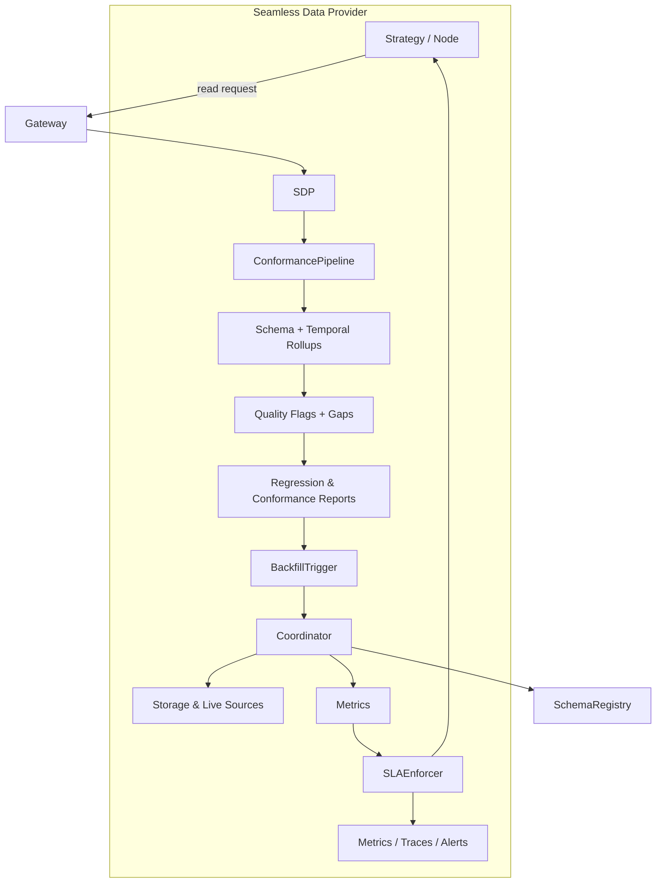

# Seamless Data Provider v2 Architecture

> **Status:** The Seamless Data Provider v2 architecture outlined below is a
> roadmap. The current codebase still ships the in-process coordinator stub,
> optional conformance hooks, and no SLA policy enforcement. Use this document
> to understand the intended target state while the implementation in
> `qmtl/runtime/sdk` catches up.

The Seamless Data Provider (SDP) remains on the path from the prototype described
in the earlier design document toward a production system that enforces data
quality, backfill SLAs, and schema safety from the moment a request arrives. The
sections below call out where functionality is still forthcoming so that readers
do not over-estimate the guarantees made by today's runtime.

## High-level Flow

The request enters the gateway, is normalised by the Seamless Data Provider, and
then flows through the conformance pipeline before data is served back. Each
stage emits explicit artefacts (flags, reports, metrics) so that downstream
systems can reason about the completeness of a response.

## Conformance Pipeline

`ConformancePipeline` will ultimately run three distinct stages. Today the
pipeline is opt-in and only performs best-effort normalization for callers that
pass an explicit `ConformancePipeline` instance. The planned stages are:

1. **Schema rollups** aggregate observations against the canonical
   registry schema, catching missing columns or invalid enumerations before the
   client ever sees them.
2. **Temporal rollups** compute completeness windows per symbol and granularity,
   allowing queries to blend storage and live data without misaligned bars.
3. **Quality flags and reports** generate regression digests that are published
   to `qmtl://observability/seamless/<node>` and archived for audit.

As of the September 2025 runtime update the pipeline is enabled by default via
`EnhancedQuestDBProvider`. Any warnings or flags emitted by the pipeline raise a
`ConformancePipelineError` unless the provider is instantiated with
`partial_ok=True`. In partial-ok mode the normalized frame is returned while the
report remains accessible through `SeamlessDataProvider.last_conformance_report`.

## Distributed Backfill Coordinator

The distributed coordinator described here is still under active development.
For now the runtime uses the stub `InMemoryBackfillCoordinator`, which only
guards against duplicate backfills within a single process. The roadmap
coordinator will introduce:

- **Aligned leases** so that overlapping requests from different nodes do not
  duplicate work.
- **Stale claim detection** via heartbeat tracking and lease expiry metrics.
- **Partial completion tracking**, emitting `backfill_completion_ratio`
  Prometheus metrics and structured logs to `seamless.backfill`.
- **Recovery hooks** that re-queue unfinished shards after process restarts.

Until the Raft coordinator lands, none of the above metrics or lease recovery
hooks exist. Expect overlapping work when multiple processes issue backfills.

## SLA Enforcement

`SLAPolicy` objects are defined in the SDK but are not yet enforced. The fields
act as placeholders for future scheduling and alerting logic. When the SLA
engine is implemented it will:

- Publish `seamless_sla_deadline_seconds` histograms for Prometheus scraping.
- Attach `sla.phase` span attributes to OpenTelemetry traces.
- Raise `SeamlessSLAExceeded` alerts when thresholds are violated.

Until then, wiring an `SLAPolicy` instance into `SeamlessDataProvider` has no
observable effect beyond documentation intent, and no configuration files under
`configs/seamless/sla/` exist.

## Schema Registry Governance

Schema validation remains best-effort. The runtime exposes utilities for
callers to supply schema definitions, but no central registry is consulted.
The desired end state introduces two modes:

- **Canary** validation mirrors requests and records compatibility diagnostics
  without blocking.
- **Strict** validation stops any response whose payload deviates from the
  approved schema.

As of now, promotion between modes is manual and per-consumer. There is no audit
trail, registry integration, or automation around schema bundle fingerprinting.

## Observability Surfaces

Dashboards and traces for the features above are still on the roadmap. The
observability bundle referenced by the operations guides has not yet been
published. Expect placeholder metrics only (`seamless_conformance_flag_total`)
until the coordinator, SLA engine, and schema registry integrations are ready.

## Next Steps

Treat this document as a forward-looking architecture reference. Teams planning
migration work should continue to rely on the existing v1 behaviour and track
progress in issues #1148–#1152 before updating their runbooks.
