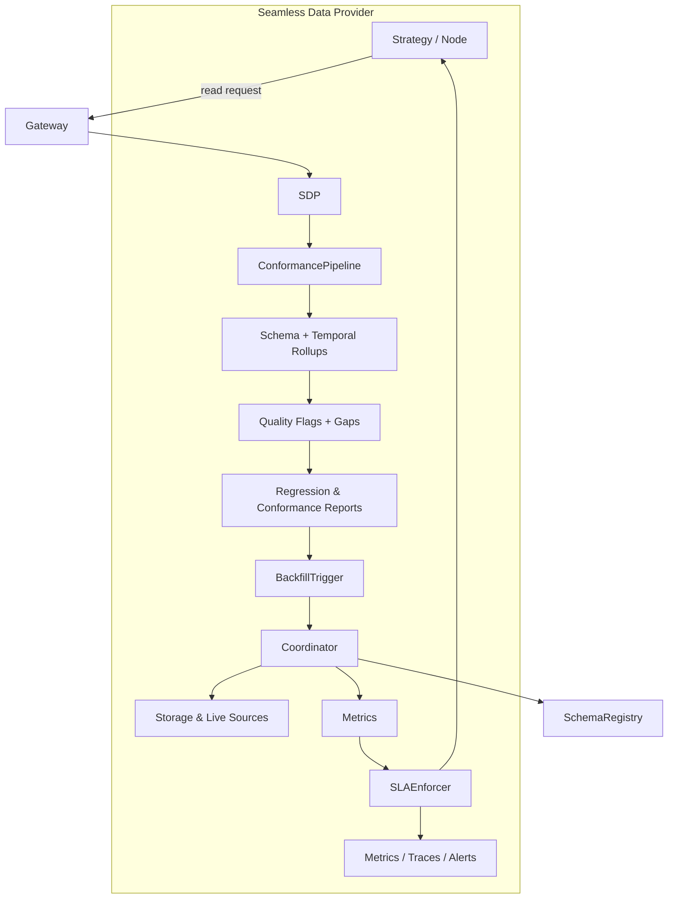

# Seamless Data Provider v2 Architecture

The Seamless Data Provider (SDP) has graduated from the prototype described in the
earlier design document into a production system that enforces data quality,
backfill SLAs, and schema safety from the moment a request arrives. This page
summarises the v2 rollout so that architecture discussions and runbooks stop
referencing the placeholder pipeline.

## High-level Flow

The request enters the gateway, is normalised by the Seamless Data Provider, and
then flows through the conformance pipeline before data is served back. Each
stage emits explicit artefacts (flags, reports, metrics) so that downstream
systems can reason about the completeness of a response.

## Conformance Pipeline

`ConformancePipeline` now runs three distinct stages:

1. **Schema rollups** aggregate observations against the canonical
   registry schema, catching missing columns or invalid enumerations before the
   client ever sees them.
2. **Temporal rollups** compute completeness windows per symbol and granularity,
   allowing queries to blend storage and live data without misaligned bars.
3. **Quality flags and reports** generate regression digests that are published
   to `qmtl://observability/seamless/<node>` and archived for audit.

A failing stage blocks reads by default unless the caller opts into
`partial_ok=True`, ensuring we never silently deliver malformed payloads.

## Distributed Backfill Coordinator

The stub `InMemoryBackfillCoordinator` has been replaced by a
Raft-backed coordinator deployed per data domain. It handles:

- **Aligned leases** so that overlapping requests from different nodes do not
  duplicate work.
- **Stale claim detection** via heartbeat tracking and lease expiry metrics.
- **Partial completion tracking**, emitting `backfill_completion_ratio`
  Prometheus metrics and structured logs to `seamless.backfill`.
- **Recovery hooks** that re-queue unfinished shards after process restarts.

Storage writers and the coordinator both publish events to the
`seamless.backfill` topic so we can build dashboards that show live progress.

## SLA Enforcement

`SLAPolicy` objects are now enforced end-to-end. Each policy specifies
latency, freshness, and recovery expectations. The coordinator publishes
`seamless_sla_deadline_seconds` histograms which are scraped by Prometheus and
forwarded into the default Grafana deck. Violations raise `SeamlessSLAExceeded`
alerts and emit OpenTelemetry traces with a `sla.phase` span attribute to make
debugging straightforward.

The policy configuration lives in `configs/seamless/sla/*.yml`; rolling out a
new policy automatically registers alerts and runbooks (see the operations
section below).

## Schema Registry Governance

Every read that passes through SDP now resolves its schema via the central
registry. Two validation modes exist:

- **Canary** validation mirrors requests and records compatibility diagnostics
  without blocking.
- **Strict** validation stops any response whose payload deviates from the
  approved schema.

Promotion from canary to strict requires double approval and an audit entry in
`docs/operations/schema_registry_governance.md`. The rollout scripts also record
SHA fingerprints of schema bundles so that drift detection jobs stay accurate.

## Observability Surfaces

The v2 rollout ships bundled dashboards:

- **Seamless SLA Dashboard** charts SLA compliance, lease health, and backfill
  throughput across clusters.
- **Conformance Quality Dashboard** shows flag counts, regression digests, and
  schema warnings over time.
- **Trace Explorer Views** expose per-request spans (`seamless.pipeline`) to
  correlate latency regressions with specific stages.

Refer to the operations guides for alert wiring and escalation paths.

## Next Steps

Teams migrating to Seamless should pair this document with the migration guide
(`Guides → Seamless Migration to v2`) and the updated monitoring runbooks. The
older provisional references can now be deleted from strategy docs and runbooks.
