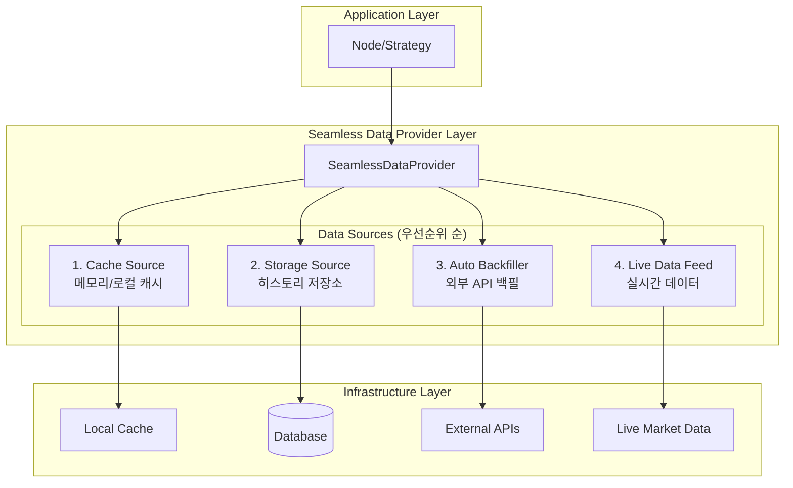

# QMTL Seamless Data Provider 설계 문서

## 개요

QMTL의 새로운 **Seamless Data Provider** 시스템은 auto backfill 기능을 통해 투명한 데이터 접근을 제공하는 아키텍처입니다. 이 시스템은 기존의 `HistoryProvider`, `EventRecorder`, `DataFetcher` 컴포넌트들을 확장하여 마치 모든 데이터가 항상 사용 가능한 것처럼 동작하게 합니다.

## 설계 목표

1. **투명성**: 노드에서 데이터를 요청할 때 데이터의 소스나 가용성을 고민할 필요 없음
2. **자동 백필**: 누락된 데이터를 자동으로 외부 소스에서 가져와 저장소에 채움
3. **seamless transition**: 이력 데이터와 실시간 데이터 간의 매끄러운 전환
4. **전략적 유연성**: 다양한 데이터 가용성 전략 지원
5. **하위 호환성**: 기존 코드와의 호환성 유지

## 아키텍처 개요



## 핵심 컴포넌트

### 1. DataAvailabilityStrategy (열거형)
데이터 가용성 처리 전략을 정의합니다:

- **FAIL_FAST**: 데이터 없으면 즉시 예외 발생
- **AUTO_BACKFILL**: 누락된 데이터를 자동으로 백필하여 완전한 데이터 제공
- **PARTIAL_FILL**: 사용 가능한 데이터 즉시 반환, 백그라운드에서 백필
- **SEAMLESS**: 모든 소스를 조합하여 투명한 데이터 제공

### 2. DataSource (프로토콜)
모든 데이터 소스가 구현해야 하는 인터페이스:

```python
class DataSource(Protocol):
    priority: DataSourcePriority
    
    async def is_available(...) -> bool
    async def fetch(...) -> pd.DataFrame
    async def coverage(...) -> list[tuple[int, int]]
```

### 3. AutoBackfiller (프로토콜)
자동 백필 기능을 제공하는 인터페이스:

```python
class AutoBackfiller(Protocol):
    async def can_backfill(...) -> bool
    async def backfill(...) -> pd.DataFrame
    async def backfill_async(...) -> AsyncIterator[pd.DataFrame]
```

### 4. SeamlessDataProvider (추상 클래스)
핵심 로직을 구현하는 기본 클래스:

- 다중 데이터 소스 조정
- 우선순위 기반 데이터 검색
- 자동 백필 트리거
- 범위 병합 및 갭 감지

## 구현 상세

### 데이터 검색 알고리즘

1. **우선순위 순서로 소스 검사**:
   - Cache (가장 빠름)
   - Storage (빠름)
   - Backfill (느림)
   - Live Data (지연 시간 가변)

2. **범위 분할 및 병합**:
   - 요청된 범위를 각 소스가 제공할 수 있는 부분으로 분할
   - 여러 소스에서 가져온 데이터를 시간순으로 병합
   - 중복 제거 및 일관성 보장

3. **자동 백필 트리거**:
   - 누락된 범위 감지
   - 백필 가능성 확인
   - 동기/비동기 백필 실행
   - 대상 저장소에 결과 저장

### 범위 관리 알고리즘

```python
def _merge_ranges(ranges: list[tuple[int, int]]) -> list[tuple[int, int]]:
    """겹치는 범위들을 병합"""
    
def _find_missing_ranges(start, end, available_ranges) -> list[tuple[int, int]]:
    """누락된 범위들을 찾아 반환"""
    
def _intersect_ranges(ranges1, ranges2) -> list[tuple[int, int]]:
    """두 범위 리스트의 교집합"""
    
def _subtract_ranges(from_ranges, subtract_ranges) -> list[tuple[int, int]]:
    """범위에서 다른 범위들을 제외"""
```

실제 구현에서는 QMTL SDK의 표준 유틸리티를 사용해 간격(Interval) 인지형 병합/갭 계산을 수행합니다.

- `qmtl.runtime.sdk.history_coverage.merge_coverage()`
- `qmtl.runtime.sdk.history_coverage.compute_missing_ranges()`

이를 통해 바 경계 정렬과 인접 구간 병합(Interval 보정)이 일관되게 처리됩니다.

## 기존 시스템과의 통합

### 1. HistoryProvider 확장
기존 `QuestDBLoader`를 `EnhancedQuestDBProvider`로 확장:

```python
class EnhancedQuestDBProvider(SeamlessDataProvider):
    def __init__(self, dsn, *, fetcher=None, live_fetcher=None, **kwargs):
        # 기존 QuestDBLoader를 storage_source로 사용
        # DataFetcher를 AutoBackfiller로 래핑
        # 선택적 live_fetcher 지원
```

### 2. StreamInput 통합
기존 `StreamInput` 노드와 완전 호환:

```python
stream_input = StreamInput(
    history_provider=EnhancedQuestDBProvider(...)  # 기존 코드 수정 없음
)
```

### 3. 점진적 마이그레이션
```python
# 기존 코드
provider = QuestDBLoader(dsn, fetcher=my_fetcher)
await provider.fill_missing(...)  # 수동 백필
data = await provider.fetch(...)

# 새 코드  
provider = EnhancedQuestDBProvider(dsn, fetcher=my_fetcher)
data = await provider.fetch(...)  # 자동 백필
```

## 성능 및 확장성 고려사항

### 1. 캐싱 최적화
- L1: 메모리 캐시 (NodeCache)
- L2: 로컬 저장소 (SQLite)
- L3: 중앙 저장소 (PostgreSQL/QuestDB)

### 2. 백그라운드 처리
- 비동기 백필 작업
- 진행률 콜백 지원
- 청크 단위 처리로 메모리 효율성
 - 단일 비행(single-flight)으로 동일 범위 중복 실행 방지
 - 작업 수명주기 관리: 완료/실패 시 내부 레지스트리 정리

### 3. 동시성 제어
- 중복 백필 방지
- 활성 백필 작업 추적
- 우아한 취소 및 정리

### 4. 오류 처리
- 소스별 격리된 오류 처리
- 폴백 체인
- 부분 실패 허용

## 사용 사례별 전략 선택

| 사용 사례 | 권장 전략 | 특징 |
|-----------|-----------|------|
| 실시간 트레이딩 | PARTIAL_FILL | 빠른 응답, 백그라운드 보완 |
| 백테스팅 | AUTO_BACKFILL | 완전한 데이터 보장 |
| 탐색적 분석 | SEAMLESS | 유연한 데이터 접근 |
| 임계적 시스템 | FAIL_FAST | 예측 가능한 동작 |

## 확장 포인트

### 1. 커스텀 백필러
특정 비즈니스 로직이 필요한 경우:
```python
class CustomBackfiller:
    async def can_backfill(...):
        # 시장 시간, 데이터 라이센스 등 확인
    
    async def backfill(...):
        # 특수한 API 호출, 데이터 변환 등
```

### 2. 스마트 캐싱
사용 패턴에 따른 적응적 캐싱:
```python
class AdaptiveCacheSource:
    def __init__(self, usage_analytics):
        # 사용 패턴 분석 기반 캐시 전략 조정
```

### 3. 데이터 품질 관리
```python
class QualityAwareBackfiller:
    async def backfill(...):
        data = await self.fetch_raw_data(...)
        validated_data = await self.validate_quality(data)
        return validated_data
```

## 모니터링 및 관측성

### 1. 메트릭스
- 백필 성공/실패율
- 데이터 소스별 응답 시간
- 캐시 히트율
- 백그라운드 작업 대기열 크기
 - (권장) SDK 표준 지표 재사용: `backfill_jobs_in_progress`, `backfill_last_timestamp`,
   `backfill_retry_total`, `backfill_failure_total`

## 구현 보강 사항(요약)

- 백그라운드 백필: 단일 비행 기반의 `asyncio` 태스크로 실행, 중복 실행 방지 및 완료 후 정리.
- 범위/갭 계산: SDK의 `history_coverage` 유틸을 사용해 Interval 일치 및 인접 병합을 표준화.
- 스토리지 우선 머터리얼라이즈: 가능한 경우 저장소에 먼저 채우고(`fill_missing`), 이후 읽기(`fetch`)로 응답하여 이중 페치 방지.
- 라이브 폴링 주기: 밀리초 변환 오류를 제거하고 바 경계까지의 정확한 수면 시간으로 조정.

### 2. 로깅
- 구조화된 로그 (JSON)
- 추적 가능한 요청 ID
- 성능 프로파일링 데이터

### 3. 알림
- 백필 실패 알림
- 데이터 품질 이슈
- 성능 임계값 초과

## 테스트 전략

### 1. 단위 테스트
- 각 DataSource 구현체
- 범위 관리 알고리즘
- 전략별 동작 검증

### 2. 통합 테스트
- 실제 데이터베이스와 연동
- 외부 API 모킹
- 동시성 시나리오

### 3. 성능 테스트
- 대용량 데이터 백필
- 동시 요청 처리
- 메모리 사용량 프로파일링

## 배포 및 운영

### 1. 점진적 배포
1. 새 인터페이스 배포 (기존 코드 영향 없음)
2. 선택적 구성요소 교체
3. 전체 마이그레이션

### 2. 구성 관리
```yaml
seamless_data_provider:
  strategy: "seamless"
  enable_background_backfill: true
  max_backfill_chunk_size: 1000
  cache_ttl: 3600
```

### 3. 장애 대응
- 자동 폴백 메커니즘
- 수동 백필 트리거
- 데이터 정합성 검증 도구

## 결론

Seamless Data Provider 시스템은 QMTL의 데이터 접근을 대폭 단순화하면서도 강력한 확장성과 유연성을 제공합니다. 기존 시스템과의 호환성을 유지하면서 점진적 마이그레이션이 가능하며, 다양한 사용 사례에 적합한 전략을 제공합니다.

주요 이점:
- **개발자 경험 향상**: 데이터 가용성 걱정 없이 비즈니스 로직에 집중
- **운영 효율성**: 자동화된 데이터 관리 및 백필
- **시스템 안정성**: 다중 소스 폴백 및 오류 격리
- **성능 최적화**: 지능적 캐싱 및 우선순위 기반 접근

이 설계는 QMTL의 핵심 가치인 재사용성과 효율성을 데이터 계층에서도 구현하여 전체 시스템의 완성도를 높입니다.
