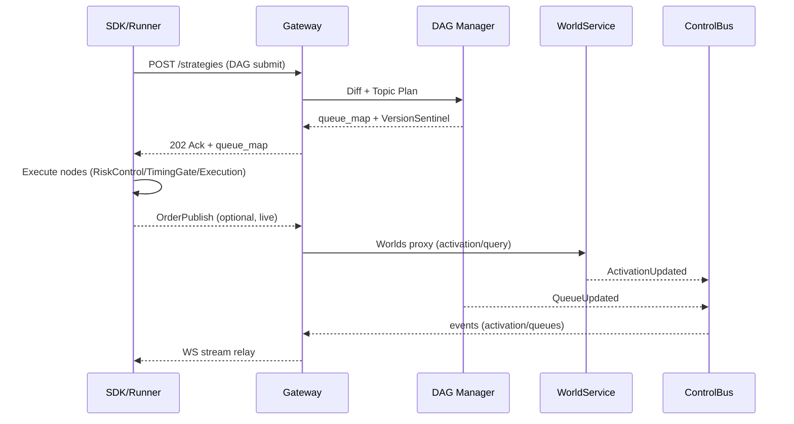
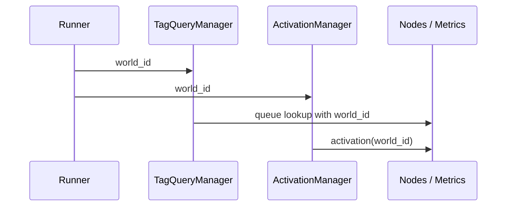

{{ nav_links() }}

# QMTL Advanced Architecture and Implementation Blueprint

!!! warning
    Legacy code samples that use `Runner.run`/`Runner.offline` are obsolete. Use `Runner.submit(..., world=...)` instead; the architecture remains the same, but the entrypoint is now submit-only.

## Related Documents
- [Architecture Overview](README.md)
- [Gateway](gateway.md)
- [DAG Manager](dag-manager.md)
- [Lean Brokerage Model](lean_brokerage_model.md)
- [WorldService](worldservice.md)
- [Core Loop Automation](core_loop_world_automation.md)
- [ControlBus](controlbus.md)
- [Exchange Node Sets](exchange_node_sets.md)
- Risk Signal Hub: [Risk Signal Hub Architecture](risk_signal_hub.md)

---

Bootstrap workflows and operational validation steps live in
[Backend Quickstart](../operations/backend_quickstart.md#fast-start-validate-and-launch).

---

## Deployment profiles

- **dev**: Default for local development. Some backends run in in-memory fallback or disabled mode. For example: DAG Manager falls back to in-memory graph/queue managers when `dagmanager.neo4j_dsn`/`dagmanager.kafka_dsn` are empty; WorldService uses an in-memory activation store when `worldservice.server.redis` is empty. Gateway uses an in-memory Redis shim when `gateway.redis_dsn` is empty, and disables features when `gateway.controlbus_brokers`/`gateway.controlbus_topics` or `gateway.commitlog_bootstrap`/`gateway.commitlog_topic` are empty.
- **prod**: Requires persistent backends across the stack. Missing `gateway.redis_dsn`, `gateway.database_backend=postgres` + `gateway.database_dsn`, `gateway.controlbus_brokers` + `gateway.controlbus_topics`, `gateway.commitlog_bootstrap` + `gateway.commitlog_topic`, `dagmanager.neo4j_dsn`, `dagmanager.kafka_dsn`, `dagmanager.controlbus_dsn`/`dagmanager.controlbus_queue_topic`, `worldservice.server.redis`, or `worldservice.server.controlbus_brokers` + `worldservice.server.controlbus_topic` causes startup to fail.

`qmtl config validate --target all` reports errors (not warnings) when `profile: prod` omits required DSNs, and the Gateway CLI enforces the same rule to prevent mixed modes (partial in-memory fallbacks).

<a id="core-loop-summary"></a>
## Core Loop decisions (incorporated)

- Single entrypoint: all submissions use `Runner.submit(..., world=...)`; there is no client-side `mode`. Stages (backtest/paper/live) are managed by world policy and WorldService. (`qmtl/runtime/sdk/submit.py`)
- WS as SSOT: SubmitResult exposes WorldService decision/activation envelopes as the source of truth, with local precheck kept separate. (`qmtl/services/worldservice/shared_schemas.py`, Core Loop contract tests)
- Default-safe: when WS decisions are missing or stale, executions downgrade to backtest/compute-only and mark safe_mode. (`qmtl/runtime/sdk/execution_context.py`, `tests/e2e/core_loop/test_compute_context_contract.py`)
- Data on-ramp: world presets drive Seamless auto-wiring by default, verified by the Core Loop contract suite. (`qmtl/runtime/sdk/world_data.py`, `tests/e2e/core_loop/`)

### Default-Safe Principle

- When configuration is thin or ambiguous, **downgrade to compute-only (backtest)**. Missing `execution_domain`/`as_of` must never yield live/dryrun promotion.
- WorldService must not default to live. Without `allow_live` and policy validation (required signals, hysteresis, dataset_fingerprint), activation/domain switches stay compute-only.
- Even if operators request live, activation stays closed until validation/policy gates pass. Minimal-config or sandbox runs must not open real trading; enforce “safe by default → explicit promotion.”

---

## 0. Overview: Motivation and Systemization Goals

QMTL is a strategy-centric data processing platform that executes complex DAGs
(Directed Acyclic Graphs) efficiently while reusing expensive computations.
Each node is a reusable compute unit with a canonical identity so identical or
similar strategies avoid duplicating work. Shared preprocessing nodes execute
once and their outputs fan out to all strategies that depend on them, which
dramatically reduces CPU, memory, and wall-clock usage in high-frequency or
multi-strategy environments.

At the architectural level, the core design value of QMTL can be stated in a
single sentence:

> **“Focus only on strategy logic; the system handles optimisation and returns.”**

All components described in this document (Gateway, DAG Manager, WorldService,
SDK/Runner, etc.) share the following intent:
- Strategy authors focus on **strategy DAGs, world selection, and execution mode**
  while the system layers own stage decisions, queue creation/scaling, ExecutionDomain handling,
  2‑Phase apply, feature artifact management, and risk/timing gating.
- Internal layers are allowed to be complex, but the **external interface is
  designed around `Write strategy → Submit → (Auto evaluate/deploy) → Check
  contribution`** as the primary user flow.
- When introducing new features, the default bias is “have the system decide
  automatically and offer overrides only when necessary” rather than pushing
  more configuration choices onto users.

!!! note "Supported execution modes"
    The Core Loop and execution model described in this document **always assume a stack that includes WorldService and Gateway**.  
    **Running the full strategy lifecycle (`submit → evaluate → gate → deploy`) in a “pure local, SDK-only” mode without WS/Gateway is *not* an officially supported mode.**
    
    ValidationPipeline, PnL helpers, and similar utilities may be used directly from the SDK for tests and experiments,  
    but WorldService remains the single source of truth for policy, evaluation, and gating, and the Core Loop narrative is defined in terms of that WS/Gateway-backed path.

### 0.1 Core Loop: Strategy Lifecycle

From the user’s perspective, QMTL’s **Core Loop** is:

> Implement strategy → Submit → (system backtests/evaluates/deploys inside a world) → Observe world performance → Refine strategy

- Strategy code only expresses “signal logic + required data”, while data supply/backfill/market replay are handled by the Seamless/DataPlane.
- A single `Runner.submit(..., world=...)` call warms up history, runs a replay‑style backtest, computes metrics, evaluates policies (WorldService), and surfaces activation/allocations at the world level.
- Users stay focused on the “submit → observe → improve” loop for their worlds.

#### 0.1.1 Backtest & Market Replay

- `HistoryWarmupService` and `Pipeline` handle `StreamInput` history loading and replay.
- Seamless/QuestDB/CCXT and other sources are integrated into the v2 data plane; worlds that declare `world.data.presets[]` let Runner/CLI auto‑wire a Seamless provider and StreamInputs from the world + preset. The default on‑ramp needs only `world` (and optionally a data preset) for market‑style replay; worlds without presets still follow the manual wiring described in the design docs.

#### 0.1.2 Data Supply Automation

- `SeamlessDataProvider v2` abstracts cache→storage→backfill→live and enforces SLAs/conformance/schema checks.
- When a world is specified, Runner/CLI defaults to a Seamless provider consistent with that world’s config/preset and auto‑injects it into StreamInputs so users think in terms of **data presets/fingerprints**, not low‑level data plumbing.

#### 0.1.3 Auto Evaluation → Tradable Transition

- `ValidationPipeline` computes Sharpe/MDD/linearity metrics and performs policy‑based PASS/FAIL checks, and `auto_returns` pre‑processing lets Runner.submit derive returns when explicit series are missing.
- WorldService `/worlds/{world_id}/evaluate` outputs (active/weight/contribution) map directly into Runner/CLI results, while local `ValidationPipeline` output is shown only in `precheck` so WS remains the SSOT for `status/weight/rank/contribution`.

#### 0.1.4 World‑Level Capital Allocation

- WorldService computes world and cross‑world allocation plans through `/allocations` and its internal rebalancing engine, and Runner.submit/CLI surface the latest snapshot for the submitted world (world/strategy shares, etag/updated_at, staleness hints) as read‑only context.
- The Core Loop treats evaluation/activation vs. allocation as a **two‑step standard flow**:  
  1) `Runner.submit(..., world=...)` → WS evaluation/activation, and  
  2) allocation/rebalancing via `/allocations`, `/rebalancing/plan`, and `/rebalancing/apply` (`qmtl world allocations|rebalance-*`).  
  Apply/rebalancing stays as an auditable operational step with `run_id`/`etag` tracking (`qmtl world apply <id> --run-id <id> [--plan-file ...]`).

### Core Principle: Simplicity > Backward Compatibility

!!! danger "Breaking Change Principle"
    **Do not keep legacy solely to preserve backward compatibility.**
    
    Keeping old and new APIs/config side-by-side for compatibility:
    - Doubles documentation surface ("old way" vs "new way")
    - Accumulates branches and flags in the codebase
    - Confuses new users on "which path is canonical"
    - Ultimately negates the simplification goal itself
    
    **Losing simplicity is more harmful than breaking backward compatibility.**

In practice:
- For major changes (e.g., Runner API, ExecutionDomain semantics, world policy schema), ship **explicit migration guides and helper tools**, but avoid long-lived runtime flags or compatibility modes.
- Docs, examples, and CLI should always point to a single “current” path; regularly prune dual paths so “old vs new” flows do not coexist indefinitely.

---

## 1. System Composition: Layer Interactions and Flow

```mermaid
graph LR
  subgraph Client
    SDK[SDK / Runner]
  end
  subgraph Edge
    GW[Gateway]
  end
  subgraph Core
    WS[WorldService (SSOT Worlds)]
    DM[DAG Manager (SSOT Graph)]
    CB[(ControlBus - internal)]
    GDB[(Graph DB)]
    KQ[(Kafka/Redpanda)]
  end

  SDK -- HTTP submit/queues/worlds --> GW
  GW -- proxy --> WS
  GW -- proxy --> DM
  DM --> GDB
  DM --> KQ
  WS -- publish --> CB
  DM -- publish --> CB
  GW -- subscribe --> CB
  GW -- WS (opaque) --> SDK
```

1. **SDK** serializes strategies into DAGs and submits or queries them via the
   Gateway. During execution it consumes ControlBus-driven event streams
   forwarded by the Gateway to react to activation or queue changes.
2. **Gateway** is the public ingress. It proxies WorldService and DAG Manager,
   owns caching, circuit-breaking, and observability, and relays ControlBus
   events to SDKs.
3. **WorldService** is the single source of truth (SSOT) for worlds, policies,
   decisions, and activations. It publishes decision and activation updates to
   the ControlBus.
4. **DAG Manager** is the SSOT for graphs, nodes, and queues. It computes diffs,
   orchestrates queue lifecycle, and publishes `QueueUpdated` events to the
   ControlBus.
5. **SDK** executes only the nodes required by the returned queue mapping and
   gates order publication via OrderGate nodes.

This layering minimises complexity and resource usage by reusing sub-DAGs
rather than entire graphs, enabling global optimisation through targeted
recomputation.

### 1.1 Node Families: Risk, Timing, Execution, Order Publication

The diagram below summarises the current node groups and their execution order.
Risk/Timing gates suppress or delay signals before execution, while the
execution/publish stages record and deliver orders through the brokerage model
and commit log.

```mermaid
flowchart LR
    subgraph Inputs
        D1[StreamInput/Features]
    end
    subgraph Pre-Trade Controls
        R[RiskControlNode\n(portfolio/position limits)]
        T[TimingGateNode\n(session/time rules)]
    end
    subgraph Execution Layer
        X[ExecutionNode\n(order type, TIF, slippage/fees)]
        P[OrderPublishNode\n(commit-log / gateway proxy)]
    end

    D1 --> R --> T --> X --> P
```

Reference material
- Operations guides: [Risk Management](../operations/risk_management.md), [Timing Controls](../operations/timing_controls.md)
- Specifications: [Brokerage API](../reference/api/brokerage.md), [Commit-Log Design](../reference/commit_log.md), [World/Activation API](../reference/api_world.md), [Order & Fill Event Schemas](../reference/api/order_events.md)

### 1.2 Sequence: SDK/Runner <-> Gateway <-> DAG Manager <-> WorldService

The sequence diagram illustrates how a strategy submission flows end-to-end:
SDK/Runner submits the DAG, Gateway mediates DAG Manager and WorldService, and
ControlBus events propagate activation or queue changes back to the SDK in
real time.



Implementation details live in the component specifications: [Gateway](gateway.md),
[DAG Manager](dag-manager.md), and [WorldService](worldservice.md). Operational
examples are catalogued under [operations/](../operations/README.md) and
[reference/](../reference/README.md).

### 1.3 Execution Domains & Isolation

- **Domains:** `backtest | dryrun | live | shadow`. Execution domains are owned
  by WorldService. Gating and promotion follow a backend-driven two-phase
  apply (Freeze/Drain -> Switch -> Unfreeze). The SDK/Runner never chooses a
  domain; it simply consumes the outcome of world decisions. The submission
  `meta.execution_domain` is treated only as a **hint**; Gateway normalises it
  against the WorldService decision (e.g., `live` hints are ignored and
  downgraded to compute-only when no fresh WS decision exists).
- **NodeID vs ComputeKey:** NodeID is a global, world-agnostic identifier.
  Runtime isolation relies on `ComputeKey = blake3(NodeHash + world_id + execution_domain + as_of + partition)`.
  Cross-context cache hits are policy violations with an SLO of zero. SDKs do
  not propose or inject ComputeKeys-the services derive and validate them using
  world decisions and submission metadata.
- **WVG extensions:** `WorldNodeRef = (world_id, node_id, execution_domain)` keeps
  per-domain state and validation isolated. WorldService exposes `EdgeOverride`
  controls (`backtest -> live` edges are disabled by default) via
  [`EdgeOverrideRepository`]({{ code_url('qmtl/services/worldservice/storage/edge_overrides.py#L13') }})
  and the API route [`/worlds/{world_id}/edges/overrides`]({{ code_url('qmtl/services/worldservice/routers/worlds.py#L109') }}).
- **Envelope mapping:** Gateway/SDKs annotate ControlBus/WebSocket copies of
  `DecisionEnvelope` objects with an `execution_domain` field derived from
  `effective_mode`. The canonical WS schema omits this field. The mapping is
  `validate -> backtest (orders gated OFF)`, `compute-only -> backtest`,
  `paper/sim -> dryrun`, `live -> live`, while `shadow` remains operator-only.
  Runner/SDK does not execute in `shadow`; any such input is safely treated as
  backtest. Ambiguous aliases like `offline`/`sandbox` also downgrade to
  backtest.
- **Queue namespaces:** Production deployments SHALL partition topics with the
  prefix `{world_id}.{execution_domain}.<topic>` and enforce cross-domain access
  via ACLs. Operational namespace defaults to `live`. If a world decision is
  missing or stale, the effective execution mode falls back to `compute-only`
  (backtest, orders gated OFF).
- **WorldNodeRef independence:** Distinct execution domains MUST NOT share
  state, queues, or validation artifacts. When reuse is required, leverage the
  immutable Feature Artifact plane (Sec.1.4).
- **Promotion guard:** WVG `EdgeOverride` entries disable `backtest -> live`
  paths until a two-phase apply completes and policy explicitly re-enables them.

### 1.4 Feature Artifact Plane (Dual-Plane)

- **Goal:** Isolate immutable feature artifacts from strategy/execution runtime
  state while enabling safe reuse across domains.
- **Key:** `(factor, interval, params, instrument, t, dataset_fingerprint)`; the
  fingerprint anchors every artifact to a dataset snapshot so cross-domain
  validation remains reproducible.
- **Storage:** Any immutable backend (object storage, filesystem, RocksDB) is
  acceptable as long as live services mount it read-only.
- **Sharing policy:** Only feature artifacts may be shared across domains and
  they must remain read-only. Runtime caches (ComputeKey scoped) are never
  shared.
- **Retention & backfill:** Version artifacts, document retention policy, and
  define explicit backfill workflows. Removing artifacts requires assessing
  downstream consumers.
- **ComputeKey interplay:** When runtime cache hits occur, the ComputeKey scope
  enforces domain isolation; feature artifacts are treated strictly as inputs.
- **SDK implementation:** `qmtl.runtime.sdk.feature_store` records artifacts for
  backtest/dryrun domains and exposes `CacheView.feature_artifacts()` for live
  or shadow domains to consume them read-only.
- **CLI/backfill guidance:** Pin `cache.feature_artifact_dir` for local replays
  and limit `cache.feature_artifact_write_domains` to keep replay and promotion
  pipelines isolated.

### 1.5 Clock & Input Guards

- Backtest/dryrun domains use `VirtualClock` with a mandatory `as_of` timestamp.
  Live runs use `WallClock`. Mixed usage must fail during build or static
  validation.
- All backtest input nodes SHALL provide `as_of` (dataset commit). Gateway
  either rejects requests that omit it or downgrades them to a safe mode.
- SDK annotations can declare the intended clock, but WorldService/Gateway
  make the final decision. Conflicts revert to `compute-only` (backtest, orders
  gated OFF).

### 1.6 Global vs. World-Local Graphs (GSG/WVG)

- **Global Strategy Graph (GSG):** An append-only, content-addressed DAG owned by
  DAG Manager. Identical node content MUST map to a single NodeID across the
  entire estate.
- **World View Graph (WVG):** A world-scoped overlay maintained by WorldService.
  It references GSG nodes while attaching world-local state such as validation
  results, activation status, and policy overrides.
- GSG and WVG boundaries enforce clear ownership and audit trails. Feature
  artifacts bridge the graphs without violating isolation.

---

## 2. Strategy State Transition Scenarios

| Scenario Type | Primary Cause                     | Secondary System Response                 | Outcome / Interpretation                                       |
|---------------|-----------------------------------|-------------------------------------------|-----------------------------------------------------------------|
| Optimistic    | Reusable compute hash              | DAG diff skips redundant nodes            | Resource savings and shorter strategy turnaround time           |
| Neutral       | Concurrent topic creation request  | Kafka idempotent API resolves duplicates  | Queue creation remains consistent without manual coordination   |
| Pessimistic   | Gateway Redis state loss           | Recovery via AOF + PostgreSQL WAL         | Durable recovery path prevents unrecoverable ingestion states   |

---

## 3. Structural Design Decisions & Meta Modeling

1. **Deterministic NodeID (GSG canonical ID)**  
   NodeID is `blake3:<digest>` of the canonical serialization  
   `(node_type, interval, period, params_canon, dependencies_sorted, schema_compat_id, code_hash)`.  
   Non-deterministic fields (timestamps, random seeds, environment) MUST be
   excluded. Parameter maps are flattened with stable ordering and precision.
   Hash strings SHALL include the `blake3:` prefix; length may be extended via
   BLAKE3 XOF if collisions ever need mitigation. SDK and Gateway share the
   `CanonicalNodeSpec` builder to guarantee ordering and omit world/domain
   parameters. `schema_compat_id` tracks major schema compatibility so minor
   schema changes retain the same NodeID.

2. **Version Sentinel**  
   Gateway inserts a meta node immediately after ingest so each DAG submission
   has an explicit version boundary. Sentinels fan out to all nodes in the
   submission, enabling canary promotion, rollback, and traffic weighting without
   requiring strategy code changes. Sentinel nodes themselves are immutable and
   managed by DAG Manager.

3. **Canonical DAG Payload**  
   DAG JSON payloads are normalised before hashing: keys sorted, numeric
   precision fixed, and dependency lists sorted by NodeID. Gateway rejects
   requests whose provided NodeIDs do not match the canonical recomputation.

4. **TagQuery Canonicalisation**  
   TagQuery nodes include only canonical query specs (`query_tags` sorted,
   `match_mode`, `interval`). Runtime queue discoveries are reflected via
   ControlBus events and MUST NOT alter NodeID.

5. **Schema Compatibility Contracts**  
   Major schema changes bump `schema_compat_id`. Minor changes reuse the same
   compatibility ID and rely on buffer modes or controlled recompute windows.

---

## 4. Eval Keys, World Bindings, and Propagation

### 4.1 EvalKey (BLAKE3, namespaced)

```
EvalKey = blake3(NodeID || WorldID || ExecutionDomain || ContractID || DatasetFingerprint || CodeVersion || ResourcePolicy)
```

Different worlds, datasets, policies, code, or resource allocations force
independent validation cycles even when the underlying NodeID matches.

Design intent summary:
- **NodeID** provides global content addressing.
- **ComputeKey** isolates runtime execution (world, domain, as_of, partition).
- **EvalKey** anchors policy decisions for reproducible promotion workflows and
  is scoped per execution domain.

### 4.2 World ID Propagation

`world_id` flows from the Runner into `TagQueryManager` and `ActivationManager`
so queue lookups and activation subscriptions remain world-aware. Nodes and
metrics include the identifier for auditability.



```python
from qmtl.runtime.sdk import Strategy, StreamInput, Runner

class FlowExample(Strategy):
    def setup(self):
        price = StreamInput(tags=["BTC", "price"], interval="1m", period=30)
        self.add_nodes([price])

Runner.submit(FlowExample, world="arch_world")
```

`TagQueryManager` includes `world_id` in `GET /queues/by_tag` requests,
`ActivationManager` polls `/worlds/{world_id}/activation`, and OrderGate metrics
emit world-scoped labels.

### 4.3 WorldStrategyBinding (WSB)

- **Definition:** `WSB = (world_id, strategy_id)` binding. Created idempotently
  per world during submission.
- **Submission:** `POST /strategies` accepts `world_ids[]` (preferred) or
  `world_ids`. The SDK still recommends running a dedicated process per
  world when operating multi-world strategies.
- **Behaviour:** Gateway upserts the WSB via WorldService after each diff so the
  WVG contains a `WorldNodeRef(root)` anchor. Activation and decision records
  are always stored world-locally.

---

## Appendix: General strategy example (Runner API)

The following sample aligns with the core architectural rules: user-defined
compute functions operate on a read-only `CacheView`, nodes reference each
other directly inside the DAG, and all warmup/period/interval constraints are
respected.

```python
from qmtl.runtime.sdk import Strategy, Node, StreamInput, Runner
import pandas as pd

# Strategy definition
class GeneralStrategy(Strategy):
    def setup(self):
        price_stream = StreamInput(
            interval="60s",    # 1-minute bars
            period=30           # require the last 30 bars
        )

        def generate_signal(view) -> pd.DataFrame:
            price = view.as_frame(price_stream, 60, columns=["close"]).validate_columns(["close"])
            momentum = price.frame["close"].pct_change().rolling(5).mean()
            signal = (momentum > 0).astype(int)
            return pd.DataFrame({"signal": signal})

        signal_node = Node(
            input=price_stream,
            compute_fn=generate_signal,
            name="momentum_signal"
        )

        self.add_nodes([price_stream, signal_node])

# World-driven execution entry point
if __name__ == "__main__":
    Runner.submit(GeneralStrategy, world="general_demo")
```

---

### Appendix: Tag Query strategy example (automatic multi-upstream selection)

This example assumes existing hourly RSI/MFI indicator nodes tagged with
`["ta-indicator"]`. `TagQueryNode` pulls all matching streams into the strategy
and computes a correlation matrix.

```python
from qmtl.runtime.sdk import Strategy, Node, Runner, TagQueryNode, MatchMode
import pandas as pd

# User-defined correlation helper
def calc_corr(view) -> pd.DataFrame:
    aligned = view.align_frames([(node_id, 3600) for node_id in view], window=24)
    frames = [frame.frame for frame in aligned if not frame.frame.empty]
    if not frames:
        return pd.DataFrame()

    corr = pd.concat(frames, axis=1).corr(method="pearson")
    return corr

class CorrelationStrategy(Strategy):
    def setup(self):
        # TagQueryNode: automatically resolves upstreams matching the tag/interval
        indicators = TagQueryNode(
            query_tags=["ta-indicator"],  # match existing RSI, MFI, etc.
            interval="1h",               # hourly bars
            period=24,                    # keep the last 24 hours
            match_mode=MatchMode.ANY,     # OR-matching by default
            compute_fn=calc_corr          # compute correlation directly
        )

        corr_node = Node(
            input=indicators,
            compute_fn=calc_corr,
            name="indicator_corr"
        )

        self.add_nodes([indicators, corr_node])

        # match_mode=MatchMode.ANY matches queues with any tag; MatchMode.ALL
        # restricts to queues containing all tags.

# Live execution example (world-driven)
if __name__ == "__main__":
    Runner.submit(CorrelationStrategy, world="corr_demo")
```

---

## 5. Component Responsibilities & Technology Stack

| Component    | Responsibility                                         | Primary Stack                               |
|--------------|--------------------------------------------------------|---------------------------------------------|
| SDK          | Build DAGs, execute strategy code, local parallelism   | Python 3.11, Ray, Pydantic                  |
| Gateway      | Submission FSM, DAG diff orchestration, callbacks      | FastAPI, Redis, PostgreSQL, xstate-py       |
| DAG Manager  | Global DAG storage, incremental queries, topic policy  | Neo4j 5.x, APOC, Kafka Admin Client         |
| WorldService | World policy/decision/activation SSOT                  | FastAPI, Redis, PostgreSQL                  |
| Infra        | Message bus, storage, observability                    | Redpanda, Prometheus, Grafana, MinIO        |

Ownership boundaries recap:
- **SDK** executes DAGs locally but does not own global state.
- **Gateway** manages submission lifecycle but not graph/world/queue state.
- **DAG Manager** owns ComputeNode and Queue metadata plus topic lifecycle.
- **WorldService** owns world policy, decisions, and activation events.
- **Infra (Redpanda/Kafka)** persists data and control-plane streams.

---

## 6. Commit-Log Boundary

QMTL adopts an append-only commit-log design so every state transition is
replayable:

1. Each ComputeNode emits to a dedicated Kafka topic, allowing historical replay.
2. DAG Manager records queue creation/updates and publishes `QueueUpdated` and
   `sentinel_weight` events to the ControlBus topic.
3. Gateway appends strategy submissions to `gateway.commitlog_topic` (default:
   `gateway.ingest`) before diffing, storing offsets in Redis for at-least-once
   processing.
4. WorldService records activation/decision events to the same log for audit and
   rollback support.

The commit-log boundary enforces ownership, simplifies recovery to precise
points-in-time, and provides a durable audit trail.

---

## 7. Determinism & Operational Checklist

1. **Gateway <-> SDK CRC validation** - Enforce mutual `crc32` checks of NodeIDs.
2. **NodeCache guardrails & GC** - Evict slices beyond `period x interval` and
   maintain zero-copy Arrow transfers.
3. **Kafka topic creation retries** - Follow the `CREATE_TOPICS -> VERIFY ->
   WAIT -> BACKOFF` loop and inspect broker metadata for near-name collisions.
4. **Sentinel traffic shift verification** - Ensure Gateway and SDK converge on
   updated weights within 5 seconds (`sentinel_skew_seconds` metric).
5. **TagQueryNode expansion** - Emit `tagquery.upsert` CloudEvents and let
   `TagQueryManager` refresh buffers automatically.
6. **Minor-schema buffering** - Reuse nodes for `schema_minor_change` but force a
   full recompute after 7 days.
7. **GSG canonicalisation & SSA DAG lint** - Convert DAGs to canonical JSON + SSA
   form and verify regenerated NodeIDs.
8. **Golden-signal SLO/alerts** - Maintain Prometheus rules for
   `diff_duration_ms_p95`, `nodecache_resident_bytes`, and `sentinel_gap_count`,
   and track submit→activation SLOs through the Core Loop golden-signal
   dashboard/SLOs (`../operations/core_loop_golden_signals.md`, T5 P1‑M2 delivered).
9. **Failure playbooks** - Cross-link runbooks and dashboards for Neo4j failures,
   Kafka metadata corruption, and Redis AOF loss.
10. **Four-stage CI/CD gate** - Pre-merge SSA lint + fast backtests, 24h canary,
    50% promotion, single-command rollback.
11. **NodeID world exclusion** - Static/dynamic validation that NodeID inputs do
    not include `world_id`; identical code/params/dependencies must yield the
    same NodeID across worlds.
12. **TagQueryNode stability** - Confirm NodeID remains unchanged before/after
    discovering additional queues when query specs are identical.

Meeting all items marks the QMTL v0.9 "Determinism" milestone.
The golden-signal To-Be is materialised in the dashboards/SLOs documented in `../operations/core_loop_golden_signals.md`.

### Observability & runbook
- Gateway metrics: `nodeid_checksum_mismatch_total{source="dag"}`, `nodeid_missing_fields_total{field,node_type}`, `nodeid_mismatch_total{node_type}`, `tagquery_nodeid_mismatch_total`.
- Runbook: follow `docs/en/operations/determinism.md` for NodeID CRC/TagQuery mismatches; if the counters rise, regenerate DAG node_ids and re-run the Core Loop contract suite (`tests/e2e/core_loop`).

---

## 8. Additional Guidance

- Promotions must pin `dataset_fingerprint` in policies and EvalKeys; missing
  fingerprints downgrade or reject applies.
- `observability.slo.cross_context_cache_hit` MUST remain zero; violations halt
  execution until remediated.
- Policy bundles should declare `share_policy`, edge overrides, and risk limits
  explicitly so promotion pipelines remain auditable.
- Keep layer templates loosely coupled and document changes in
  `docs/en/architecture/layered_template_system.md`.

{{ nav_links() }}
