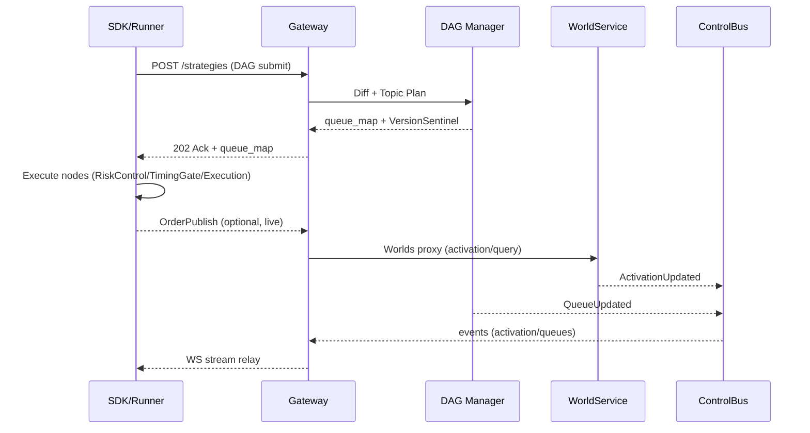
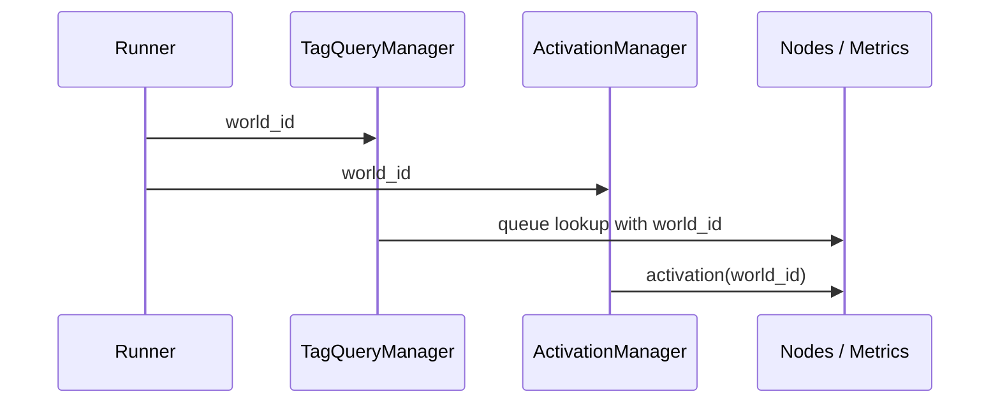

{{ nav_links() }}

# QMTL Normative Architecture

## Related Documents
- [Architecture Overview](README.md)
- [QMTL Design Principles](design_principles.md)
- [QMTL Capability Map](capability_map.md)
- [QMTL Semantic Types](semantic_types.md)
- [QMTL Decision Algebra](decision_algebra.md)
- [QMTL Implementation Traceability](implementation_traceability.md)
- [Core Loop Contract](../contracts/core_loop.md)
- [World Lifecycle Contract](../contracts/world_lifecycle.md)
- [Gateway](gateway.md)
- [DAG Manager](dag-manager.md)
- [Lean Brokerage Model](lean_brokerage_model.md)
- [WorldService](worldservice.md)
- [World Allocation and Rebalancing Contract](rebalancing_contract.md)
- [Core Loop Automation](core_loop_world_automation.md)
- [ControlBus](controlbus.md)
- [ACK/Gap Resync RFC (Draft)](../design/ack_resync_rfc.md)
- [Exchange Node Sets](exchange_node_sets.md)
- Risk Signal Hub: [Risk Signal Hub Architecture](risk_signal_hub.md)
- Core Loop contract tests: `tests/e2e/core_loop/README.md`

This page covers only QMTL’s **service boundaries, invariants, and domain contracts**.

- Bootstrap, deployment, config validation, and runbooks live in the [operations layer](../operations/README.md).
- Legacy cleanup and the transition to a submit-only surface live in [Migration: Removing Legacy Modes and Backward Compatibility](../guides/migration_bc_removal.md).
- The current implementation scope and `partial/implemented` status live in [QMTL Implementation Traceability](implementation_traceability.md).

<a id="core-loop-summary"></a>
## Core Loop decisions (incorporated)

The product-facing Core Loop contract is now split out into dedicated contract pages.

- The strategy-author golden path lives in [Core Loop Contract](../contracts/core_loop.md).
- Stage transitions and promotion handoff live in [World Lifecycle Contract](../contracts/world_lifecycle.md).
- This page explains the **internal architecture that upholds those contracts**.

### Default-Safe Principle

- When configuration is thin or ambiguous, **downgrade to compute-only (backtest)**. Missing `execution_domain`/`as_of` must never yield live/dryrun promotion.
- WorldService must not default to live. Without `allow_live` and policy validation (required signals, hysteresis, dataset_fingerprint), activation/domain switches stay compute-only.
- Even if operators request live, activation stays closed until validation/policy gates pass. Minimal-config or sandbox runs must not open real trading; enforce “safe by default → explicit promotion.”

---

## 0. Overview: Motivation and Systemization Goals

QMTL is a strategy-centric data processing platform that executes complex DAGs
(Directed Acyclic Graphs) efficiently while reusing expensive computations.
Each node is a reusable compute unit with a canonical identity so identical or
similar strategies avoid duplicating work. Shared preprocessing nodes execute
once and their outputs fan out to all strategies that depend on them, which
dramatically reduces CPU, memory, and wall-clock usage in high-frequency or
multi-strategy environments.

At the architectural level, the core design value of QMTL can be stated in a
single sentence:

> **“Focus on strategy logic; the system owns orchestration, policy, and safe automation.”**

All components described in this document (Gateway, DAG Manager, WorldService,
SDK/Runner, etc.) share the following intent:
- Strategy authors focus on **strategy DAGs and world selection**, while system layers own stage decisions, queue creation/scaling, ExecutionDomain handling, feature-artifact management, and risk/timing gating.
- Internal layers may be complex, but the external surface should remain centered on a single submission path and read-only result surfaces.
- New features should default toward automatic system decisions with explicit overrides only where necessary.

### 0-A. Design Review Criteria (Normative)

This document describes the current architecture, but future feature additions and
design changes should be judged first against the following documents:

- [QMTL Design Principles](design_principles.md): first-class rules for extension
- [QMTL Capability Map](capability_map.md): capability-centered structure rather than archetype-centered structure
- [QMTL Semantic Types](semantic_types.md): legality and isolation axes
- [QMTL Decision Algebra](decision_algebra.md): shared decision family and planner boundaries

The following rules are treated as **normative design criteria** for future work:

- New features should be explained as capability composition, not as archetype-specific exceptions.
- Restrictions should be expressed in semantic types, not in feature or product names.
- Combinations such as `ML + MM` should remain ordinary composition paths, not special cases.
- Profiles are examples for explanation and onboarding, not first-class axes of the Core.

If future documentation or implementation begins to accumulate combination-specific
branches, revisit the capability boundaries and semantic contracts before extending
the implementation further.

!!! note "Supported execution modes"
    The Core Loop and execution model described in this document **always assume a stack that includes WorldService and Gateway**.  
    **Running the full strategy lifecycle (`submit → evaluate → gate → deploy`) in a “pure local, SDK-only” mode without WS/Gateway is *not* an officially supported mode.**
    
    ValidationPipeline, PnL helpers, and similar utilities may be used directly from the SDK for tests and experiments,  
    but WorldService remains the single source of truth for policy, evaluation, and gating, and the Core Loop narrative is defined in terms of that WS/Gateway-backed path.

### 0.1 Core Loop: Strategy Lifecycle

The product-facing Core Loop narrative now lives in [Core Loop Contract](../contracts/core_loop.md) and [World Lifecycle Contract](../contracts/world_lifecycle.md).

The only summary preserved here is:

- submissions converge on `Runner.submit(..., world=...)`
- stage and world-policy outcomes are managed across the Gateway/WorldService boundary
- data on-ramp and replay/backtest are owned by the data plane and SDK orchestration
- allocation/rebalancing is a separate control-plane contract documented in [World Allocation and Rebalancing Contract](rebalancing_contract.md)

### Legacy and Migration

This page assumes only the current, supported surfaces. Legacy-removal policy and concrete migration checklists are maintained in [Migration: Removing Legacy Modes and Backward Compatibility](../guides/migration_bc_removal.md).

---

## 1. System Composition: Layer Interactions and Flow

```mermaid
graph LR
  subgraph Client
    SDK[SDK / Runner]
  end
  subgraph Edge
    GW[Gateway]
  end
  subgraph Core
    WS[WorldService (SSOT Worlds)]
    DM[DAG Manager (SSOT Graph)]
    CB[(ControlBus - internal)]
    GDB[(Graph DB)]
    KQ[(Kafka/Redpanda)]
  end

  SDK -- HTTP submit/queues/worlds --> GW
  GW -- proxy --> WS
  GW -- proxy --> DM
  DM --> GDB
  DM --> KQ
  WS -- publish --> CB
  DM -- publish --> CB
  GW -- subscribe --> CB
  GW -- WS (opaque) --> SDK
```

1. **SDK** serializes strategies into DAGs and submits or queries them via the
   Gateway. During execution it consumes ControlBus-driven event streams
   forwarded by the Gateway to react to activation or queue changes.
2. **Gateway** is the public ingress. It proxies WorldService and DAG Manager,
   owns caching, circuit-breaking, and observability, and relays ControlBus
   events to SDKs.
3. **WorldService** is the single source of truth (SSOT) for worlds, policies,
   decisions, and activations. It publishes decision and activation updates to
   the ControlBus.
4. **DAG Manager** is the SSOT for graphs, nodes, and queues. It computes diffs,
   orchestrates queue lifecycle, and publishes `QueueUpdated` events to the
   ControlBus.
5. **SDK** executes only the nodes required by the returned queue mapping and
   gates order publication via OrderGate nodes.

This layering minimises complexity and resource usage by reusing sub-DAGs
rather than entire graphs, enabling global optimisation through targeted
recomputation.

### 1.1 Node Families: Risk, Timing, Execution, Order Publication

The diagram below summarises the current node groups and their execution order.
Risk/Timing gates suppress or delay signals before execution, while the
execution/publish stages record and deliver orders through the brokerage model
and commit log.

```mermaid
flowchart LR
    subgraph Inputs
        D1[StreamInput/Features]
    end
    subgraph Pre-Trade Controls
        R[RiskControlNode\n(portfolio/position limits)]
        T[TimingGateNode\n(session/time rules)]
    end
    subgraph Execution Layer
        X[ExecutionNode\n(order type, TIF, slippage/fees)]
        P[OrderPublishNode\n(commit-log / gateway proxy)]
    end

    D1 --> R --> T --> X --> P
```

Reference material
- Operations guides: [Risk Management](../operations/risk_management.md), [Timing Controls](../operations/timing_controls.md)
- Specifications: [Brokerage API](../reference/api/brokerage.md), [Commit-Log Design](../reference/commit_log.md), [World/Activation API](../reference/api_world.md), [Order & Fill Event Schemas](../reference/api/order_events.md)

### 1.2 Label Nodes/Node Sets Are Training-Only

Label nodes and labeling node sets are **training/evaluation only**. The delayed
label stream contains future information, so it must remain isolated from any
order/decision path to avoid leakage.

- Send label streams only to offline storage, training pipelines, or evaluation
  metrics.
- Never connect label outputs to the order path (signal → risk/timing → execution
  → order publish).
- In live mode, `NodeSetOptions.label_order_guard` can warn (`warn`) or block
  (`block`, default) if label outputs are wired into the order path.

Recommended wiring example:

```mermaid
flowchart LR
    subgraph Decision/Order Path
        S[Signal Node]
        R[Risk/Timing Gate]
        O[Order Publish]
        S --> R --> O
    end

    subgraph Labeling (offline only)
        P[Price/Input]
        E[Entry Events]
        L[Label NodeSet (delayed labels)]
        P --> L
        E --> L
        L --> T[Label Store / Training]
    end

    L -. do not connect to orders .-> R
```

### 1.3 Sequence: SDK/Runner <-> Gateway <-> DAG Manager <-> WorldService

The sequence diagram illustrates how a strategy submission flows end-to-end:
SDK/Runner submits the DAG, Gateway mediates DAG Manager and WorldService, and
ControlBus events propagate activation or queue changes back to the SDK in
real time.


```mermaid
sequenceDiagram
    participant SDK as SDK/Runner
    participant GW as Gateway
    participant DM as DAG Manager
    participant WS as WorldService
    participant CB as ControlBus

    SDK->>GW: POST /strategies (DAG submit)
    GW->>DM: Diff + Topic Plan
    DM-->>GW: queue_map + VersionSentinel
    GW-->>SDK: 202 Ack + queue_map
    SDK->>SDK: Execute nodes (RiskControl/TimingGate/Execution)
    SDK-->>GW: OrderPublish (optional, live)
    GW->>WS: Worlds proxy (activation/query)
    WS-->>CB: ActivationUpdated
    DM-->>CB: QueueUpdated
    CB-->>GW: events (activation/queues)
    GW-->>SDK: WS stream relay
```

Implementation details live in the component specifications: [Gateway](gateway.md),
[DAG Manager](dag-manager.md), and [WorldService](worldservice.md). Operational
examples are catalogued under [operations/](../operations/README.md) and
[reference/](../reference/README.md).

### 1.4 Execution Domains & Isolation

- **Domains:** `backtest | dryrun | live | shadow`. Execution domains are owned
  by WorldService. Gating and promotion follow a backend-driven two-phase
  apply (Freeze/Drain -> Switch -> Unfreeze). The SDK/Runner never chooses a
  domain; it simply consumes the outcome of world decisions. The submission
  `meta.execution_domain` is treated only as a **hint**; Gateway normalises it
  against the WorldService decision (e.g., `live` hints are ignored and
  downgraded to compute-only when no fresh WS decision exists).
- **NodeID vs ComputeKey:** NodeID is a global, world-agnostic identifier.
  Runtime isolation relies on `ComputeKey = blake3(NodeHash + world_id + execution_domain + as_of + partition)`.
  Cross-context cache hits are policy violations with an SLO of zero. SDKs do
  not propose or inject ComputeKeys-the services derive and validate them using
  world decisions and submission metadata.
- **WVG extensions:** `WorldNodeRef = (world_id, node_id, execution_domain)` keeps
  per-domain state and validation isolated. WorldService exposes `EdgeOverride`
  controls (`backtest -> live` edges are disabled by default) via
  [`EdgeOverrideRepository`]({{ code_url('qmtl/services/worldservice/storage/edge_overrides.py#L13') }})
  and the API route [`/worlds/{world_id}/edges/overrides`]({{ code_url('qmtl/services/worldservice/routers/worlds.py#L109') }}).
- **Envelope mapping:** Gateway/SDKs annotate ControlBus/WebSocket copies of
  `DecisionEnvelope` objects with an `execution_domain` field derived from
  `effective_mode`. The canonical WS schema omits this field. The mapping is
  `validate -> backtest (orders gated OFF)`, `compute-only -> backtest`,
  `paper/sim -> dryrun`, `live -> live`, while `shadow` remains operator-only.
  Runner/SDK preserves `shadow` as a distinct execution domain, but order
  publish paths remain hard-blocked in `shadow`. Ambiguous aliases like
  `offline`/`sandbox` downgrade to backtest.
- **Queue namespaces:** Production deployments SHALL partition topics with the
  prefix `{world_id}.{execution_domain}.<topic>` and enforce cross-domain access
  via ACLs. Operational namespace defaults to `live`. If a world decision is
  missing or stale, the effective execution mode falls back to `compute-only`
  (backtest, orders gated OFF).
- **WorldNodeRef independence:** Distinct execution domains MUST NOT share
  state, queues, or validation artifacts. When reuse is required, leverage the
  immutable Feature Artifact plane (Sec.1.4).
- **Promotion guard:** WVG `EdgeOverride` entries disable `backtest -> live`
  paths until a two-phase apply completes and policy explicitly re-enables them.

### 1.5 Feature Artifact Plane (Dual-Plane)

- **Goal:** Isolate immutable feature artifacts from strategy/execution runtime
  state while enabling safe reuse across domains.
- **Key:** `(factor, interval, params, instrument, t, dataset_fingerprint)`; the
  fingerprint anchors every artifact to a dataset snapshot so cross-domain
  validation remains reproducible.
- **Storage:** Any immutable backend (object storage, filesystem, RocksDB) is
  acceptable as long as live services mount it read-only.
- **Sharing policy:** Only feature artifacts may be shared across domains and
  they must remain read-only. Runtime caches (ComputeKey scoped) are never
  shared.
- **Retention & backfill:** Version artifacts, document retention policy, and
  define explicit backfill workflows. Removing artifacts requires assessing
  downstream consumers.
- **ComputeKey interplay:** When runtime cache hits occur, the ComputeKey scope
  enforces domain isolation; feature artifacts are treated strictly as inputs.
- **Implementation note:** The currently shipped store/adaptor set is tracked in
  [QMTL Implementation Traceability](implementation_traceability.md). The
  normative contract here is only that backtest/dryrun may write artifacts,
  while live/shadow consume them read-only.
- **CLI/backfill guidance:** Pin `cache.feature_artifact_dir` for local replays
  and limit `cache.feature_artifact_write_domains` to keep replay and promotion
  pipelines isolated.

### 1.6 Clock & Input Guards

- Backtest/dryrun domains use `VirtualClock` with a mandatory `as_of` timestamp.
  Live runs use `WallClock`. Mixed usage must fail during build or static
  validation.
- All backtest input nodes SHALL provide `as_of` (dataset commit). Gateway
  either rejects requests that omit it or downgrades them to a safe mode.
- SDK annotations can declare the intended clock, but WorldService/Gateway
  make the final decision. Conflicts revert to `compute-only` (backtest, orders
  gated OFF).

### 1.7 Global vs. World-Local Graphs (GSG/WVG)

- **Global Strategy Graph (GSG):** An append-only, content-addressed DAG owned by
  DAG Manager. Identical node content MUST map to a single NodeID across the
  entire estate.
- **World View Graph (WVG):** A world-scoped overlay maintained by WorldService.
  It references GSG nodes while attaching world-local state such as validation
  results, activation status, and policy overrides.
- GSG and WVG boundaries enforce clear ownership and audit trails. Feature
  artifacts bridge the graphs without violating isolation.

---

## 2. Strategy State Transition Scenarios

| Scenario Type | Primary Cause                     | Secondary System Response                 | Outcome / Interpretation                                       |
|---------------|-----------------------------------|-------------------------------------------|-----------------------------------------------------------------|
| Optimistic    | Reusable compute hash              | DAG diff skips redundant nodes            | Resource savings and shorter strategy turnaround time           |
| Neutral       | Concurrent topic creation request  | Kafka idempotent API resolves duplicates  | Queue creation remains consistent without manual coordination   |
| Pessimistic   | Gateway Redis state loss           | Recovery via AOF + PostgreSQL WAL         | Durable recovery path prevents unrecoverable ingestion states   |

---

## 3. Structural Design Decisions & Meta Modeling

1. **Deterministic NodeID (GSG canonical ID)**  
   NodeID is `blake3:<digest>` of the canonical serialization  
   `(node_type, interval, period, params_canon, dependencies_sorted, schema_compat_id, code_hash)`.  
   Non-deterministic fields (timestamps, random seeds, environment) MUST be
   excluded. Parameter maps are flattened with stable ordering and precision.
   Hash strings SHALL include the `blake3:` prefix; length may be extended via
   BLAKE3 XOF if collisions ever need mitigation. SDK and Gateway share the
   `CanonicalNodeSpec` builder to guarantee ordering and omit world/domain
   parameters. `schema_compat_id` tracks major schema compatibility so minor
   schema changes retain the same NodeID.

2. **Version Sentinel**  
   Gateway inserts a meta node immediately after ingest so each DAG submission
   has an explicit version boundary. Sentinels fan out to all nodes in the
   submission, enabling canary promotion, rollback, and traffic weighting without
   requiring strategy code changes. Sentinel nodes themselves are immutable and
   managed by DAG Manager.

3. **Canonical DAG Payload**  
   DAG JSON payloads are normalised before hashing: keys sorted, numeric
   precision fixed, and dependency lists sorted by NodeID. Gateway rejects
   requests whose provided NodeIDs do not match the canonical recomputation.

4. **TagQuery Canonicalisation**  
   TagQuery nodes include only canonical query specs (`query_tags` sorted,
   `match_mode`, `interval`). Runtime queue discoveries are reflected via
   ControlBus events and MUST NOT alter NodeID.

5. **Schema Compatibility Contracts**  
   Major schema changes bump `schema_compat_id`. Minor changes reuse the same
   compatibility ID and rely on buffer modes or controlled recompute windows.

### 3.2 Runtime reliability and determinism

Operational reliability proposals, determinism checklists, and observability/runbook links are maintained in [Architecture Runtime Reliability](../reference/architecture_runtime_reliability.md). This architecture page stays focused on service boundaries and invariants.

---

## 4. Eval Keys, World Bindings, and Propagation

### 4.1 EvalKey (BLAKE3, namespaced)

```
EvalKey = blake3(NodeID || WorldID || ExecutionDomain || ContractID || DatasetFingerprint || CodeVersion || ResourcePolicy)
```

Different worlds, datasets, policies, code, or resource allocations force
independent validation cycles even when the underlying NodeID matches.

Design intent summary:
- **NodeID** provides global content addressing.
- **ComputeKey** isolates runtime execution (world, domain, as_of, partition).
- **EvalKey** anchors policy decisions for reproducible promotion workflows and
  is scoped per execution domain.

### 4.2 World ID Propagation

`world_id` flows from the Runner into `TagQueryManager` and `ActivationManager`
so queue lookups and activation subscriptions remain world-aware. Nodes and
metrics include the identifier for auditability.


```mermaid
sequenceDiagram
    participant R as Runner
    participant T as TagQueryManager
    participant A as ActivationManager
    participant N as Nodes / Metrics
    R->>T: world_id
    R->>A: world_id
    T->>N: queue lookup with world_id
    A->>N: activation(world_id)
```

```python
from qmtl.runtime.sdk import Strategy, StreamInput, Runner

class FlowExample(Strategy):
    def setup(self):
        price = StreamInput(tags=["BTC", "price"], interval="1m", period=30)
        self.add_nodes([price])

Runner.submit(FlowExample, world="arch_world")
```

`TagQueryManager` includes `world_id` in `GET /queues/by_tag` requests,
`ActivationManager` polls `/worlds/{world_id}/activation`, and OrderGate metrics
emit world-scoped labels.

### 4.3 WorldStrategyBinding (WSB)

- **Definition:** `WSB = (world_id, strategy_id)` binding. Created idempotently
  per world during submission.
- **Submission:** `POST /strategies` accepts `world_ids[]` (preferred) or
  `world_ids`. The SDK still recommends running a dedicated process per
  world when operating multi-world strategies.
- **Behaviour:** Gateway upserts the WSB via WorldService after each diff so the
  WVG contains a `WorldNodeRef(root)` anchor. Activation and decision records
  are always stored world-locally.

---

### 4.4 Examples and data on-ramp

Strategy examples, Seamless data on-ramp notes, TagQuery examples, and cross-market examples now live in [QMTL Architecture Examples](architecture_examples.md). The world-owned data wiring contract is defined separately in [World Data Preset Contract](../world/world_data_preset.md).

---

## 5. Component Responsibilities & Technology Stack

| Component    | Responsibility                                         | Primary Stack                               |
|--------------|--------------------------------------------------------|---------------------------------------------|
| SDK          | Build DAGs, execute strategy code, local parallelism   | Python 3.11, Ray, Pydantic                  |
| Gateway      | Submission FSM, DAG diff orchestration, callbacks      | FastAPI, Redis, PostgreSQL, xstate-py       |
| DAG Manager  | Global DAG storage, incremental queries, topic policy  | Neo4j 5.x, APOC, Kafka Admin Client         |
| WorldService | World policy/decision/activation SSOT                  | FastAPI, Redis, PostgreSQL                  |
| Infra        | Message bus, storage, observability                    | Redpanda, Prometheus, Grafana, MinIO        |

## Ownership Model

- **SDK** executes DAGs locally but does not own global state.
- **Gateway** manages submission lifecycle but not graph/world/queue state.
- **DAG Manager** owns ComputeNode and Queue metadata plus topic lifecycle.
- **WorldService** owns world policy, decisions, and activation events.
- **Infra (Redpanda/Kafka)** persists data and control-plane streams.

---

## 6. Commit-Log Boundary

QMTL adopts an append-only commit-log design so every state transition is
replayable:

1. Each ComputeNode emits to a dedicated Kafka topic, allowing historical replay.
2. DAG Manager records queue creation/updates and publishes `QueueUpdated` and
   `sentinel_weight` events to the ControlBus topic.
3. Gateway appends strategy submissions to `gateway.commitlog_topic` (default:
   `gateway.ingest`) before diffing, and provides at-least-once processing by
   committing Kafka consumer-group offsets only after successful handling.
4. WorldService emits activation/decision events on the ControlBus, and Gateway
   subscribes and relays those updates to SDK/clients.

The commit-log boundary enforces ownership, simplifies recovery to precise
points-in-time, and provides a durable audit trail.

---

## 7. Supplemental references

- [Architecture Runtime Reliability](../reference/architecture_runtime_reliability.md): determinism checklist, runtime reliability proposals, observability links
- [QMTL Architecture Examples](architecture_examples.md): strategy examples and data on-ramp examples
- [World Event Stream Runtime](world_eventstream_runtime.md): activation/queue/policy fan-out boundary
- [ACK/Gap Resync RFC (Draft)](../design/ack_resync_rfc.md): ACK/gap resync design discussion

{{ nav_links() }}
