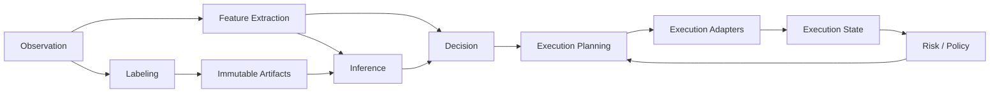

{{ nav_links() }}

# QMTL Capability Map

## Related Documents

- [QMTL Design Principles](design_principles.md)
- [Semantic Types](semantic_types.md)
- [Decision Algebra](decision_algebra.md)
- [Architecture Overview](architecture.md)

## Overview

QMTL is a capability-composition system rather than an archetype-driven system.
The core architecture must therefore describe **which capabilities connect through
which contracts**, rather than focusing first on which strategy types are supported.

The capability map below defines the minimum common structure used as the extension
criterion for QMTL.

## Capability Definitions

| Capability | Description | Typical Inputs | Typical Outputs | Core Rule |
| --- | --- | --- | --- | --- |
| Observation | Ingest market, fill, portfolio, and external events | external streams | CausalStream | core input boundary |
| Feature Extraction | Transform observations into usable features | Observation, ImmutableArtifact | CausalStream, ImmutableArtifact | usable by both execution and research paths |
| Labeling | Generate future-dependent labels | Observation, entry events | DelayedStream, ImmutableArtifact | must not feed live decision paths |
| Inference | Rule-based or learned inference | CausalStream, ImmutableArtifact | Decision | must not directly consume delayed values on live paths |
| Decision | Express execution intent | features/inference outputs | Decision subtype | must follow the shared decision algebra |
| Execution Planning | Convert decisions into executable plans | Decision, ExecutionState, RiskPolicy | Plan | order- and quote-shaped planners are both allowed |
| Execution Adapters | Bridge to venue/broker/system boundaries | Plan | ack/fill/events | external I/O is isolated here |
| Execution State | Track open orders, quotes, fills, inventory, portfolio | adapter events | MutableExecutionState | world/domain scoped |
| Risk / Policy | Apply stateful and stateless constraints | Decision, Plan, ExecutionState | filtered Decision/Plan | may not bypass semantic-type rules |

## Relationships Between Capabilities

### Observation

Concept ID: `CAP-OBSERVATION`

Observation is the boundary through which the system reads the outside world.
Quotes, trades, order books, fills, portfolio snapshots, and operator commands all
belong to this capability.

### Feature Extraction

Concept ID: `CAP-FEATURE-EXTRACTION`

Feature extraction transforms raw observations into causal features usable by
inference or rules. Some features may be promoted into immutable artifacts for
replay and research reuse.

### Labeling

Concept ID: `CAP-LABELING`

Labeling generates delayed outputs for training and evaluation.
It is a first-class research capability, but its boundary to execution must be
enforced through semantic rules rather than ad hoc exceptions.

### Inference

Concept ID: `CAP-INFERENCE`

Inference is not limited to ML.
Rule-based scoring, statistical models, and external model calls all belong here.
The key requirement is that they emit values in the shared decision algebra.

### Decision

Concept ID: `CAP-DECISION`

Decision is the layer that represents execution intent.
Position targets, order intents, and quote intents are not separate archetypes;
they are different subtypes within the same decision algebra.

### Execution Planning

Concept ID: `CAP-EXECUTION-PLANNING`

Execution planning converts decisions into executable plans.
Most of the difference between directional and market-making strategies should
appear here.

- `PositionTargetDecision -> OrderIntentPlan`
- `QuoteIntentDecision -> CancelReplacePlan`

### Execution State

Concept ID: `CAP-EXECUTION-STATE`

Execution state is mutable and world/domain scoped.
It must therefore remain separate from immutable artifacts and cannot be shared
across domains.

### Execution Adapters

Concept ID: `CAP-EXECUTION-ADAPTERS`

Execution adapters carry plans across real I/O boundaries such as venues,
brokers, gateways, and external services.
External APIs, commit logs, brokerage clients, and webhook ingress are explained through this capability.

### Risk / Policy

Concept ID: `CAP-RISK-POLICY`

Risk / policy constrains decisions and plans into an executable subset.
Stateful risk, activation policy, world gating, and compliance-like filters live in this layer.

## Profiles Are Capability Bundles

The following profiles are examples of capability composition, not core concepts.

### Directional profile

`Observation -> Feature Extraction -> Decision -> Position Planner -> Execution`

### ML directional profile

`Observation -> Feature Extraction -> Immutable Artifacts -> Inference -> Decision -> Position Planner -> Execution`

### ML-driven MM profile

`Observation(order book) -> Feature Extraction -> Inference -> QuoteIntentDecision -> Quote Planner -> Execution`

### Label research profile

`Observation -> Feature Extraction -> Labeling -> Immutable Artifacts -> Dataset Build`

These profiles are useful for explanation and onboarding, but they must not become
first-class branching points in the Core.

## Extension Rules

When deciding whether a new capability is needed, use the following order:

1. Can the feature be explained by existing capabilities and contracts?
2. If yes, is a new profile or planner sufficient?
3. If not, is there truly a new semantic boundary?
4. If so, add a new capability defined by semantic role, not by archetype.

{{ nav_links() }}
