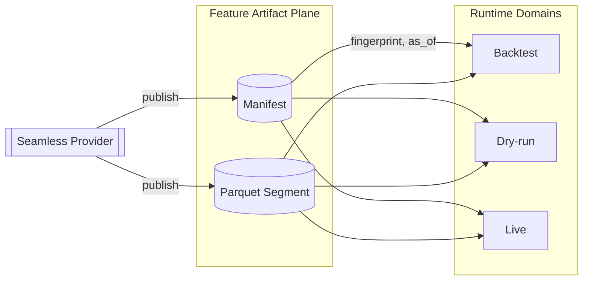
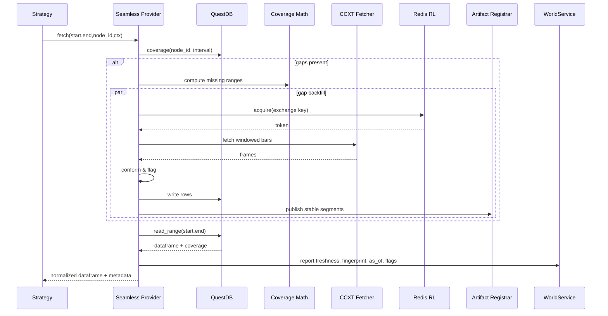

# CCXT × Seamless Integrated Architecture (High + Codex)

## Related Documents
- [Seamless Data Provider v2](seamless_data_provider_v2.md)
- [DAG Manager](dag-manager.md)
- [Gateway](gateway.md)
- [CCXT × QuestDB IO Recipe](../io/ccxt-questdb.md)
- Historical governance notes formerly published as `ccxt-seamless-gpt5codex.md` were retired after their guidance landed in this blueprint.
- Historical runtime notes previously published as `ccxt-seamless-gpt5high.md` were retired after their coverage guidance landed in this blueprint.

## Scope and Status

This document supersedes earlier split narratives and formalizes the integrated architecture for CCXT-backed Seamless data access. The Sonnet proposal is deprecated and intentionally excluded. Teams should converge on this blueprint when implementing, evolving, or auditing the CCXT + Seamless stack.

## Objectives

- Provide an "always ready" history interface built on existing Seamless runtime primitives.
- Preserve deterministic reproducibility through dataset fingerprints, `as_of` discipline, and domain isolation.
- Support multi-exchange, multi-symbol orchestration with consistent node identities and coverage guarantees.
- Offer explicit operational levers for SLA budgets, backfill coordination, rate limiting, and conformance reporting.
- Maintain compatibility with Gateway, WorldService, and DAG Manager workflows without introducing parallel stacks.

## Architectural Overview

```mermaid
flowchart LR
  subgraph Strategy Layer
    STRAT[Strategies / Node Sets]
  end

  subgraph Seamless Data Plane
    CORE[(Seamless Core)]
    COV[Coverage \n & Gap Math]
    SLA[SLA Policy]
    CONF[Conformance]
    COORD[Backfill Coordinator]
    CACHE[World/AsOf Keyed Cache]
    LIVE[Live Feed (poll/WS)]
  end

  subgraph IO & Storage
    QDB[(QuestDB Storage)]
    FETCH[CCXT Fetcher]
    RL[(Redis Token Bucket)]
    ARTIFACT[(Artifact Store\nParquet + Manifest)]
  end

  subgraph Governance Plane
    REG[Artifact Registrar]
    WLD[WorldService]
    GATE[Gateway / Execution Domain]
  end

  STRAT -->|fetch(start,end,node_id,ctx)| CORE
  CORE --- SLA
  CORE --- COV
  CORE --- CONF
  CORE --- COORD
  CORE --> CACHE
  CORE -->|coverage/read_range| QDB
  CORE -->|fill gaps| FETCH --> RL
  CORE --> LIVE
  CORE -->|publish stable| REG --> ARTIFACT
  REG -->|manifest sync| QDB
  CORE -->|freshness, flags| WLD --- GATE
```

The overview retains the Hybrid document's dual-plane split: the Seamless data plane adopts GPT5-High mechanics, while governance policies trace back to GPT5-Codex. No new provider classes are introduced; the runtime reuses `qmtl/runtime/io/seamless_provider.py` and `qmtl/runtime/sdk` modules.

## Data Plane (GPT5-High Lineage)

### Runtime Composition Overview

```mermaid
flowchart LR
    subgraph Strategy/Nodes
      S[Strategy] -->|fetch/coverage| P((Seamless Provider))
    end

    P --> C[Cache Source]
    P --> ST[Storage Source (QuestDB)]
    P --> BF[Auto Backfiller (CCXT)]
    P --> LV[Live Feed (poll/WS)]

    BF --> RL[Rate Limiter]
    BF --> CCXT[CCXT async_support]
    ST --> QDB[(QuestDB)]

    subgraph Control
      SLA[SLA Policy]
      CO[Backfill Coordinator]
      CONF[Conformance Pipeline]
    end

    P --- SLA
    P --- CO
    P --- CONF
```

### Seamless Core
- Implementation: `EnhancedQuestDBProvider` (`qmtl/runtime/io/seamless_provider.py`) paired with `ArtifactRegistrar` (`qmtl/runtime/io/artifact.py`).
  The provider now wires the IO-layer registrar by default so every fetch emits ISO-8601
  `as_of` values, provenance metadata, and manifest URIs even in development mode. Set
  `QMTL_SEAMLESS_ARTIFACTS=1` (optionally combine with `QMTL_SEAMLESS_ARTIFACT_DIR`) to
  mirror the filesystem store used in integration tests, or point `registrar=` at a custom
  implementation when publishing to cloud storage.
- Exposed strategies: `FAIL_FAST`, `AUTO_BACKFILL`, `PARTIAL_FILL`, `SEAMLESS`.
- Coordinates cache, storage reads, backfills, and optional live feeds behind a `HistoryProvider` facade while delegating stabilized artifact publication to `ArtifactRegistrar`.

### Coverage & Gap Accounting
- Deterministic gap detection powered by `qmtl/runtime/sdk/history_coverage.py`.
- Node identity convention: `ohlcv:{exchange_id}:{symbol}:{timeframe}` (e.g. `ohlcv:binance:BTC/USDT:1m`).
- Interval-aware merges ensure every delivered frame is aligned to timeframe boundaries.

#### Coverage Math Quick Reference

| Step | Responsibility | Notes |
| --- | --- | --- |
| Coverage fetch | `QuestDBHistoryProvider.coverage` | Returns contiguous segments with `start`, `end`, and `interval_seconds` metadata. |
| Gap derivation | `HistoryCoverage.compute_missing_ranges` | Produces inclusive/exclusive window tuples respecting timeframe cadence (no partial bars). |
| Merge | `HistoryCoverage.merge_ranges` | Coalesces storage + freshly backfilled spans before readback. |
| Validation | `ConformancePipeline` | Drops duplicates, enforces monotonic timestamps, and flags remaining coverage deltas. |

### Data Model & Interval Semantics
- Canonical OHLCV schema: `ts`, `open`, `high`, `low`, `close`, `volume`.
- `ts` values are normalized to epoch **seconds**; coverage math expects the declared `interval` to use the same unit so cadence math stays integer aligned.
- Node identities should include exchange, symbol, and CCXT timeframe. When downstream resampling is required, publish a new node identifier rather than mutating the base cadence.

### Backfill Orchestration
- Backfills driven by `CcxtOHLCVFetcher` and `CcxtBackfillConfig` (`qmtl/runtime/io/ccxt_fetcher.py`).
- Background fills are preferred; synchronous `ensure_coverage` remains available when strategies need deterministic completion.
- Distributed single-flight coordination using `BackfillCoordinator` (process scope) plus the `QMTL_SEAMLESS_COORDINATOR_URL` HTTP endpoint for cross-worker leases.
- Each backfill batch records attempt/complete/fail events to structured logs so operations dashboards can expose fill throughput.

### Rate Limiting
- Process-level throttles rely on asyncio semaphores and minimum-interval guards to prevent CCXT burst bans.
- Cluster-level budgets are enforced via Redis token buckets (`qmtl/runtime/io/ccxt_rate_limiter.py`). Keys should partition on `exchange_id` and optional account suffix.

| Parameter | Purpose | Default Source |
| --- | --- | --- |
| `connectors.ccxt_rate_limiter_redis` | Connection string for cluster token bucket state | `qmtl.yml` (`QMTL_CCXT_RATE_LIMITER_REDIS` fallback) |
| `tokens_per_interval` | Allowance per rolling window | Provider configuration |
| `interval_ms` | Shared window duration | Provider configuration |
| `burst_tokens` | Extra headroom before throttling | Provider configuration |
| `local_semaphore` | Concurrency cap inside a single process | Provider configuration |
| `min_interval_ms` | Hard lower-bound between CCXT requests per worker | Provider configuration |
| `penalty_backoff_ms` | Cooldown applied after hitting exchange-side 429s | Provider configuration |

`CcxtQuestDBProvider.from_config(...)` also accepts `min_interval_s`. When both
fields are present they must describe the same cadence; the millisecond value is
converted to seconds for the underlying limiter configuration.

### Provider Recipes

```python
from qmtl.runtime.io import EnhancedQuestDBProvider
from qmtl.runtime.io import CcxtOHLCVFetcher, CcxtBackfillConfig
from qmtl.runtime.sdk.sla import SLAPolicy

fetcher = CcxtOHLCVFetcher(CcxtBackfillConfig(
    exchange_id="binance",
    symbols=["BTC/USDT"],
    timeframe="1m",
))

provider = EnhancedQuestDBProvider(
    dsn="postgresql://localhost:8812/qdb",
    fetcher=fetcher,
    strategy="SEAMLESS",
    conformance=None,
    partial_ok=True,
)

provider_with_sla = EnhancedQuestDBProvider(
    dsn="postgresql://localhost:8812/qdb",
    fetcher=fetcher,
    sla=SLAPolicy(
        max_wait_storage_ms=300,
        max_wait_backfill_ms=5000,
        total_deadline_ms=1500,
        max_sync_gap_bars=2,
    ),
)
```

### Seamless Builder Scaffolding

`EnhancedQuestDBProvider` now composes its sources through the reusable
`SeamlessBuilder` (`qmtl.runtime.sdk.seamless.SeamlessBuilder`). The builder accepts
storage/cache/backfill/live/registrar components (either concrete instances or
factories) and materialises them into a `SeamlessAssembly`. Future presets will be
registered via `SeamlessPresetRegistry` to deliver opinionated CCXT or equities
defaults without cloning provider code.

```python
from qmtl.runtime.sdk import build_seamless_assembly, hydrate_builder

config = {
    "preset": "ccxt.questdb.ohlcv",
    "options": {
        "exchange_id": "binance",
        "symbols": ["BTC/USDT"],
        "timeframe": "1m",
        "questdb": {"dsn": "postgresql://localhost:8812/qdb", "table": "crypto_ohlcv"},
    },
}

# Either materialize the builder for further customisation…
builder = hydrate_builder(config)
assembly = builder.build()

# …or produce an assembly in one call:
assembly = build_seamless_assembly(config)

# The resulting assembly exposes cache/storage/backfill/live components ready for
# SeamlessDataProvider subclasses (e.g., EnhancedQuestDBProvider).
# Existing providers can adopt the assembly by either wiring the pieces during
# initialisation or by assigning them post-construction when migrating legacy
# setups that already instantiate EnhancedQuestDBProvider directly.
```

#### Preset Catalog

- `ccxt.questdb.ohlcv`
  - Purpose: QuestDB storage + CCXT OHLCV backfill
  - Options: `exchange_id`, `symbols`, `timeframe`, `questdb: {dsn, table}`, `rate_limiter`, `window_size`, `max_retries`, `retry_backoff_s`

- `ccxt.questdb.trades`
  - Purpose: QuestDB storage + CCXT Trades backfill
  - Options: `exchange_id`, `symbols`, `questdb: {dsn, table}`, `rate_limiter`, `window_size`, `max_retries`, `retry_backoff_s`

- `ccxt.live.pro`
  - Purpose: ccxt.pro-based LiveDataFeed (websocket) for OHLCV or trades
  - Options: `exchange_id`, `symbols`, `timeframe`, `mode` ("ohlcv"|"trades"), `sandbox`, `reconnect_backoff_ms`, `dedupe_by`, `emit_building_candle`
  - Note: ccxt.pro optional dependency; factories are created lazily and only resolve on subscribe().

- `seamless.registrar.filesystem`
  - Purpose: File-system artifact registrar using env configuration
  - Options: none (honors `QMTL_SEAMLESS_ARTIFACTS=1`, `QMTL_SEAMLESS_ARTIFACT_DIR`); `stabilization_bars` override supported.

- `ccxt.bundle.ohlcv_live`
  - Purpose: Convenience bundle that applies `ccxt.questdb.ohlcv` and `ccxt.live.pro` together
  - Options: union of both presets; typical: `exchange_id`, `symbols`, `timeframe`, `questdb`, and live options like `reconnect_backoff_ms`

- `ccxt.bundle.trades_live`
  - Purpose: Convenience bundle that applies `ccxt.questdb.trades` and `ccxt.live.pro` together
  - Options: union of both presets; typical: `exchange_id`, `symbols`, `questdb`, plus live options
Example chaining:

```python
config = {
  "presets": [
    {"name": "ccxt.questdb.ohlcv", "options": {"exchange_id": "binance", "symbols": ["BTC/USDT"], "timeframe": "1m", "questdb": {"dsn": "postgresql://localhost:8812/qdb", "table": "ohlcv"}}},
    {"name": "ccxt.live.pro", "options": {"exchange_id": "binance", "symbols": ["BTC/USDT"], "timeframe": "1m", "mode": "ohlcv"}},
    {"name": "seamless.registrar.filesystem"}
  ]
}

assembly = build_seamless_assembly(config)
```

When scaling to multi-symbol or multi-timeframe coverage, prefer `CcxtQuestDBProvider.from_config_multi(...)` for scaffolding while retaining the enhanced provider for SLA orchestration. The config snippet above can also be layered in `presets: [...]` lists when chaining multiple adapters.

### Live Data Integration
- Default polling `LiveDataFeedImpl` with bar-boundary scheduling that respects timeframe cadence and waits for bar completion before publishing.
- Optional ccxt.pro wrapper (WebSocket) retained as a future extension; enable only when ccxt.pro is present and conformance hooks can deduplicate late frames.
- WebSocket adapters expose `reconnect_backoff_ms` ladders and `dedupe_by` keys (`ts` by default) to remain idempotent across reconnects; disable `emit_building_candle` unless downstream consumers are prepared for in-progress bars.
- Live extensions should emit the same coverage metadata as historical reads so Gateway can enforce lag windows.

### SLA & Conformance
- SLA budgets sourced from `qmtl/runtime/sdk/sla.py`; phases include storage_wait, backfill_wait, live_wait, total.
- Conformance pipeline (`qmtl/runtime/sdk/conformance.py`) enforces dtype normalization, timestamp sorting, duplicate drop, and gap flag emission.
- Violations raise `SeamlessSLAExceeded` or return partial fills according to strategy settings.

#### SLA Budget Reference

| Phase | Description | Typical Budget |
| --- | --- | --- |
| `storage_wait` | Time spent waiting on QuestDB responses (read + coverage) | ≤ 300 ms |
| `backfill_wait` | CCXT fetch latency plus stabilization writes | ≤ 5000 ms |
| `live_wait` | Optional live feed wait for most recent bar | ≤ 800 ms |
| `total_deadline` | Aggregate ceiling across phases | ≤ 1500 ms |

Budgets should be tuned per exchange; exceeding any threshold flips the provider into fail-fast or partial modes depending on the selected strategy. Persist SLA outcomes to metrics for alerting.

## Governance Plane (GPT5-Codex Lineage)

### Feature Artifact Plane

The governance plane preserves deterministic reproducibility by anchoring every exchange snapshot in the Feature Artifact Plane. The plane treats artifacts as immutable, world-agnostic records that can be replayed or inspected without rehydrating live dependencies. Guardrails inherited from the Codex draft remain mandatory:

- **Immutable artifacts** – every stabilized Parquet segment is published with a manifest and never mutated in place. Reprocessing always emits a brand-new fingerprint/as_of pair.
- **Read-only cross-domain access** – artifacts are shared read-only across Worlds; mutation requires producing a fresh artifact. Cache layers may only materialize copies that reference the canonical manifest key.
- **Explicit provenance** – manifests must encode producer identity, upstream exchange, Seamless policy decisions, and the publication watermark so auditors can reconstruct lineage without consulting ad-hoc dashboards.
- **Reproducibility contract** – Gateway and WorldService must treat `{dataset_fingerprint, as_of}` as content-addressed identifiers; any attempt to reuse mutable QuestDB rows without an accompanying artifact reference is rejected.



#### Dataset Identity
- **Runtime key**: `node_id` as defined above.
- **Version key**: `dataset_fingerprint` (SHA-256 over canonicalized frame + metadata) and `as_of` (snapshot or commit instant).
- Artifact manifests record `{fingerprint, as_of, node_id, range, conformance_version, producer, publication_watermark}` and live alongside Parquet data in object storage. The default registrar stamps manifests with a `producer.identity` of `seamless@qmtl`, the originating `node_id`/`interval`, and a UTC `publication_watermark` indicating when the stabilized dataset was sealed.
- Fingerprints must be calculated after tail-bar stabilization and dtype normalization to guarantee idempotent replay. Workers may compute a "preview" fingerprint for debugging, but only the post-stabilization value is authoritative.

#### Publication Workflow

Ingestion workers are responsible for promoting stabilized frames into the artifact plane. The following pseudo-code captures the canonical sequence and replaces the disparate snippets that previously lived in the hybrid draft:

```python
def conform_frame(df, interval_s) -> pd.DataFrame:
    df = df.sort_values("ts")
    df["ts"] = (df["ts"] // interval_s) * interval_s
    df = df.drop_duplicates(subset=["ts"], keep="last")
    # Additional dtype validation and gap flagging here...
    return df

def compute_fingerprint(df, meta: dict) -> str:
    payload = serialize_canonical(df, meta)
    return sha256(payload).hexdigest()

def maybe_publish_artifact(df, node_id, start, end, conf_ver, as_of, store):
    stable_df = drop_tail(df, bars=2)
    if stable_df.empty:
        return None
    meta = {
        "node_id": node_id,
        "range": [start, end],
        "conformance": conf_ver,
    }
    fp = compute_fingerprint(stable_df, meta)
    write_parquet_with_manifest(stable_df, fp, as_of, meta, store)
    return fp
```

Two configuration toggles control where the fingerprint is produced:

- `early_fingerprint` – experimental mode that lets CCXT workers emit a provisional fingerprint at snapshot time.
- `publish_fingerprint` – default path that waits for watermark stabilization (tail-bar drop) before sealing the manifest. Production environments must leave this enabled.

Runtime deployments surface these switches through both configuration files and environment variables. `publish_fingerprint` maps to `QMTL_SEAMLESS_PUBLISH_FP` and `early_fingerprint` maps to `QMTL_SEAMLESS_EARLY_FP`, allowing operators to flip the behavior without editing YAML.

#### Artifact Lifecycle

| Step | Owner | Guarantee |
| --- | --- | --- |
| Snapshot stabilization | Seamless Provider | Drops incomplete tail bars, enforces schema parity. |
| Fingerprint emission | Artifact Registrar | Computes SHA-256 over frame bytes + manifest metadata. |
| Manifest publish | Artifact Registrar | Writes `{fingerprint, as_of, coverage, producer}` to object storage. |
| Domain import | Gateway / WorldService | Validates fingerprint + `as_of` prior to admitting data into a session. |

#### Storage Policy

Hot and cold storage responsibilities are intentionally bifurcated:

- **Hot (QuestDB)** retains mutable bars for fast coverage math and background fills. TTLs should match SLA recovery expectations.
- **Cold (Artifact Store)** persists immutable Parquet segments with manifests. Backfilled segments are versioned rather than overwritten; downstream consumers always select by fingerprint.
- **Watermark promotion** occurs once `stabilization_bars` have elapsed. The registrar publishes both the artifact and a manifest delta so catalogs can advance `as_of` monotonically.
- **Rollback & auditability** rely on manifest snapshots. Operators debug incidents by replaying the exact fingerprint/as_of pair referenced in Gateway logs rather than re-running CCXT pulls.

### Domain Isolation & Execution Gating

Domain policies govern which runtime surfaces are permitted to read mutable sources and how `as_of` progresses within a session. World and Execution Domain boundaries must never reuse cache entries produced under a different `as_of` or fingerprint.

- **Backtest** – `as_of` must be specified up front and map to a published artifact; gap fills that have not been artifactized are rejected.
- **Dry-run** – accepts storage reads, but every response must be immediately artifactized and replayed from the manifest before reuse.
- **Live** – binds `as_of` at session start. Seamless may combine storage, backfill, and live feeds provided `now - data_end ≤ max_lag`; violations downgrade the session to HOLD or compute-only modes.

#### Domain Policy Matrix

| Domain | Allowed Sources | `as_of` Handling | Gating Outcome |
| --- | --- | --- | --- |
| Backtest | Artifact store only | Fixed per run; immutable | Hard fail on missing artifact |
| Research / Lab | Artifact store only | Fixed per run; immutable | Hard fail on missing artifact |
| Dry-run | Artifact store → immediate publish of fresh reads | Fixed per run; immutable | Reject reuse until artifact exists |
| Live | Storage, backfill, optional live feed | Monotonic per session; non-decreasing | HOLD or PARTIAL_FILL on SLA or lag breach |

### Gateway Compute Context

Gateway is the source of truth for execution context. Every fetch call must include the complete compute context, and Seamless must echo the relevant governance metadata so downstream services can persist reproducibility evidence.

- Gateway supplies `world_id`, `execution_domain`, `as_of`, `max_lag`, `min_coverage`, SLA policy selection, and optional feature toggles per session.
- Seamless responses must echo coverage metadata and conformance flags; attach the `{dataset_fingerprint, as_of}` pair via the Artifact Registrar layer before handing results to WorldService so audit trails stay reproducible.
- Cache entries must key on `(node_id, interval, start, end, conformance_version, world_id, as_of)` to prevent cross-domain leakage.

_Implementation note_: The base `EnhancedQuestDBProvider` still returns data frames only; pair it with the `maybe_publish_artifact` workflow above to populate `{dataset_fingerprint, as_of}` before echoing metadata to Gateway/WorldService.
Seamless SDKs now expose `last_fetch_metadata` and `SeamlessFetchMetadata` (see `qmtl/runtime/sdk/seamless_data_provider.py`) so integrations can forward coverage bounds, conformance flags, and artifact fingerprints without re-inspecting the payload.

The canonical compute-context contract lives in `qmtl/foundation/common/compute_context.py`. Gateway's `StrategyComputeContext` populates these fields today, so the Seamless stack does not require an additional `QMTL_WORLD_CONTEXT_SOURCE` toggle.

#### Context Contract Checklist

| Field | Source | Guarantee |
| --- | --- | --- |
| `world_id` | Gateway | Segregates cache + metrics per world. |
| `execution_domain` | Gateway | Distinguishes live, dry-run, backtest orchestration. |
| `as_of` | Gateway (input) / Seamless (echo) | Provides immutable snapshot boundary. |
| `dataset_fingerprint` | Seamless | Identifies the exact artifact or stabilized live blend. |
| `coverage_bounds` | Seamless | Captures `[start, end]` delivered for audit trails. |
| `conformance_flags` | Seamless | Signals dtype/ordering fixes applied during delivery. |

### World & Execution Domain Coordination

WorldService consumes the echoed governance metadata to decide whether a strategy remains eligible for execution. If coverage gaps, SLA breaches, or fingerprint drift are detected, WorldService issues a downgrade that Gateway must honor before the next fetch. Producers must surface structured logs linking every downgrade to the governing fingerprint/as_of pair so audits can reconstruct decisions without consulting non-canonical documents.

## Request Lifecycle



This sequence combines the original GPT5-High runtime flow with governance notifications so readers no longer need to consult legacy diagrams.

## Configuration Blueprint

```yaml
seamless:
  node_id_format: "ohlcv:{exchange}:{symbol}:{timeframe}"
  strategy: SEAMLESS
  conformance:
    version: v2
    dtype_policy: strict
    gap_flagging: true
  sla:
    max_wait_storage_ms: 300
    max_wait_backfill_ms: 5000
    max_wait_live_ms: 800
    total_deadline_ms: 1500
    on_violation: PARTIAL_FILL
  backfill:
    mode: background
    max_concurrent_requests: 8
    window_bars: 900
    single_flight_ttl_ms: 60000
    distributed_lease_ttl_ms: 120000
    max_attempts: 5
    retry_backoff_ms: 500
    jitter_ratio: 0.25
  rate_limit:
    redis_dsn: "redis://redis.service.local:6379/0"
    key_template: "ccxt:{exchange}:{account?}"
    tokens_per_interval: 1200
    interval_ms: 60000
    burst_tokens: 200
    local_semaphore: 10
    min_interval_ms: 25
    penalty_backoff_ms: 5000
  live:
    ws:
      enabled: false
      reconnect_backoff_ms: [500, 1000, 2000, 5000]
      dedupe_by: ts
      emit_building_candle: false
  artifact:
    object_store_uri: "s3://qmtl-artifacts"
    format: parquet
    compression: zstd
    stabilization_bars: 2
    partition_template: "exchange={exchange}/symbol={symbol}/timeframe={timeframe}"
    publish_fingerprint: true
    early_fingerprint: false
    fingerprint:
      algo: sha256
      include_columns: [ts, open, high, low, close, volume]
      normalize_nan: zero
  observability:
    coverage_ratio_threshold: 0.98
    backfill_completion_ratio_min: 0.95
    storage_wait_warn_ms: 300
    backfill_wait_warn_ms: 5000
cache:
  enable: true
  ttl_ms: 60000
  max_shards: 512
  key_template: "{node_id}:{start}:{end}:{interval}:{conformance_version}:{world_id}:{as_of}"
domains:
  backtest:
    require_as_of: true

The runtime honours ``rate_limit.key_template`` when wiring CCXT fetchers. The
template supports ``{exchange}`` (lower-case), ``{exchange_id}`` (original
case), and aliases for the optional suffix value (``{suffix}``, ``{key_suffix}``,
``{account}``). Sections written as ``:{account?}`` are removed entirely when the
value is missing, matching the configuration blueprint. When a template is
provided the legacy ``key_suffix`` is not appended automatically; include the
suffix inside the template if it should participate in the limiter key.
    source: artifact_only
  dryrun:
    require_as_of: true
    source: artifact_prefers
  live:
    max_lag_sec: 120
    allow_partial: true
    monotonic_as_of: true
exchanges:
  binance:
    sandbox: false
    symbols: ["BTC/USDT", "ETH/USDT"]
    rate_limit_rps: 20
  coinbase:
    sandbox: true
    symbols: ["BTC/USDT"]
    rate_limit_rps: 10
environment:
  coordinator_url: ${QMTL_SEAMLESS_COORDINATOR_URL}
  rate_limiter_redis: ${connectors.ccxt_rate_limiter_redis}
```

The blueprint aligns configuration knobs with existing runtime modules. Teams should implement validation that cross-checks domain policies, rate-limit settings, and artifact destinations during startup.

## Implementation Guidance

1. **Reuse existing providers** – compose `EnhancedQuestDBProvider`, `CcxtOHLCVFetcher`, `BackfillCoordinator`, and SLA policies rather than creating new wrappers.
2. **Artifact publication** – adopt the `maybe_publish_artifact` workflow defined above. Always stabilize, conform, and fingerprint frames before emitting manifests, and store the returned fingerprint alongside coverage metadata for Gateway echoing.
3. **World-aware caching** – enable the in-process TTL LRU (`cache.enable`) so Seamless can reuse frames keyed by `{world_id, as_of}` without risking cross-domain bleed. Purge entries on domain switch and surface cache hit/miss/resident metrics for observability. Cache hits must reference immutable artifacts or explicitly declare partial coverage.
4. **Storage bifurcation** – route hot writes and reads through QuestDB while publishing immutable segments to object storage using the configured partition template. Promote artifacts only after `stabilization_bars` have elapsed.
5. **Gateway contract** – ensure integration layers surface `{dataset_fingerprint, as_of, coverage_bounds, conformance_flags}` when routing Seamless responses through Gateway/WorldService; use `SeamlessFetchMetadata` alongside the artifact workflow to capture the values emitted by the provider.
6. **Observability** – emit the metrics catalogued below (`seamless_storage_wait_ms`, `backfill_completion_ratio`, `domain_gate_holds`, etc.) so operations dashboards can enforce alert thresholds without consulting legacy docs.
7. **Testing** – follow the documented preflight hang scan, then execute `uv run -m pytest -W error -n auto` with recorded ccxt fixtures or sandbox exchanges. Long-running end-to-end scenarios should be marked `slow` and excluded from the preflight run.

## Storage Strategy & Stabilization Workflow

Seamless promotes CCXT data through two storage planes:

1. **QuestDB (hot path)** retains mutable writes for recent coverage math, intra-day diagnostics, and in-flight gap repairs. TTLs should align with SLA recovery windows so stale frames are evicted automatically.
2. **Artifact store (cold path)** receives immutable Parquet segments partitioned by exchange, symbol, and timeframe. Only manifests produced by `maybe_publish_artifact` may advance a dataset’s `as_of` pointer.

Stabilization proceeds as follows:

1. Backfills land in QuestDB via the enhanced provider while conformance flags track dtype fixes.
2. Workers drop tail bars according to `stabilization_bars` and compute fingerprints against canonicalized payloads.
3. The Artifact Registrar publishes `{fingerprint, as_of}` manifests and Parquet payloads to object storage and notifies catalog subscribers.
4. WorldService advances eligible sessions once the manifest echo confirms monotonic `as_of` progression; rollbacks require pinning a prior fingerprint.

This workflow keeps hot storage responsive without sacrificing the reproducibility guarantees demanded by governance.

## Operational Practices

- **Environment coordination**: configure `QMTL_SEAMLESS_COORDINATOR_URL` for distributed leases and `connectors.ccxt_rate_limiter_redis` (or the legacy `QMTL_CCXT_RATE_LIMITER_REDIS`) for shared throttles; Gateway supplies world context via `StrategyComputeContext`.
- **Metrics**: emit the full catalog below, including SLA phase timers, coverage quality, artifact throughput, and gating outcomes.
- **Alerting**: trigger warnings for SLA breaches, persistent coverage gaps, Redis rate-limit saturation, or fingerprint collisions. Suggested thresholds are listed alongside each metric.
- **Backfill visibility**: monitor coordinator claim/complete/fail events via structured logs; integrate into dashboards already defined in `operations/seamless_sla_dashboards.md`.
- **Runbooks**: reference `operations/backfill.md` for manual remediation and `operations/monitoring.md` for Prometheus setup.

### Metrics Catalog

| Metric | Description | Suggested Alert |
| --- | --- | --- |
| `seamless_storage_wait_ms` | Storage wait duration per request | Warn > 300 ms p95 for 5 min |
| `seamless_backfill_wait_ms` | CCXT fetch and stabilization latency | Warn > 5000 ms p95 for 5 min |
| `seamless_live_wait_ms` | Live feed wait duration | Warn > 800 ms p95 for 5 min |
| `seamless_total_ms` | Aggregate SLA duration | Critical if `total_deadline_ms` exceeded |
| `seamless_sla_deadline_seconds` | Histogram of configured deadlines | Track distribution for regressions |
| `seamless_conformance_flag_total` / `_warning_total` | Conformance corrections applied | Alert on spikes vs baseline |
| `backfill_completion_ratio` | Completed backfill windows ÷ scheduled | Warn < 0.95 for 10 min |
| `coverage_ratio` | Delivered vs requested bars | Warn < 0.98 for 5 min |
| `gap_repair_latency_ms` | Time to close detected gaps | Investigate if > 2× historical median |
| `seamless_rl_tokens_available` | Remaining Redis tokens | Warn on sustained < 10 % headroom |
| `seamless_rl_dropped_total` | Requests dropped by rate limiter | Critical if non-zero in steady state |
| `artifact_publish_latency_ms` | Time from stabilization to manifest publish | Warn > 120 s |
| `artifact_bytes_written` | Volume of artifact storage writes | Capacity planning |
| `fingerprint_collisions` | Count of duplicate fingerprints | Critical if > 0 |
| `as_of_advancement_events` | Count of monotonic `as_of` promotions (labels: `node_id`, `world_id`) | Alert if progression stalls or regresses |
| `domain_gate_holds` | Number of HOLD downgrades | Warn on upward trend |
| `partial_fill_returns` | Frequency of PARTIAL_FILL outcomes | Correlate with SLA breaches |
| `live_staleness_seconds` | Live data freshness gap | Warn if exceeds domain `max_lag` |

Conformance counters now include granular labels: `seamless_conformance_flag_total{node_id,interval,world_id,flag_type}` and
`seamless_conformance_warning_total{node_id,interval,world_id}`. Dashboards should pivot on the interval and world identifiers to
trace partial degradations back to specific domains.

### Conformance v2 Flag Taxonomy

The blocking v2 pipeline emits the following canonical flag keys. Downstream systems (Gateway, governance tooling, dashboards)
should treat the keys as stable contract identifiers.

| Flag | Meaning |
| --- | --- |
| `duplicate_ts` | Duplicate timestamps were detected and the most recent row was retained. |
| `gap` | One or more interval-sized gaps were detected between consecutive rows. The count records the missing bar total. |
| `missing_column` | Required schema fields were absent from the payload. |
| `dtype_cast` | Columns required dtype coercion to satisfy the declared schema. |
| `dtype_mismatch` | Columns failed dtype normalization and remain incompatible with the schema. |
| `ts_cast` | Timestamp fields were coerced to epoch seconds. |
| `ts_timezone_normalized` | Timezone-aware timestamps were normalized to UTC before casting. |
| `non_finite` | NaN or +/-inf values were detected in numeric columns (inf values are replaced with NaN). |
| `invalid_timestamp` | Rows were dropped because timestamps could not be parsed or normalized. |

## Testing Guidance

- Run the hang-preflight documented in `guides/testing.md` before the full suite to surface import hangs.
- Prefer recorded CCXT responses or sandbox exchanges to keep tests deterministic and classify network-backed tests as `slow`.
- Validate coverage merges with representative gap fixtures (missing first bar, trailing partials, discontinuous mid-range) before enabling Seamless in production.

## Migration Path

Execute the following phases (low risk → high impact) when rolling the integrated architecture into production:

1. **Standardize node IDs** on `ohlcv:{exchange}:{symbol}:{timeframe}` across ingestion, cache, and artifact layers.
2. **Adopt Conformance v2** to guarantee ordering, dtype normalization, gap flags, and deterministic coverage math.
3. **Deploy SLA policies** with explicit `PARTIAL_FILL`/`FAIL_FAST` behavior and alerting tied to the metrics catalog.
4. **Introduce Redis-backed rate limiting** alongside local semaphores so burst protection extends across workers.
5. **Install the Artifact Registrar** to compute fingerprints/as_of pairs and publish manifests via the workflow above.
6. **Wire Gateway/World domain gating** so every fetch echoes `{dataset_fingerprint, as_of}` and honors monotonic progress.
7. **Enable live freshness gates** that downgrade sessions (HOLD/PARTIAL) when `live_staleness_seconds` exceeds the configured `max_lag`.

## Validation Benchmarks

Release readiness requires the following acceptance checks:

- Re-running the same `world_id`/`as_of` session yields byte-identical artifacts and metadata.
- `as_of` never regresses within a live session; monotonic advancement is enforced by Gateway and cache layers.
- Coverage ratios remain ≥ 0.98 for 1 m/5 m cadences, with automatic recovery inside ten minutes after an exchange incident.
- SLA violations emit metrics and respect configured strategies (`PARTIAL_FILL` or `FAIL_FAST`) without silent degradation.
- Fetching the same node range at different times returns the artifact selected by fingerprint, guaranteeing reproducible replay.

## Risk Considerations

- Misaligned node IDs or missing `as_of` values can leak mutable data across domains; enforce validation at DAG compile time.
- Redis outages should degrade gracefully by falling back to process-level rate limiting while emitting alerts.
- Artifact publication latency impacts replay reproducibility; monitor stabilization lag and scale orchestration workers accordingly.

---

Adhering to this integrated design guarantees a single, reusable CCXT + Seamless implementation that satisfies runtime performance targets and reproducibility requirements without resuscitating the deprecated Sonnet architecture.

## Extensions

- Implement a ccxt.pro-based `LiveDataFeed` that mirrors polling semantics while leveraging WebSockets for tighter SLAs.
- Explore cross-exchange synthetic series (for example, weighted midprice aggregations) as separate nodes that continue to honor coverage guarantees.
- Evaluate trades-to-bar repair workflows when upstream OHLCV feeds exhibit persistent gaps, emitting provenance metadata for downstream audits.
