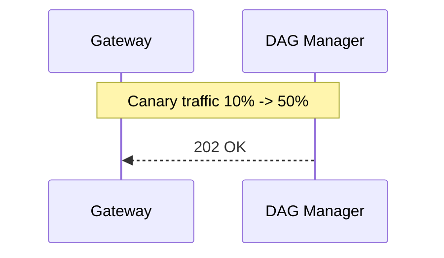

{{ nav_links() }}

# QMTL DAG Manager - Detailed Design (Extended Edition)

> **Revision 2025-06-04 / v1.1** - Expanded by 75% with production-grade specifications and operating guidance.

## Related Documents
- [Architecture Overview](README.md)
- [QMTL Architecture](architecture.md)
- [Gateway](gateway.md)
- [Lean Brokerage Model](lean_brokerage_model.md)

Additional references
- Reference: [Commit-Log Design](../reference/commit_log.md), [TagQuery Specification](../reference/tagquery.md)
- Operations guides: [Timing Controls](../operations/timing_controls.md)

!!! note "Deployment profile"
    With `profile: dev`, missing Neo4j/Kafka DSNs fall back to in-memory graph and queue managers. With `profile: prod`, missing `dagmanager.neo4j_dsn` or `dagmanager.kafka_dsn` stops the process before startup.

---

## 0. Responsibilities & Design Principles

| Core Responsibility | Description | Section |
| ------------------- | ----------- | ------- |
| **Graph DB Single Source of Truth** | Persist every strategy node, topic, and version in a single Neo4j property graph. | Sec. 1 Data Model |
| **DAG Diff Engine** | Compare submitted DAGs against the graph to decide node reuse vs. creation and assign topics. | Sec. 2 Diff Algorithm |
| **Topic Orchestration** | Idempotent topic creation, TTL/GC, and version rollout using reference counting. | Sec. 3, Sec. 4 |
| **Version Management & Rollback** | Version Sentinel nodes mark graph boundaries for canary splits and controlled rollback. | Sec. 2, Sec. 3-A |
| **SRE Friendly** | gRPC/HTTP interfaces, metrics, logs, alerts, and an admin CLI for day-two ops. | Sec. 6, Sec. 10 |

> **Design principle:** Tie the compute graph and messaging queues together with immutable IDs to prioritize reproducibility and rollback. Every mutation forks into new nodes and topics; legacy artifacts are retired via TTL and GC.
> Every SDK `compute_fn` executes with a single read-only `CacheView` returned from `NodeCache.view()`.

---

## 0-A. Ownership & Commit-Log Design

- **Ownership** - DAG Manager is the single source of truth for ComputeNode and Queue metadata. It owns topic creation, version rollout, and GC. Gateway orchestrates submission pipelines but never owns graph state. WorldService maintains world and decision state.
- **Commit Log** - Each queue is implemented as an append-only Redpanda/Kafka topic. DAG Manager emits control events such as `QueueUpdated` onto the ControlBus and records topic lifecycle events in an audit log for recovery and forensics.

> Terminology / SSOT boundary: The Global Strategy Graph (GSG) is owned exclusively by the DAG Manager and is immutable (append-only). World-local objects (World View Graph, WVG: WorldNodeRef, Validation, DecisionsRequest) belong to WorldService; DAG Manager never persists them. Consult the Architecture Glossary (`architecture/glossary.md`) for vocabulary.

### 0-A.1 Commit-Log Message Keys and Partitioning

- The partitioning key derives from `partition_key(node_id, interval, bucket_ts)`; Gateway uses the merged Kafka message key  
  `"{partition_key(node_id, interval, bucket_ts)}:{input_window_hash}"`  
  so log compaction keeps a canonical record per execution key while retaining uniqueness per input window.
- Consumers deduplicate with `(node_id, bucket_ts, input_window_hash)`.

---

## 1. Data Model (Neo4j Property Graph)

### 1.1 Node and Relationship Schema

| Label             | Required Properties | Optional Properties | Description |
| ----------------- | ------------------- | ------------------- | ----------- |
| `ComputeNode`     | `node_id` (pk), `node_type`, `interval`, `period`, `code_hash`, `schema_compat_id`, `params_canon` | `created_at`, `tags[]`, `owner`, `schema_hash` | DAG compute node (indicator, preprocessing, trading, etc.) |
| `Queue`           | `topic`, `created_at`, `ttl`, `retention_ms` | `brokers`, `tag`, `lag_alert_threshold` | Kafka/Redpanda topic |
| `VersionSentinel` | `version`, `commit_hash`, `created_at` | `release_tag`, `traffic_weight` | Version boundary and rollback marker |
| `Artifact`        | `path`, `checksum`, `size` | `framework`, `dtype` | Binary artifact such as a model |

**Relationships**

```
(ComputeNode)-[:EMITS]->(Queue)
(VersionSentinel)-[:HAS]->(ComputeNode)
(Artifact)-[:USED_BY]->(ComputeNode)
```

### 1.2 Indexes & Constraints

The following schema objects are idempotent and must be re-applied on boot.

- `CREATE CONSTRAINT compute_node_id IF NOT EXISTS`
- `CREATE CONSTRAINT queue_topic IF NOT EXISTS`
- `CREATE CONSTRAINT version_sentinel_version IF NOT EXISTS`

### 1.3 NodeID Canonicalization

- NodeID = `blake3:<digest>` over the canonical serialization of `(node_type, interval, period, params(split & canonical), dependencies(sorted by node_id), schema_compat_id, code_hash)`.
- Non-deterministic fields (timestamps, RNG seeds, environment variables) are excluded. Parameters are split into atomic fields and serialized as deterministic JSON with sorted keys and fixed numeric precision.
- NodeID MUST NOT include `world_id`. World isolation is handled by the WVG (World View Graph) and queue namespaces (e.g., world `topic_prefix`).
- Normalization guarantees:
  - Parameter maps with identical content hash to the same NodeID regardless of insertion or key order.
  - Dependency identifiers are sorted lexicographically before hashing so upload order cannot influence the digest.
  - Display-only metadata (`name`, `tags`, `metadata`, etc.) and non-deterministic inputs are removed before hashing.
  - NodeIDs without the mandatory `blake3:` prefix are rejected at Gateway validation time.
  - To mitigate collisions, reuse detection applies deterministic re-hashing with domain separation (BLAKE3 XOF) when the digest already exists in `existing_ids`.
- TagQuery canonicalization:
  - Do not include the runtime-resolved upstream queue set in `dependencies`.
  - Instead, capture the query specification in `params_canon` (normalized `query_tags` sorted and deduplicated, `match_mode`, and `interval`).
  - Dynamic queue discovery/expansion flows through ControlBus events and does not affect NodeID.
- Use `schema_compat_id` (major-compatibility identifier) instead of `schema_hash`. Minor/patch-compatible schema changes retain the same `schema_compat_id` so NodeID remains stable.
- Display metadata (human-friendly `name`, classification `tags`) is excluded; only functional parameters belong in `params_canon`.
- Use BLAKE3. When collision resistance needs to be strengthened, use domain-separated **BLAKE3 XOF** and keep the `blake3:` prefix on every ID.
- Uniqueness is enforced by the `compute_node_id` constraint. `schema_compat_id` references the Schema Registry major-compat identifier from the node message format.
- **Schema compatibility:** Minor/patch-level schema changes keep `schema_compat_id` and therefore preserve `node_id`. Byte-level schema changes may be tracked in the optional `schema_hash` to drive buffering/recompute policies.

### 1.3-A NodeID/TagQuery Determinism Invariants and Observability Hooks
- **Same spec → same NodeID:** `(node_type, interval, period, params_canon, dependencies_sorted, schema_compat_id, code_hash)` must yield a single NodeID regardless of upload order or world/domain.
- **World/domain exclusion:** `world_id`, `execution_domain`, `as_of`, and `partition` never enter the NodeID input. Execution/cache isolation belongs to `ComputeKey` (Sec.1.4) and `EvalKey`; do not conflate NodeID reuse with domain isolation.
- **TagQuery rules:** NodeID inputs include only normalized `query_tags` (sorted, deduped), `match_mode`, and `interval`. The runtime-resolved upstream queue set travels via ControlBus → TagQueryManager and must never be hashed into NodeID.
- **Schema/code boundary:** Only changes to `schema_compat_id` or `code_hash` produce a new NodeID. Minor/patch schema changes keep the same NodeID and are handled via buffering/validation paths.
- **Input normalization:** Dependencies are sorted by NodeID, and parameters use fixed-precision, deterministic JSON serialization. Drop non-deterministic fields and display-only metadata before hashing.

**Observability and validation patterns (for #1784/#1786 metrics/alerts)**
- NodeID CRC: Gateway/SDK recompute NodeIDs and cross-check with the `crc32` field. Mismatches return 400 and increment `nodeid_crc_mismatch_total`; sample logs should include `submitted_node_id`, `recomputed_node_id`, and `strategy_id`.
- Recompute drift: DAG Manager increments `nodeid_drift_total` and emits a ControlBus warning event when the stored `node_id` diverges from a recomputation. Periodically sample healthy cases and expose `nodeid_recalc_latency_ms` as a histogram.
- TagQuery stability: At execution time, log the normalized query spec hash (`tagquery_spec_hash`) and the resolved upstream cardinality (`resolved_queue_count`). If recomputation from the same spec disagrees with the stored NodeID, raise `tagquery_nodeid_mismatch_total` and force an SDK cache invalidation.
- Domain isolation: Enforce `cross_context_cache_hit_total` (defined in Sec.1.4) as a shared DAG Manager/SDK metric. When above zero, block cache reuse and escalate to an alert.

### 1.4 VersionSentinel Layout

```
(:VersionSentinel { 
  version: "v1.2.3", 
  commit_hash: "0xabc", 
  traffic_weight: 0.2 
})-[:HAS]->(:ComputeNode {...})
```

Sentinels partition the graph so rollback can swap traffic by updating sentinel weights.

### 1.5 ComputeKey (Domain-Scoped Execution Key)

```
ComputeKey = blake3(NodeHash + world_id + execution_domain + as_of + partition)
```

- `NodeHash` is the canonical hash backing NodeID (see Sec.1.3).
- `world_id` scopes an execution to a world; `execution_domain in {backtest, dryrun, live, shadow}` separates compute surfaces.
- `as_of` pins backtests to a data snapshot/commit to ensure deterministic replay.
- `partition` optionally scopes tenants or portfolio partitions.

Usage and enforcement:

- NodeCache and any deduplication MUST key by `ComputeKey`. `node_id` alone is insufficient.
- Cross-context cache hits (same `node_id`, different `world_id/execution_domain/as_of/partition`) are policy violations. Emit and alert on `cross_context_cache_hit_total`.
- Queue names and NodeID stay stable; `ComputeKey` does not change topic naming. Operators MAY prefix broker-level topics (e.g. `{world_id}.{execution_domain}.<topic>`) to isolate traffic.
- Instrumentation: both DAG Manager and SDK must emit `cross_context_cache_hit_total` and block promotions when the count is non-zero.
- `as_of` MUST be present for backtests/dry-runs. Missing values cause `ComputeContext.evaluate_safe_mode()` to downgrade the request and forbid reuse without a live sentinel.

---

## 2. Diff Algorithm (v2)

### 2.1 Input/Output Definition

* **Input:** `DiffReq{strategy_id, dag_json, world_id?, execution_domain?, as_of?, partition?, dataset_fingerprint?}` (~10-500 KiB)
* **Output:** stream `DiffChunk{queue_map[], sentinel_id, version}`

### 2.2 Step-by-Step Logic

1. **Node Pre-scan** O(N)
   * Parse DAG JSON via `orjson`, topologically sort, and produce the `node_id` list.
2. **DB Fetch**
   * `MATCH (c:ComputeNode WHERE c.node_id IN $list)` -> map existing nodes.
3. **Hash Compare**

   | Case                      | Handling                  | Queue Policy                                              |
   | ------------------------- | ------------------------- | --------------------------------------------------------- |
   | `node_id` identical       | **Reuse**                 | Join existing queue                                       |
   | Backward-compatible schema change | **Reuse + buffer mode** | Queue lag == history size; auto full recompute after 7 days |
   | `node_id` different       | **New node and queue**    | `topic_suffix=_v{n}` and inherit TTL                      |

4. **Sentinel insertion** `CREATE (:VersionSentinel{...})-[:HAS]->(new_nodes)` (optional).
5. **Queue Upsert**
   * Kafka Admin API must run with idempotent topic creation as defined in Sec.2.
   * gRPC bulk `CreateTopicsRequest` is idempotent.
   * On failure, execute the `CREATE_TOPICS -> VERIFY -> WAIT -> BACKOFF` loop (5 attempts). During VERIFY pull broker metadata to detect near-name collisions.
6. **Stream transfer** 100 items / <=1 MiB per chunk with an ACK window of 10.

### 2.3 Complexity

* Graph index hit -> O(N).
* Network Delta approx. (#chunks x RTT).
* 1k nodes at lambda=50 req/s: p95 < 80 ms in test environment.

---

### 2-A. Gateway <-> DAG Manager Interface (Extended)

| Direction | Protocol | Endpoint                     | Payload          | Response             | Retry/Timeout          | Purpose                 |
| --------- | -------- | ---------------------------- | ---------------- | -------------------- | ---------------------- | ----------------------- |
| G->D       | gRPC     | `DiffService.DiffRequest`    | DAG              | `DiffChunk` stream   | Exponential backoff 0.5->4 s x5 | Diff + topic mapping       |
| G->D       | gRPC     | `AdminService.Cleanup`       | `strategy_id`    | Ack                  | 1 retry                | Reference-count decref   |
| G->D       | gRPC     | `AdminService.GetQueueStats` | filter           | Stats                | 300 ms                 | Monitoring              |
| G->D       | gRPC     | `HealthCheck.Ping`           | -                | Pong                 | 30 s interval          | Liveness                |
| G->D       | HTTP     | `/admin/gc-trigger`          | id               | 202                  | 2 retries              | Manual GC               |
| G->D       | gRPC     | `AdminService.RedoDiff`      | `sentinel_id`    | DiffResult           | Manual                 | Re-diff / rollback      |
| D->G       | ControlBus | `queue` topic              | queue_update/gc  | At-least-once        | -                      | Queue events            |

For rollout procedures see the [Canary Rollout Guide](../operations/canary_rollout.md).

### 2-B. Sentinel Traffic

Sentinel weight changes publish `sentinel_weight` events on the ControlBus. Refer to the [Canary Rollout Guide](../operations/canary_rollout.md) for sequencing.

---

## 3. Topic Provisioning & Naming Rules (Extended)

### 3.1 Naming Convention

```
{asset}_{node_type}_{short_hash}_{version}
```

* `short_hash` = first 8 characters of the `node_id` digest; increase by 2 characters on collision.
* Default topic settings live in `_TOPIC_CONFIG` and are resolved with `get_config(topic_type)`.
* `{version}` is derived from `VersionSentinel.version` or strategy metadata (`meta.version`, `meta.strategy_version`). If omitted, default to `v1`.

### 3.2 QoS & Replication Settings

| Topic Type   | Partitions | Replication Factor | Retention | Compaction |
| ------------ | ---------- | ------------------ | --------- | ---------- |
| Raw (price)  | 3          | 3                  | 7d        | none       |
| Indicator    | 1          | 2                  | 30d       | delete     |
| Trade Exec   | 1          | 3                  | 90d       | none       |

---

### 3-A. End-to-End Interaction Scenarios (Extended)

*(previous table plus `RedoDiff` and canary coverage)*

| # | Scenario                    | Summary                                                                 |
| - | --------------------------- | ----------------------------------------------------------------------- |
| 5 | **RedoDiff for Hotfix**     | Rapid bug fix -> `RedoDiff` gRPC call -> create topic `vX.Y.Z-hotfix` and swap traffic. |

---

### 3-B. Control Events (`QueueUpdated`) (New)

DAG Manager publishes control-plane updates about queue availability and tag resolution so Gateways can update SDKs in real time without polling.

- Publisher: DAG Manager -> ControlBus (internal)
- Event: `QueueUpdated` with schema

```json
{
  "type": "QueueUpdated",
  "tags": ["BTC", "price"],
  "interval": 60,
  "queues": ["q1", "q2"],
  "etag": "q:BTC.price:60:77",
  "ts": "2025-08-28T09:00:00Z"
}
```

Semantics

- Partition key: `hash(tags, interval)`; ordering is guaranteed per partition only.
- At-least-once delivery; consumers deduplicate by `etag`.
- Gateways subscribe and rebroadcast via WebSocket. The SDK `TagQueryManager` heals divergences via periodic HTTP reconciliation.



Note: Control updates (queue/tag changes, traffic weights) live on the internal ControlBus. Gateways relay them to SDKs over WebSocket; no callback API exists.

---

## 4. Garbage Collection (Orphan Queue GC) (Extended)

* **Policy matrix**

  | Queue Tag  | TTL  | Grace Period | GC Action |
  | ---------- | ---- | ------------ | --------- |
  | `raw`      | 7d   | 1d           | drop      |
  | `indicator`| 30d  | 3d           | drop      |
  | `sentinel` | 180d | 30d          | archive to S3 |

* **Archive implementation** - Sentinel queues upload to S3 through `S3ArchiveClient` before deletion.
* **Dynamic rate limiter** - When `kafka_server_BrokerTopicMetrics_MessagesInPerSec > 80%`, halve the GC batch size.

---

## 5. Failure Scenarios & Recovery (Extended)

| Failure                 | Impact                         | Detection Metric                     | Recovery Procedure                          | Alert Channel |
| ----------------------- | ------------------------------ | ------------------------------------ | ------------------------------------------- | ------------- |
| Neo4j leader down       | Diff requests rejected         | `raft_leader_is_null`                | Automatic leader election                   | PagerDuty     |
| Kafka ZK session loss   | Topic creation failure         | `kafka_zookeeper_disconnects`        | Retry with backoff, fallback to admin node  | Slack #ops    |
| Diff stream stall       | Gateway status polling timeout | `ack_status=timeout`                 | Resume from last ACK offset                 | Opsgenie      |

Each row links to a runbook Markdown file and the relevant Grafana dashboard so incident response remains reproducible.

---

## 6. Monitoring & Metrics (Extended)

| Metric                     | Target | Alert Rule                    |
| -------------------------- | ------ | ----------------------------- |
| `diff_duration_ms_p95`     | <80 ms | `>200ms for 5m -> WARN`        |
| `queue_create_error_total` | =0     | `>0 in 15m -> CRIT`            |
| `sentinel_gap_count`       | <1     | `>=1 -> WARN`                  |
| `nodecache_resident_bytes` | stable | `>5e9 for 5m -> WARN`          |
| `orphan_queue_total`       | down      | Upward trend 3h -> inspect GC  |
| `compute_nodes_total`      | <50k   | `>50k for 10m -> WARN`         |
| `queues_total`             | <100k  | `>100k for 10m -> WARN`        |

Scale the cluster (Neo4j memory, Kafka brokers) before approaching these limits to protect ingest throughput.

---

## 7. Security (Extended)

* **Authn:** mTLS plus JWT assertion. Rotate keys every 12 hours.
* **Authz:** Neo4j RBAC and Kafka ACLs (`READ_TOPIC`, `WRITE_TOPIC`).
* **Audit:** Capture every diff request/response via OpenTelemetry traces and hash the payloads.

---

## 8. Potential Weaknesses & Mitigations (Extended)

| Weakness               | Level  | Description                       | Mitigation                                                         |
| ---------------------- | ------ | --------------------------------- | ------------------------------------------------------------------ |
| Graph bloat            | Medium | Thousands of versions accumulate  | Sentinel TTL + archive, offline compaction                         |
| Hash collision         | Low    | BLAKE3 collisions are improbable  | Use BLAKE3 XOF (longer digest), domain separation, and audit logs  |
| Queue name collision   | Low    | Broker lowercase uniqueness limit | Append `_v{n}` suffix                                              |
| Stats flood            | Medium | `GetQueueStats` abuse             | Rate limit (5/s) and scope authorization                           |

---

## 9. Service Level Objectives (SLO)

| SLO ID | Target                     | Measurement        | Window |
| ------ | -------------------------- | ------------------ | ------ |
| SLO-1  | Diff p95 <100 ms           | Prometheus histogram | 28d   |
| SLO-2  | Queue create success 99.9% | success/total      | 30d    |
| SLO-3  | Sentinel gap = 0           | Gauge              | 90d    |

---

## 10. Testing & Validation

* **Unit:** pytest plugins covering hash calculation and schema diff edge cases.
* **Integration:** Docker Compose (Kafka, Neo4j, Gateway stub) for diff latency and GC batch coverage.
* **Chaos:** Toxiproxy split-brain testing and network delay injection.
* **CI/CD Gate:** SSA DAG lint + 20 backtests -> 24h canary -> 50% promotion -> auto deploy.  
  Use `dagmanager redo-diff --sentinel <id> --rollback` for rollback validation.

---

## 11. Admin CLI Snippets (Examples)

```shell
# Diff example (non-destructive read)
qmtl service dagmanager diff --file dag.json
# queue stats
qmtl service dagmanager queue-stats --tag indicator --interval 1h
# trigger GC for a sentinel
qmtl service dagmanager gc --sentinel v1.2.3
# export schema DDL
qmtl service dagmanager export-schema --out schema.cypher
```

Canary deployment steps live in [`docs/canary_rollout.md`](../operations/canary_rollout.md).

---

## 12. Server Configuration File Usage

The `qmtl service dagmanager server` subcommand accepts a single YAML configuration file. Define every server option in YAML and point to the file with `--config` when needed.

Example:

```yaml
neo4j_dsn: bolt://db:7687
neo4j_user: neo4j
neo4j_password: secret
kafka_dsn: localhost:9092
```

The sample installed by `qmtl project init` defaults to in-memory repositories and queues for local development. Uncommenting the DSN fields enables Neo4j and Kafka integrations.

```
# Run with defaults
qmtl service dagmanager server

# Run with YAML configuration
qmtl service dagmanager server --config qmtl/examples/qmtl.yml
```

The command reads the `dagmanager` section in `qmtl/examples/qmtl.yml`. Without `--config`, in-memory repositories and queues are used because no DSNs are provided. The sample file documents each field inline.

Available flags:

- `--config` - optional path to the configuration file.

{{ nav_links() }}
