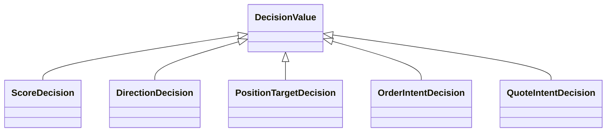
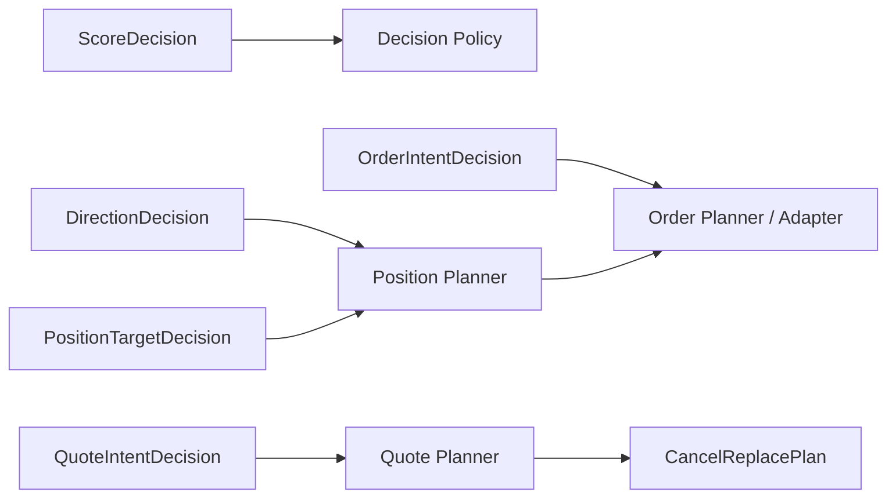

{{ nav_links() }}

# QMTL Decision Algebra

## Related Documents

- [QMTL Design Principles](design_principles.md)
- [QMTL Capability Map](capability_map.md)
- [Semantic Types](semantic_types.md)
- [Architecture Overview](architecture.md)

## Purpose

QMTL does not assign an entirely separate decision model to each strategy archetype.
Instead, it aims to express execution intent in a shared algebra, while planners
interpret specific subtypes and turn them into executable plans.

This document defines that common decision family.

## Core Principles

- inference and rule engines should emit the shared decision algebra
- planners consume decision subtypes and produce plans
- new strategy styles extend the system through new decision subtypes or planners, not new archetype enums
- legality is determined by semantic type and planner contract, not by decision name alone

## Decision Family

## Decision Subtypes

### ScoreDecision

Concept ID: `DEC-SCORE`

Represents a score or confidence signal before final execution shaping.
It may feed thresholding, ranking, allocation, or quote skew logic.

Examples:

- alpha score
- fill probability estimate
- adverse-selection risk score

### DirectionDecision

Concept ID: `DEC-DIRECTION`

Represents a directional judgment.
Long/short/flat or buy/sell/hold style outputs belong here.

### PositionTargetDecision

Concept ID: `DEC-POSITION-TARGET`

Represents a desired target position or target weight.
This is a typical planner input for directional strategies.

### OrderIntentDecision

Concept ID: `DEC-ORDER-INTENT`

Represents an execution intent at order granularity.
It may include order-level semantics such as price, quantity, tif, reduce_only, and venue hints.

### QuoteIntentDecision

Concept ID: `DEC-QUOTE-INTENT`

Represents an execution intent over a two-sided or multi-quote set.
Market making should usually center around this subtype.

Examples:

- bid/ask quote pair
- inventory-adjusted skewed quotes
- cancel/replace candidate set

## Planner Relationships

The key architectural move is to separate decisions from planners.

### Position Planner

Concept ID: `PLAN-POSITION-PLANNER`

Transforms `DirectionDecision` or `PositionTargetDecision` into
`OrderIntentDecision` or another order-shaped execution plan.

### Quote Planner

Concept ID: `PLAN-QUOTE-PLANNER`

Consumes `QuoteIntentDecision` together with `MutableExecutionState` and produces
a `CancelReplacePlan` containing keep/cancel/modify/new actions.

The distinction between directional and market-making execution should therefore
appear as a planner-contract difference, not as an archetype branch in the Core.

## Relationship to Execution State

Decision expresses intent; execution state describes the mutable current world.
These must remain separate.

- decision answers “what should happen”
- execution state answers “what is currently open, filled, and held”

Examples:

- inventory is state
- inventory target is decision
- open quote book is state
- next quote set is decision or plan

## ML + MM Example

`ML + MM` should be treated as an ordinary composition:

1. Observation: order book, trades, fills
2. Feature Extraction: microstructure features
3. Inference: fair value, fill probability, adverse-selection score
4. Decision: `QuoteIntentDecision`
5. Planner: `QuotePlanner`
6. Adapter: venue cancel/replace API
7. State: open quotes, fills, inventory

This requires no `if mm and ml` style exception because ML is an inference capability
and MM is a quote-planning capability.

## Extension Rules

When a new strategy style appears, evaluate it in the following order:

1. Can it be expressed with an existing decision subtype?
2. If yes, is a new planner or policy sufficient?
3. If not, is a genuinely new decision family required?
4. If so, add a new subtype together with its semantic type and planner contract.

Avoid adding a new top-level strategy kind whenever possible.

## Non-goals

The decision algebra does not try to make every strategy think the same way internally.
Its goal is to let different inference methods converge on shared execution boundaries.

It should therefore hide implementation detail while preserving the minimum common
execution meaning required by planners and policies.

{{ nav_links() }}
