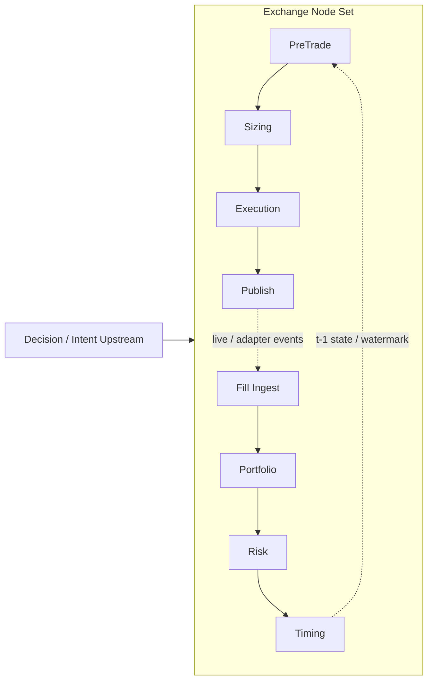

{{ nav_links() }}

# Exchange Node Sets — Execution Layer Composition

## 0. Purpose and Core Loop Position

- Purpose: Define the composition boundary for reusable post-signal execution paths as black-box `NodeSet`s.
- Core Loop position: The standard composition boundary for the Core Loop’s “strategy execution and order routing” stage, bundling `DecisionValue -> Execution Planning -> Execution Adapters -> Execution State`.

This document explains exchange node sets not as bundles for specific strategy archetypes,
but as black-box composition units that connect the new capability-first design rules to the current execution chain.
Typical strategies should attach execution through this public surface rather than reach into internal execution nodes.

## Related Normative Documents

- [QMTL Design Principles](design_principles.md)
- [QMTL Capability Map](capability_map.md)
- [QMTL Semantic Types](semantic_types.md)
- [QMTL Decision Algebra](decision_algebra.md)
- [QMTL Implementation Traceability](implementation_traceability.md)

## 1. Design Role

An exchange node set is an execution capability bundle.
Once a strategy has produced an execution intent such as `OrderIntentDecision`,
the node set connects that intent to order publication and execution state updates.

In this document, “node set” means:

- a composition unit whose internal execution wiring does not need to be known by the strategy
- a public surface that follows capability-first design
- a boundary that remains interpretable through `describe()` and `capabilities()` even if internals change

And it explicitly does not mean:

- a core enum keyed by archetypes such as `directional`, `ML`, or `market making`
- a promise that internal execution node classes and wiring are public API
- a claim that unsupported quote lifecycle capabilities are already implemented

## 2. Normative Contracts

The table below summarizes the core contracts exchange node sets must follow, together with their current implementation anchors.

| Concern | Normative rule | Current implementation anchor |
| --- | --- | --- |
| Black-box boundary | Strategies must depend on the `NodeSet` public surface rather than internal execution nodes | [NodeSet / NodeSetBuilder]({{ code_url('qmtl/runtime/nodesets/base.py') }}), [NodeSetAdapter]({{ code_url('qmtl/runtime/nodesets/adapter.py') }}) |
| Capability-first composition | Node sets must bundle planning/state/adapter capabilities, not archetype enums | [NodeSetRecipe]({{ code_url('qmtl/runtime/nodesets/recipes.py') }}), [registry]({{ code_url('qmtl/runtime/nodesets/registry.py') }}) |
| Semantic legality | A live order path must not directly consume delayed label output | [`_guard_label_outputs()`]({{ code_url('qmtl/runtime/nodesets/base.py') }}), [test_label_guardrails.py]({{ code_url('tests/qmtl/runtime/nodesets/test_label_guardrails.py') }}) |
| Feedback without cycles | Feedback must be expressed through watermark/state mechanisms, not literal graph cycles | [PreTradeGateNode]({{ code_url('qmtl/runtime/pipeline/execution_nodes/pretrade.py') }}), [PortfolioNode]({{ code_url('qmtl/runtime/pipeline/execution_nodes/portfolio.py') }}) |
| Scoped mutable state | Portfolio/fill state may only be shared through `strategy` or `world` scope | [NodeSetOptions]({{ code_url('qmtl/runtime/nodesets/options.py') }}), [resources]({{ code_url('qmtl/runtime/nodesets/resources.py') }}) |

## 3. Composition Overview



The important point is that feedback may look like an execution loop,
but it must not become a hidden DAG cycle.
In the current structure, state topics, watermarks, and world/portfolio scoping
allow `MutableExecutionState` to be consumed as time-shifted input.

## 4. Current Implementation Anchors

### 4.1 Black-box boundary and builder

The current public composition boundary is centered on the following implementation.

- [NodeSet]({{ code_url('qmtl/runtime/nodesets/base.py') }}): wraps internal nodes as an opaque execution subgraph
- [`NodeSet.describe()` / `NodeSet.capabilities()`]({{ code_url('qmtl/runtime/nodesets/base.py') }}): ensures strategies depend on stable metadata instead of internal wiring
- [NodeSetBuilder]({{ code_url('qmtl/runtime/nodesets/base.py') }}): composes the default step chain and injects world/scope/resources
- [NodeSetOptions]({{ code_url('qmtl/runtime/nodesets/options.py') }}): provides composition options such as `mode`, `portfolio_scope`, `activation_weighting`, and `label_order_guard`

### 4.2 Recipes, adapters, and registry

The current built-in composition surface sits on top of recipes and adapters.

- [NodeSetRecipe / RecipeAdapterSpec]({{ code_url('qmtl/runtime/nodesets/recipes.py') }}): bundle step wiring, descriptors, and adapter parameters in one place
- [NodeSetAdapter / NodeSetDescriptor / PortSpec]({{ code_url('qmtl/runtime/nodesets/adapter.py') }}): expose black-box input/output ports
- [registry]({{ code_url('qmtl/runtime/nodesets/registry.py') }}): handles recipe discovery and duplicate registration protection
- [adapters package]({{ code_url('qmtl/runtime/nodesets/adapters/__init__.py') }}): exposes `CcxtSpotAdapter`, `CcxtFuturesAdapter`, `IntentFirstAdapter`, and `LabelingTripleBarrierAdapter`

### 4.3 Built-in recipe surface

The representative recipes currently backed by both docs and code are:

- [make_intent_first_nodeset]({{ code_url('qmtl/runtime/nodesets/recipes.py') }}): connects signal + price inputs to an intent-first order path
- [make_ccxt_spot_nodeset]({{ code_url('qmtl/runtime/nodesets/recipes.py') }}): composes a CCXT-based spot order path
- [make_ccxt_futures_nodeset]({{ code_url('qmtl/runtime/nodesets/recipes.py') }}): composes a futures order path with leverage, reduce-only, and margin-mode options
- [make_labeling_triple_barrier_nodeset]({{ code_url('qmtl/runtime/nodesets/recipes.py') }}): provides a delayed labeling bundle for research/evaluation

Important constraints:

- Built-in recipes are currently centered on `OrderIntentDecision`-like order paths.
- A first-class market-making node set centered on `QuoteIntentDecision` and `QuotePlanner` does not exist yet.

### 4.4 Internal step chain and canonical execution wrappers

The canonical execution wrappers composed by current node set recipes live under
`qmtl/runtime/pipeline/execution_nodes/`.

- [PreTradeGateNode]({{ code_url('qmtl/runtime/pipeline/execution_nodes/pretrade.py') }})
- [SizingNode]({{ code_url('qmtl/runtime/pipeline/execution_nodes/sizing.py') }})
- [ExecutionNode]({{ code_url('qmtl/runtime/pipeline/execution_nodes/execution.py') }})
- [OrderPublishNode]({{ code_url('qmtl/runtime/pipeline/execution_nodes/publishing.py') }})
- [FillIngestNode]({{ code_url('qmtl/runtime/pipeline/execution_nodes/fills.py') }})
- [PortfolioNode]({{ code_url('qmtl/runtime/pipeline/execution_nodes/portfolio.py') }})
- [RiskControlNode]({{ code_url('qmtl/runtime/pipeline/execution_nodes/risk.py') }})
- [TimingGateNode]({{ code_url('qmtl/runtime/pipeline/execution_nodes/timing.py') }})
- [RouterNode]({{ code_url('qmtl/runtime/pipeline/execution_nodes/routing.py') }})

Auxiliary and compatibility surfaces still exist.

- [qmtl/runtime/transforms/execution_nodes.py]({{ code_url('qmtl/runtime/transforms/execution_nodes.py') }}): keeps transform-era wrappers and the `activation_blocks_order()` helper
- Transform-era public surfaces such as [TradeOrderPublisherNode]({{ code_url('qmtl/runtime/transforms/publisher.py') }}) still exist, but the canonical anchor for exchange node sets is now the pipeline execution package

## 5. Current Operating Contracts

### Public usage pattern

The default usage pattern is to attach a node set via the registry or an adapter.

```python
from qmtl.runtime.nodesets.registry import make

nodeset = make("ccxt_spot", signal, "demo-world", exchange_id="binance")
strategy.add_nodes([price, alpha, signal, nodeset])

info = nodeset.describe()
caps = nodeset.capabilities()
```

Direct recipe or builder use is still possible for advanced overrides.
Even then, strategies should avoid depending on the internal node order.

```python
from qmtl.runtime.nodesets.base import NodeSetBuilder
from qmtl.runtime.pipeline.execution_nodes import ExecutionNode

builder = NodeSetBuilder()

def custom_execution(upstream, ctx):
    return ExecutionNode(upstream, execution_model=my_exec_model)

nodeset = builder.attach(signal, world_id="demo-world", execution=custom_execution)
```

### Scope and resource injection

The shared mutable-state boundary is currently controlled through `portfolio_scope`.

- `strategy`: isolate state per `(world_id, strategy_id, symbol)`
- `world`: share state at `(world_id, symbol)` level

Relevant implementation and evidence:

- [NodeSetOptions]({{ code_url('qmtl/runtime/nodesets/options.py') }})
- [resources]({{ code_url('qmtl/runtime/nodesets/resources.py') }})
- [test_nodeset_builder_smoke.py]({{ code_url('tests/qmtl/runtime/nodesets/test_nodeset_builder_smoke.py') }})
- [test_nodeset_adapter_descriptor.py]({{ code_url('tests/qmtl/runtime/nodesets/test_nodeset_adapter_descriptor.py') }})

### Delayed feedback and watermark

Today, acyclic order-path feedback is primarily expressed through this combination.

- [PreTradeGateNode]({{ code_url('qmtl/runtime/pipeline/execution_nodes/pretrade.py') }}): checks portfolio readiness through a watermark gate
- [PortfolioNode]({{ code_url('qmtl/runtime/pipeline/execution_nodes/portfolio.py') }}): updates the watermark topic after fill application
- [`_shared.py`]({{ code_url('qmtl/runtime/pipeline/execution_nodes/_shared.py') }}): provides watermark normalization and commit-log key hints

Current evidence:

- [test_pretrade.py]({{ code_url('tests/qmtl/runtime/pipeline/execution_nodes/test_pretrade.py') }})
- [test_portfolio.py]({{ code_url('tests/qmtl/runtime/pipeline/execution_nodes/test_portfolio.py') }})

### Live legality and label guard

In the current live order path, label output is guarded from being connected directly into the order path.
This is not a special “ML exception”; it is the concrete implementation of the semantic rule
that forbids `DelayedStream -> live execution path`.

Relevant implementation and evidence:

- [`_guard_label_outputs()`]({{ code_url('qmtl/runtime/nodesets/base.py') }})
- [NodeSetOptions.label_order_guard]({{ code_url('qmtl/runtime/nodesets/options.py') }})
- [test_label_guardrails.py]({{ code_url('tests/qmtl/runtime/nodesets/test_label_guardrails.py') }})

### Gateway / fill ingress boundary

The current fill-ingress boundary is split across two layers.

- [FillIngestNode]({{ code_url('qmtl/runtime/pipeline/execution_nodes/fills.py') }}): represents the external fill stream boundary inside the DAG
- [Gateway `/fills` route]({{ code_url('qmtl/services/gateway/routes/fills.py') }}): handles CloudEvents envelopes, JWT/HMAC auth, and Kafka publish

Current evidence:

- [test_fills.py]({{ code_url('tests/qmtl/runtime/pipeline/execution_nodes/test_fills.py') }})
- [test_fills_webhook.py]({{ code_url('tests/qmtl/services/gateway/test_fills_webhook.py') }})

## 6. Current Test Evidence

The current public contract for exchange node sets is directly backed by the following tests.

- [test_recipe_contracts.py]({{ code_url('tests/qmtl/runtime/nodesets/test_recipe_contracts.py') }}): recipe registration, descriptor ports, mode metadata, sizing/portfolio resource injection
- [test_nodeset_builder_smoke.py]({{ code_url('tests/qmtl/runtime/nodesets/test_nodeset_builder_smoke.py') }}): attach contract, world-scope sharing, StepSpec resource injection
- [test_nodeset_adapter_descriptor.py]({{ code_url('tests/qmtl/runtime/nodesets/test_nodeset_adapter_descriptor.py') }}): adapter descriptor surface and capability exposure
- [test_ccxt_recipes.py]({{ code_url('tests/qmtl/runtime/nodesets/test_ccxt_recipes.py') }}): CCXT spot/futures publish-path mutations
- [test_intent_first.py]({{ code_url('tests/qmtl/runtime/nodesets/test_intent_first.py') }}): intent-first composition and default activation/resource injection
- [test_nodeset_testkit_and_webhook.py]({{ code_url('tests/qmtl/runtime/nodesets/test_nodeset_testkit_and_webhook.py') }}): minimal attach/testkit and fake fill webhook shape

## 7. Current Gaps and Non-goals

This document should state both what the current implementation guarantees and what remains missing.

Current gaps:

- A market-making path of `QuoteIntentDecision -> QuotePlanner -> CancelReplacePlan` is not yet a first-class node-set implementation.
- [ExecutionNode]({{ code_url('qmtl/runtime/pipeline/execution_nodes/execution.py') }}) uses a simplified simulation that sets `bid=ask=last=requested_price`. It does not model quote queues, cancel/replace, or maker lifecycle.
- `simulate / paper / live` are present in recipe metadata and some guards, but end-to-end execution semantics are still partial.
- Freeze/drain, replay, DLQ, and schema-to-code concerns have clear design intent, but remain only partially surfaced in the current node-set API.

Non-goals:

- freezing internal node wiring as public API
- documenting ML/MM combinations as pairwise exceptions
- claiming production support for capabilities that do not yet exist

{{ nav_links() }}
