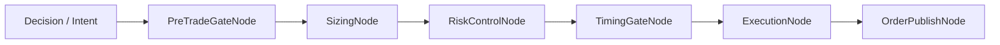
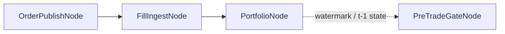

{{ nav_links() }}

# Execution Layer Nodes

## 0. Purpose and Core Loop Position

- Purpose: Describe the individual execution-layer nodes in capability terms, together with current implementation anchors and limitations.
- Core Loop position: Reference for the Core Loop’s “strategy execution and order routing” stage, showing how order paths, execution state, and risk/policy connect.

This document is an execution capability reference.
Typical strategies should reach for [exchange_node_sets.md](exchange_node_sets.md) first,
and read this page to understand the canonical wrapper nodes inside those node sets.

## Related Documents

- [Exchange Node Sets](exchange_node_sets.md)
- [QMTL Capability Map](capability_map.md)
- [QMTL Semantic Types](semantic_types.md)
- [QMTL Decision Algebra](decision_algebra.md)
- [QMTL Implementation Traceability](implementation_traceability.md)

## 1. How to Read This Document

Each node is described through the same lens.

- Design role: where it sits in the capability map and decision algebra
- Semantic contract: relation to causal live paths, mutable state, and command boundaries
- Current implementation: concrete code path
- Test evidence: currently guaranteed behavior
- Known limitations: areas that are not yet first-class

Important principles:

- legality must be explained through semantic type, not `strategy_type`
- execution nodes are not archetype-specific classes; they are the current implementations of planning/state/adapter/policy capabilities
- fan-in is a general `Node` feature, but this document only covers it where it matters for execution capabilities

## 2. Placement in the Capability Map

| Node | Primary capability | Primary semantic input | Primary output | Canonical implementation |
| --- | --- | --- | --- | --- |
| PreTradeGateNode | Risk / Policy | causal order-like input, activation/account state | pass-through order or rejection | [pretrade.py]({{ code_url('qmtl/runtime/pipeline/execution_nodes/pretrade.py') }}) |
| SizingNode | Execution Planning | decision/order intent, portfolio state | sized order | [sizing.py]({{ code_url('qmtl/runtime/pipeline/execution_nodes/sizing.py') }}) |
| ExecutionNode | Execution Planning | sized order, execution model | simulated fill or downstream order payload | [execution.py]({{ code_url('qmtl/runtime/pipeline/execution_nodes/execution.py') }}) |
| OrderPublishNode | Execution Adapters | command-ready order payload | gateway/commit-log friendly payload | [publishing.py]({{ code_url('qmtl/runtime/pipeline/execution_nodes/publishing.py') }}) |
| FillIngestNode | Observation | external fill stream | normalized fill-stream ingress | [fills.py]({{ code_url('qmtl/runtime/pipeline/execution_nodes/fills.py') }}) |
| PortfolioNode | Execution State | fill stream | mutable portfolio snapshot | [portfolio.py]({{ code_url('qmtl/runtime/pipeline/execution_nodes/portfolio.py') }}) |
| RiskControlNode | Risk / Policy | sized order, portfolio state | adjusted order or rejection | [risk.py]({{ code_url('qmtl/runtime/pipeline/execution_nodes/risk.py') }}) |
| TimingGateNode | Risk / Policy | timestamped order | allow/deny order | [timing.py]({{ code_url('qmtl/runtime/pipeline/execution_nodes/timing.py') }}) |
| RouterNode | Execution Adapters support | order payload | route-tagged payload | [routing.py]({{ code_url('qmtl/runtime/pipeline/execution_nodes/routing.py') }}) |

Supporting utilities:

- [order_types.py]({{ code_url('qmtl/runtime/pipeline/order_types.py') }}): typed payload contracts such as `OrderIntent`, `SizedOrder`, `GatewayOrderPayload`, and `FillPayload`
- [`_shared.py`]({{ code_url('qmtl/runtime/pipeline/execution_nodes/_shared.py') }}): watermark normalization, commit-log key hints, and shared helpers
- [MicroBatchNode]({{ code_url('qmtl/runtime/pipeline/micro_batch.py') }}): orchestration utility for downstream batching

## 3. Per-node Reference

### PreTradeGateNode

- Design role: policy gate at the head of the execution path, checking activation, brokerage, account state, and watermark readiness
- Semantic contract:
  - accepts only causal order-like input
  - `DelayedStream` legality is blocked earlier by the upstream node-set guard
  - returns a rejection when watermark readiness is not satisfied, preventing hidden cycles
- Current implementation: [pretrade.py]({{ code_url('qmtl/runtime/pipeline/execution_nodes/pretrade.py') }})
- Test evidence:
  - [test_pretrade.py]({{ code_url('tests/qmtl/runtime/pipeline/execution_nodes/test_pretrade.py') }})
  - [test_pretrade_metrics.py]({{ code_url('tests/qmtl/runtime/sdk/test_pretrade_metrics.py') }})
- Known limitations:
  - currently focused on order-level activation/account checks
  - quote-set legality and cancel/replace-specific gating are not yet first-class contracts

### SizingNode

- Design role: planning-stage node that turns `DecisionValue` or order intent into an executable quantity
- Semantic contract:
  - `Portfolio` is injected as `MutableExecutionState`
  - the weight function expresses soft gating from activation policy
- Current implementation: [sizing.py]({{ code_url('qmtl/runtime/pipeline/execution_nodes/sizing.py') }})
- Test evidence:
  - [test_sizing.py]({{ code_url('tests/qmtl/runtime/pipeline/execution_nodes/test_sizing.py') }})
  - [test_sizing_weight_integration.py]({{ code_url('tests/qmtl/runtime/sdk/test_sizing_weight_integration.py') }})
- Known limitations:
  - current planning is centered on quantity resolution
  - quote ladders, inventory skew, and cancel/replace planning are outside this node’s responsibility

### ExecutionNode

- Design role: runs a sized order through an execution model or passes a downstream payload through
- Semantic contract:
  - sits after planning and produces payloads close to `CommandValue`
  - if no execution model is configured, it passes the payload through
- Current implementation: [execution.py]({{ code_url('qmtl/runtime/pipeline/execution_nodes/execution.py') }})
- Test evidence:
  - [test_execution_node.py]({{ code_url('tests/qmtl/runtime/pipeline/execution_nodes/test_execution_node.py') }})
- Known limitations:
  - current simulation uses `requested_price` as `bid=ask=last` and treats the order as `MARKET`
  - maker queues, stale quotes, and partial requote behavior are not represented

### OrderPublishNode

- Design role: adapter node that pushes command-ready orders across the gateway/commit-log boundary and enriches metadata
- Semantic contract:
  - execution side effects begin after this node
  - order payloads are normalized as `GatewayOrderPayload`
- Current implementation: [publishing.py]({{ code_url('qmtl/runtime/pipeline/execution_nodes/publishing.py') }})
- Test evidence:
  - [test_publishing.py]({{ code_url('tests/qmtl/runtime/pipeline/execution_nodes/test_publishing.py') }})
  - [test_trade_order_publisher.py]({{ code_url('tests/qmtl/runtime/transforms/test_trade_order_publisher.py') }}) is separate evidence for the transform-era public surface
- Known limitations:
  - currently focused on a lightweight submit/commit-log boundary
  - retry policy, circuit breakers, and venue-specific ack lifecycle belong to external adapters or higher orchestration

### FillIngestNode

- Design role: observation boundary where an external fill stream enters the DAG
- Semantic contract:
  - assumes the fill event has already been authenticated and normalized outside the DAG
  - does not itself mutate execution state
- Current implementation: [fills.py]({{ code_url('qmtl/runtime/pipeline/execution_nodes/fills.py') }})
- Test evidence:
  - [test_fills.py]({{ code_url('tests/qmtl/runtime/pipeline/execution_nodes/test_fills.py') }})
  - [test_fills_webhook.py]({{ code_url('tests/qmtl/services/gateway/test_fills_webhook.py') }})
- Known limitations:
  - the node implementation is currently a `StreamInput` wrapper
  - CloudEvents parsing, JWT/HMAC auth, and Kafka publication happen at the gateway boundary outside the DAG

### PortfolioNode

- Design role: updates execution state by converting fill streams into portfolio snapshots
- Semantic contract:
  - directly mutates `MutableExecutionState`
  - updates a watermark topic so the downstream order path can read `t-1` state
- Current implementation: [portfolio.py]({{ code_url('qmtl/runtime/pipeline/execution_nodes/portfolio.py') }})
- Test evidence:
  - [test_portfolio.py]({{ code_url('tests/qmtl/runtime/pipeline/execution_nodes/test_portfolio.py') }})
  - [test_portfolio.py]({{ code_url('tests/qmtl/runtime/sdk/test_portfolio.py') }})
- Known limitations:
  - the current snapshot is centered on cash and positions
  - richer MM state such as open quote books, venue ack state, and inventory bands is not yet first-class

### RiskControlNode

- Design role: policy node that adjusts or rejects sized orders against portfolio/risk-manager rules
- Semantic contract:
  - reads mutable portfolio state without emitting a brand-new state object
  - reports violations explicitly through rejection payloads
- Current implementation: [risk.py]({{ code_url('qmtl/runtime/pipeline/execution_nodes/risk.py') }})
- Test evidence:
  - [test_risk.py]({{ code_url('tests/qmtl/runtime/pipeline/execution_nodes/test_risk.py') }})
  - [test_risk_integration.py]({{ code_url('tests/qmtl/runtime/sdk/risk_management/test_risk_integration.py') }})
- Known limitations:
  - current controls are centered on position size, leverage, and concentration
  - maker inventory skew, per-side quote exposure, and quote-age policies do not yet exist

### TimingGateNode

- Design role: policy node that enforces calendar and market-hours constraints
- Semantic contract:
  - consumes timestamped causal order input and returns allow/deny
  - does not directly mutate state
- Current implementation: [timing.py]({{ code_url('qmtl/runtime/pipeline/execution_nodes/timing.py') }})
- Test evidence:
  - [test_timing.py]({{ code_url('tests/qmtl/runtime/pipeline/execution_nodes/test_timing.py') }})
- Known limitations:
  - currently centered on regular-hours validation
  - venue microstructure-aware timing and quote freshness windows require separate planner/policy contracts

### RouterNode and MicroBatchNode

- Design role:
  - [RouterNode]({{ code_url('qmtl/runtime/pipeline/execution_nodes/routing.py') }}): adds route hints to order payloads
  - [MicroBatchNode]({{ code_url('qmtl/runtime/pipeline/micro_batch.py') }}): batches downstream publish/fill handling
- Test evidence:
  - [test_trade_order_publisher.py]({{ code_url('tests/qmtl/runtime/transforms/test_trade_order_publisher.py') }}) provides a transform-era example at the routing/publish boundary
- Known limitations:
  - these nodes are orchestration utilities more than execution semantics proper

## 4. Composition Examples

### Intent-first order path

This is the current canonical path for directional/order-intent execution.
Most built-in node sets use variations of this shape.

### Live feedback / watermark path

This expresses feedback without turning it into a DAG cycle.
`PortfolioNode` updates state, and `PreTradeGateNode` later reads readiness from that state boundary.

## 5. Relationship to Older Paths

The canonical implementation for execution-layer docs is now `qmtl/runtime/pipeline/execution_nodes/`.
However, transform-era surfaces still exist.

- [qmtl/runtime/transforms/execution_nodes.py]({{ code_url('qmtl/runtime/transforms/execution_nodes.py') }}): keeps older wrappers and helpers such as `activation_blocks_order()`
- [TradeOrderPublisherNode]({{ code_url('qmtl/runtime/transforms/publisher.py') }}) remains a runner/transforms-oriented public surface

Documentation rule:

- new design discussions and canonical anchors should point to pipeline execution nodes
- transform-era implementations should be mentioned only as compatibility or separate public surfaces

## 6. Current Gaps

This document is meant to surface the actual status of individual execution nodes, so it should also surface the missing parts.

- There are no first-class nodes yet for `QuoteIntentDecision`, `QuotePlanner`, or `CancelReplacePlan`.
- ML + MM is natural at the capability level, but the current implementation is still centered on order-intent paths.
- If richer execution state or quote lifecycle is needed, new planner/state contracts should be added instead of layering pairwise exceptions onto existing nodes.

{{ nav_links() }}
