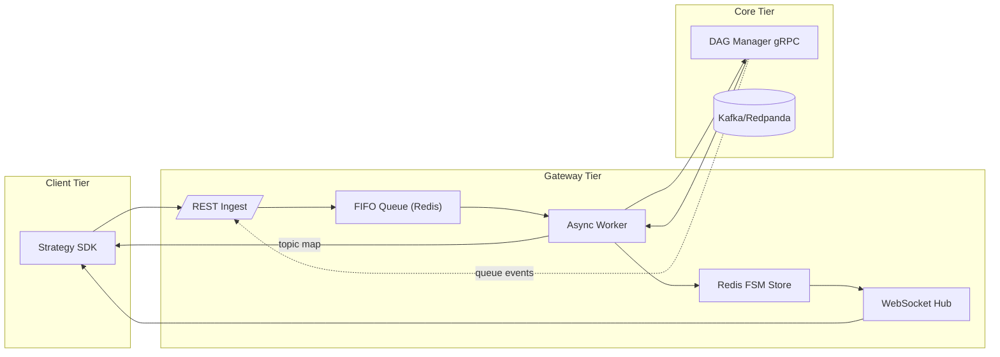

{{ nav_links() }}

# QMTL Gateway - Comprehensive Technical Specification

*Research-Driven Draft v1.2 - 2025-06-10*

## S0-A. Core Loop Alignment

- Gateway accepts `/strategies` submissions, orchestrates DAG Manager diff/queue mapping and WorldService proxies, and constructs a **compute context `{world_id, execution_domain, as_of, partition}`** for downstream services while serving purely as the Core Loop ingress + bridge.
- ExecutionDomain/ComputeKey/EvalKey rules are described consistently in `architecture.md`, `worldservice.md`, and this spec, with submission domain hints always subordinate to WS decisions.
- WS Decision/Activation/Allocation outputs and Gateway’s caching/stream relays map cleanly onto Runner/CLI `SubmitResult` and operator CLIs (world status, allocations), with field/TTL/error semantics aligned.

## Related Documents
- [Architecture Overview](README.md)
- [QMTL Architecture](architecture.md)
- [DAG Manager](dag-manager.md)
- [WorldService](worldservice.md)
- [ControlBus](controlbus.md)
- [Lean Brokerage Model](lean_brokerage_model.md)

Additional references
- Operations: [Risk Management](../operations/risk_management.md), [Timing Controls](../operations/timing_controls.md)
- Reference: [Brokerage API](../reference/api/brokerage.md), [Commit-Log Design](../reference/commit_log.md), [World/Activation API](../reference/api_world.md)

!!! note "Deployment profile"
    With `profile: dev`, some backends run in “local fallback/disabled” mode:

    - If `gateway.redis_dsn` is empty, Gateway uses an in-memory Redis shim.
    - If `gateway.controlbus_brokers`/`gateway.controlbus_topics` are empty, the ControlBus consumer is disabled.
    - If `gateway.commitlog_bootstrap`/`gateway.commitlog_topic` are empty, the Commit-Log writer/consumer are disabled.

    With `profile: prod`, missing `gateway.redis_dsn`, `gateway.database_backend=postgres` + `gateway.database_dsn`, `gateway.controlbus_brokers`/`gateway.controlbus_topics`, or `gateway.commitlog_bootstrap`/`gateway.commitlog_topic` stops Gateway before it starts.

!!! note "Risk Signal Hub integration"
    - Gateway acts only as a producer that pushes post-rebalance/fill portfolio snapshots (weights, covariance_ref/matrix, as_of) to the hub.
    - Configuration: inject tokens and the inline/offload criteria via the `risk_hub` block in `qmtl.yml`. In the dev profile, only inline + fakeredis are used and offload (blob/file/S3) is disabled. Redis/S3 offload is used only in the prod profile.
    - The consumer role (VaR/ES calculation, stress re-simulation) is handled on the WorldService side via hub events/queries; Gateway does not read the hub directly.
    - ControlBus/queue routing remains consistent with the existing activation/decision streams, and hub events are subscribed to by WorldService and the exit engine.

> This extended edition enlarges the previous document by approx. 75 % and adopts an explicit, graduate-level rigor. All threat models, formal API contracts, latency distributions, and CI/CD semantics are fully enumerated.
> Legend: **Sx** = Section, **Rx** = Requirement, **Ax** = Assumption.

---

## S0 - System Context & Goals

Gateway sits at the **operational boundary** between *ephemeral* strategy submissions and the *persistent* graph state curated by DAG Manager. Its design objectives are:

| ID     | Goal                                                         | Metric                    |
| ------ | ------------------------------------------------------------ | ------------------------- |
|  G-01  | Diff submission queuing **loss-free** under 1 k req/s burst  | `lost_requests_total = 0` |
|  G-02  | **<= 150 ms** p95 end-to-end latency (SDK POST -> Warm-up ack) | `gateway_e2e_latency_p95` |
|  G-03  | Zero duplicated Kafka topics across concurrent submissions   | invariants Sec.S3            |
|  G-04  | Line-rate WebSocket streaming of state updates (>= 500 msg/s) | WS load test              |

**Ax-1** SDK nodes adhere to canonical hashing rules (see Architecture doc Sec.1.1).
**Ax-2** Neo4j causal cluster exposes single-leader consistency; read replicas may lag.
**Ax-3** Gateway constructs and forwards a compute context `{ world_id, execution_domain, as_of, partition }` to downstream services. The SDK does not choose this context; Gateway derives it from WorldService decisions (and, where applicable, submission metadata). DAG Manager uses it to derive a Domain-Scoped ComputeKey; WorldService uses it to authorize/apply domain policies. The canonical implementation of this contract lives in `qmtl/foundation/common/compute_context.py` and is wrapped by `StrategyComputeContext` (`qmtl/services/gateway/submission/context_service.py`) which owns commit-log serialization, downgrade tracking, and Redis mapping for ingestion flows.

**User-facing design intent:** Gateway is the place where the QMTL core value
“focus only on strategy logic; the system handles optimisation and returns”
is enforced at the network boundary.
- SDK users submit via `Runner.submit(MyStrategy)` or simple REST calls; Gateway
derives the full compute context and hides WorldService/DAG Manager complexity
behind that interface.
- When adding endpoints or metadata, first check whether the **strategy
author’s submit flow becomes more complex**; prefer defaults, inference, and
policy presets over exposing raw backend configuration.
- Avoid keeping old and new paths alive for long purely for compatibility; at any point in time there should be a single **canonical endpoint surface**, with compatibility layers removed after a defined migration window.

### Non-Goals
- Gateway does not compute world policy decisions and is not an SSOT for worlds or queues.
- Gateway does not manage brokerage execution; it only mediates requests and relays control events.

---

## S1 - Functional Decomposition



Note: WorldService and ControlBus are omitted in this decomposition for brevity. See Sec.S6 for the Worlds proxy and opaque event stream handoff. In the full system, Gateway subscribes to ControlBus and proxies WorldService APIs.

---

## S2 - API Contract (**OpenAPI 3.1 excerpt**)

```yaml
paths:
  /strategies:
    post:
      summary: Submit local DAG for execution
      requestBody:
        content:
          application/json:
            schema: { $ref: '#/components/schemas/StrategySubmit' }
      responses:
        '202': { $ref: '#/components/responses/Ack202' }
  /strategies/{id}/status:
    get:
      parameters:
        - in: path
          name: id
          schema: { type: string }
      responses:
        '200': { $ref: '#/components/responses/Status200' }
  /queues/by_tag:
    get:
      summary: Fetch queues matching tags and interval
      parameters:
        - in: query
          name: tags
          schema: { type: string }
        - in: query
          name: interval
          schema: { type: integer }
        - in: query
          name: match_mode
          schema: { type: string, enum: [any, all] }
          description: |
            Preferred tag matching mode.
      responses:
        '200':
          description: Queue list
          content:
            application/json:
              schema:
                type: object
                properties:
                  queues:
                    type: array
                    items:
                      type: object
                      properties:
                        queue: { type: string }
                        global: { type: boolean }
```
Clients SHOULD specify ``match_mode`` to control tag matching behavior. When
omitted, Gateway defaults to ``any`` for backward compatibility.

!!! note "Additional endpoints (current implementation)"
    The OpenAPI excerpt below includes only the core paths. The current implementation also exposes the following routes; whether each is public or internal depends on the deployment profile and auth/ACL policy (evidence: `qmtl/services/gateway/routes/**`).

    - Strategies: ``POST /strategies/dry-run``, ``POST /strategies/{strategy_id}/history``
    - Events/schemas: ``GET /events/jwks``, ``GET /events/schema`` (WebSocket subscriptions are separate)
    - Ingest/replay: ``POST /fills`` (implemented ingest endpoint), ``GET /fills/replay`` *(placeholder response in the current build)*
    - Observability: ``GET /metrics``
    - Rebalancing: ``POST /rebalancing/execute`` (and the WorldService-proxied ``/rebalancing/plan``)

**Example Request (compressed 32 KiB DAG JSON omitted)**

```http
POST /strategies HTTP/1.1
Authorization: Bearer <jwt>
Content-Encoding: gzip
Content-Type: application/json
{
  "dag_json": "<base64>",
  "meta": {
    "user": "quant.alice",
    "desc": "BTC scalper",
    "execution_domain": "backtest",
    "as_of": "2025-01-01T00:00:00Z",
    "partition": "tenant-a"
  },
  "world_ids": ["crypto_mom_1h", "crypto_alt_1h"]
}
```

> **Backtests & dry-runs:** When `meta.execution_domain` resolves to `backtest` or
> `dryrun` (including aliases such as `compute-only`, `paper`, or `sim`), callers
> MUST include `meta.as_of`. Gateway downgrades missing values to compute-only
> backtests, enters safe mode, and records the event via
> `strategy_compute_context_downgrade_total{reason="missing_as_of"}`. The
> downgrade reasons are defined by the shared `DowngradeReason` enum in
> `qmtl/foundation/common/compute_context.py` to keep replay and commit-log behavior in
> sync. When WorldService is unreachable the submission also enters safe mode
> with downgrade reason `decision_unavailable`, ensuring live domains cannot
> execute without an authoritative decision envelope.

`meta.execution_domain` is caller intent only; the authoritative domain is derived
from WorldService `effective_mode` and normalised by Gateway. Alias mapping is
`compute-only/validate -> backtest`, `paper/sim -> dryrun`, `live -> live`, and
`shadow` is operator-only. When WS is stale or unavailable, `live` hints are
downgraded to compute-only (backtest).

**POST /strategies — HTTP Status**

| HTTP Status         | Meaning                                 | Typical Cause      |
| ------------------- | --------------------------------------- | ------------------ |
|  202 Accepted       |  Ingest successful, StrategyID returned | Nominal            |
|  400 Bad Request   |  Submission rejected                     | NodeID validation failure (`E_CHECKSUM_MISMATCH`, `E_NODE_ID_FIELDS`, `E_NODE_ID_MISMATCH`) |
|  409 Conflict       |  Duplicate StrategyID within TTL        | Same DAG re-submit (`E_DUPLICATE`) |
|  422 Unprocessable  |  Schema validation failure              | `StrategySubmit` payload invalid (FastAPI/Pydantic 422) |

**Example Queue Lookup**

```http
GET /queues/by_tag?tags=t1,t2&interval=60&match_mode=any HTTP/1.1
Authorization: Bearer <jwt>
```

| HTTP Status         | Meaning                          | Typical Cause      |
| ------------------- | -------------------------------- | ------------------ |
|  200 OK             |  Queue lookup successful         | Nominal            |
|  422 Unprocessable  |  Query parameter validation fail | Missing/invalid `tags` or `interval` |

---

## S3 - Exactly-Once Execution (NodexIntervalxBucket)

This section summarizes the once-and-only-once layer required by issue #544.

- Ownership: For each execution key `(node_id, interval, bucket_ts)`, a single worker acquires ownership before executing. Gateway uses a DB advisory lock (Postgres `pg_try_advisory_lock`) with optional Kafka-based coordination driven by `gateway.ownership.mode`, `gateway.ownership.bootstrap`, `gateway.ownership.topic`, `gateway.ownership.group_id` (plus retry/backoff knobs). The Kafka path claims ownership when the worker's consumer group owns the partition for the key and falls back to Postgres when unavailable.
- Commit log: Results are published via a transactional, idempotent Kafka producer to a compacted topic. The message value is `(node_id, bucket_ts, input_window_hash, payload)`.
- Message key: The Kafka message key is built as `"{partition_key(node_id, interval, bucket_ts)}:{input_window_hash}"` ensuring compaction on a stable prefix while preserving uniqueness per input window.
- Deduplication: Downstream consumers deduplicate on the triple `(node_id, bucket_ts, input_window_hash)` and increment `commit_duplicate_total` when duplicates are observed.
- Owner handoff metric: Gateway increments `owner_reassign_total` when a different worker takes ownership of the same execution key mid-bucket (best-effort reporting).

Acceptance tests cover: (a) two workers competing for the same key yield exactly one commit with zero duplicates, and (b) owner takeover increments `owner_reassign_total` once.


## S3 - Deterministic FIFO & Idempotency

**Invariant R-3.1** At most one Worker may pop a given StrategyID. Implemented by:
`SETNX("lock:{id}", worker_id, "NX", "PX", 60000)`

### S4 - Architecture Alignment

The architecture document (Sec.3) defines the deterministic NodeID used across Gateway and DAG Manager. Each NodeID is computed as `blake3:<digest>` over the **canonical serialization** of `(node_type, interval, period, params(split & canonical), dependencies(sorted by node_id), schema_compat_id (stable across minor/patch), code_hash)`. Non-deterministic fields are excluded; the `blake3:` prefix is mandatory, and BLAKE3 XOF may be used for strengthening. Gateway must generate the same IDs before calling the DiffService.

Clarifications
- NodeID MUST NOT include `world_id`. World isolation is enforced at the WVG layer and via world-scoped queue namespaces (e.g., `topic_prefix`), not in the global ID.
- TagQueryNode canonicalization: do not include the dynamically resolved upstream queue set in `dependencies`. Instead, capture the query spec in `params_canon` (normalized `query_tags` sorted, `match_mode`, and `interval`). Runtime queue discovery and growth are delivered via ControlBus -> SDK TagQueryManager; NodeID remains stable across discoveries.
- Gateway rejects any node submission missing `node_type`, `code_hash`, `config_hash`, `schema_hash`, or `schema_compat_id` with `E_NODE_ID_FIELDS` and returns `E_NODE_ID_MISMATCH` when the provided `node_id` does not equal the canonical `compute_node_id()` output. For `node_ids_crc32` (CRC32) mismatches, Gateway returns `E_CHECKSUM_MISMATCH`. If both `schema_compat_id` and legacy `schema_id` are present and differ, Gateway rejects with `E_SCHEMA_COMPAT_MISMATCH`. All errors include actionable hints so SDK clients can regenerate DAGs with the BLAKE3 contract.

Immediately after ingest, Gateway inserts a `VersionSentinel` node into the DAG so that rollbacks and canary traffic control can be orchestrated without strategy code changes. This behaviour is enabled by default and controlled by the ``insert_sentinel`` configuration field; it may be disabled with the ``--no-sentinel`` CLI flag.

!!! note "Design intent"
- TagQuery canonicalization keeps `NodeID` stable; dynamic queue discovery is a runtime concern (ControlBus -> SDK TagQueryManager), not part of canonical hashing.
- Execution domains are derived centrally by Gateway from WorldService decisions (see Sec.S0) and propagated via the shared `ComputeContext`; SDK treats the result as input only.
- VersionSentinel is default-on to enable rollout/rollback/traffic-split without strategy changes; disable only in low-risk, low-frequency environments.

Gateway records its FSM in Redis and in a database-backed event log. Durability guarantees such as Redis AOF and database WAL semantics must be enforced by **deployment/infra configuration**, not by application logic. This mitigates the Redis failure scenario described in the architecture (Sec.2).

When resolving `TagQueryNode` dependencies, the Runner's **TagQueryManager**
invokes ``resolve_tags()`` which issues a ``/queues/by_tag`` request. Gateway
consults DAG Manager for queues matching `(tags, interval)` and returns the list
so that TagQueryNode instances remain network-agnostic and only nodes lacking
upstream queues execute locally.

Gateway also listens (via ControlBus) for `sentinel_weight` CloudEvents emitted by DAG Manager. Upon receiving an update, Gateway updates local metrics and broadcasts the new weight to SDK clients via WebSocket. The effective ratio per version is exported as the Prometheus gauge `gateway_sentinel_traffic_ratio{version="<id>"}`.

Rebalancing plans from WorldService are delivered on the `rebalancing_planned` ControlBus topic. Gateway deduplicates the events, broadcasts them over the WebSocket `rebalancing` topic (CloudEvent type `rebalancing.planned`), and records metrics capturing plan volume and automatic execution (`rebalance_plans_observed_total`, `rebalance_plan_last_delta_count`, `rebalance_plan_execution_attempts_total`, `rebalance_plan_execution_failures_total`).

### S5 - Reliability Checklist

* **NodeID CRC pipeline** - Gateway recomputes each `node_id` and cross-checks it with the SDK value via the `crc32` field on diff requests/responses. A mismatch returns HTTP 400.
* **TagQueryNode runtime expansion** - When Gateway discovers a new `(tags, interval)` queue, it emits a `tagquery.upsert` CloudEvent. The Runner's **TagQueryManager** consumes the event and primes node buffers automatically.
* **Local DAG fallback queue** - If DAG Manager is unavailable, submitted strategy IDs are buffered in memory and flushed to the Redis queue once the service recovers.
* **Sentinel weight application latency** - After `traffic_weight` updates, Gateway measures the time until it applies the ratio locally and exports the skew via the `sentinel_skew_seconds` metric.

### Gateway CLI Options

Run the Gateway service. The ``--config`` flag is optional:

```bash
# start with built-in defaults
qmtl service gateway

# specify a configuration file
qmtl service gateway --config qmtl/examples/qmtl.yml
```

When provided, the command reads the ``gateway`` section of
``qmtl/examples/qmtl.yml`` for all server parameters. Omitting ``--config``
starts the service with built-in defaults that use SQLite and an in-memory
Redis substitute. The sample file illustrates how to set ``redis_dsn`` to point
to a real cluster. If ``redis_dsn`` is omitted, Gateway automatically uses the
in-memory substitute. See the file for a fully annotated configuration template.
Setting ``insert_sentinel: false`` disables automatic ``VersionSentinel`` insertion.

Available flags:

- ``--config`` - optional path to configuration file.
- ``--no-sentinel`` - disable automatic ``VersionSentinel`` insertion.
- ``--allow-live`` - disable the live trading guard requiring ``X-Allow-Live: true``.

### Configuration validation flow

`qmtl config validate` orchestrates the `qmtl.foundation.config_validation` helpers in three stages to keep each dependency check concise.

1. **Schema validation (`schema`)** – `validate_config_structure` walks the `UnifiedConfig` dataclass definitions, ensuring every section key is present and typed correctly. Errors mention readable descriptions such as `list[str]` so operators can quickly identify the offending field.
2. **Gateway connectivity (`gateway`)** – dedicated helpers like `_validate_gateway_redis`, `_validate_gateway_database`, `_check_controlbus`, and `_validate_gateway_worldservice` sequentially verify Redis, the configured database backend, ControlBus topics, and the proxied WorldService. Passing `--offline` converts these network-bound checks into warnings rather than outbound requests.
3. **DAG Manager connectivity (`dagmanager`)** – `_validate_dagmanager_neo4j`, `_validate_dagmanager_kafka`, and `_validate_dagmanager_controlbus` independently cover Neo4j, Kafka, and ControlBus connectivity, keeping each helper's cyclomatic complexity beneath the Radon B target.

Each stage emits `ValidationIssue` payloads that are rendered as a CLI table and, when requested, JSON (`--json`). Any error-level severity causes the command to exit with code 1 so automation picks up failing environments.

---

## S4 - Ownership & Commit-Log Design

- **Ownership** - Gateway manages the submission FIFO queue and each strategy's FSM. It is not the SSOT for the graph, queues, or worlds. Topics created after a diff and their lifecycle belong to DAG Manager, while world policy and activation state belong to WorldService.
- **Commit Log** - Every strategy submission is appended to the `gateway.ingest` topic (Redpanda/Kafka) before processing. Gateway’s commit-log consumer uses Kafka consumer group offset commits (committing after successful processing) and provides deduplication and metrics. Gateway subscribes to ControlBus events emitted by DAG Manager and WorldService so it can relay them to the SDK. This log boundary enables replay and auditing after failures.

---

## S6 - Worlds Proxy & Event Stream (New)

Gateway remains the single public boundary for SDKs. It proxies WorldService endpoints and provides an opaque event stream descriptor to SDKs; it does not compute world policy itself.

### Worlds Proxy

- Proxied endpoints -> WorldService:
  - ``GET /worlds/{id}/decide`` -> DecisionEnvelope (cached with TTL/etag)
  - ``GET /worlds/{id}/activation`` -> ActivationEnvelope (fail-safe: inactive on stale)
  - ``POST /worlds/{id}/evaluate`` / ``POST /worlds/{id}/apply`` (operator-only)
- Caching & TTLs:
  - Per-world decision cache honors envelope TTL (default 300s if unspecified); stale decisions -> safe fallback (compute-only, orders gated OFF)
  - Activation cache: stale/unknown -> orders gated OFF; ActivationEnvelope MAY include `state_hash` for quick divergence checks
- Circuit breakers & budgets: Gateway periodically polls WorldService and DAG Manager status to drive circuit breakers.
- `/status` exposes circuit breaker states for dependencies, including WorldService.

- Strategy submission and worlds:
  - Clients SHOULD send `world_ids[]` (multiple). `world_id` (single) is deprecated; Gateway still accepts it as a fallback (`world_ids=[world_id]`) and emits a deprecation warning/metric. Gateway upserts a **WorldStrategyBinding (WSB)** for each world and ensures the corresponding `WorldNodeRef(root)` exists in the WVG. Execution mode is still determined solely by WorldService decisions.
  - When `gateway.worldservice_url` is set (or a `WorldServiceClient` is injected), the submission helper mirrors each binding to WorldService via `POST /worlds/{world_id}/bindings`. Duplicate bindings return HTTP 409 and are treated as success; transient errors are logged but do not block ingestion.
  - Gateway maps `DecisionEnvelope.effective_mode` to an ExecutionDomain for compute/context and writes it to envelopes it relays: `validate -> backtest (orders gated OFF by default)`, `compute-only -> backtest`, `paper/sim -> dryrun`, `live -> live`. The same mapping is applied to proxied ActivationEnvelope payloads so clients receive an explicit `execution_domain` even though WorldService omits it. `shadow` is reserved and must be explicitly requested by operators. SDK/Runner treats this mapping as input only.
  - Gateway forwards a compute context `{ world_id, execution_domain, as_of (if backtest), partition }` with diff/ingest requests so DAG Manager derives a Domain-Scoped ComputeKey and isolates caches per domain. When a caller does not supply backtest metadata, Gateway either derives the context from WS or omits optional fields; DAG Manager then applies safe defaults and context-scoped isolation.
  - The HTTP `/strategies` flow is implemented by the composable services in `qmtl/services/gateway/submission/` (see `SubmissionPipeline`). Each stage-DAG decoding/validation, node identity verification, compute-context normalization, diff execution, and TagQuery fallback-has focused coverage so future changes only affect the relevant module.
  - Backtest/dryrun submissions MUST include `as_of` (dataset commit) and MAY include `dataset_fingerprint`; when absent Gateway rejects or falls back to compute-only mode to avoid mixing datasets.

### Event Stream Descriptor

SDKs obtain an opaque WebSocket descriptor from Gateway and subscribe to real-time control updates without learning about ControlBus.

```
POST /events/subscribe
{ "world_id": "crypto_mom_1h", "strategy_id": "...", "topics": ["activation", "queues"] }
-> { "stream_url": "wss://gateway/ws/evt?ticket=...", "token": "<jwt>", "topics": ["activation"], "expires_at": "..." }
```

- Gateway subscribes to internal ControlBus and relays events to SDK over the descriptor URL.
- Ordering is guaranteed per key (world_id or tags+interval). Consumers deduplicate via ``etag``/``run_id``. First message per topic SHOULD be a full snapshot or carry a `state_hash`.
- **Public availability:** The descriptor currently serves SDK internals (ActivationManager, TagQueryManager). There is no
  general-purpose CLI/SDK helper for user-facing subscriptions yet; external observers should poll Gateway/WorldService
  endpoints (e.g., `qmtl status`, `GET /worlds/{id}`) until a stable surface is released.

Token (JWT) claims (delegated WS or future use):
- `aud`: `controlbus`
- `sub`: user/service identity
- `world_id`, `strategy_id`, `topics`: subscription scope
- `jti`, `iat`, `exp`: idempotency and keying. Key ID (`kid`) is conveyed in the JWT header.

Token refresh
- Clients may refresh an expiring token on the same connection by sending `{ "type": "refresh", "token": "<jwt>" }`.
- On success Gateway updates scopes/topics in-place and returns `{ "type": "refresh_ack" }`.
- Failures emit `ws_refresh_failed` and close the socket with policy code 1008.

### Degrade & Fail-Safe Policy (Summary)

- WorldService unavailable:
  - ``/decide`` -> cached DecisionEnvelope if fresh; else safe default (compute-only)
  - ``/activation`` -> inactive
- Event stream unavailable:
  - Reconnect with provided ``fallback_url``; SDK may periodically reconcile via HTTP
- Live guard: Gateway rejects live trading unless consent is given.
  - When enabled, callers must include header ``X-Allow-Live: true``.
  - Starting Gateway with ``--allow-live`` disables the guard for testing.
- 2-Phase apply handshake: during `Freeze/Drain`, Gateway MUST gate all order publications (OrderPublishNode outputs are suppressed). Gateway unblocks only after an `ActivationUpdated` event reflecting `freeze=false` post-switch.
- Identity propagation: Gateway forwards caller identity (JWT subject/claims) to WorldService; WorldService logs it in audit records.

See also: World API Reference (reference/api_world.md) and Schemas (reference/schemas.md).

{{ nav_links() }}
- Status (2025-09):
  - Partition key is defined in `qmtl/services/dagmanager/kafka_admin.py:partition_key(node_id, interval, bucket)` and used by the commit-log writer.
  - Transactional commit-log writer/consumer are implemented (`qmtl/services/gateway/commit_log.py`, `qmtl/services/gateway/commit_log_consumer.py`) with deduplication and metrics.
  - OwnershipManager coordinates Kafka ownership with Postgres advisory locks fallback (`qmtl/services/gateway/ownership.py`). Kafka partition ownership is implemented by `KafkaPartitionOwnership` (wired via `gateway.ownership` config), and `owner_reassign_total` is recorded on handoff.
  - The “skip local execution when queues are globally owned” behaviour is implemented on the SDK side when applying queue mappings (e.g., filtering out `global=true` entries for TagQueryNode). Gateway `worker.py` is not the canonical implementation of this policy (see `qmtl/runtime/sdk/tag_manager_service.py`).
  - Chaos/soak style dedup tests exist under `tests/qmtl/services/gateway/test_commit_log_soak.py`.
