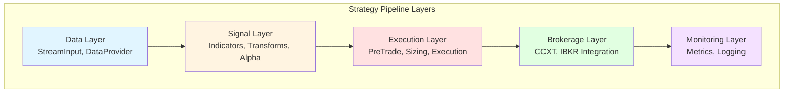

{{ nav_links() }}

# Layered Template System Architecture

## Related Documents
- [Architecture Overview](README.md)
- [Strategy Development Workflow](../guides/strategy_workflow.md)
- [SDK Tutorial](../guides/sdk_tutorial.md)

---

## Overview

QMTL's project initialization flow has shifted from a single monolithic template
to a **layered, composable architecture**. Each stage of a strategy-data supply,
signal generation, execution, and brokerage-is modeled as an independent layer so
teams can assemble only the components they need.

### Design Goals

1. **Separation of Concerns** - Every layer owns exactly one responsibility and is maintained independently.
2. **Reusability** - Mirrors QMTL's core philosophy of partial DAG reuse.
3. **Progressive Learning** - Allows newcomers to build a strategy step by step.
4. **Flexibility** - Supports research, backtesting, and production deployments with tailored bundles.
5. **Maintainability** - Layer-scoped templates prevent combinatorial growth in complexity.

---

## Architecture Overview

### Layer Structure



### Layer Responsibilities

| Layer        | Responsibility                            | Key Components                                      |
|--------------|-------------------------------------------|-----------------------------------------------------|
| **Data**     | Data ingestion and sourcing               | StreamInput, HistoryProvider, DataProvider          |
| **Signal**   | Alpha production and signal transforms    | Indicators, Transforms, Alpha logic                 |
| **Execution**| Order orchestration and management        | PreTradeGate, Sizing, ExecutionNode                 |
| **Brokerage**| Exchange/broker integration               | CCXT, IBKR, custom brokers                          |
| **Monitoring**| Observability and metrics collection     | Metrics, Event Recorder, Logging                    |

---

## CLI Interface Design

### Command Tree

```
qmtl project
  +--- init                  # Create a new project
  |   +--- --preset          # Select a preset (fast start)
  |   +--- --layers          # Choose layers explicitly
  |   `--- --path            # Target project path
  +--- add-layer             # Add a layer to an existing project
  |   +--- <layer>           # Layer to add (positional)
  |   +--- --path            # Project path (defaults to CWD)
  |   `--- --template        # Select a concrete template
  +--- list-layers           # Print layer and template metadata
  |   +--- --show-templates  # Display template list
  |   `--- --show-requires   # Display template dependencies
  +--- list-presets          # Print preset descriptions
  |   `--- --show-legacy-templates  # Include deprecated template names
  `--- validate              # Validate project structure
      `--- --path            # Project path (defaults to CWD)
```

### Usage Examples

#### 1. Fast start with presets

```bash
# Discover available presets
qmtl project list-presets

# Minimal backtesting strategy
qmtl project init --path my_backtest --preset minimal

# Production-ready strategy
qmtl project init --path my_prod --preset production

# Research-oriented strategy
qmtl project init --path my_research --preset research
```

#### 2. Custom initialization by selecting layers

```bash
# Include only data and signal layers
qmtl project init --path my_strategy --layers data,signal

# Add execution layer on top
qmtl project init --path my_strategy --layers data,signal,execution

# Include every layer
qmtl project init --path my_strategy --layers data,signal,execution,brokerage,monitoring
```

#### 3. Incremental layer additions

```bash
# Add the execution layer to an existing project
cd my_strategy
qmtl project add-layer execution

# Add brokerage layer with a specific template
qmtl project add-layer brokerage --template ccxt_binance

# Add monitoring layer
qmtl project add-layer monitoring

# Inspect available layers and templates in the current environment
qmtl project list-layers --show-templates --show-requires

# Validate the resulting project structure
qmtl project validate --path my_strategy
```

---

## Preset Definitions

### Minimal (baseline)

**Purpose:** Backtesting and research  
**Layers:** `data`, `signal`

```yaml
# qmtl/examples/presets/minimal.yml
name: minimal
description: "Minimal strategy for backtesting and research"
layers:
  - data
  - signal
templates:
  data: "templates/layers/data/stream_input.py"
  signal: "templates/layers/signal/single_indicator.py"
config:
  include_sample_data: true
  include_notebooks: true
```

**Generated structure:**
```
my_backtest/
+--- strategy.py           # Entry point
+--- qmtl.yml              # Configuration
+--- layers/
|   +--- data/
|   |   `--- providers.py  # StreamInput implementation
|   `--- signal/
|       `--- indicators.py # Indicator calculations
+--- data/                 # Sample data
|   `--- sample_ohlcv.csv
`--- tests/
    `--- test_strategy.py
```

### Production

**Purpose:** Live trading  
**Layers:** `data`, `signal`, `execution`, `brokerage`, `monitoring`

```yaml
# qmtl/examples/presets/production.yml
name: production
description: "Production-ready trading strategy with full execution pipeline"
layers:
  - data
  - signal
  - execution
  - brokerage
  - monitoring
templates:
  data: "templates/layers/data/questdb_hybrid.py"
  signal: "templates/layers/signal/multi_factor.py"
  execution: "templates/layers/execution/canary_guard.py"
  brokerage: "templates/layers/brokerage/ccxt_binance.py"
  monitoring: "templates/layers/monitoring/prometheus.py"
config:
  enable_risk_checks: true
  require_live_guard: true
```

**Generated structure adds:**
```
+--- layers/execution/
|   `--- pipeline.py
+--- layers/brokerage/
|   `--- adapter.py
+--- layers/monitoring/
|   `--- telemetry.py
+--- configs/
|   `--- risk_limits.yml
`--- ops/
    `--- docker-compose.yml
```

### Research

**Purpose:** Exploratory strategy development with notebooks and synthetic data  
**Layers:** `data`, `signal`, `monitoring`

```yaml
# qmtl/examples/presets/research.yml
name: research
description: "Research workflow with notebooks and experiment harness"
layers:
  - data
  - signal
  - monitoring
templates:
  data: "templates/layers/data/synthetic_generator.py"
  signal: "templates/layers/signal/notebook_pipeline.py"
  monitoring: "templates/layers/monitoring/lab_metrics.py"
config:
  include_notebooks: true
  enable_experiment_tracking: true
```

**Additional assets:**
```
+--- notebooks/
|   +--- feature_experiments.ipynb
|   `--- dag_diff_walkthrough.ipynb
+--- experiments/
|   `--- tracking_config.yml
`--- scripts/
    `--- bootstrap_lab_env.py
```

---

## Layer Dependency Matrix

| Layer      | Requires | Optional dependencies                  |
|------------|----------|----------------------------------------|
| Data       | None     | QuestDB, Redis for caching             |
| Signal     | Data     | NumPy, pandas, indicator libraries     |
| Execution  | Signal   | Risk engine, order throttling service  |
| Brokerage  | Execution| Exchange SDKs (CCXT, IBKR), secrets    |
| Monitoring | None     | Prometheus, Grafana, logging sink      |

Templates declare hard requirements via metadata; the CLI collects and installs
extras when a preset or layer is selected.

---

## Template Registry Structure

```
templates/
+--- layers/
|   +--- data/
|   |   +--- stream_input.py
|   |   +--- questdb_hybrid.py
|   |   `--- synthetic_generator.py
|   +--- signal/
|   |   +--- single_indicator.py
|   |   `--- multi_factor.py
|   +--- execution/
|   |   `--- canary_guard.py
|   +--- brokerage/
|   |   `--- ccxt_binance.py
|   `--- monitoring/
|       +--- prometheus.py
|       `--- lab_metrics.py
`--- metadata.yml          # Layer definitions, dependencies, tags, docs link
```

Metadata drives both CLI prompts and documentation (e.g., surfaced through
`qmtl project list-layers --show-templates`).

---

## Testing Strategy

- **Unit tests** exercise per-layer template generation with fixture DAGs.
- **Integration tests** spawn the CLI to assemble projects under temporary directories and validate their structure.
- **Smoke tests** run `uv run -m pytest -q` inside generated projects to ensure dependencies and scaffolding work out of the box.

---

## Operational Guidance

- Keep layer templates loosely coupled. Shared utilities belong in `qmtl/foundation/`.
- Version templates using semantic tags. The CLI verifies compatibility between template versions and the target QMTL release.
- Record changelog entries in `docs/architecture/layered_template_system.md` when adding layers or presets so downstream teams can update pipelines deliberately.
- Whenever a layer introduces new Python dependencies, update `pyproject.toml` extras and the CI workflows that bake template tests.

{{ nav_links() }}
