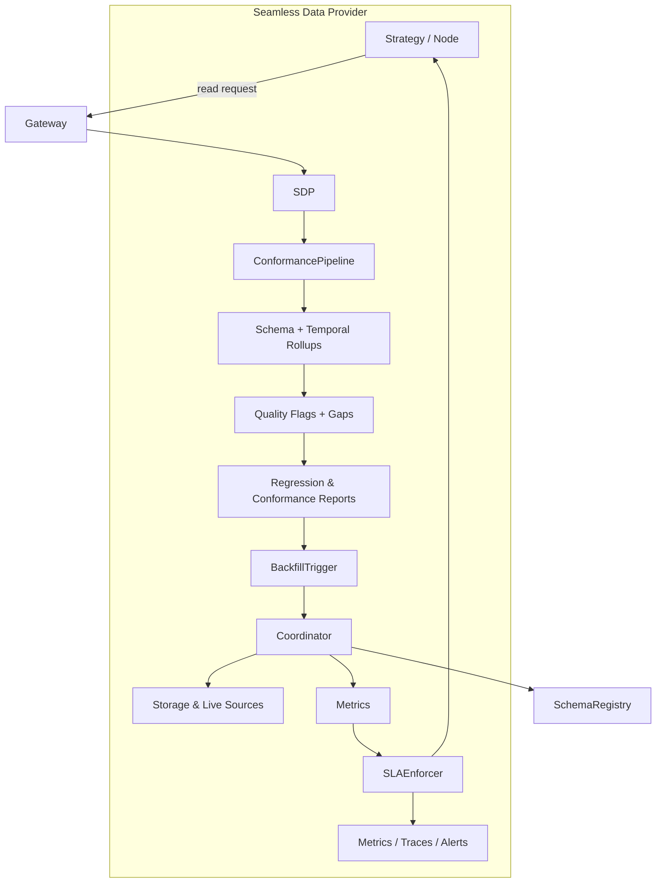

# Seamless Data Provider v2 Architecture

## 0. Purpose and Core Loop Position

- Purpose: Describe how the Seamless Data Provider (SDP) v2 combines **normalisation, conformance checks, backfill, SLAs, and observability** to feed strategies/worlds with consistent history and live data.
- Core Loop position: Backs the Core Loop stages **“data supply automation” + “market replay backtest”** by guaranteeing the data quality and coverage that Runner.submit and WorldService rely on.

### 0-A. As-Is / To-Be Summary

- As‑Is
  - SDP v2 is live in the runtime: cache→storage→backfill→live flows and ConformancePipeline/SLA/metrics already guard data quality.
  - At the strategy/template level, authors still construct `history_provider` explicitly in most cases; the only
    default on‑ramp today is for worlds that declare `world.data.presets[]`, where Runner/CLI build an SDP instance
    from presets and inject it into `StreamInputs` when a world is specified.
- To‑Be
  - For world/preset-based on‑ramps, Runner/CLI automatically builds an SDP instance from **Seamless presets + data specs** and injects it into StreamInputs when a world is specified.
  - This document becomes the normative data‑plane counterpart to `rewrite_architecture_docs.md`, including the contract for “world-centric data presets → SDP wiring”.

> **Status:** The Seamless Data Provider v2 architecture is now live in the
> runtime. The distributed backfill coordinator replaces the in-process stub,
> `SLAPolicy` budgets are enforced, and the observability surfaces referenced
> below are emitted by default. Remaining roadmap items focus on schema
> governance and dashboard polish rather than core service gaps.

The Seamless Data Provider (SDP) remains on the path from the prototype described
in the earlier design document toward a production system that enforces data
quality, backfill SLAs, and schema safety from the moment a request arrives. The
sections below call out where functionality is still forthcoming so that readers
do not over-estimate the guarantees made by today's runtime.

## High-level Flow



The request enters the gateway, is normalised by the Seamless Data Provider, and
then flows through the conformance pipeline before data is served back. Each
stage emits explicit artefacts (flags, reports, metrics) so that downstream
systems can reason about the completeness of a response.

## Conformance Pipeline

`ConformancePipeline` runs three distinct stages. Callers still opt in by
supplying an explicit `ConformancePipeline` instance, but the runtime now emits
structured reports alongside the data path. The stages are:

1. **Schema rollups** aggregate observations against the canonical
   registry schema, catching missing columns or invalid enumerations before the
   client ever sees them.
2. **Temporal rollups** compute completeness windows per symbol and granularity,
   allowing queries to blend storage and live data without misaligned bars.
3. **Quality flags and reports** generate regression digests that are published
   to `qmtl://observability/seamless/<node>` and archived for audit.

As of the September 2025 runtime update the pipeline is enabled by default via
`EnhancedQuestDBProvider`. Normalisation warnings continue to be surfaced via the
returned report. Any warnings or flags emitted by the pipeline raise a
`ConformancePipelineError` unless the provider is instantiated with
`partial_ok=True`. In partial-ok mode the normalized frame is returned while the
report remains accessible through `SeamlessDataProvider.last_conformance_report`,
so teams can defer blocking behaviour until the registry rollout completes.

## Distributed Backfill Coordinator

The distributed coordinator is now the default when
`QMTL_SEAMLESS_COORDINATOR_URL` is set. The SDK instantiates
`DistributedBackfillCoordinator`, negotiates leases with the Raft service, and
falls back to the legacy in-memory guard only when the URL is absent or the
service is unavailable. The production implementation provides:

- **Aligned leases** so overlapping requests share work instead of duplicating
  backfills.
- **Stale claim detection** via lease expiry telemetry and automatic failure
  signalling when a worker crashes mid-flight.
- **Partial completion tracking**, emitting the
  `backfill_completion_ratio{node_id,interval,lease_key}` gauge to Prometheus
  and structured logs under `seamless.backfill`.
- **Recovery hooks** that mark failed leases for reprocessing, guaranteeing that
  every shard either completes or raises an explicit violation.

Consumers no longer need to provide a coordinator stub; enabling the service via
environment configuration activates the distributed path.

## SLA Enforcement

`SLAPolicy` budgets are honoured for every Seamless request. The provider tracks
time spent waiting on storage, backfill, live feeds, and the overall request and
records the duration in the `seamless_sla_deadline_seconds{node_id,phase}`
histogram. When any phase exceeds its configured budget the runtime raises
`SeamlessSLAExceeded`, logs the violation under `seamless.sla`, and surfaces the
failure to callers so they can degrade gracefully. Policies can also bound the
number of synchronous gap bars; violations emit the same exception with a
`sync_gap` phase.

Tracing hooks are wired for future span enrichment; the metrics and exception
behaviour are active today.

## Schema Registry Governance

Seamless v2 integrates with the shared QMTL schema registry layer. Schemas used
for normalisation and rollups are managed via
`qmtl.foundation.schema.SchemaRegistryClient`, which can operate in in-memory
or remote modes depending on configuration.

- Registry integration
  - By default, `SchemaRegistryClient` stores schemas in-process. When
    `connectors.schema_registry_url` or `QMTL_SCHEMA_REGISTRY_URL` is set,
    `RemoteSchemaRegistryClient` talks to an external registry.
  - The conformance pipeline’s schema-rollup stage is designed to evaluate
    compatibility against these canonical registry-backed schemas.
- Validation modes
  - Governance is configured via the `validation_mode` parameter or the
    `QMTL_SCHEMA_VALIDATION_MODE` env var, supporting `canary` and `strict`
    modes (`canary` is the default).
  - **Canary** validation mirrors requests and records compatibility diagnostics
    without blocking responses.
  - **Strict** validation rejects incompatible payloads and raises
    `SchemaValidationError` when approved schemas are violated.
- Observability & audit
  - All compatibility failures are recorded in the Prometheus counter
    `seamless_schema_validation_failures_total{subject,mode}`, which dashboards
    use to monitor regressions during canary→strict transitions.
  - Strict-mode promotions are captured via `scripts/schema/audit_log.py`,
    which persists schema bundle SHAs and validation windows; the full workflow
    is defined in `docs/en/operations/schema_registry_governance.md`.

This closes the original gap where validation was described as “best-effort with
no central registry or governance hooks”. The Seamless data plane now follows
the Core Loop roadmap’s **P‑C / T3 P1‑M2 — Schema Registry Governance
formalization** contract.

### Canary → strict rollout checklist (operations)

1. **Register schema:** publish the new subject/version to the registry and pin the bundle SHA.  
   `uv run python scripts/schema/audit_log.py --bundle schemas/vX --note "ohlcv 1m vX canary"`
2. **Canary deploy:** restart Seamless with `validation_mode=canary` (or set `QMTL_SCHEMA_VALIDATION_MODE=canary`). Runner/CLI use the world preset data spec as the subject automatically.
3. **Monitor:** watch `seamless_schema_validation_failures_total{subject,mode="canary"}` and ConformancePipeline warning logs for 24–48h.
4. **Promote to strict:** switch to `validation_mode=strict` and re-check metrics/logs. If failures surface, revert to canary immediately and block the offending subject.
5. **Audit:** append the promotion window and bundle SHA to the audit log and annotate dashboards.
6. **Rollback path:** from strict, downgrade to canary for failing subjects and tombstone the problematic schema until a fixed version is published.

## Observability Surfaces

Prometheus now exposes the coordinator and SLA metrics described above alongside
the existing conformance counters. The Jsonnet dashboards referenced in the
operations guide can be rendered directly from these metrics. Tracing spans will
gain richer attributes once the schema registry work completes, but no further
changes are required for the coordinator or SLA instrumentation.

## Validation & Failure-Injection Suite

Seamless v2 now ships with a comprehensive regression suite that backs the
architecture promises in this document:

- **Coverage algebra property tests** exercise `merge_coverage` and
  `compute_missing_ranges` with Hypothesis-driven scenarios to ensure interval
  boundaries and missing-range computations remain associative and lossless.
- **Failure-injection tests** simulate coordinator lease loss, SLA deadline
  breaches, and schema mismatches so the runtime surfaces the expected
  `SeamlessSLAExceeded` or `ConformancePipelineError` exceptions.
- **Observability snapshots** guard the Prometheus counters and structured log
  fields (`node_id`, `interval`, `start`, `end`) emitted during background
  backfills.

Run the suite locally or in CI with:

```
uv run -m pytest -W error -n auto \
  tests/qmtl/runtime/sdk/test_history_coverage_property.py \
  tests/qmtl/runtime/sdk/test_seamless_provider.py
```

The command above is also the invocation wired into the CI Seamless job so new
regressions surface before release promotion.

## Next Steps

Teams can now migrate workloads to the distributed coordinator, rely on SLA
enforcement, and adopt the schema registry governance flow described here
without waiting on additional runtime releases. The schema-governance milestones
from the original Seamless rollout were tracked via issues #1150–#1152 and are
now complete; those references remain useful as historical context.

Future adjustments (dashboard polish, runbook refinements, roadmap alignment)
should be managed through the Core Loop roadmap’s P‑C / T3 track and the
`docs/en/operations/schema_registry_governance.md` runbook rather than new
runtime changes.
