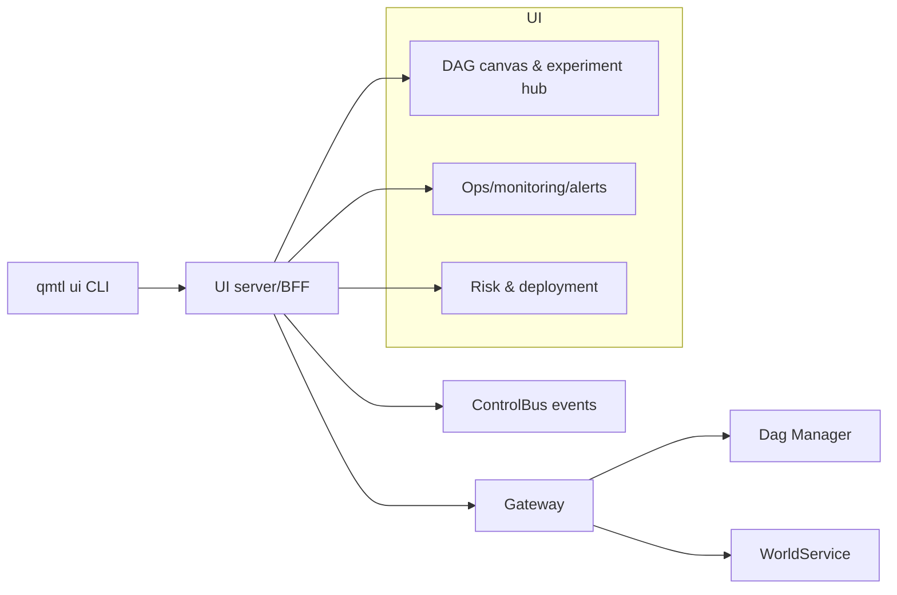

# QMTL UI Design

!!! warning "Icebox (Reference-only)"
    This document lives under `docs/en/design/icebox/` and is **not an active work item/SSOT**. Use it for background/reference only; promote adopted parts into `docs/en/architecture/` or code/tests.

!!! warning "Status: draft"
    This is a draft. Details may change before implementation or formal decisions land.

## 0. Goals and Scope

- Define a UI layer that visualizes and operates the existing Gateway, DAG Manager, and WorldService paths. No new backend; add a thin UI/CLI skin on top of current components.
- Reuse the same configs/secrets (e.g., `config-cli`, environment variables) and start the UI via `qmtl ui` CLI for local/staging.
- Keep the flows consistent with [`architecture/architecture.md`](../../architecture/architecture.md), [`architecture/gateway.md`](../../architecture/gateway.md), and [`architecture/dag-manager.md`](../../architecture/dag-manager.md). Target users: strategy authors, runner/deployment owners, SRE/risk teams.

## 1. User journeys and feature pillars

- Strategy canvas & DAG builder: compose data sources → feature extraction (qmtl utils) → simulation/execution pipelines with versioning.
- Project/portfolio view: per-strategy state, recent runs, performance metrics (return, MDD, Sharpe, slippage, etc.), asset/exchange distribution.
- Experiment/backtest hub: parameter sweeps, A/B comparison, notes and artifacts (logs, result files), one-click reproduce.
- Governance & distillation (draft): use integrity/execution realism/overfitting controls/risk budgeting signals to auto-suggest promotion/demotion/templating for strategies and nodes, and close the loop with explicit human approvals (overrides).
- Runbook & scheduler: cron/event runs, retry/timeout policies, live DAG state stream (pending/running/succeeded/failed).
- Data sources & connections: exchange/API key health, rate-limit/quota dashboard, health checks and key-expiry alerts.
- Monitoring/alerts: metrics/order events/latency/error-rate alerts (email/webhook/Slack), rule-based risk guards (position/exposure/slippage caps).
- Risk & capital: real-time positions/orders/PnL, VaR/worst-case scenarios, drawdown alerts, stop-loss/trailing-stop policies.
- Deployment pipeline: staging→prod promotion, change summary (diff), rollback/roll-forward, environment variable/secret scope management.
- Auditability & collaboration: execution logs, input parameters, code/node versions, user action history; RBAC, share links, comments/approvals.
- Templates & examples: gallery of common strategy/node templates, quickstart wizard, inline diagrams sourced from `docs/en/architecture/`.
- Performance/cost visibility: per-run resource usage, cost estimates, cache/reuse hit rate, anomaly detection for resource spikes.

## 2. UI/CLI architecture overview

- UI server acts as a thin BFF that reads Gateway HTTP/gRPC endpoints and ControlBus events, handling normalization and auth mapping only.
- Run/deploy/schedule requests delegate to DAG Manager, WorldService, and Runner paths; the UI aggregates state and log streams for presentation.
- `qmtl ui` CLI shares the same config files and offers separate dev/hot-reload and production modes.



## 3. CLI entrypoints (`qmtl ui`)

- `qmtl ui init`: create a UI profile, wire Gateway/ControlBus endpoints and tokens, generate a local `.env.ui` stub.
- `qmtl ui up`: run the UI server in production mode (build static assets and serve), print host/port.
- `qmtl ui dev`: run in dev mode (hot reload, proxy to Gateway/ControlBus).
- `qmtl ui status`: show running UI processes/ports/target environment and health summaries.
- `qmtl ui open`: open the current profile URL in a browser (non-headless assumption).
- `qmtl ui stop`: stop the local UI process.
- `qmtl ui export --project <id>`: export a static report for a strategy/experiment (options: metrics only / include logs).
- All commands honor shared flags `--profile`, `--config`, `--env-file` to stay aligned with Runner/Backend configuration.

## 4. Screen modules and wiring rules

- Canvas & DAG builder: reuse node templates, input/output schema, and DAG Manager state/run IDs to guarantee reproducibility.
- Experiment/backtest hub: cache run parameters, TagQuery, and metric artifacts; re-run locks the same parameters/node versions.
- Runbook/scheduler: surface DAG Manager scheduling API with retry/SLA/timeout templates.
- Monitoring/alerts: subscribe to ControlBus events and Gateway diagnostics to stream state changes.
- Deploy/rollback: diff env-specific secrets/configs and gate execution behind approvals.

## 5. Data and metadata to collect

- Strategy/experiment meta: run IDs, NodeSet/Template versions, input parameters, presets/worlds used, log fingerprints.
- Risk/positions: periodic snapshots of positions, order history, slippage/rate-limit events from WorldService/Execution Nodes.
- Observability: latency, error rate, cache hit rate, and cost estimates aggregated and cached in the UI server (ControlBus-driven).
- Validation/integrity (draft): accounting invariants (daily/trades/strategy PnL sums), execution/friction profile (fees/slippage/funding), search intensity/complexity (tries, parameter count), and overfitting controls (PBO/DSR/bootstrap success probabilities) with locked calculation inputs (run_manifest snapshots).

## 6. Operations and security

- AuthZ/AuthN: reuse Gateway auth; UI sessions rely on short-lived tokens plus RBAC-based view filtering.
- Audit log: emit UI actions (run/stop/promote/rollback/config change) to a dedicated stream (ControlBus or audit channel).
- Failure handling: if Gateway/DAG Manager/WorldService are degraded, the UI falls back to read-only mode and surfaces retry/alternate endpoints.

## 7. Governance & distillation (draft)

The goal is to close the loop in the UI: “strategy/node design → submit/run → metrics accumulate → automatic recommendations → approve/reject with recorded rationale”. Recommendations must **not bypass** World validation/policy; any activation/allocation changes still flow through WorldPolicy/Activation/Allocation.

Related docs (keep design/ops SSOT in each document):

- World validation layer: [world_validation_architecture.md](world_validation_architecture.md)
- MRM/governance: [model_risk_management_framework.md](model_risk_management_framework.md)
- Strategy/node distillation (icebox, reference-only): [strategy_distillation.md](strategy_distillation.md)
- Evaluation Store ops: [operations/evaluation_store.md](../../operations/evaluation_store.md)
- Determinism runbook (NodeID/TagQuery): [operations/determinism.md](../../operations/determinism.md)

### 7.1 Views the UI should expose (examples)

- **Integrity dashboard**
  - Fix an accounting SSOT (e.g., realized PnL/fees inclusion) and verify invariants per slice: `daily_*` sums == `trades_*` sums == `strategy_*` sums.
  - Elevate “fee/friction drops to zero”, missing discontinuities, and rounding/precision anomalies into first-class warnings.
- **Execution realism & stress**
  - Manage fee (maker/taker), slippage (spread/impact/volatility function), and (when applicable) funding assumptions as profiles and lock them per run (run_manifest).
  - Show slippage stress results (e.g., +1/+2/+5 bps) to quickly decide whether performance is “edge” or “friction”.
- **Validation rigor (overfitting controls)**
  - Surface DSR/PSR, (optional) CSCV-based PBO, fold dispersion/sign flips, and search_intensity on one screen and wire them into promotion gates.
  - Export “committee-style” reports via block bootstrap success probabilities (e.g., `P(total_pnl>0)`, `P(max_dd<x)`).
- **Risk shell library**
  - Provide composable templates that separate alpha (direction/entry rationale) from risk (exposure/kill-switch/budgeting) and execution (order/fill assumptions).
  - Make one-axis experiments easy (e.g., max_open_positions/cluster caps/vol targeting) to isolate “alpha vs risk structure” when scaling fails in high-vol regimes.
- **Distillation board**
  - Aggregate reuse/stability/contribution (e.g., ablation uplift, cohort-level robustness) at the DAG node/feature/gate level and auto-recommend “blessed nodes/templates”.
  - Track approve/reject/defer decisions with rationale; on approval, propagate into template galleries/WorldPolicy with human-readable change logs.

```mermaid
flowchart TD
  Submit[Submit/Run] --> Eval[EvaluationRun & Metrics]
  Eval --> Store[Evaluation Store]
  Store --> Distiller[Distiller (strategy/node)]
  Distiller --> UI[QMTL UI]
  UI --> Decision[Approve/Reject/Override]
  Decision --> Policy[WorldPolicy / Templates]
  Policy --> Activation[Activation/Allocation]
```

## 8. Out of scope and follow-ups

- Mobile UX, multi-tenancy, and external identity federation stay out of scope for this draft.
- Expand build/deploy pipeline, performance budgets, and accessibility checklist in dedicated follow-up docs.
