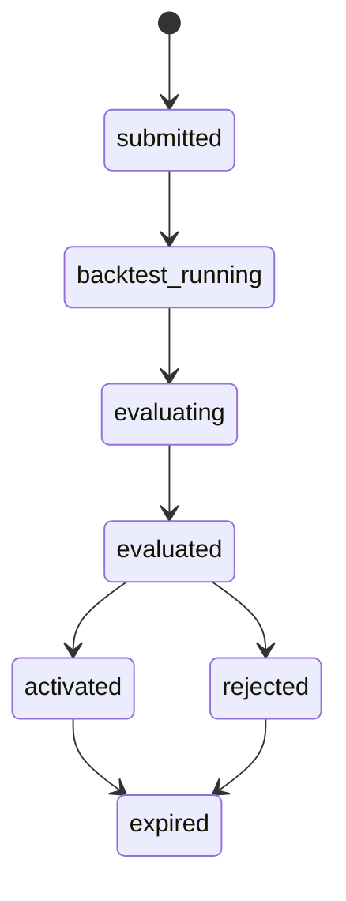
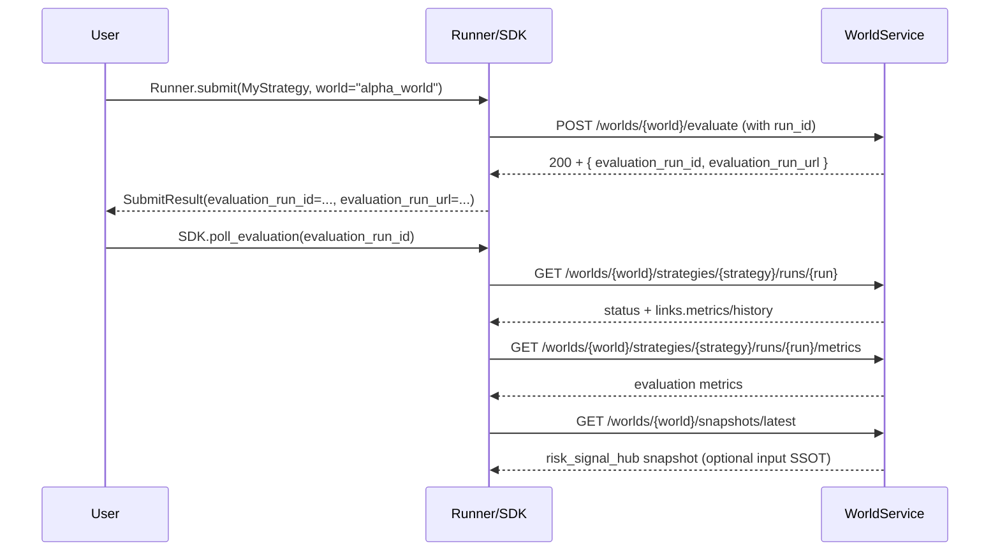

# WorldService Evaluation Runs & Metrics API Sketch

!!! warning "Icebox (Reference-only)"
    This document lives under `docs/en/design/icebox/` and is **not an active work item/SSOT**. Use it for background/reference only; promote adopted parts into `docs/en/architecture/` or code/tests.

## 0. Motivation & Context

This document captures an initial design sketch for:

- letting WorldService **consume and expose PnL/metrics in a consistent, world-centric way** for gating,
- exposing **strategy lifecycle state** within a world (e.g., “backtest running”, “evaluated”, “activated”), and
- providing APIs to **fetch snapshots/metrics** once evaluation is complete,

from the perspective of the Core Loop and the external feedback in [hyophyop/qmtl#1750](https://github.com/hyophyop/qmtl/issues/1750).

Related docs:

- [Architecture](../../architecture/architecture.md), [WorldService](../../architecture/worldservice.md)
- [auto_returns unified design (Korean source)](../../../ko/archive/auto_returns_unified_design.md)
- Core Loop decisions: [architecture.md](../../architecture/architecture.md#core-loop-summary)

All API shapes and schemas here are **draft-level**. They are meant to drive discussion; any implementation must be reconciled with existing worldservice/gateway/SDK contracts.

!!! note "Assumed responsibility split (where computations live)"
    - Strategy-level history replay, returns/metric computation, and (optionally) account-level PnL simulation are assumed to run in **Runner/SDK/ValidationPipeline**, not inside WorldService.
    - The APIs in this document treat WorldService as the component that **accepts already-computed metrics/PnL, applies world policies, and stores/exposes evaluation results and snapshots**.  
      (Rebuilding a full backtest/PnL engine inside WS is explicitly *out of scope* for this sketch.)

## 1. As‑Is / To‑Be Summary

### 1.1 As‑Is

- PnL/metrics:
  - ValidationPipeline and Runner compute returns and metrics today, but many projects reimplement their own returns→PnL→snapshot helpers.
  - WorldService can embed some metrics in its evaluation responses, but there is no explicit **“evaluation run” model + metrics API** yet.
- Strategy lifecycle:
  - `Runner.submit` orchestrates history warm-up, backtest, validation, and WS evaluate/apply, but
  - there is no explicit API or model to ask “where is this submission in the world lifecycle right now?”.
- Snapshots:
  - Each project invents its own `.qmtl_snapshots/*.json` format and logging utilities.

### 1.2 To‑Be (idea-level)

- WorldService introduces **Evaluation Runs** as a first-class concept:
  - Key: `(world_id, strategy_id, evaluation_run_id)`  
    (Here, `evaluation_run_id` lives in a **separate namespace** from any existing rebalancing/allocation run IDs.)
  - States: `submitted / backtest_running / evaluating / evaluated / activated / rejected / expired ...`
- Once an evaluation run completes:
  - WS stores a **standardised metric bundle** (returns/PnL summary, risk/performance metrics, gating reasons) and
  - exposes a **metrics/snapshot API** to retrieve it.
- Runner/CLI/tools:
  - receive an `evaluation_run_id` (or URL) from `Runner.submit`,
  - use a **status API** to see “where this run is in the lifecycle”, then
  - call the **snapshot API** to materialise metrics into JSON files when ready.
- Local PnL helpers:
  - become an **offline/preview** path that follows the same contract as WS metrics, rather than re-defining PnL semantics per project.

## 2. Strategy Lifecycle & Evaluation Run Model

### 2.1 Evaluation Run Concept

- Identifiers:
  - `world_id`: world ID
  - `strategy_id`: strategy ID (or `(strategy_id, version)` pair)
  - `run_id`: identifier for a specific submission/evaluation cycle

Evaluation run states are organised along two axes:
- **Computation scope:** per-strategy (replay/metric computation) vs world-level (policy/gating).
- **Time:** in-flight (running) vs fixed (evaluated and beyond).

- States (draft):
   - `submitted`: evaluation run registered by Runner/Gateway
   - `backtest_running`: history warm-up + replay backtest, **computing per-strategy returns/metrics**.
   - `evaluating`: metrics for this run are already available, and the WorldService policy engine is  
     **applying world-level rules (threshold/top-k/correlation/hysteresis, cross-strategy comparisons) to decide activation/weights/violations**.
   - `evaluated`: both metric computation and policy evaluation have completed and the **world-level decision + metrics snapshot** for this run is fixed.
   - `activated`: world activation/weights derived from this run have been applied and are reflected in execution/gating.
   - `rejected`: the run has been evaluated but not activated due to policy violations or insufficient contribution.
   - `expired`: the run has been superseded by newer runs or TTL and remains only as historical reference.

In table form:

| State              | Scope         | Description |
|--------------------|--------------|-------------|
| `submitted`        | shared       | Run has been created but not yet executed |
| `backtest_running` | **strategy** | History replay and per-strategy returns/metrics are being computed |
| `evaluating`       | **world**    | WS policy engine is turning metrics into activation/weights/violations (threshold/top-k/correlation/hysteresis, cross-strategy view) |
| `evaluated`        | world        | World-level decision + metrics snapshot for this run are fixed |
| `activated`        | world        | Decisions have been applied to the world’s activation/weights and affect execution/gating |
| `rejected`         | world        | Run did not satisfy activation criteria and was discarded |
| `expired`          | shared       | Run is no longer a live candidate (superseded/TTL) and remains only as historical context |

State transitions (sketch):



!!! note "`backtest_running` / `evaluating` usage guidance"
    - In this definition, `backtest_running` covers **strategy-level history replay and returns/metric computation**,  
      while `evaluating` covers the **world-level policy application** that turns those metrics into activation/weights/violations.
    - In the current v2 implementation these phases form a **single synchronous pipeline**, but the state model itself distinguishes strategy-level and world-level concerns.
    - When world-level evaluation (e.g., cross-world correlation/risk) becomes asynchronous or significantly more expensive, services can introduce a `phase: backtest | evaluate` sub-field and surface `evaluating` explicitly where it adds value.

!!! note "Evaluation run immutability and re-evaluation"
    - Once an `evaluation_run_id` reaches `evaluated`, the associated metrics/gating result should be treated as **immutable**; updates are append-only in terms of history/audit.
    - To re-evaluate a strategy under different conditions or at a later time, create a **new evaluation run with a new `evaluation_run_id`** instead of overwriting the old run.
    - Activation/weights derived from an evaluation run may change over time (e.g., via apply/allocation flows), but the evaluation snapshot for a given `evaluation_run_id` is expected to remain stable.

### 2.2 Relation to Runner.submit (conceptual)

- When `Runner.submit(MyStrategy, world="alpha_world")` is called:
  - Gateway/WS create or enqueue an evaluation run `(world_id, strategy_id, run_id)`.
  - `SubmitResult` may expose at least:
    - `world_id`
    - `strategy_id`
    - `evaluation_run_id` (or `evaluation_run_url`)
    - optionally, a `snapshot_url` for when metrics are ready.

## 3. API Flow Sketch

This section outlines REST-style endpoints for evaluation run status, metrics, and snapshot retrieval. Names and schemas are **illustrative** and must be reconciled with worldservice/gateway specs.

### 3.1 Evaluation Run Status API (draft)

- Purpose: answer “where is this submission in the world lifecycle?”.

- Example endpoint:

```http
GET /worlds/{world_id}/strategies/{strategy_id}/runs/{run_id}
```

- Response (close to current implementation):

```json
{
  "world_id": "alpha_world",
  "strategy_id": "beta_mkt_simple",
  "run_id": "2025-12-02T10:00:00Z-uuid",
  "status": "evaluated",
  "stage": "paper",
  "risk_tier": "low",
  "created_at": "2025-12-02T10:00:01Z",
  "updated_at": "2025-12-02T10:05:30Z",
  "links": {
    "metrics": "/worlds/alpha_world/strategies/beta_mkt_simple/runs/2025-.../metrics",
    "history": "/worlds/alpha_world/strategies/beta_mkt_simple/runs/2025-.../history"
  }
}
```

- Runner/CLI:
  - `SubmitResult.evaluation_run_url` points here, so tools can see status and discover metrics/snapshot URLs.
  - CLI may provide `qmtl world run-status --world alpha_world --strategy beta_mkt_simple --run latest`.

### 3.2 Metrics API (current implementation)

- Purpose: fetch the **world-level evaluation metrics that WS owns and serves as a canonical contract**.
  - In an initial implementation, Runner/ValidationPipeline compute metrics/PnL and pass them to WS, which then uses them as the basis for policy evaluation and storage.
  - Over time WS may compute or augment some metrics itself, but this endpoint remains the **SSOT for “world evaluation metrics”**.

- Example endpoint:

```http
GET /worlds/{world_id}/strategies/{strategy_id}/runs/{run_id}/metrics
```

- Response (summary; actual metrics fields follow the `EvaluationMetrics` schema):

```json
{
  "world_id": "alpha_world",
  "strategy_id": "beta_mkt_simple",
  "run_id": "2025-12-02T10:00:00Z-uuid",
  "status": "evaluated",
  "stage": "paper",
  "risk_tier": "low",
  "metrics": {
    "returns": { "sharpe": 1.8, "max_drawdown": -0.12 },
    "sample": { "effective_history_years": 0.5, "n_trades_total": 120 },
    "risk": { "adv_utilization_p95": 0.2, "participation_rate_p95": 0.15 }
  },
  "validation": { "policy_version": "1", "ruleset_hash": "blake3:..." },
  "summary": { "status": "pass", "recommended_stage": "paper_ok_live_candidate" },
  "links": {
    "metrics": "/worlds/alpha_world/strategies/beta_mkt_simple/runs/2025-.../metrics",
    "history": "/worlds/alpha_world/strategies/beta_mkt_simple/runs/2025-.../history"
  }
}
```

This shape can serve as the **canonical “world evaluation metrics snapshot”** format.

!!! note "Call timing and error semantics"
    - When calling `GET /runs/{run_id}/metrics`:
      - If the specified `evaluation_run_id` does not exist, the service SHOULD return `404 Not Found`.
      - If the run exists but is not yet in `evaluated` status, return `409 Conflict` with a machine-readable code like `detail.code=E_RUN_NOT_EVALUATED`.
    - Clients are expected to first query `/runs/{run_id}` for status and only call the metrics endpoint once `status=evaluated`.

### 3.3 Snapshot API (draft)

Purpose: separately from “evaluation run metrics”, manage `risk_signal_hub` snapshots as the **input SSOT** (portfolio/risk/coverage).  
In the current codebase, `/worlds/{world_id}/snapshots/*` refers to **Risk Signal Hub snapshots (world-scoped)**.

- Example endpoints (current implementation):

```http
POST /worlds/{world_id}/snapshots
GET  /worlds/{world_id}/snapshots/latest
GET  /worlds/{world_id}/snapshots/lookup?version=...&as_of=...
GET  /worlds/{world_id}/snapshots?limit=10
```

!!! note "Evaluation metrics vs Risk Hub snapshots"
    - `/runs/{run_id}/metrics` is the SSOT for strategy evaluation results (returns/sample/risk).
    - `/worlds/{world_id}/snapshots/*` is the SSOT for input/observation snapshots (`risk_signal_hub`).

!!! note "Relationship to existing `/worlds/{id}/evaluate` API"
    - In an initial rollout, `/worlds/{world_id}/strategies/{strategy_id}/runs/{run_id}/metrics` is expected to wrap the existing `/worlds/{world_id}/evaluate` behaviour (or the same policy engine) and expose the **same evaluation outcome in a normalised schema**.
    - Over time the `/runs/*` family can become the primary “submit strategy → create evaluation run → fetch evaluation result” surface, while `/evaluate` is narrowed to compatibility/batch use cases or a lower-level entry point to the same engine.

## 4. SDK/CLI Flow (draft)

The following sequence diagram sketches how Runner/CLI might use these APIs:



Possible CLI surface (idea-level):

- `qmtl submit strategies.beta_factory.beta_mkt_simple:Strategy --world alpha_world`
- `qmtl world run-status alpha_world --strategy beta_mkt_simple --run latest --metrics`

## 5. Relationship to Local PnL Helpers

Even with WS/gateway-based evaluation, **pure local development** (no WS/gateway running) still benefits from PnL helpers. In that mode:

- A helper like `qmtl.sdk.pnl.simulate_long_account_from_returns(...)`:
  - should follow the same contract and semantics as WS metrics as closely as possible, and
  - act as a **preview/offline** approximation rather than redefining PnL per project.
- Runner/ValidationPipeline:
  - can use auto_returns + local PnL helpers for fast feedback,
  - but docs should clearly state that **WorldService remains the official source of truth** for policy decisions and gating.

This document is intentionally exploratory. Before implementing any of it, we must:

- align it with existing worldservice schemas (DecisionEnvelope/ActivationEnvelope/EvalKey),
- integrate it cleanly with commit-log/ControlBus patterns, and
- design a backward-compatible rollout strategy.
