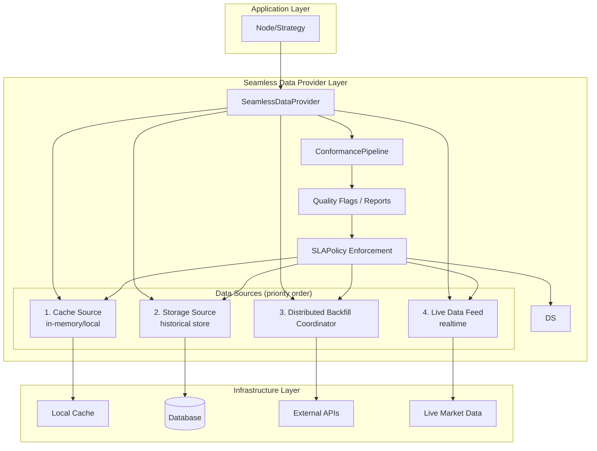

# QMTL Seamless Data Provider - Design Document

## Overview

The **Seamless Data Provider v2** architecture combines auto backfill with a
Conformance Pipeline, a Distributed Backfill Coordinator, SLA enforcement, and
Schema Registry governance. It extends `HistoryProvider`, `EventRecorder`, and
`DataFetcher` so strategies experience data as if it were always available while
ensuring the supplied data meets current schemas and service objectives.

## Design Goals

1. **Transparency**: Callers request data without worrying about source or availability.
2. **Auto backfill**: Automatically fetch and materialize missing ranges.
3. **Seamless transition**: Smooth handoff between historical and live data.
4. **Conformance guarantees**: Visualize and block on schema/temporal rollups and reports.
5. **Strategic flexibility**: Multiple data-availability strategies supported.
6. **Backward compatibility**: Keep existing code working intact.

## Architecture Overview



## Core Components

### 1. ConformancePipeline (component)
Consists of `SchemaRollupStage`, `TemporalRollupStage`, and
`RegressionReportStage`. Each stage blocks by default on violations or can be
relaxed with `partial_ok=True`. As of the 2025.09 release,
`EnhancedQuestDBProvider` injects a `ConformancePipeline` by default and raises
`ConformancePipelineError` on warnings/flags. With `partial_ok=True`, the same
report is accessible via `SeamlessDataProvider.last_conformance_report` while the
response proceeds. Reports are uploaded under
`qmtl://observability/seamless/<node>` for dashboards and audits.

### 2. SLAPolicy (configuration)
Defines latency/freshness limits. The provider tracks stage timings and coverage
for each request and publishes a `seamless_sla_deadline_seconds` histogram plus
traces. Violations raise `SeamlessSLAExceeded` and alert via `seamless-*` rules
in `alert_rules.yml`.

### 3. DistributedBackfillCoordinator (service)
Replaces the previous in‑memory stub with a Raft‑backed coordinator that
manages ordered leases, detects stale claims, tracks partial completion, and
exports `backfill_completion_ratio`. Manual intervention is supported via
`scripts/lease_recover.py`.

### 4. DataAvailabilityStrategy (enum)
Controls how missing data is handled:

- **FAIL_FAST**: raise immediately when data is unavailable
- **AUTO_BACKFILL**: fetch and materialize missing ranges before returning
- **PARTIAL_FILL**: return available data now, backfill in the background
- **SEAMLESS**: combine all sources for transparent access

### 5. DataSource (protocol)
Common interface implemented by all sources:

```python
class DataSource(Protocol):
    priority: DataSourcePriority
    
    async def is_available(...) -> bool
    async def fetch(...) -> pd.DataFrame
    async def coverage(...) -> list[tuple[int, int]]
```

### 6. AutoBackfiller (protocol)
Interface for automatic backfill:

```python
class AutoBackfiller(Protocol):
    async def can_backfill(...) -> bool
    async def backfill(...) -> pd.DataFrame
    async def backfill_async(...) -> AsyncIterator[pd.DataFrame]
```

### 7. SeamlessDataProvider (abstract base)
Implements core logic:

- Run conformance stages and block on failure
- Orchestrate multiple data sources
- Priority‑based data retrieval
- SLA budget accounting and metrics
- Auto backfill triggers
- Range merge and gap detection

## Implementation Details

### Retrieval Algorithm

1. **Probe sources in priority order**:
   - Cache (fastest)
   - Storage (fast)
   - Backfill (slower)
   - Live (variable latency)

2. **Split and merge ranges**:
   - Partition the request window by what each source can serve
   - Merge results chronologically
   - Deduplicate and enforce consistency

3. **Auto backfill trigger**:
   - Detect missing spans
   - Check backfill eligibility
   - Execute sync/async backfilling
   - Materialize results to the target store

### Range Management Algorithm

```python
def _merge_ranges(ranges: list[tuple[int, int]]) -> list[tuple[int, int]]:
    """Merge overlapping ranges"""
    
def _find_missing_ranges(start, end, available_ranges) -> list[tuple[int, int]]:
    """Find and return missing ranges"""
    
def _intersect_ranges(ranges1, ranges2) -> list[tuple[int, int]]:
    """Intersection of two range lists"""
    
def _subtract_ranges(from_ranges, subtract_ranges) -> list[tuple[int, int]]:
    """Subtract ranges from another list of ranges"""
```

In practice, use the SDK utilities for interval‑aware merges and gap detection:

- `qmtl.runtime.sdk.history_coverage.merge_coverage()`
- `qmtl.runtime.sdk.history_coverage.compute_missing_ranges()`

These ensure bar alignment and adjacent interval merging behave consistently.

## Integration with Existing Systems

### 1. Extending HistoryProvider
Upgrade `QuestDBLoader` to `EnhancedQuestDBProvider`:

```python
class EnhancedQuestDBProvider(SeamlessDataProvider):
    def __init__(self, dsn, *, fetcher=None, live_fetcher=None, **kwargs):
        # Use existing QuestDBLoader as the storage_source
        # Wrap DataFetcher as an AutoBackfiller
        # Optionally support live_fetcher
```

### 2. StreamInput Integration
Fully compatible with `StreamInput` nodes:

```python
stream_input = StreamInput(
    history_provider=EnhancedQuestDBProvider(...)  # no changes to existing node code
)
```

### 3. Gradual Migration
```python
# Existing code
provider = QuestDBLoader(dsn, fetcher=my_fetcher)
await provider.fill_missing(...)  # manual backfill
data = await provider.fetch(...)

# New code
provider = EnhancedQuestDBProvider(dsn, fetcher=my_fetcher)
data = await provider.fetch(...)  # auto backfill
```

## Performance and Scalability Considerations

### 1. Caching
- L1: in‑memory (NodeCache)
- L2: local store (SQLite)
- L3: central store (Postgres/QuestDB)

### 2. Background processing
- Async backfill jobs with progress callbacks
- Chunked processing for memory efficiency
- Single‑flight to prevent duplicate range execution
- Lifecycle management: cleanup registry on completion/failure

### 3. Concurrency control
- Prevent duplicate backfills
- Track active jobs
- Graceful cancellation and cleanup

### 4. Error handling
- Isolate failures by source
- Fallback chains
- Allow partial failure where appropriate

## Strategy Selection by Use Case

| Use case        | Strategy       | Notes                              |
|-----------------|----------------|------------------------------------|
| Realtime trading| PARTIAL_FILL   | Fast response; backfill in background |
| Backtesting     | AUTO_BACKFILL  | Guarantees complete windows        |
| Exploratory     | SEAMLESS       | Flexible data access               |
| Critical systems| FAIL_FAST      | Predictable behavior               |

## Extension Points

### 1. Custom backfiller
When bespoke business logic is required:
```python
class CustomBackfiller:
    async def can_backfill(...):
        # Check market hours, data licensing, etc.
    
    async def backfill(...):
        # Perform specialized API calls, transforms, etc.
```

### 2. Adaptive caching
Adjust caching policies based on usage patterns:
```python
class AdaptiveCacheSource:
    def __init__(self, usage_analytics):
        # Adjust caching strategy based on usage analytics
```

### 3. Data quality guardrails
```python
class QualityAwareBackfiller:
    async def backfill(...):
        data = await self.fetch_raw_data(...)
        validated_data = await self.validate_quality(data)
        return validated_data
```

## Monitoring and Observability

### 1. Metrics
- Backfill success/failure rate
- Latency by data source
- Cache hit ratio
- Background queue depth
- Recommended SDK metrics: `backfill_jobs_in_progress`, `backfill_last_timestamp`,
  `backfill_retry_total`, `backfill_failure_total`

## Implementation Reinforcements (Summary)

- Background backfill: single‑flight `asyncio` tasks with cleanup on completion.
- Range/gap math: use `history_coverage` helpers for interval alignment and
  adjacent merges.
- Storage‑first materialization: prefer `fill_missing` then `fetch` to avoid
  double fetching.
- Live polling cadence: remove millisecond conversion errors and sleep precisely
  to bar boundaries.

### 2. Logging
- Structured logs (JSON)
- Traceable request IDs
- Performance profiling data

### 3. Alerts
- Backfill failure notifications
- Data quality violations
- Performance threshold breaches

## Testing Strategy

### 1. Unit tests
- Each DataSource implementation
- Range management algorithms
- Strategy‑specific behaviors

### 2. Integration tests
- Real database connectivity
- External API mocking
- Concurrency scenarios

### 3. Performance tests
- Large backfills
- Concurrent request loads
- Memory profiling

## Deployment and Operations

### 1. Gradual rollout
1. Ship new interfaces (no impact to existing callers)
2. Replace optional components
3. Complete migration

### 2. Configuration management
```yaml
seamless_data_provider:
  strategy: "seamless"
  enable_background_backfill: true
  backfill_config:
    mode: "background"
    single_flight_ttl_ms: 60000
    distributed_lease_ttl_ms: 120000
    window_bars: 900
    max_concurrent_requests: 8
    max_attempts: 6
    retry_backoff_ms: 500
    jitter_ratio: 0.25
  cache_ttl: 3600
```

`jitter_ratio` is expressed as a percentage of the exponentially increasing
retry delay. A value of `0.25` means each retry waits for the deterministic
backoff plus a random component sampled between 0 and 25% of that delay,
ensuring concurrent workers do not stampede the upstream API.

### 3. Incident response
- Automatic fallback mechanisms
- Manual backfill triggers
- Data conformance verification tools

## Conclusion

The Seamless Data Provider simplifies data access while providing strong
scalability and flexibility. It supports gradual migration, remains compatible
with existing systems, and offers strategies suitable for a wide range of use
cases.

Key benefits:
- **Developer experience**: focus on business logic without availability concerns
- **Operational efficiency**: automated backfill and data management
- **System resilience**: multi‑source fallback and fault isolation
- **Performance**: intelligent caching and priority‑based access

This design extends QMTL's core values—reuse and efficiency—into the data plane,
raising overall system completeness.
