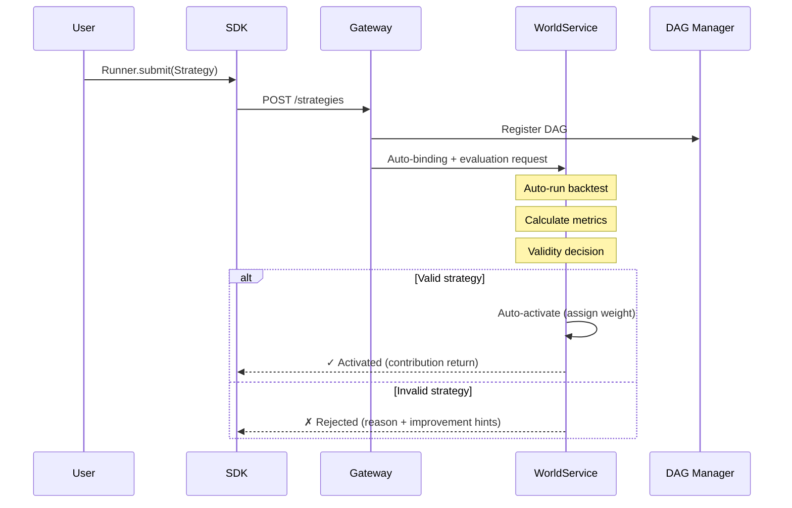

# QMTL Simplification Proposal

!!! success "Implementation Complete"
    The core content of this proposal has been implemented in **QMTL v2.0**.
    
    - ✅ Phase 1: `Runner.submit()` API unification complete
    - ✅ Phase 2: `Mode` enum integration (`backtest | paper | live`)
    - ✅ Phase 3: CLI flattening and legacy hiding
    - ✅ All examples and documentation updated to v2 API

## 2025 Q4 Updates

- `Runner.submit`/`ValidationPipeline` now fetch WS policies/presets for validation and include a monotonic-return guard.
- CLI v2 `status`/`world` talks to Gateway to persist and describe policy presets when creating worlds.

## 1. Revisiting Original Design Goals

QMTL's core objectives:
1. **Simplify strategy composition via DAG** - Users only write strategy logic
2. **System handles optimization/management** - Computation reuse, scheduling, resource management
3. **Automatic validation and deployment** - Submit strategy → WorldService evaluates → Auto-deploy if valid
4. **Automatic return increase** - World's returns grow with each valid strategy submission

**Ideal user experience:**
```
Write strategy → Submit → (System handles evaluation/deployment) → Check return contribution
```

**Minimum concepts users must understand (≤3):**
- **Strategy**: Return-generating logic implemented as a set of DAG nodes
- **World**: A single portfolio context where strategies run together
- **Mode**: One of `backtest | paper | live` execution modes

## 2. Areas That Have Become Complex

### 2.1 Identified Complexity Areas

| Area | Current State | Complexity Cause | Simplification Direction |
|------|--------------|------------------|-------------------------|
| **ExecutionDomain Mapping** | 4-level mapping (effective_mode → execution_domain) | Translation layers between WS/Gateway/SDK | Unify |
| **2-Phase Apply** | Freeze→Switch→Unfreeze + ACK | Prioritized live transition stability | Automate |
| **Compute Context** | 10+ fields (as_of, dataset_fingerprint, etc.) | Reproducibility/audit requirements | Default settings |
| **World Binding/WSB** | Manual strategy-world binding management | Multi-world support | Auto-binding |
| **Gating Policy YAML** | 40+ lines configuration | Cover all edge cases | Provide presets |
| **CLI Structure** | 4-level depth (qmtl → service → sdk → run) | Module separation | Flatten |
| **ValidationCache/EvalKey** | blake3 hash chain | Cache invalidation accuracy | Transparent |

### 2.2 User Pain Points


**Current Strategy Submission Flow (too many steps):**
1. Write Strategy class ✓ (Simple)
2. Configure qmtl.yml ✗ (Complex - service DSNs, ports, etc.)
3. Create/select World ✗ (New concept to learn)
4. Configure Policy ✗ (40+ lines YAML)
5. Parameters for submission call ✗ (world_id, gateway_url, etc.)
6. Interpret results ✗ (Understand effective_mode, execution_domain)

## 3. Simplification Proposals

### 3.1 [P0] Zero-Config Strategy Submission

**Goal:** Single line `Runner.submit(MyStrategy)` for strategy submission and return contribution

```python
# After: Proposed
Runner.submit(MyStrategy)  # Auto-submit to default world
# or
Runner.submit(MyStrategy, world="prod")  # Specify world
```

**Implementation approach:**
- Auto-create default world (`__default__`)
- Environment variable-based Gateway URL discovery (`QMTL_GATEWAY_URL`)
- Policies auto-applied at world-level defaults

### 3.2 [P0] Automatic Validation Pipeline

**Goal:** Submit and system automatically evaluates, activating valid strategies



**Key changes:**
- Remove manual `evaluate → apply` calls
- Auto-execute backtest (using history data)
- Auto-verify statistical significance
- Auto-check correlation with existing strategies

### 3.3 [P1] Simplified Policy Presets

**Before: Current complex Gating Policy**
```yaml
gating_policy:
  promotion_point: "2025-10-01T00:00:00Z"
  apply: { mode: two_phase, freeze_timeout_ms: 30000 }
  domains: { from: backtest, to: live }
  clocks:
    backtest: { type: virtual, epoch0: "2020-01-01T00:00:00Z" }
    live: { type: wall }
  dataset_fingerprint: "ohlcv:ASOF=2025-09-30T23:59:59Z"
  share_policy: "feature-artifacts-only"
  snapshot:
    strategy_plane: "cow"
    feature_plane: "readonly"
  risk_limits:
    max_pos_usd_long: 500000
    max_pos_usd_short: 500000
  # ... 40+ lines
```

**After: Preset-based**
```yaml
# Entire world config
world:
  name: "my_world"
  policy: conservative  # preset: conservative | moderate | aggressive
  
  # Optional: only specify overrides
  overrides:
    risk_limits.max_pos_usd: 100000
```

**Preset definitions:**
| Preset | Description | Key Settings |
|--------|-------------|--------------|
| `sandbox` | Testing/development | Live disabled, no limits |
| `conservative` | Conservative operation | Low positions, long hysteresis |
| `moderate` | Balanced operation | Medium settings |
| `aggressive` | Aggressive operation | High positions, short hysteresis |

### 3.4 [P1] CLI Flattening

**Before:**
```bash
qmtl service sdk run MyStrategy --world-id demo --gateway-url http://gw
qmtl tools sdk --help
qmtl project init --path my_project --preset minimal
```

**After:**
```bash
qmtl submit my_strategy.py            # Submit strategy (main use case)
qmtl status                           # Check my strategies status
qmtl world list                       # List worlds
qmtl init my_project                  # Initialize project
```

**Command priority:**
1. `submit` - Strategy submission (core)
2. `status` - Status check
3. `world` - World management
4. `init` - Project creation

### 3.5 [P1] Transparent Return Feedback

**Goal:** Immediately check contribution after strategy submission

```python
result = Runner.submit(MyStrategy)

print(result)
# StrategySubmitResult(
#     strategy_id="mom_btc_1h_v3",
#     status="active",
#     world="__default__",
#     contribution=0.023,  # 2.3% contribution to world returns
#     weight=0.15,         # Portfolio weight
#     rank=7,              # Rank within world
#     metrics={
#         "sharpe": 1.85,
#         "max_drawdown": -0.12,
#         "correlation_avg": 0.23,
#     }
# )
```

### 3.6 [P2] ExecutionDomain Unification

**Before: Complex mapping**
```
effective_mode (WS) → execution_domain (Gateway) → behavior (SDK)
- validate → backtest → orders OFF
- compute-only → backtest → orders OFF  
- paper → dryrun → simulated orders
- live → live → real orders
```

**After: Single concept**
```
mode: backtest | paper | live
```

- `backtest`: Historical data simulation (used for auto-evaluation)
- `paper`: Real-time data, simulated orders
- `live`: Real-time data, real orders

Internally maintain existing mapping, but expose only 3 modes at user interface.

### 3.7 [P2] WorldService Policy for Monotonic World Return

**Goal:** Make the ideal of “world returns grow whenever a valid strategy is submitted” as true as possible at the WorldService policy level

- **Validity definition:** `valid` strategies are those that improve **risk-adjusted returns of the world portfolio**, not just “pass a backtest”  
  - Example: `ΔSharpe > 0` & max drawdown/volatility constraints satisfied & correlation with existing strategies below a cap
- **Auto-activation and weighting:** Once marked `valid`, a strategy is auto-activated by WS with a default portfolio optimization rule, without operator intervention  
  - Example default: risk-parity with per-strategy weight cap and world-level risk budget
- **Auto monitoring and down-weighting:** If live performance degrades below baseline, WS automatically reduces weight or deactivates the strategy  
  - Use the same metrics (Sharpe, drawdown, correlation) for both promotion and demotion to fully automate the lifecycle
- **User-facing contract:** Users only care about “submit strategy → if `valid`, it contributes to the world”;  
  they do not need to inspect or control internal ExecutionDomain, 2‑Phase Apply, or Activation state directly.

## 4. Core Principle: Simplicity > Backward Compatibility

!!! danger "Breaking Change Principle"
    **Do not keep legacy for backward compatibility.**
    
    Maintaining legacy API/config alongside new ones causes:
    - Documentation doubles ("old way" vs "new way")
    - Branches accumulate in codebase
    - New users confused about "which way is correct"
    - Simplification goal itself becomes nullified
    
    **Losing simplicity is more fatal than breaking backward compatibility.**

### Migration Strategy

Legacy APIs are **maintained with deprecation warnings**, and documentation/examples are unified to v2 patterns:

**Manual Migration Guide:**
- `Runner.run(world_id=, gateway_url=)` → `Runner.submit(world=)`
- `Runner.offline()` → `Runner.submit(mode=Mode.BACKTEST)`
- `qmtl service sdk run` → `qmtl submit`
- `execution_domain` parameter → `mode`

> **Note:** Automatic migration tools are not provided due to code corruption risks.
> Manually replace patterns and test your code.

## 5. Implementation Priority

!!! success "Implementation Status"
    All phases have been completed as of QMTL v2.0.
    
    - **Phase 1**: ✅ Complete - Clean Slate (Runner.submit, CLI v2, Policy Presets)
    - **Phase 2**: ✅ Complete - Automation Pipeline (Validation, Feedback)
    - **Phase 3**: ✅ Complete - Internal Cleanup (Mode unification, Codebase slimming)

### Phase 1: Clean Slate (1-2 weeks) ✅ COMPLETED

1. **Unify to `Runner.submit()` API**
   - Completely remove `Runner.run()`
   - Single entry point: `Runner.submit(MyStrategy)`
   - Auto-discover default world/Gateway
   
2. **Complete CLI Redesign**
   - Remove entire legacy multi-level structure
   - Keep only 4 commands: `qmtl submit`, `qmtl status`, `qmtl world`, `qmtl init`

3. **Policy Preset System**
   - Remove legacy gating_policy YAML schema
   - Support only 4 presets + simple overrides

### Phase 2: Automation Pipeline (2-4 weeks) ✅ COMPLETED

4. **Automatic Validation Pipeline**
   - Auto-trigger backtest on submission
   - Auto-calculate performance metrics
   - Threshold-based auto-activation

5. **Return Feedback System**
   - Define `StrategySubmitResult` schema
   - Real-time contribution calculation logic

### Phase 3: Internal Cleanup (4-6 weeks) ✅ COMPLETED

6. **ExecutionDomain Unification**
   - Internal 4-level mapping → Single `mode` concept
   - Complete cleanup of related code/docs

7. **Codebase Slimming**
   - Delete all legacy compatibility branch code
   - Clean up test cases (remove legacy tests)

## 6. Removal Targets (Breaking Changes)

### APIs/Concepts Being Completely Removed

| Removal Target | Replacement | Migration |
|----------------|-------------|------------|
| `Runner.run(world_id=, gateway_url=)` | `Runner.submit(world=)` | Auto-convert |
| `Runner.offline()` | `Runner.submit(mode="backtest")` | Auto-convert |
| `qmtl service sdk run` | `qmtl submit` | CLI auto-detect |
| `qmtl tools sdk` | Removed (consolidated) | - |
| `qmtl project init` | `qmtl init` | CLI auto-detect |
| `execution_domain` parameter | `mode` | Auto-convert |
| `effective_mode` exposure | Internal only | - |
| Complex gating_policy YAML | Preset-based | Auto-convert |
| 2-Phase Apply manual calls | Automated (internal) | - |
| WSB manual binding | Auto-binding | - |

### Why Immediate Removal Instead of Deprecation?

```
With a deprecation cycle:
1. v2.0: Add new API + warn on old API
2. v2.1~2.x: Both APIs coexist (doc confusion, code branches)
3. v3.0: Remove old API

→ Complexity actually INCREASES for at least 1 year
→ Meanwhile "new users" ironically learn the legacy way
```

**Immediate removal + migration tool** is better:
- Single clear transition point
- All docs/examples use one approach
- No confusion for new users

## 7. Success Metrics

| Metric | Current | Target |
|--------|---------|--------|
| Time to first strategy submission | ~30 min | <5 min |
| Config file lines | 40+ | <10 |
| Required concepts to learn | 8 | 3 |
| CLI command depth | 4 | 2 |
| Legacy compatibility code lines | ~2000 | 0 |
| API entry points | 5+ | 1 (`Runner.submit`) |

## 8. Conclusion

QMTL's core value is "Focus only on strategy logic and the system handles optimization and returns."
The current implementation added many layers for stability and scalability, but this has
diluted the core value.

### Key Decision: Abandon Backward Compatibility

> **"If maintaining backward compatibility undermines the value of simplification,
> abandoning backward compatibility is the right choice."**

This proposal:
- **Immediately removes** legacy APIs
- Does NOT go through a deprecation cycle
- Supports existing users' transition with a migration tool
- Unifies all documentation and examples to a single approach

### Expected Outcomes

1. **New users**: First strategy submission in 5 minutes, learn single approach without confusion
2. **Existing users**: One-time migration then enjoy simpler interface
3. **Maintenance**: 50%+ codebase reduction by removing legacy branch code

```
Current: Write strategy → Config → World → Policy → Binding → Submit → Evaluate → Verify
Proposed: Write strategy → Submit → (Auto) → Check contribution
```

### Version Strategy

This change releases as **QMTL v2.0**:
- v1.x: Current complex structure (maintenance mode)
- v2.0: Simplified structure (Legacy APIs deprecated)
