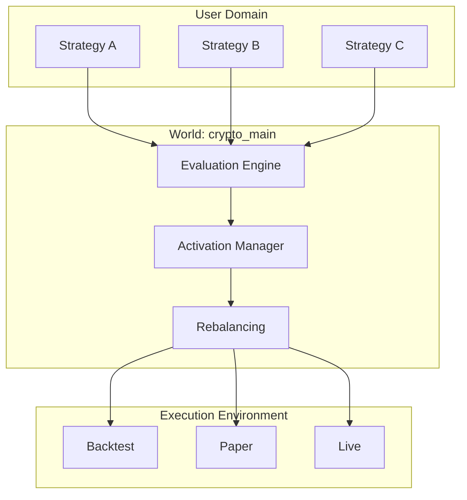

# Core Concepts

You only need to know **3 concepts** to use QMTL.

## 1. Strategy

A **Strategy** is logic that receives market data and generates trading signals.

```python
from qmtl.sdk import Strategy, StreamInput, Node

class MyStrategy(Strategy):
    def setup(self):
        # 1. Declare required data
        price = StreamInput(tags=["BTC", "price"], interval="1m", period=30)
        
        # 2. Signal generation logic
        def generate_signal(view):
            closes = view.as_frame(price)["close"]
            return {"signal": 1 if closes.pct_change().mean() > 0 else 0}
        
        signal = Node(input=price, compute_fn=generate_signal)
        self.add_nodes([price, signal])
```

**What users write:**
- What data is needed (StreamInput)
- What to compute with the data (compute_fn)

**What the system handles:**
- Data collection and delivery
- Caching and optimization
- Reusing identical computations

---

## 2. World

A **World** is the portfolio context where strategies operate together.

```
┌─────────────────────────────────────────┐
│              World: "crypto_main"       │
│                                         │
│   ┌─────────┐  ┌─────────┐  ┌─────────┐│
│   │Strategy │  │Strategy │  │Strategy ││
│   │   A     │  │   B     │  │   C     ││
│   │ (25%)   │  │ (45%)   │  │ (30%)   ││
│   └─────────┘  └─────────┘  └─────────┘│
│                                         │
│   Total Capital: $100,000               │
│   World Sharpe: 1.85                    │
└─────────────────────────────────────────┘
```

**What a World does:**
- Evaluate and rank strategy performance
- Activate only valid strategies
- Auto-allocate capital (based on performance/correlation)
- Risk management (exposure limits, etc.)

**User perspective:**
- Specify `world="crypto_main"` when submitting
- Check overall world performance and your strategy's contribution

**How to pick a world:**
- Specify `world=` when submitting; worlds should exist beforehand.
- Set a default via `QMTL_DEFAULT_WORLD` or project config for convenience.

---

## 3. Mode

**Mode** represents the execution environment for a strategy.

| Mode | Description | Order Execution |
|------|-------------|-----------------|
| `backtest` | Simulation with historical data | ❌ |
| `paper` | Real-time data, virtual orders | Simulated |
| `live` | Real-time data, real orders | ✅ |

```python
# Backtest (default)
Runner.submit(MyStrategy, world="demo", mode=Mode.BACKTEST)

# Paper trading
Runner.submit(MyStrategy, world="demo", mode=Mode.PAPER)

# Live trading (requires policy approval)
Runner.submit(MyStrategy, world="demo", mode=Mode.LIVE)
```

**Safety Design:**
- Default is always `backtest` (no accidental live trading)
- `live` activates only after passing world policy validation
- Auto-demotion to `backtest` if performance falls below threshold

!!! warning "Mode Transitions are System-Decided"
    Even if a user requests `mode=Mode.LIVE`, if world policy criteria 
    (Sharpe threshold, minimum trading days, etc.) aren't met, the system 
    automatically demotes to `backtest`.
    
    This is the core of "the system handles it."

---

## Concept Relationship Diagram



---

## Other Useful Concepts

### Data (StreamInput)

Data is specified by **tags**. The system handles actual data source connections.

```python
# Specify data by tags — system connects to appropriate sources
btc_price = StreamInput(tags=["BTC", "price", "binance"], interval="1m", period=60)
eth_price = StreamInput(tags=["ETH", "price", "binance"], interval="1m", period=60)
```

**Data supply today:**
- Worlds with `data.presets[]` auto-wire Seamless providers into `StreamInput` when you submit with that world.
- If a world lacks presets, configure the provider manually or add presets to the world definition.
- Dataset fingerprints and backfill/cache are handled by the data plane once the preset is known.

### Performance Metrics

Key metrics received in submission result:

| Metric | Description |
|--------|-------------|
| `sharpe` | Risk-adjusted return (higher is better) |
| `max_drawdown` | Maximum drawdown (lower is better) |
| `win_rate` | Win rate |
| `contribution` | Contribution to world returns |
| `weight` | Capital allocation ratio in world |
| `rank` | Rank within world |

---

## Next Steps

If you understand the concepts → Try building a strategy in [Quickstart](quickstart.md).
