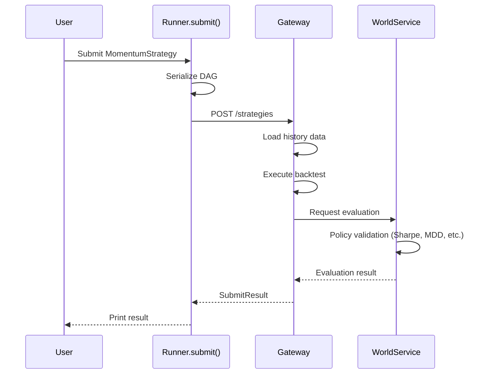

# Quickstart

Follow this guide to write and submit your first strategy **in 10 minutes**.

## Prerequisites

- Python 3.11+
- QMTL installed (`pip install qmtl` or `uv pip install -e .[dev]`)

## Step 1: Write a Strategy (3 min)

Create a file `my_strategy.py`:

```python
from qmtl.sdk import Strategy, StreamInput, Node, Runner
import polars as pl

class MomentumStrategy(Strategy):
    """Simple momentum strategy: buy signal if recent returns are positive"""
    
    def setup(self):
        # 1-minute candle price data, need last 30
        price = StreamInput(
            tags=["BTC", "price"],
            interval="1m",
            period=30
        )
        
        def compute_signal(view) -> pl.DataFrame:
            # Get close price data
            frame = view.as_frame(price, columns=["close"]).frame
            
            # Calculate 5-minute momentum
            momentum = frame.get_column("close").pct_change().rolling_mean(window_size=5)
            
            # Buy (1) if momentum > 0, else hold (0)
            signal = (momentum > 0).cast(pl.Int64)
            
            return pl.DataFrame({"signal": signal})
        
        signal_node = Node(
            input=price,
            compute_fn=compute_signal,
            name="momentum_signal"
        )
        
        self.add_nodes([price, signal_node])


if __name__ == "__main__":
    # Submit strategy
    result = Runner.submit(
        MomentumStrategy,
        world="quickstart_demo",
    )
    print(result)
```

## Step 2: Run the Strategy (1 min)

```bash
python my_strategy.py
```

## Step 3: Check Results (1 min)

On success, you'll receive results like:

```python
{
  "strategy_id": "momentum_btc_1m_abc123",
  "status": "valid",              # valid | invalid | pending | rejected
  "world": "quickstart_demo",
  "downgraded": false,            # True if forced into safe compute-only
  "downgrade_reason": null,       # e.g., "missing_as_of" when backtest inputs are incomplete
  "safe_mode": false,
  "ws": {                         # WorldService is the SSOT for decisions/activations
    "decision": { "world_id": "quickstart_demo", "effective_mode": "validate", "etag": "..." },
    "activation": { "strategy_id": "momentum_btc_1m_abc123", "weight": 0.10, "active": true },
    "metrics": { "sharpe": 1.45, "max_drawdown": -0.08, "win_rate": 0.55, "profit_factor": 1.32 },
    "threshold_violations": [],
    "rejection_reason": null
  },
  "precheck": {                   # Local ValidationPipeline reference only
    "status": "passed",
    "violations": [],
    "metrics": { "sharpe": 1.4, "max_drawdown": -0.09 }
  }
}
```

The CLI can emit the same WS/Precheck-separated JSON with:

```bash
qmtl submit strategies.momentum:MomentumStrategy --world quickstart_demo --output json
```

---

## Understanding: What Happened?



**What the system automatically did:**
1. Converted strategy code to DAG (computation graph)
2. Auto-loaded required history data
3. Executed backtest (market situation replay)
4. Calculated performance metrics
5. Validated against world policy criteria
6. Generated improvement hints

---

## Next Step Guides

### A. Making a Valid Strategy

Improve strategy based on `improvement_hints`:

```python
# Use longer data period
price = StreamInput(
    tags=["BTC", "price"],
    interval="1m",
    period=60  # Increased 30 → 60
)

# More sophisticated signal logic
def compute_signal(view):
    frame = view.as_frame(price, columns=["close", "volume"]).frame
    
    # Price momentum
    price_mom = frame.get_column("close").pct_change().rolling_mean(window_size=10)
    
    # Volume confirmation (only when volume increasing)
    vol_increase = frame.get_column("volume").pct_change() > 0
    
    # Buy only when both conditions met
    signal = ((price_mom > 0) & vol_increase).cast(pl.Int64)
    
    return pl.DataFrame({"signal": signal})
```

### B. Paper/Live are World-governed

After you submit, WorldService may run additional campaigns (paper/live) based on world policy and governance. There is no client-side `mode` flag.

- Inspect the world and campaign status: `qmtl world status quickstart_demo`
- Inspect live candidates (operator): `qmtl world live-candidates quickstart_demo`

### C. Performance Monitoring

- Check status via CLI: `qmtl status --world quickstart_demo` or `qmtl world info quickstart_demo`
- A public subscription helper is planned; until then, poll via CLI/REST for live monitoring.

---

## Using the CLI

### Submit Strategy

```bash
# Submit file directly
qmtl submit my_strategy.py --world quickstart_demo
```

### Check Status

```bash
# Query world status
qmtl world info quickstart_demo

# Check my strategy status
qmtl status --strategy momentum_btc_1m_abc123
```

Tip: set `QMTL_DEFAULT_WORLD` or project defaults to avoid repeating `--world`, and configure `QMTL_GATEWAY_URL` if the gateway isn’t local.

---

## Common Troubleshooting

### "No returns produced" Error

```
Error: No returns produced. Cannot validate strategy.
```

**Cause:** Strategy doesn't generate returns data

**Solution:** 
```python
# Include returns column in compute_fn
def compute_signal(view):
    frame = view.as_frame(price, columns=["close"]).frame
    returns = frame.get_column("close").pct_change()
    signal = (returns.rolling_mean(window_size=5) > 0).cast(pl.Int64)
    return pl.DataFrame({
        "signal": signal,
        "returns": returns  # This column is required
    })
```

If explicit returns are hard to add, enable `auto_returns=True` in `Runner.submit(...)` to derive them from price/equity data.

### Gateway Connection Failed

```
Error: Cannot connect to Gateway at http://localhost:8000
```

**Solution:**
```bash
# Start Gateway server
qmtl gateway

# Or verify in another terminal
curl http://localhost:8000/health
```

### No Data Error

```
Error: No data available for tags=['BTC', 'price']
```

**Solution:** Verify data source for those tags is configured

```bash
# Query available data tags
qmtl data list-tags
```

---

## Next Steps

- Learn strategy improvement cycle → [User Workflow](workflow.md)
- Write more complex strategies → [SDK Tutorial](../guides/sdk_tutorial.md)
- Understand architecture → [Architecture Overview](../architecture/README.md)
