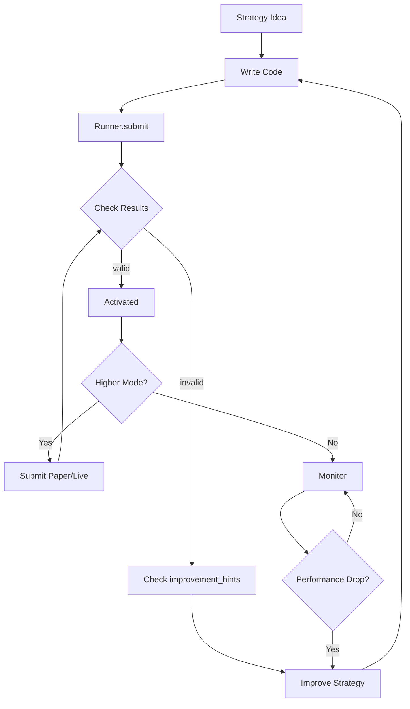

# User Workflow

The core cycle for QMTL users is **Develop → Evaluate → Improve**.

```
┌──────────────────────────────────────────────────────────────────┐
│                        Core User Cycle                           │
│                                                                  │
│    ┌─────────┐      ┌──────────┐      ┌─────────┐              │
│    │1. Develop│ ───▶ │2. Evaluate│ ───▶ │3. Improve│             │
│    │         │      │          │      │         │              │
│    │ Write   │      │ Submit → │      │ Apply   │              │
│    │ Strategy│      │ Results  │      │ Hints   │              │
│    └─────────┘      └──────────┘      └────┬────┘              │
│         ▲                                   │                   │
│         └───────────────────────────────────┘                   │
│                                                                  │
│    Repeat this cycle to accumulate good strategies in the world │
│    and gradually increase returns                                │
└──────────────────────────────────────────────────────────────────┘
```

---

## Step 1: Strategy Development

### From Idea to Code

```python
from qmtl.sdk import Strategy, StreamInput, Node
import pandas as pd

class MyStrategy(Strategy):
    """
    Strategy idea:
    - Buy when short-term MA crosses above long-term MA
    - Sell when it crosses below
    """
    
    def setup(self):
        price = StreamInput(
            tags=["BTC", "price"],
            interval="5m",
            period=100  # Need 100 candles for MA calculation
        )
        
        def compute_signal(view):
            df = view.as_frame(price, columns=["close"])
            
            ma_short = df["close"].rolling(10).mean()
            ma_long = df["close"].rolling(50).mean()
            
            # Golden cross: 1, Death cross: -1, Other: 0
            signal = pd.Series(0, index=df.index)
            signal[ma_short > ma_long] = 1
            signal[ma_short < ma_long] = -1
            
            returns = df["close"].pct_change()
            
            return pd.DataFrame({
                "signal": signal,
                "returns": returns
            })
        
        signal_node = Node(
            input=price,
            compute_fn=compute_signal,
            name="ma_crossover"
        )
        
        self.add_nodes([price, signal_node])
```

### Development Considerations

| Item | Recommendation |
|------|----------------|
| Data period | `period` = minimum needed + 20% buffer |
| Compute function | Write as pure function (no external state) |
| Signal values | `-1` (sell), `0` (hold), `1` (buy) |
| returns | Required (needed for evaluation) |

---

## Step 2: Submission and Evaluation

### Submit Strategy

```python
from qmtl.sdk import Runner, Mode

result = Runner.submit(
    MyStrategy,
    world="my_portfolio",
    mode=Mode.BACKTEST
)
```

### Interpret Results

```python
print(f"Status: {result.status}")  # valid, invalid, pending
print(f"Sharpe: {result.metrics['sharpe']}")
print(f"MDD: {result.metrics['max_drawdown']}")
print(f"Win rate: {result.metrics['win_rate']}")

# Position in world (if activated)
if result.status == "valid":
    print(f"Contribution: {result.contribution}")
    print(f"Weight: {result.weight}")
    print(f"Rank: {result.rank}")
```

### Status Meanings

| Status | Meaning | Next Action |
|--------|---------|-------------|
| `valid` | Meets policy criteria, pending/complete activation | Try next mode (paper/live) |
| `invalid` | Below policy criteria | Improve based on `improvement_hints` |
| `pending` | Evaluation in progress | Re-query shortly |

---

## Step 3: Improvement

### Using improvement_hints

```python
result = Runner.submit(MyStrategy, world="demo")

for hint in result.improvement_hints:
    print(f"💡 {hint}")
```

Example hints:

```
💡 Sharpe Ratio is 1.2. Paper mode promotion available at 1.5 or higher.
💡 Maximum drawdown is -15%. Recommend improving to within -10%.
💡 Correlation with existing strategies is 0.85. Below 0.7 provides better diversification.
💡 Backtest period is 14 days. Minimum 30 days recommended.
```

### Improvement Strategies

| Hint Type | Improvement Direction |
|-----------|----------------------|
| Low Sharpe | Improve signal accuracy, add noise filters |
| High MDD | Add stop-loss logic, adjust position sizing |
| High correlation | Use different markets/timeframes/logic |
| Short period | Increase `period`, longer backtest |

### Iterative Improvement Example

```python
# Version 1: Basic
class MyStrategy_v1(Strategy):
    def setup(self):
        price = StreamInput(tags=["BTC", "price"], interval="5m", period=100)
        # ... basic logic

# Version 2: Improve MDD - Add stop-loss
class MyStrategy_v2(Strategy):
    def setup(self):
        price = StreamInput(tags=["BTC", "price"], interval="5m", period=100)
        
        def compute_signal(view):
            df = view.as_frame(price, columns=["close"])
            # ... existing logic
            
            # Stop-loss: Close position on 5%+ decline
            drawdown = (df["close"] / df["close"].cummax() - 1)
            signal[drawdown < -0.05] = 0  # Stop-loss
            
            return pd.DataFrame({"signal": signal, "returns": returns})

# Version 3: Diversification - Add other assets
class MyStrategy_v3(Strategy):
    def setup(self):
        btc = StreamInput(tags=["BTC", "price"], interval="5m", period=100)
        eth = StreamInput(tags=["ETH", "price"], interval="5m", period=100)
        # ... multi-asset logic
```

---

## Complete Flow Diagram



---

## Advanced: Multi-Strategy Management

### Submit Multiple Strategies to World

```python
strategies = [
    MomentumStrategy,
    MeanReversionStrategy,
    BreakoutStrategy,
]

for strategy_cls in strategies:
    result = Runner.submit(strategy_cls, world="my_portfolio")
    print(f"{strategy_cls.__name__}: {result.status}")
```

### Considering Inter-Strategy Correlation

Worlds automatically calculate correlations between strategies:

```python
result = Runner.submit(NewStrategy, world="my_portfolio")

# Correlation with existing strategies
print(result.metrics.get("correlation_with_portfolio"))
# Output: 0.45 (lower = better diversification)
```

!!! tip "Maximizing Diversification"
    - Different timeframes (1m vs 1h)
    - Different assets (BTC vs ETH vs stocks)
    - Different strategy types (momentum vs mean reversion)
    
    Combining such strategies can make the world's overall Sharpe higher than individual strategies.

---

## Workflow Automation

```
User focus:
1. Write strategy code
2. Call Runner.submit(world=..., mode=...)
3. Read results and improvement_hints
4. Improve and resubmit as needed
```

- Mode transitions are governed by world policies. Submit with the mode you want (`backtest`/`paper`/`live`); WorldService will gate/activate or downgrade to safe compute-only if criteria are not met.
- Demotion on performance/policy breaches is automatic; promotion to higher modes still requires a submission with that mode.
- Notifications/streams: ControlBus streams exist for SDK internals; user-facing subscribe helpers are not yet stable—poll via CLI/REST for now.

---

## Monitoring

- Use CLI: `qmtl status --world <id>` or `qmtl world info <id>` to check activation/allocations.
- REST/SDK: fetch SubmitResult JSON or world endpoints for dashboards/automation.
- Streaming: ControlBus streams are available for internal SDK components; a public subscription helper will be added later. Until then, poll CLI/REST for world/strategy status.

---

## Summary: What Users Should Focus On

| Focus On | Don't Focus On (System Handles) |
|----------|--------------------------------|
| Strategy ideas | Data collection/storage |
| Signal logic writing | Backtest execution |
| Hint-based improvement | Performance metric calculation |
| | Policy validation |
| | Capital allocation |
| | Risk management |

---

## Next Steps

- Advanced node usage → [SDK Tutorial](../guides/sdk_tutorial.md)
- Understanding world policies → [World Documentation](../world/world.md)
