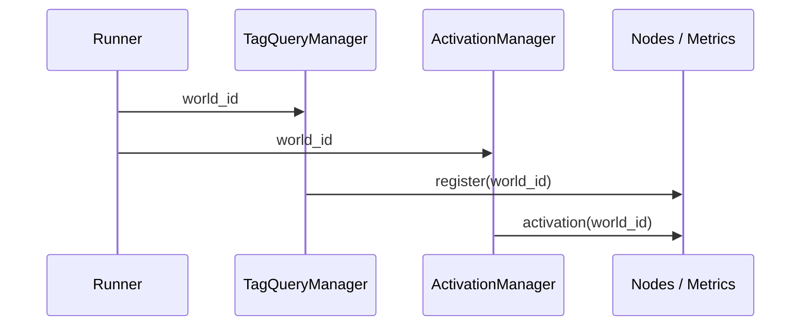

{{ nav_links() }}

# Learning Path Overview

1. [MVP Strategy Example]({{ code_url('qmtl/examples/templates/single_indicator.py') }})  
   Run `qmtl project init --path mvp --strategy single_indicator --with-sample-data`, then  
   `uv run python strategy.py` followed by `uv run qmtl report run.log`.
2. [Strategy Template Library](../reference/templates.md)
3. [Architecture Deep Dive](../architecture/architecture.md)

# SDK Usage Guide

This guide walks through the core workflow for implementing and running
strategies with the QMTL SDK. For deeper architectural context and comprehensive
examples, refer to [architecture.md](../architecture/architecture.md) and the
`qmtl/examples/` directory.

## Installation

```bash
uv venv
uv pip install -e .[dev]
```

Install extra IO modules as needed:

```bash
uv pip install -e .[io]
```

## Core Structure

Implement a strategy by subclassing `Strategy` and overriding `setup()`. Nodes are
divided into **source nodes** such as `StreamInput` or `TagQueryNode`, and
**processing nodes** that consume upstream nodes. A `ProcessingNode` must declare
at least one upstream dependency. Intervals may be specified as integers or
strings with units (`"1h"`, `"30m"`, `"45s"`). `period` must always be a positive
integer indicating the number of bars.

`TagQueryNode` itself does not issue network calls. The `TagQueryManager` created
by the Runner communicates with the Gateway to keep queue mappings current. After
nodes are registered, calling `TagQueryManager.resolve_tags()` loads the initial
queue set. `TagQueryManager.start()` obtains the event descriptor and token from
the Gateway during the WebSocket handshake; subsequent updates stream through the
established connection. Control matching via the `match_mode` option defaults to
`MatchMode.ANY` (string `"any"` is also accepted). Use `MatchMode.ALL` or `"all"`
when every tag must match.

### WebSocketClient

`WebSocketClient` subscribes to Gateway events in real time:

```python
client = WebSocketClient(
    "ws://localhost:8000",
    token="<JWT>",
    on_message=my_handler,
)
```

- `url`: Gateway WebSocket endpoint
- `token`: JWT returned by `/events/subscribe`
- `on_message`: async callback handling incoming messages

Call `start()` to begin receiving messages and `stop()` to close the connection.
`TagQueryManager` either creates or receives an instance of this client and
registers `handle_message()` as the callback. Because the manager forwards the
event descriptor and token automatically, custom clients must also accept the
`token` argument. When queue updates (`queue_update`) or sentinel weight
notifications arrive, the manager calls `update_queues()` for the corresponding
`TagQueryNode`. Sentinel weights are stored on `WebSocketClient.sentinel_weights`.

### Gateway Event Subscription

Gateway surfaces WebSocket events through `/events/subscribe`. The underlying
activation and queue updates originate from the internal ControlBus; Gateway
relays them to SDK consumers. WorldService remains the authority for policy and
activation decisions.

`ProcessingNode.input` accepts a single node or a list of nodes. Dictionary inputs
are no longer supported.

### Node vs. ProcessingNode

`Node` is the base class for all nodes and imposes no constraints. `ProcessingNode`
enforces the requirement that at least one upstream node is supplied, helping
developers catch configuration issues earlier. When implementing new computation
logic, inherit from `ProcessingNode` unless a standalone `Node` is sufficient.

```python
from qmtl.runtime.sdk import Strategy, ProcessingNode, StreamInput

class MyStrategy(Strategy):
    def setup(self):
        price = StreamInput(interval="1m", period=30)

        def compute(view):
            return view

        out = ProcessingNode(input=price, compute_fn=compute, name="out")
        self.add_nodes([price, out])
```

## Running Strategies (World-Driven)

Execution is governed by world decisions served by WorldService. Runner exposes a
single entry point:

- `Runner.run(MyStrategy, world_id="...", gateway_url="http://gw")`  
  Respects WorldService decisions and activations. Order gates toggle based on
  activation state and default to compute-only (orders OFF) when decisions are
  missing or expired.
- `Runner.offline(MyStrategy)`  
  Runs locally without the Gateway. Tag-based nodes start with empty queues.

```python
from qmtl.runtime.sdk import Runner

# World-driven execution
Runner.run(MyStrategy, world_id="my_world", gateway_url="http://gw")

# Offline execution
Runner.offline(MyStrategy)
```

After each `TagQueryNode` is registered, Runner automatically queries the Gateway
to fetch matching queues and, during `TagQueryManager.start()`, exchanges the
event descriptor and token required for WebSocket subscriptions. The manager
stores the result internally; callers do not need to persist it. Policy
evaluations remain the responsibility of WorldService-SDK simply adapts behavior
based on the received decisions and activations.

### Backtest and Dry Run Requirements

Clock snapshots (`as_of`, `dataset_fingerprint`) are enforced server side by
WorldService/Gateway. The SDK does not choose the execution domain or clock; it
always follows world decisions.

- If backtest/dry-run metadata is missing, Gateway/WorldService reject the request
  or downgrade it to compute-only (orders OFF).
- When decisions or activations are stale or absent, SDK stays in compute-only mode.

Use `Runner.offline(MyStrategy)` for deterministic local reproduction. Tag-based
nodes keep empty queues, and you can manually hydrate caches or feature artifacts
to mirror production data.

### World ID Propagation

`world_id` flows from Runner into `TagQueryManager` and `ActivationManager`, which
inject the identifier into node registrations and metric labels so that queues and
observability remain world-scoped.



```python
from qmtl.runtime.sdk import Strategy, StreamInput, Runner

class WorldStrategy(Strategy):
    def setup(self):
        price = StreamInput(tags=["BTC", "price"], interval="1m", period=30)
        self.add_nodes([price])

# world_id is propagated automatically to node registration and metric labels
Runner.run(WorldStrategy, world_id="demo_world", gateway_url="http://gw")
```

### ExecutionDomain Mapping

- WorldService emits `effective_mode` (`validate|compute-only|paper|live`).
- Gateway and SDK map this value to `execution_domain`.
- Mapping rules: `validate -> backtest (orders OFF)`, `compute-only -> backtest`,
  `paper -> dryrun`, `live -> live`. `shadow` is reserved for operators.
- Example: [`dryrun_live_switch_strategy.py`]({{ code_url('qmtl/examples/strategies/dryrun_live_switch_strategy.py') }})
  switches domains via `connectors.execution_domain`. Legacy `trade_mode=paper`
  automatically translates to `dryrun`.
- `Runner.offline` applies the same gating as the `backtest` domain. If
  WorldService sends `effective_mode="validate"`, the SDK maps it to `backtest`
  and blocks orders.

## CLI Helpers

`qmtl tools sdk run` requires `--world-id`:

```bash
qmtl tools sdk run strategies.my:MyStrategy --world-id demo_world --gateway-url http://gw
```

Environment variables work as well:

```bash
export WORLD_ID=demo_world
qmtl tools sdk run strategies.my:MyStrategy --world-id $WORLD_ID --gateway-url http://gw
```

Example of reading values from a config file:

```yaml
# config.yml
world_id: demo_world
gateway_url: http://gw
```

```bash
WORLD_ID=$(yq '.world_id' config.yml)
GATEWAY_URL=$(yq '.gateway_url' config.yml)
qmtl tools sdk run strategies.my:MyStrategy --world-id $WORLD_ID --gateway-url $GATEWAY_URL
```

List all options:

```bash
qmtl tools sdk --help
```

`qmtl tools sdk run` also accepts clock and dataset metadata:

```bash
qmtl tools sdk run strategies.my:MyStrategy \
  --world-id demo_world \
  --gateway-url http://gw \
  --mode backtest \
  --clock virtual \
  --as-of 2025-09-30T23:59:59Z \
  --dataset-fingerprint lake:blake3:ohlcv:20250930
```

`--mode live` only permits `--clock wall`. Invalid combinations fail immediately.
Omitting `--as-of` or `--dataset-fingerprint` for backtests or dry runs causes
Runner to block Gateway calls and remain in compute-only mode, preventing mixed
datasets from reaching live queues.

## Cache Access

`compute_fn` receives the read-only `CacheView` returned by `NodeCache.view()`.
`NodeCache.snapshot()` is now used internally and should not be invoked by
strategy code.

Enable the PyArrow-backed cache with `cache.arrow_cache_enabled: true`. Expired
slices are purged every `cache.cache_evict_interval` seconds. If Ray is available
and `--no-ray` is not supplied, eviction runs in a Ray actor; otherwise it runs in
a background thread.

## Cache Backends

The default `NodeCache` manages ring buffers per `(upstream_id, interval)` pair.
Use `missing_flags()` to inspect missing timestamps and `last_timestamps()` to
read the tail bucket. `get_slice()` returns window data as either a list or
`xarray.DataArray`.

When `cache.arrow_cache_enabled: true` is set and PyArrow is installed,
`NodeCacheArrow` becomes active and applies the same eviction schedule. Cache
consumption metrics such as `cache_read_total` and `cache_last_read_timestamp` are
published through `qmtl.runtime.sdk.metrics`. Start a metrics server to expose the
values under `/metrics`:

```python
from qmtl.runtime.sdk import metrics

metrics.start_metrics_server(port=8000)
```

## Performance Metrics

`alpha_performance_node` computes statistics such as Sharpe, max drawdown, and
CAR/MDD. The resulting metrics are emitted under the `alpha_performance.<metric>`
namespace (for example, `alpha_performance.sharpe` or
`alpha_performance.max_drawdown`) so they stay aligned with the `alpha_metrics`
envelope that WorldService publishes. Unknown keys are ignored to keep the parser
compatible with future additions.
Pair it with `alpha_history_node` to decouple return accumulation and
performance calculation for easier testing.

```python
from qmtl.runtime.transforms import alpha_history_node, alpha_performance_from_history_node

history = alpha_history_node(alpha, window=30)
perf = alpha_performance_from_history_node(history)
```

## Custom Alpha Indicators with History

`alpha_indicator_with_history` wraps a function that returns `{"alpha": value}`
and automatically maintains a sliding window of recent alpha values:

```python
from qmtl.runtime.indicators import alpha_indicator_with_history

history = alpha_indicator_with_history(my_alpha_fn, inputs=[src], window=30)
```

## Alpha to Signal Pipeline

`TradeSignalGeneratorNode` converts an alpha history into trade signals. Combine
it with `alpha_history_node` to generate orders from the latest alpha:

```python
from qmtl.runtime.transforms import TradeSignalGeneratorNode

history = alpha_history_node(alpha, window=30)
signal = TradeSignalGeneratorNode(
    history,
    long_threshold=0.5,
    short_threshold=-0.5,
)
```

## Execution Models and Cost-Adjusted Performance

`ExecutionModel` estimates realistic fills with commission, slippage, and market
impact. Supplying the resulting `ExecutionFill` list to
`alpha_performance_node` produces cost-aware metrics.

```python
from qmtl.runtime.sdk.execution_modeling import (
    ExecutionModel, OrderSide, OrderType, create_market_data_from_ohlcv,
)
from qmtl.runtime.transforms import TradeSignalGeneratorNode, alpha_history_node
from qmtl.runtime.transforms.alpha_performance import alpha_performance_node

history = alpha_history_node(alpha, window=30)
signal = TradeSignalGeneratorNode(history, long_threshold=0.5, short_threshold=-0.5)

model = ExecutionModel(commission_rate=0.0005, base_slippage_bps=2.0)
market = create_market_data_from_ohlcv(
    timestamp=0,
    open_price=100,
    high=101,
    low=99,
    close=100,
    volume=10_000,
)

fill = model.simulate_execution(
    order_id="demo",
    symbol="TEST",
    side=OrderSide.BUY,
    quantity=100,
    order_type=OrderType.MARKET,
    requested_price=100.0,
    market_data=market,
    timestamp=0,
)

metrics = alpha_performance_node(
    returns,
    execution_fills=[fill],
    use_realistic_costs=True,
)
```

## Timing Controls

Timing controls prevent unrealistic fills by enforcing market hours. The default
`TimingController` models US equities (pre-market 04:00, regular session 09:30-16:00,
after hours 20:00). Customize `MarketHours` for daylight savings or early-close
scenarios:

```python
from datetime import time
from qmtl.runtime.sdk.timing_controls import MarketHours, TimingController

hours = MarketHours(
    pre_market_start=time(4, 0),
    regular_start=time(9, 30),
    regular_end=time(13, 0),  # early close
    post_market_end=time(17, 0),
)
controller = TimingController(market_hours=hours, allow_pre_post_market=True)
```

Use `validate_backtest_timing(strategy)` to detect weekend or off-session fills
quickly. Enforce `require_regular_hours=True` to block fills outside the primary
session.

## Order Results and External Executors

`TradeOrderPublisherNode` converts trade signals into standardized order payloads.
Destinations are configured via `Runner` hooks; the node itself does not carry
topic information. If no destinations are configured the order is discarded,
letting strategies remain agnostic of downstream execution.

```python
from qmtl.runtime.transforms import (
    alpha_history_node,
    TradeSignalGeneratorNode,
    TradeOrderPublisherNode,
)

history = alpha_history_node(alpha, window=30)
signal = TradeSignalGeneratorNode(history, long_threshold=0.5, short_threshold=-0.5)
orders = TradeOrderPublisherNode(signal)

from qmtl.runtime.sdk import Runner, TradeExecutionService

service = TradeExecutionService("http://broker")
Runner.set_trade_execution_service(service)
Runner.set_trade_order_http_url("http://endpoint")
Runner.set_trade_order_kafka_topic("orders")
```

Reference implementation:
[`order_pipeline_strategy.py`](https://github.com/hyophyop/qmtl/blob/main/qmtl/examples/strategies/order_pipeline_strategy.py).

## Backfill Operations

For instructions on hydrating node caches with historical data, see
[backfill.md](../operations/backfill.md).

{{ nav_links() }}
