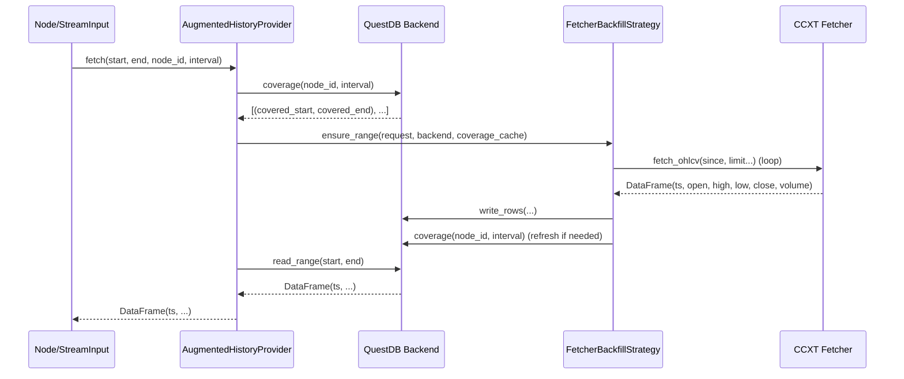

# CCXT x QuestDB (IO)

This guide explains how to combine a CCXT-based data fetcher with a QuestDB
backend to provide on-demand, auto-backfilled time series. The implementation
ships as part of the production package (`qmtl/runtime/io/`) and is suitable for
real deployments, not just examples.

- Package: `qmtl.runtime.io`
- Primary components:
  - `CcxtOHLCVFetcher` + `CcxtBackfillConfig`
  - `CcxtQuestDBProvider` (QuestDB wrapper that wires the auto backfill strategy)
  - Internally uses `AugmentedHistoryProvider` + `FetcherBackfillStrategy`

## Installation & Environment

- Install extras  
  `uv pip install -e .[dev,ccxt,questdb]`
- Run QuestDB  
  - Docker example: `docker run -p 8812:8812 -p 9000:9000 questdb/questdb:latest`  
  - Or add QuestDB to the project's Docker Compose stack
- (Optional) Redis for cluster-wide rate limiting  
  - Docker example: `docker run -p 6379:6379 redis:7-alpine`  
  - Configuration: `connectors.ccxt_rate_limiter_redis: redis://localhost:6379/0`  
  - Legacy env var: `QMTL_CCXT_RATE_LIMITER_REDIS=redis://localhost:6379/0`

## Quick Start

```python
from qmtl.runtime.sdk import StreamInput
from qmtl.runtime.io import CcxtQuestDBProvider

provider = CcxtQuestDBProvider.from_config({
    "exchange": "binance",
    "symbols": ["BTC/USDT"],
    "timeframe": "1m",
    "questdb": {"dsn": "postgresql://localhost:8812/qdb", "table": "crypto_ohlcv"},
    # Example of process vs. cluster level rate limiting
    "rate_limiter": {
        "max_concurrency": 1,
        "min_interval_s": 1.2,
        "scope": "cluster",  # or "process"
        "redis_dsn": "redis://localhost:6379/0",
        "burst": 1
    },
})

# Adjust interval/period to match the desired window
price = StreamInput(interval="60s", period=120, history_provider=provider)

# Optional warm-up
# from qmtl.runtime.sdk import Runner
# await Runner._ensure_history(strategy, start, end)
```

## How It Works



## Configuration Options

- `mode`: `ohlcv` (default) or `trades`
- `exchange` / `exchange_id`: CCXT exchange identifier (for example `binance`, `okx`)
- `symbols`: list of symbols; start with a single symbol to simplify rollout
- `timeframe`: CCXT interval string such as `"1m"`, `"5m"`, `"1h"` (ohlcv only)
- `questdb`: use `dsn` (recommended) or `host/port/database`, plus `table` or
  `table_prefix` (for example `crypto` -> `crypto_ohlcv` / `crypto_trades`)
- Rate limiter (optional): `rate_limiter = {max_concurrency, min_interval_s, scope}`
  - `scope`: `local` (per fetcher), `process` (default, process wide), or `cluster`
  - Additional fields for `cluster` scope:
    - `redis_dsn`: Redis DSN (defaults to `connectors.ccxt_rate_limiter_redis` or
      `QMTL_CCXT_RATE_LIMITER_REDIS` if unset)
    - `tokens_per_interval`: tokens allowed per `interval_ms`
    - `interval_ms`: token bucket window size in milliseconds
    - `burst_tokens`: optional burst allowance (defaults to `tokens_per_interval`)
    - `local_semaphore`: optional process local concurrency cap (defaults to `max_concurrency`)
    - `key_suffix`: suffix for bucket partitioning (per account or endpoint)
    - `key_template`: custom limiter key pattern. Supports `{exchange}` (lowercase),
      `{exchange_id}` (original case), and `{suffix}`/`{key_suffix}`/`{account}`. Use
      the `?` suffix (for example `:{account?}`) to drop delimiters when the value is
      absent. When `key_template` is set, `key_suffix` is not appended automatically,
      so include `{suffix}` explicitly if needed.
  - `penalty_backoff_ms`: forced cooldown after a 429 (Too Many Requests)
- Retry controls (optional): `max_retries`, `retry_backoff_s`

## Testing and Verification

- Preflight (recommended):  
  `PYTHONFAULTHANDLER=1 uv run --with pytest-timeout -m pytest -q --timeout=60 --timeout-method=thread --maxfail=1 -k 'not slow'`
- Full suite:  
  `uv run -m pytest -W error -n auto`

## Extensions and Follow-ups

- Trades support: add `CcxtTradesFetcher` using the same pattern (row adapter)
- Multi timeframe / multi symbol: branch by the node_id convention
  (`ohlcv:{exchange}:{symbol}:{timeframe}`)
- QuestDB coverage metadata table: optimise coverage queries for large datasets
- Data validation: enforce timestamp ordering and interval consistency checks
- Alerts and monitoring: publish backfill failures to Slack or webhooks

## Trades Mode Notes

- Collects fills for the requested window. Empty windows are expected when no
  trades occur. Coverage calculations merge contiguous ranges using the supplied
  `interval` (recommend 1 second).
- Suggested node ID: `trades:{exchange}:{symbol}`. Helper:
  `CcxtQuestDBProvider.make_node_id(...)`.

