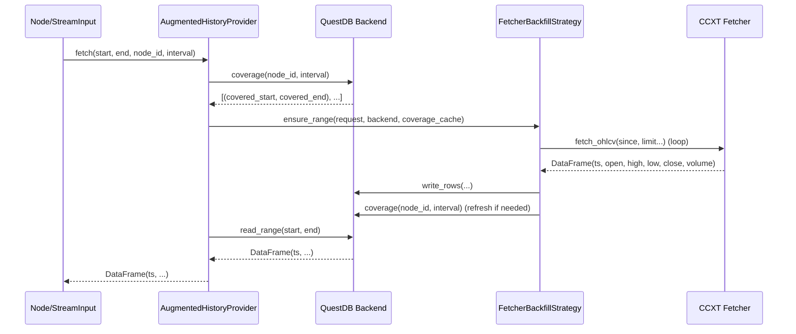

# CCXT × QuestDB (IO)

이 문서는 CCXT 기반 DataFetcher와 QuestDB 백엔드를 조합해, 요청 시 자동 백필되는 시계열을 제공하는 방법을 설명합니다. 구현은 정식 패키지(`qmtl/runtime/io/`)로 제공되며, 예제가 아닌 실사용 구성에 적합합니다.

- 패키지: `qmtl.runtime.io`
- 주요 구성 요소:
  - `CcxtOHLCVFetcher` + `CcxtBackfillConfig`
  - `CcxtQuestDBProvider` (QuestDB + AutoBackfill 전략 래퍼)
  - 내부적으로 `AugmentedHistoryProvider` + `FetcherBackfillStrategy` 사용

## 설치/환경

- 플러그인 설치
  - `uv pip install -e .[dev,ccxt,questdb]`
- QuestDB 실행
  - Docker 예시: `docker run -p 8812:8812 -p 9000:9000 questdb/questdb:latest`
  - 또는 프로젝트의 Docker Compose에 QuestDB를 추가해 사용
  
- (선택) Redis 실행 — 클러스터 레이트리밋
  - Docker 예시: `docker run -p 6379:6379 redis:7-alpine`
  - 설정: `connectors.ccxt_rate_limiter_redis: redis://localhost:6379/0`
  - (레거시) 환경변수: `QMTL_CCXT_RATE_LIMITER_REDIS=redis://localhost:6379/0`

## 빠른 시작

```python
from qmtl.runtime.sdk import StreamInput
from qmtl.runtime.io import CcxtQuestDBProvider

provider = CcxtQuestDBProvider.from_config({
    "exchange": "binance",
    "symbols": ["BTC/USDT"],
    "timeframe": "1m",
    "questdb": {"dsn": "postgresql://localhost:8812/qdb", "table": "crypto_ohlcv"},
    # 전역(프로세스) 또는 클러스터 레이트리밋 예시
    "rate_limiter": {
        "max_concurrency": 1,
        "min_interval_s": 1.2,
        "scope": "cluster",  # 또는 "process"
        "redis_dsn": "redis://localhost:6379/0",
        "burst": 1
    },
})

# interval/period은 원하는 윈도 크기에 맞춰 조정
price = StreamInput(interval="60s", period=120, history_provider=provider)

# 필요 시 워머프
# from qmtl.runtime.sdk import Runner
# await Runner._ensure_history(strategy, start, end)
```

## 동작 원리



## 설정 항목

- `mode`: `ohlcv`(기본) 또는 `trades`
- `exchange`/`exchange_id`: CCXT 교환소 식별자 (예: `binance`, `okx`)
- `symbols`: 심볼 목록. 단일 심볼 예제로 시작하는 것을 권장
- `timeframe`: `"1m"`, `"5m"`, `"1h"` 등 CCXT 규약 (ohlcv 전용)
- `questdb`: `dsn`(권장) 또는 `host/port/database`와 `table`(테이블명) 또는 `table_prefix` (예: `crypto` → `crypto_ohlcv`/`crypto_trades`)
- 레이트리밋(옵션): `rate_limiter = {max_concurrency, min_interval_s, scope}`
  - `scope`: `local`(페처별), `process`(프로세스 전역, 기본), `cluster`(분산)
  - `cluster` 추가 옵션: `redis_dsn`, `tokens_per_interval`, `interval_ms`, `burst_tokens`, `local_semaphore`, `key_suffix`, `key_template`
    - `redis_dsn`: Redis DSN (미설정 시 `connectors.ccxt_rate_limiter_redis` 또는 `QMTL_CCXT_RATE_LIMITER_REDIS` → 기본값)
    - `tokens_per_interval`: 윈도우(`interval_ms`)당 허용 토큰 수
    - `interval_ms`: 토큰 버킷 윈도우 크기(ms)
    - `burst_tokens`: 버스트 허용량(미설정 시 `tokens_per_interval`)
    - `local_semaphore`: 프로세스 로컬 동시성 제한(미설정 시 `max_concurrency`)
    - `key_suffix`: 버킷 분리용 서픽스(계정/엔드포인트별 분리)
    - `key_template`: 리미터 키 포맷을 직접 제어. `{exchange}`(소문자), `{exchange_id}`(원본) 및
      `{suffix}`/`{key_suffix}`/`{account}`(서픽스 값)을 활용할 수 있으며, `:{account?}`와 같이 `?`를 붙이면
      값이 없을 때 구분자까지 제거된다. 템플릿이 설정되면 `key_suffix`는 자동으로 덧붙지 않으므로 필요하면
      템플릿 안에 `{suffix}`를 배치한다.
  - `penalty_backoff_ms`: 429(Too Many Requests) 응답 이후 강제 쿨다운 시간
- 재시도(옵션): `max_retries`, `retry_backoff_s`

## 테스트 & 검증

- 프리플라이트(권장):
  - `PYTHONFAULTHANDLER=1 uv run --with pytest-timeout -m pytest -q --timeout=60 --timeout-method=thread --maxfail=1 -k 'not slow'`
- 전체 테스트:
  - `uv run -m pytest -W error -n auto`

## 확장/후속

- Trades 지원: 동일한 패턴으로 `CcxtTradesFetcher` 추가 (row adapter)
- 멀티 타임프레임/다심볼: node_id 규칙(`ohlcv:{exchange}:{symbol}:{timeframe}`) 기준으로 분기
- QuestDB 커버리지 메타테이블: 대형 테이블에서 커버리지 질의 최적화
- 데이터 검증: 타임스탬프 정렬/간격 정합성 검사 고도화
- 알림/모니터링: 백필 실패 Slack/webhook 연동

## Trades 모드 참고

- 요청 구간의 이벤트(체결)들을 단순 시간 윈도로 수집합니다. 거래가 없는 구간은 비어 있을 수 있으며, 커버리지 계산은 제공된 `interval`(권장: 1초) 기준으로 근접 범위를 병합합니다.
- Node ID 권장 규칙: `trades:{exchange}:{symbol}`. 도우미: `CcxtQuestDBProvider.make_node_id(...)`.
