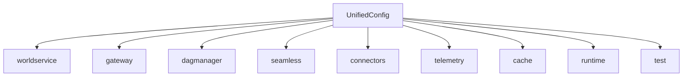

# Configuration Reference

The unified `qmtl.yml` schema replaces ad-hoc environment variables with a
structured document that can be linted and version-controlled. Each section maps
cleanly onto the runtime services so that `qmtl config env export` can generate
environment assignments when required.



Use `qmtl config validate --target schema` to check that every section contains
values compatible with the expected types before running the deeper service
connectivity probes:

```bash
qmtl config validate --target schema --config path/to/qmtl.yml
```

Sample configurations for common environments live under
`operations/config/` (see `dev.yml`, `stage.yml`, and `prod.yml`).

## Sections

### Worldservice

| Key | Type | Default | Environment variable | Required |
| --- | --- | --- | --- | --- |
| `url` | string or null | `null` | `QMTL__GATEWAY__WORLDSERVICE_URL` | No |
| `timeout` | float | `0.3` | `QMTL__GATEWAY__WORLDSERVICE_TIMEOUT` | No |
| `retries` | integer | `2` | `QMTL__GATEWAY__WORLDSERVICE_RETRIES` | No |
| `enable_proxy` | boolean | `True` | `QMTL__GATEWAY__ENABLE_WORLDSERVICE_PROXY` | No |
| `enforce_live_guard` | boolean | `True` | `QMTL__GATEWAY__ENFORCE_LIVE_GUARD` | No |
| `cache_ttl_seconds` | integer or null | `null` | `QMTL__GATEWAY__WORLDSERVICE_CACHE_TTL` | No |
| `cache_max_entries` | integer or null | `null` | `QMTL__GATEWAY__WORLDSERVICE_CACHE_MAX` | No |
| `dsn` | string | – | – | Yes |
| `redis` | string | – | – | Yes |
| `bind.host` | string | `"0.0.0.0"` | – | No |
| `bind.port` | integer | `8080` | – | No |
| `auth.header` | string | `"Authorization"` | – | No |
| `auth.tokens` | list of strings | `[]` | – | No |

### Gateway

| Key | Type | Default | Environment variable | Required |
| --- | --- | --- | --- | --- |
| `host` | string | `"0.0.0.0"` | `QMTL__GATEWAY__HOST` | No |
| `port` | integer | `8000` | `QMTL__GATEWAY__PORT` | No |
| `redis_dsn` | string or null | `null` | `QMTL__GATEWAY__REDIS_DSN` | No |
| `database_backend` | string | `"sqlite"` | `QMTL__GATEWAY__DATABASE_BACKEND` | No |
| `database_dsn` | string | `"./qmtl.db"` | `QMTL__GATEWAY__DATABASE_DSN` | No |
| `insert_sentinel` | boolean | `True` | `QMTL__GATEWAY__INSERT_SENTINEL` | No |
| `controlbus_brokers` | list of strings | `[]` | `QMTL__GATEWAY__CONTROLBUS_BROKERS` | No |
| `controlbus_topics` | list of strings | `[]` | `QMTL__GATEWAY__CONTROLBUS_TOPICS` | No |
| `controlbus_group` | string | `"gateway"` | `QMTL__GATEWAY__CONTROLBUS_GROUP` | No |
| `commitlog_bootstrap` | string or null | `null` | `QMTL__GATEWAY__COMMITLOG_BOOTSTRAP` | No |
| `commitlog_topic` | string or null | `"gateway.ingest"` | `QMTL__GATEWAY__COMMITLOG_TOPIC` | No |
| `commitlog_group` | string | `"gateway-commit"` | `QMTL__GATEWAY__COMMITLOG_GROUP` | No |
| `commitlog_transactional_id` | string | `"gateway-commit-writer"` | `QMTL__GATEWAY__COMMITLOG_TRANSACTIONAL_ID` | No |
| `controlbus_dsn` | string or null | `null` | `QMTL__GATEWAY__CONTROLBUS_DSN` | No |
| `events.secret` | string or null | `null` | — | No |
| `events.keys` | mapping | `{}` | — | No |
| `events.active_kid` | string | `"default"` | — | No |
| `events.ttl` | integer | `300` | — | No |
| `events.stream_url` | string | `"wss://gateway/ws/evt"` | — | No |
| `events.fallback_url` | string | `"wss://gateway/ws"` | — | No |
| `websocket.rate_limit_per_sec` | integer or null | `null` | — | No |

### Dagmanager

| Key | Type | Default | Environment variable | Required |
| --- | --- | --- | --- | --- |
| `neo4j_dsn` | string or null | `null` | `QMTL__DAGMANAGER__NEO4J_DSN` | No |
| `neo4j_user` | string | `"neo4j"` | `QMTL__DAGMANAGER__NEO4J_USER` | No |
| `neo4j_password` | string | `"neo4j"` | `QMTL__DAGMANAGER__NEO4J_PASSWORD` | No |
| `memory_repo_path` | string | `"memrepo.gpickle"` | `QMTL__DAGMANAGER__MEMORY_REPO_PATH` | No |
| `kafka_dsn` | string or null | `null` | `QMTL__DAGMANAGER__KAFKA_DSN` | No |
| `grpc_host` | string | `"0.0.0.0"` | `QMTL__DAGMANAGER__GRPC_HOST` | No |
| `grpc_port` | integer | `50051` | `QMTL__DAGMANAGER__GRPC_PORT` | No |
| `http_host` | string | `"0.0.0.0"` | `QMTL__DAGMANAGER__HTTP_HOST` | No |
| `http_port` | integer | `8001` | `QMTL__DAGMANAGER__HTTP_PORT` | No |
| `controlbus_dsn` | string or null | `null` | `QMTL__DAGMANAGER__CONTROLBUS_DSN` | No |
| `controlbus_queue_topic` | string | `"queue"` | `QMTL__DAGMANAGER__CONTROLBUS_QUEUE_TOPIC` | No |
| `enable_topic_namespace` | boolean | `True` | — | No |

### Seamless

| Key | Type | Default | Environment variable | Required |
| --- | --- | --- | --- | --- |
| `coordinator_url` | string or null | `null` | — | No |
| `artifacts_enabled` | boolean | `False` | — | No |
| `artifact_dir` | string | `"~/.qmtl_seamless_artifacts"` | — | No |
| `fingerprint_mode` | string | `"canonical"` | — | No |
| `publish_fingerprint` | boolean | `True` | — | No |
| `preview_fingerprint` | boolean | `False` | — | No |
| `early_fingerprint` | boolean | `False` | — | No |
| `sla_preset` | string | `"baseline"` | — | No |
| `conformance_preset` | string | `"strict-blocking"` | — | No |
| `presets_file` | string or null | `null` | — | No |

### Connectors

| Key | Type | Default | Environment variable | Required |
| --- | --- | --- | --- | --- |
| `ccxt_rate_limiter_redis` | string or null | `null` | `QMTL_CCXT_RATE_LIMITER_REDIS` | No |
| `schema_registry_url` | string or null | `null` | `QMTL_SCHEMA_REGISTRY_URL` | No |
| `worker_id` | string or null | `null` | `QMTL_WORKER_ID` | No |
| `seamless_worker_id` | string or null | `null` | `QMTL_SEAMLESS_WORKER` | No |
| `strategy_id` | string or null | `null` | `QMTL_STRATEGY_ID` | No |
| `execution_domain` | string or null | `null` | `QMTL_EXECUTION_DOMAIN` | No |
| `broker_url` | string or null | `null` | `QMTL_BROKER_URL` | No |
| `trade_max_retries` | integer | `3` | `QMTL_TRADE_MAX_RETRIES` | No |
| `trade_backoff` | float | `0.1` | `QMTL_TRADE_BACKOFF` | No |
| `ws_url` | string or null | `null` | `QMTL_WS_URL` | No |

### Telemetry

| Key | Type | Default | Environment variable | Required |
| --- | --- | --- | --- | --- |
| `otel_exporter_endpoint` | string or null | `null` | — | No |
| `enable_fastapi_otel` | boolean | `False` | `QMTL_ENABLE_FASTAPI_OTEL` | No |
| `prometheus_url` | string or null | `null` | `QMTL_PROMETHEUS_URL` | No |

> **Note:** Telemetry configuration now resolves exclusively from YAML. The
> deprecated ``QMTL_OTEL_EXPORTER_ENDPOINT`` environment variable is ignored by
> the CLI and services.

### Cache

| Key | Type | Default | Environment variable | Required |
| --- | --- | --- | --- | --- |
| `arrow_cache_enabled` | boolean | `False` | `QMTL_ARROW_CACHE` | No |
| `cache_evict_interval` | integer | `60` | `QMTL_CACHE_EVICT_INTERVAL` | No |
| `feature_artifacts_enabled` | boolean | `False` | `QMTL_FEATURE_ARTIFACTS` | No |
| `feature_artifact_dir` | string | `".qmtl_feature_artifacts"` | `QMTL_FEATURE_ARTIFACT_DIR` | No |
| `feature_artifact_versions` | integer or null | `null` | `QMTL_FEATURE_ARTIFACT_VERSIONS` | No |
| `feature_artifact_write_domains` | list of strings | `[]` | `QMTL_FEATURE_ARTIFACT_WRITE_DOMAINS` | No |
| `tagquery_cache_path` | string | `".qmtl_tagmap.json"` | `QMTL_TAGQUERY_CACHE` | No |
| `snapshot_dir` | string | `".qmtl_snapshots"` | `QMTL_SNAPSHOT_DIR` | No |
| `snapshot_url` | string or null | `null` | `QMTL_SNAPSHOT_URL` | No |
| `snapshot_strict_runtime` | boolean | `False` | `QMTL_SNAPSHOT_STRICT_RUNTIME` | No |
| `snapshot_format` | string | `"json"` | `QMTL_SNAPSHOT_FORMAT` | No |

### Runtime

| Key | Type | Default | Environment variable | Required |
| --- | --- | --- | --- | --- |
| `http_timeout_seconds` | float | `2.0` | `QMTL_HTTP_TIMEOUT` | No |
| `http_timeout_seconds_test` | float | `1.5` | `QMTL_HTTP_TIMEOUT_TEST` | No |
| `ws_recv_timeout_seconds` | float | `30.0` | `QMTL_WS_RECV_TIMEOUT` | No |
| `ws_recv_timeout_seconds_test` | float | `5.0` | `QMTL_WS_RECV_TIMEOUT_TEST` | No |
| `ws_max_total_time_seconds` | float or null | `null` | `QMTL_WS_MAX_TOTAL_TIME` | No |
| `ws_max_total_time_seconds_test` | float or null | `5.0` | `QMTL_WS_MAX_TOTAL_TIME_TEST` | No |
| `poll_interval_seconds` | float | `10.0` | `QMTL_POLL_INTERVAL` | No |
| `poll_interval_seconds_test` | float | `2.0` | `QMTL_POLL_INTERVAL_TEST` | No |

### Test

| Key | Type | Default | Environment variable | Required |
| --- | --- | --- | --- | --- |
| `test_mode` | boolean | `False` | `QMTL_TEST_MODE` | No |
| `fail_on_history_gap` | boolean | `False` | `QMTL_FAIL_ON_HISTORY_GAP` | No |
| `fixed_now` | string or null | `null` | `QMTL_FIXED_NOW` | No |
| `history_start` | string or null | `null` | `QMTL_HISTORY_START` | No |
| `history_end` | string or null | `null` | `QMTL_HISTORY_END` | No |

> **Note:** `qmtl tools sdk run` now reads history boundaries exclusively from
> the `test.history_start` and `test.history_end` keys in `qmtl.yml`.
> `QMTL_HISTORY_START` and `QMTL_HISTORY_END` environment variable overrides are
> ignored during command execution.

## Validation summary

* `qmtl config validate --target schema` checks structural types only.
* `qmtl config validate --target gateway` and `--target dagmanager` perform the
  existing connectivity probes for Redis, Postgres, Neo4j, Kafka, and related
  services.
