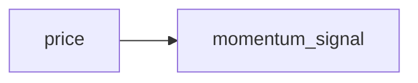
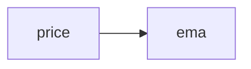
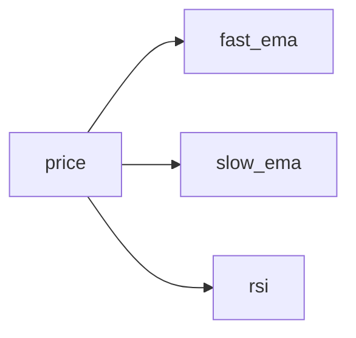
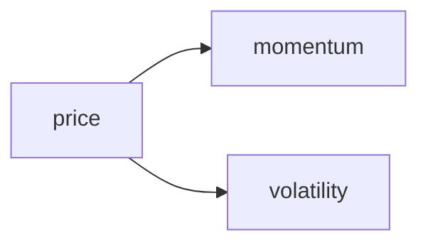
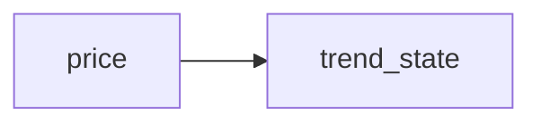

{{ nav_links() }}

<!-- markdownlint-disable MD013 MD025 MD012 -->

# Strategy Templates

QMTL ships with starter strategies that can be used when running `qmtl project init`.
For a step-by-step introduction and a minimal working example, see the
[SDK Tutorial](../guides/sdk_tutorial.md).

Add sample data and an analysis notebook with `--with-sample-data`:

```bash
qmtl project init --path my_proj --preset minimal --with-sample-data
```

## general



*Basic example used by default.* Demonstrates a minimal momentum signal
calculation and serves as a starting point for new projects.

## single_indicator



*Single EMA indicator.* Shows how to attach one indicator to a price stream.
Recommended as the [MVP example](../guides/sdk_tutorial.md) starting point.

## multi_indicator



*Multiple indicators from one stream.* Useful when comparing different
indicators over the same data source.

## branching



*Two computation branches from one input.* Demonstrates branching logic within a
strategy.

## state_machine



*Keeps track of trend direction between runs.* Shows how to maintain simple
state inside a strategy.

## Backend configuration templates

When you scaffold a project with `qmtl project init`, two backend configuration samples
are included under the generated `templates/` directory:

* {{ code_link('qmtl/examples/templates/local_stack.example.yml', text='`local_stack.example.yml`') }} &mdash; lightweight backend stack that relies on
  SQLite, optional Redis, and in-process fallbacks for Kafka and Neo4j. Useful
  for local development or smoke tests without external dependencies.
* {{ code_link('qmtl/examples/templates/backend_stack.example.yml', text='`backend_stack.example.yml`') }} &mdash; production-ready template covering Redis,
  Postgres, Kafka, Neo4j, and observability services. Replace the placeholders
  before deploying.

Use these files as starting points when wiring up Gateway, DAG Manager, and
WorldService for different environments.

## Tagging guidelines

Modules can include a `TAGS` dictionary describing scope, family and other
metadata. Required keys are `scope`, `family`, `interval` and `asset`; optional
fields such as `window`, `price`, `side`, `target_horizon` and `label` help
classify the node further. Use lowercase strings and canonical intervals such as
`1m`, `5m`, `1h` or `1d`.

Lint TAGS with `qmtl taglint`:

```bash
qmtl taglint path/to/module.py
```

Add `--fix` to normalize intervals and scaffold missing keys. Linting can run in
parallel with documentation tasks, so teams can update docs while `qmtl taglint`
checks the code.

{{ nav_links() }}
