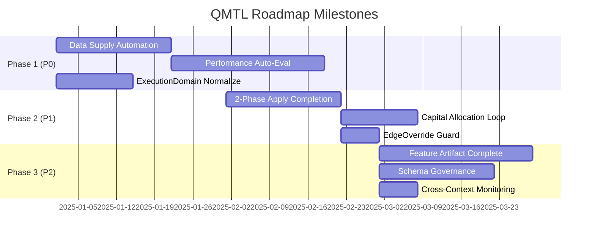

# QMTL Development Roadmap

## Overview

This document presents the development direction and specific improvement plans based on the **Core Loop** and **As-Is / To-Be** analysis defined in QMTL architecture documents (architecture.md, gateway.md, dag-manager.md, worldservice.md, seamless_data_provider_v2.md, etc.).

!!! abstract "Core Loop Goal"
    **"Strategy writing → Submission → (System handles backtest/evaluation/deployment within world) → World performance review → Strategy improvement"**
    
    Users **focus only on strategy logic** while the system handles optimization and generates returns automatically.

---

## 1. Key Gap Summary (As-Is → To-Be)

The table below summarizes the major gaps identified in each architecture area.

| Area | As-Is Status | To-Be Goal | Priority |
|------|-------------|-----------|----------|
| **Data Supply Automation** | `history_provider` must be configured directly in strategy | world + preset auto-connects Seamless | P0 |
| **Performance Auto-Evaluation** | `auto_returns` not implemented, ValidationPipeline and WorldService dualized | Unified submission → auto-backtest → evaluation → activation | P0 |
| **Capital Auto-Allocation** | Runner.submit and allocation paths are separated | Document and integrate "submit → evaluate → allocate" standard loop | P1 |
| **ExecutionDomain Normalization** | Confusion between submission meta hint and WS decision priority | Unify WS `effective_mode` as the sole authoritative source | P0 |
| **2-Phase Apply** | Design exists, ACK convergence partially implemented | Fully automate Freeze → Switch → Unfreeze | P1 |
| **Feature Artifact Plane** | Design and basic adapter exist | Guarantee safe read-only sharing across domains | P2 |
| **Schema Governance** | Best-effort level validation | Introduce Schema Registry + Canary/Strict modes | P2 |

---

## 2. Phased Roadmap Plan

### Phase 0: Foundation Setup (Completed)

!!! success "Completed Items"
    - Runner API unification: `Runner.submit(..., world=..., mode=...)`
    - SeamlessDataProvider v2 runtime application
    - ValidationPipeline basic implementation
    - WorldService core APIs (`/evaluate`, `/apply`, `/activation`, `/allocations`)
    - ControlBus event publish/subscribe structure
    - ComputeContext/ComputeKey shared module

---

### Phase 1: Core Loop Completion (P0 Priority)

**Goal:** Complete the experience where "strategy submission → evaluation → activation" flows automatically with a single call

#### 1.1 Data Supply Automation (On-Ramp)

**Current Status:**
```python
# As-Is: User manually configures provider
from qmtl.runtime.sdk import SeamlessDataProvider
provider = SeamlessDataProvider(config=...)
strategy = MyStrategy(history_provider=provider)
```

**Goal:**
```python
# To-Be: Just specify world for preset-based auto-configuration
Runner.submit(MyStrategy, world="crypto_mom_1h")
# → Runner reads data_preset from world config and auto-injects Seamless
```

**Work Items:**

| Task | Description | Est. Effort |
|-----|------|----------|
| Define `WorldDataPreset` schema | Add `data_preset` section to world config | 2 days |
| `Runner._resolve_data_provider()` | Auto-create SeamlessDataProvider from world preset | 3 days |
| CLI `--data-preset` option | Support manual override | 1 day |
| Integration tests | Validate world-based data auto-connection | 2 days |

#### 1.2 Performance Auto-Evaluation (`auto_returns`)

**Current Status:**
- `ValidationPipeline` calculates metrics like Sharpe/MDD
- WorldService `/evaluate` determines active set
- However, `backtest_returns` must be passed manually by the user

**Goal:**
- Implement `auto_returns` so strategies without explicit returns can get default backtest evaluation
- WorldService evaluation results consistently exposed to Runner/CLI

**Work Items:**

| Task | Description | Est. Effort |
|-----|------|----------|
| Implement `auto_returns` preprocessing | Calculate history-based returns before Runner.submit | 5 days |
| Extend `SubmitResult` schema | Include WS evaluation results (active/weight/contribution/violations) | 2 days |
| ValidationPipeline ↔ WS integration | Local evaluation as hint, WS as final decision | 3 days |
| CLI `world status` command | Query world evaluation/activation status | 2 days |

#### 1.3 ExecutionDomain Normalization

**Current Status:**
- Submission meta `execution_domain` hint and WS decision coexist
- Priority unclear in some paths

**Goal:**
- Clearly document **WS `effective_mode` as the sole authoritative source**
- Submission meta hint used only for reference

**Work Items:**

| Task | Description | Est. Effort |
|-----|------|----------|
| Gateway normalization logic integration | Apply WS decision priority in all paths | 2 days |
| Document alignment | Describe same norms in architecture/gateway/worldservice | 1 day |
| Codify mapping table | Single function for `validate→backtest`, `paper→dryrun`, `live→live` | 1 day |
| Add downgrade metrics | `strategy_compute_context_downgrade_total{reason=...}` | 1 day |

---

### Phase 2: Operations Automation (P1 Priority)

**Goal:** Complete 2-Phase Apply automation, establish capital allocation standard loop

#### 2.1 2-Phase Apply Completion

**Current Status:**
- Freeze/Drain → Switch → Unfreeze design exists
- ACK convergence logic partially implemented (`requires_ack`, `sequence`)

**Work Items:**

| Task | Description | Est. Effort |
|-----|------|----------|
| Complete Gateway ACK convergence | Block Unfreeze propagation before Freeze ACK | 3 days |
| SDK ACK response implementation | Guarantee linear replay based on `sequence` | 2 days |
| Rollback automation | Restore previous Activation snapshot on Switch failure | 3 days |
| Apply state monitoring | `apply_phase_duration_ms{phase=...}` metrics | 1 day |
| Timeout policy | Auto-rollback when `freeze_timeout_ms` exceeded | 2 days |

#### 2.2 Capital Allocation Standard Loop

**Current Status:**
- `/allocations` and `/rebalancing/*` APIs exist
- Operator-driven loop separate from Runner.submit

**Goal:**
- Document "strategy evaluation loop" and "capital allocation loop" as **standard two-step loop**
- Enable world allocations query/display from Runner/CLI

**Work Items:**

| Task | Description | Est. Effort |
|-----|------|----------|
| Standard loop documentation | Guide connecting "evaluate → activate → allocate" | 2 days |
| CLI `world allocations` | Query world/strategy allocation status | 2 days |
| `SubmitResult.allocations` | Connect evaluation results to allocation info | 1 day |
| Rebalancing v2 schema negotiation | Standardize `alpha_metrics` envelope | 2 days |

#### 2.3 EdgeOverride Promotion Guard

**Current Status:**
- `EdgeOverride` records can disable cross-domain edges
- Manual activation required post-promotion

**Work Items:**

| Task | Description | Est. Effort |
|-----|------|----------|
| Apply default deactivation | `backtest→live` edge default OFF | 1 day |
| Auto-activation post-Apply | Policy-based edge ON after 2-Phase completion | 2 days |
| CLI `edges override` | Manual override management | 1 day |

---

### Phase 3: Stability and Scalability (P2 Priority)

**Goal:** Complete Feature Artifact Plane, schema governance, enhanced observability

#### 3.1 Feature Artifact Plane Completion

**Current Status:**
- Design and FileSystem basic adapter exist
- Cross-domain sharing policy `share_policy` defined

**Work Items:**

| Task | Description | Est. Effort |
|-----|------|----------|
| S3/GCS adapter | Object storage support for distributed environments | 5 days |
| Enforce `dataset_fingerprint` | Fingerprint validation on artifact hydration | 2 days |
| Version management and GC | Artifact retention policy, expired artifact cleanup | 3 days |
| Read-only mount validation | Exception on write attempt in live domain | 1 day |

#### 3.2 Schema Registry Governance

**Current Status:**
- Schema validation at best-effort level
- Central registry lookup not implemented

**Work Items:**

| Task | Description | Est. Effort |
|-----|------|----------|
| Canary mode | Log only on schema mismatch (no blocking) | 3 days |
| Strict mode | Block response if different from approved schema | 2 days |
| Audit log | Record schema violation history | 2 days |
| Schema bundle fingerprinting | Automated version tracking | 3 days |

#### 3.3 Cross-Context Cache Hit Monitoring

**Current Status:**
- `cross_context_cache_hit_total` metric designed
- SLO: 0 (critical on violation)

**Work Items:**

| Task | Description | Est. Effort |
|-----|------|----------|
| Metric implementation | Emit metrics from DAG Manager/SDK | 2 days |
| Alert rules | Critical alert when `> 0` | 1 day |
| Promotion blocking | Reject Apply in violation state | 1 day |

---

## 3. Milestone Summary



---

## 4. Validation Criteria

The following validations are performed at each Phase completion:

### Phase 1 Completion Conditions
- [ ] `Runner.submit(Strategy, world="...")` completes from data connection to evaluation in one call
- [ ] Strategies without specified returns pass backtest evaluation when `auto_returns` is enabled
- [ ] ExecutionDomain mapping consistently described in all documents
- [ ] CLI `world status` command can query evaluation/activation status

### Phase 2 Completion Conditions
- [ ] 2-Phase Apply fully automated including ACK convergence
- [ ] Auto-rollback on Switch failure verified
- [ ] CLI `world allocations` command works
- [ ] EdgeOverride auto-switches before/after promotion

### Phase 3 Completion Conditions
- [ ] Feature Artifact S3 adapter works
- [ ] Hydration blocked on `dataset_fingerprint` mismatch
- [ ] Schema Canary/Strict mode switchable
- [ ] `cross_context_cache_hit_total` metric emitted and alerts work

---

## 5. Principles Reaffirmation

The following principles are always observed while executing this roadmap:

!!! danger "Breaking Change Principle"
    **Do not maintain legacy for backward compatibility in the long term.**
    
    Losing simplicity is more critical than breaking backward compatibility.

!!! warning "Default-Safe Principle"
    The more insufficient or ambiguous the settings, the more it **downgrades to compute-only (backtest) safe mode**.
    
    Never default to live.

!!! note "Core Loop Centric Design"
    Even when adding new features, the default direction is "instead of making users aware of more options, 
    have the system decide automatically and only override when necessary."

---

## Related Documents

- [Architecture Overview](architecture/architecture.md)
- [Gateway Specification](architecture/gateway.md)
- [DAG Manager Specification](architecture/dag-manager.md)
- [WorldService Specification](architecture/worldservice.md)
- [Seamless Data Provider v2](architecture/seamless_data_provider_v2.md)
- [World Specification](world/world.md)
