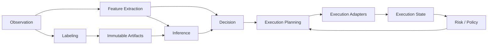

{{ nav_links() }}

# QMTL Capability Map

## 관련 문서

- [QMTL 설계 원칙](design_principles.md)
- [Semantic Types](semantic_types.md)
- [Decision Algebra](decision_algebra.md)
- [아키텍처 개요](architecture.md)

## 개요

QMTL은 archetype 중심 시스템이 아니라 capability 조합 시스템이다.
따라서 코어 설계는 “어떤 전략 유형을 지원하는가”보다
“어떤 capability가 어떤 contract로 연결되는가”를 우선적으로 기술해야 한다.

아래 capability map은 QMTL의 확장 판단 기준이 되는 최소 공통 구조를 정의한다.

## Capability 정의

| Capability | 설명 | 주 입력 | 주 출력 | 핵심 규칙 |
| --- | --- | --- | --- | --- |
| Observation | 시장/체결/포트폴리오/외부 이벤트 관측 | 외부 스트림 | CausalStream | 코어 입력 계층 |
| Feature Extraction | 관측치를 특징으로 변환 | Observation, ImmutableArtifact | CausalStream, ImmutableArtifact | 실행 경로와 연구 경로 모두 사용 가능 |
| Labeling | 미래 의존 라벨 생성 | Observation, entry events | DelayedStream, ImmutableArtifact | live decision path 투입 금지 |
| Inference | 규칙 기반 또는 학습 기반 추론 | CausalStream, ImmutableArtifact | Decision | delayed input 직접 소비 금지 |
| Decision | 실행 의도를 표현 | Feature/Inference 출력 | Decision subtype | planner가 이해할 수 있는 공통 algebra 사용 |
| Execution Planning | decision을 실행 계획으로 변환 | Decision, ExecutionState, RiskPolicy | Plan | order/quote 등 실행 형태별 planner 허용 |
| Execution Adapters | venue/broker/system boundary | Plan | ack/fill/events | 외부 I/O는 adapter로 격리 |
| Execution State | open orders, open quotes, fills, inventory, portfolio | adapter events | MutableExecutionState | world/domain scoped |
| Risk / Policy | stateful/stateless 제약 및 게이트 | Decision, Plan, ExecutionState | filtered Decision/Plan | semantic type 규칙을 우회하지 않음 |

## Capability 간 관계

### Observation

Concept ID: `CAP-OBSERVATION`

Observation은 외부 세계를 읽는 경계다.
Quote, trade, order book, fill, portfolio snapshot, operator command 모두 observation capability에 속한다.

### Feature Extraction

Concept ID: `CAP-FEATURE-EXTRACTION`

Feature extraction은 raw observation을
추론이나 규칙 평가에 사용할 수 있는 causal feature로 변환한다.
일부 feature는 immutable artifact로 승격되어 replay/research reuse를 지원할 수 있다.

### Labeling

Concept ID: `CAP-LABELING`

Labeling은 학습과 평가를 위한 delayed output을 생성한다.
Labeling은 연구 capability이지만 코어의 일부로 명시적으로 존재해야 하며,
실행 경로와의 경계를 semantic rule로 분리해야 한다.

### Inference

Concept ID: `CAP-INFERENCE`

Inference는 ML에 한정되지 않는다.
규칙 기반 점수 함수, 통계 모델, 외부 모델 호출 모두 inference capability에 속한다.
핵심은 output이 공통 decision algebra를 따르는 것이다.

### Decision

Concept ID: `CAP-DECISION`

Decision은 실행 의도를 표현하는 계층이다.
Position target, order intent, quote intent는 서로 다른 archetype이 아니라
decision algebra의 서로 다른 subtype으로 표현한다.

### Execution Planning

Concept ID: `CAP-EXECUTION-PLANNING`

Execution planning은 decision을 실제 실행 계획으로 변환한다.
Directional 전략과 MM 전략의 차이는 대부분 이 계층에서 발생한다.

- `PositionTargetDecision -> OrderIntentPlan`
- `QuoteIntentDecision -> CancelReplacePlan`

### Execution State

Concept ID: `CAP-EXECUTION-STATE`

Execution state는 mutable하며 world/domain scoped다.
따라서 cross-domain 공유를 금지하고,
immutable artifact와 명확히 구분해야 한다.

### Execution Adapters

Concept ID: `CAP-EXECUTION-ADAPTERS`

Execution adapter는 plan을 venue, broker, gateway, external service 같은
실제 I/O 경계로 전달하는 계층이다.
외부 API, 커밋 로그, 브로커리지 client, webhook ingress는 이 capability로 설명한다.

### Risk / Policy

Concept ID: `CAP-RISK-POLICY`

Risk / policy는 decision과 plan을 실행 가능한 범위로 제한하는 capability다.
stateful risk, activation policy, world gating, compliance-like filters 모두 이 계층에서 다룬다.

## Profile은 capability 번들이다

다음 profile은 코어 개념이 아니라 capability 조합 예시다.

### Directional profile

`Observation -> Feature Extraction -> Decision -> Position Planner -> Execution`

### ML directional profile

`Observation -> Feature Extraction -> Immutable Artifacts -> Inference -> Decision -> Position Planner -> Execution`

### ML-driven MM profile

`Observation(order book) -> Feature Extraction -> Inference -> QuoteIntentDecision -> Quote Planner -> Execution`

### Label research profile

`Observation -> Feature Extraction -> Labeling -> Immutable Artifacts -> Dataset Build`

이 profile들은 문서화와 예시에는 유용하지만,
코어 구현을 분기시키는 1급 타입이 되어서는 안 된다.

## 확장 규칙

새 capability가 필요한지 판단할 때는 아래 순서를 따른다.

1. 기존 capability의 contract만으로 설명 가능한가?
2. 설명 가능하다면 새 profile 또는 새 planner로 충분한가?
3. 설명 불가능하다면 실제로는 새로운 semantic boundary가 필요한가?
4. 필요하다면 capability를 추가하되, archetype이 아니라 semantic 역할로 정의한다.

{{ nav_links() }}
