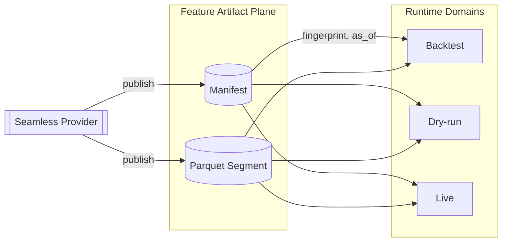

# CCXT × Seamless 통합 아키텍처 (High + Codex)

## 0. 목적과 Core Loop 상 위치

- 목적: CCXT 기반 거래소 데이터를 Seamless 데이터 플레인으로 통합해, 전략/월드에서 **동일한 히스토리·라이브 데이터**를 재현 가능하게 사용할 수 있도록 하는 아키텍처를 정의합니다.
- Core Loop 상 위치: Core Loop의 **“데이터 공급 자동화” + “시장 replay 백테스트”** 단계를 담당하며, Runner.submit이 기대하는 히스토리/커버리지를 어떻게 보장하는지 설명합니다.
- 구현 상태와 후속 계획은 [seamless_data_provider_v2.md](seamless_data_provider_v2.md) 및 [rewrite_architecture_docs.md](../../../docs_archive/rewrite_architecture_docs.md)에서 Core Loop 정렬 관점으로 추적합니다.

## 관련 문서
- [Seamless Data Provider v2](seamless_data_provider_v2.md)
- [DAG Manager](dag-manager.md)
- [Gateway](gateway.md)
- [CCXT × QuestDB IO 레시피](../io/ccxt-questdb.md)
- 기존에 `ccxt-seamless-gpt5codex.md`로 공개되었던 거버넌스 노트는 본 문서에 흡수되어 폐기되었습니다.
- 기존에 `ccxt-seamless-gpt5high.md`로 공개되었던 런타임 노트 역시 본 설계에 흡수되어 폐기되었습니다.

## 범위와 상태

본 문서는 과거에 분리되어 있던 내러티브를 대체하고, CCXT 기반 심리스 데이터 접근을 위한 통합 아키텍처를 정식으로 정의합니다. Sonnet 제안은 폐기되어 의도적으로 제외되었습니다. 팀은 CCXT + Seamless 스택을 구현·개선·감사할 때 본 청사진을 기준으로 삼아야 합니다.

## 목표

- 기존 심리스 런타임 프리미티브 위에서 항상 준비된(\"always ready\") 히스토리 인터페이스를 제공합니다.
- 데이터셋 지문, `as_of` 규율, 도메인 격리를 통해 결정적 재현성을 유지합니다.
- 일관된 노드 ID와 커버리지 보증을 바탕으로 멀티 거래소·멀티 심볼 오케스트레이션을 지원합니다.
- SLA 예산, 백필 조율, 레이트 리미팅, 적합성 리포팅을 위한 운영 레버를 명시적으로 제공합니다.
- Gateway, WorldService, DAG Manager 워크플로와 호환성을 유지하며 병렬 스택을 만들지 않습니다.

## 아키텍처 개요

```mermaid
flowchart LR
  subgraph Strategy Layer
    STRAT[전략 / 노드 세트]
  end

  subgraph Seamless Data Plane
    CORE[(Seamless Core)]
    COV[Coverage \n & Gap Math]
    SLA[SLA Policy]
    CONF[Conformance]
    COORD[Backfill Coordinator]
    CACHE[World/AsOf Keyed Cache]
    LIVE[Live Feed (poll/WS)]
  end

  subgraph IO & Storage
    QDB[(QuestDB Storage)]
    FETCH[CCXT Fetcher]
    RL[(Redis Token Bucket)]
    ARTIFACT[(Artifact Store\nParquet + Manifest)]
  end

  subgraph Governance Plane
    REG[Artifact Registrar]
    WLD[WorldService]
    GATE[Gateway / Execution Domain]
  end

  STRAT -->|fetch(start,end,node_id,ctx)| CORE
  CORE --- SLA
  CORE --- COV
  CORE --- CONF
  CORE --- COORD
  CORE --> CACHE
  CORE -->|coverage/read_range| QDB
  CORE -->|fill gaps| FETCH --> RL
  CORE --> LIVE
  CORE -->|publish stable| REG --> ARTIFACT
  REG -->|manifest sync| QDB
  CORE -->|freshness, flags| WLD --- GATE
```

개요는 기존 Hybrid 문서의 이중 평면 구조를 유지합니다. 심리스 데이터 플레인은 GPT5-High 계열의 메커니즘을 채택하고, 거버넌스 정책은 GPT5-Codex에서 이어받습니다. 새로운 프로바이더 클래스는 도입되지 않으며 `qmtl/runtime/io/seamless_provider.py`와 `qmtl/runtime/sdk` 모듈을 재사용합니다.

## 데이터 플레인 (GPT5-High 계열)

### 런타임 구성 개요

```mermaid
flowchart LR
    subgraph Strategy/Nodes
      S[Strategy] -->|fetch/coverage| P((Seamless Provider))
    end

    P --> C[Cache Source]
    P --> ST[Storage Source (QuestDB)]
    P --> BF[Auto Backfiller (CCXT)]
    P --> LV[Live Feed (poll/WS)]

    BF --> RL[Rate Limiter]
    BF --> CCXT[CCXT async_support]
    ST --> QDB[(QuestDB)]

    subgraph Control
      SLA[SLA Policy]
      CO[Backfill Coordinator]
      CONF[Conformance Pipeline]
    end

    P --- SLA
    P --- CO
    P --- CONF
```

### Seamless Core
- 구현: `EnhancedQuestDBProvider`(`qmtl/runtime/io/seamless_provider.py`)와 `ArtifactRegistrar`(`qmtl/runtime/io/artifact.py`) 조합.
  프로바이더는 기본적으로 IO 계층 레지스트라를 연결해 모든 fetch 호출에서 ISO-8601 `as_of`, 프로비넌스 메타데이터, 매니페스트 URI를 발행합니다. 개발 환경에서도 동일하며, `QMTL_SEAMLESS_ARTIFACTS=1`(필요 시 `QMTL_SEAMLESS_ARTIFACT_DIR`와 결합)을 설정하면 통합 테스트가 사용하는 파일 시스템 스토어를 미러링할 수 있고, 클라우드 게시가 필요하면 `registrar=`에 사용자 구현을 넘기면 됩니다.
- 노출된 전략: `FAIL_FAST`, `AUTO_BACKFILL`, `PARTIAL_FILL`, `SEAMLESS`.
- 캐시, 스토리지, 백필, 선택적 라이브 피드를 `HistoryProvider` 파사드를 통해 조정하고, 안정화된 아티팩트 게시를 `ArtifactRegistrar`에 위임합니다.

### 커버리지 & 갭 계산
- 결정적 갭 탐지는 `qmtl/runtime/sdk/history_coverage.py`가 담당합니다.
- 노드 ID 규칙: `ohlcv:{exchange_id}:{symbol}:{timeframe}` (예: `ohlcv:binance:BTC/USDT:1m`).
- 구간 정렬 병합을 통해 제공되는 프레임이 항상 타임프레임 경계에 맞춰지도록 합니다.

#### 커버리지 수학 요약

| 단계 | 책임 | 비고 |
| --- | --- | --- |
| 커버리지 조회 | `QuestDBHistoryProvider.coverage` | `start`, `end`, `interval_seconds` 메타데이터를 포함한 연속 구간을 반환합니다. |
| 갭 도출 | `HistoryCoverage.compute_missing_ranges` | 타임프레임 간격을 존중하는 포괄/배제 구간 튜플을 생성합니다(부분 바 없음). |
| 병합 | `HistoryCoverage.merge_ranges` | 스토리지 구간과 새로 백필한 구간을 읽기 전에 결합합니다. |
| 검증 | `ConformancePipeline` | 중복을 제거하고 단조 시간 순서를 강제하며 남은 커버리지 차이를 플래그합니다. |

### 데이터 모델 & 인터벌 의미
- 표준 OHLCV 스키마: `ts`, `open`, `high`, `low`, `close`, `volume`.
- `ts`는 epoch **초** 단위로 정규화되며, 커버리지 수학은 선언된 `interval`이 동일한 단위를 사용한다고 가정해 정수 간격을 유지합니다.
- 다운스트림 리샘플링이 필요하면 기본 주기를 수정하지 말고 새로운 노드 ID를 게시하세요.

### 백필 오케스트레이션
- 백필은 `CcxtOHLCVFetcher`와 `CcxtBackfillConfig`(`qmtl/runtime/io/ccxt_fetcher.py`)가 수행합니다.
- 백그라운드 백필이 기본이며, 결정적 완료가 필요한 전략을 위해 동기식 `ensure_coverage`도 제공됩니다.
- 분산 단일 비행(single-flight) 조정은 `BackfillCoordinator`(프로세스 범위)와 `QMTL_SEAMLESS_COORDINATOR_URL` HTTP 엔드포인트를 통해 교차 워커 리스를 지원합니다.
- 각 백필 배치는 시도/완료/실패 이벤트를 구조화 로그에 기록해 운영 대시보드에서 처리량을 관측할 수 있게 합니다.

### 레이트 리미팅
- 프로세스 수준 스로틀은 asyncio 세마포어와 최소 간격 가드로 구성해 CCXT 버스트 밴을 방지합니다.
- 클러스터 수준 예산은 Redis 토큰 버킷(`qmtl/runtime/io/ccxt_rate_limiter.py`)으로 강제하며 키는 `exchange_id`와 선택적 계정 접미사로 분할합니다.

| 파라미터 | 목적 | 기본 출처 |
| --- | --- | --- |
| `connectors.ccxt_rate_limiter_redis` | 클러스터 토큰 버킷 상태 연결 문자열 | `qmtl.yml` (`QMTL_CCXT_RATE_LIMITER_REDIS` 대체) |
| `tokens_per_interval` | 롤링 윈도우 허용량 | 프로바이더 설정 |
| `interval_ms` | 공유 윈도우 길이 | 프로바이더 설정 |
| `burst_tokens` | 스로틀 전 추가 헤드룸 | 프로바이더 설정 |
| `local_semaphore` | 단일 프로세스 동시성 제한 | 프로바이더 설정 |
| `min_interval_ms` | 워커당 CCXT 요청 최소 간격 | 프로바이더 설정 |
| `penalty_backoff_ms` | 429 발생 시 적용할 쿨다운 | 프로바이더 설정 |

`CcxtQuestDBProvider.from_config(...)`도 `min_interval_s`를 허용합니다. 두 필드가 동시에 있으면 동일한 주기를 의미해야 하며, 밀리초 값은 내부 리미터 설정에 맞춰 초 단위로 변환됩니다.

### 프로바이더 레시피

```python
from qmtl.runtime.io import EnhancedQuestDBProvider
from qmtl.runtime.io import CcxtOHLCVFetcher, CcxtBackfillConfig
from qmtl.runtime.sdk.sla import SLAPolicy

fetcher = CcxtOHLCVFetcher(CcxtBackfillConfig(
    exchange_id="binance",
    symbols=["BTC/USDT"],
    timeframe="1m",
))

provider = EnhancedQuestDBProvider(
    dsn="postgresql://localhost:8812/qdb",
    fetcher=fetcher,
    strategy="SEAMLESS",
    conformance=None,
    partial_ok=True,
)

provider_with_sla = EnhancedQuestDBProvider(
    dsn="postgresql://localhost:8812/qdb",
    fetcher=fetcher,
    sla=SLAPolicy(
        max_wait_storage_ms=300,
        max_wait_backfill_ms=5000,
        total_deadline_ms=1500,
        max_sync_gap_bars=2,
    ),
)
```

### Seamless Builder 스캐폴딩

`EnhancedQuestDBProvider`는 재사용 가능한 `SeamlessBuilder`(`qmtl.runtime.sdk.seamless.SeamlessBuilder`)를 통해 소스를 조합합니다. 빌더는 스토리지/캐시/백필/라이브/레지스트라 컴포넌트(인스턴스 또는 팩토리)를 받아 `SeamlessAssembly`로 물질화합니다. 향후 프리셋은 `SeamlessPresetRegistry`에 등록되어 CCXT 또는 주식용 기본값을 프로바이더 코드 복제 없이 제공합니다.

```python
from qmtl.runtime.sdk import build_seamless_assembly, hydrate_builder

config = {
    "preset": "ccxt.questdb.ohlcv",
    "options": {
        "exchange_id": "binance",
        "symbols": ["BTC/USDT"],
        "timeframe": "1m",
        "questdb": {"dsn": "postgresql://localhost:8812/qdb", "table": "crypto_ohlcv"},
    },
}

# 추가 커스터마이징을 위해 빌더를 물질화하거나…
builder = hydrate_builder(config)
assembly = builder.build()

# 한 번에 어셈블리를 생성할 수도 있습니다.
assembly = build_seamless_assembly(config)

# 결과 어셈블리는 SeamlessDataProvider 하위 클래스(예: EnhancedQuestDBProvider)에서 바로 사용할
# cache/storage/backfill/live 컴포넌트를 제공합니다.
# 기존 프로바이더는 초기화 시 조각을 연결하거나, 레거시 설정에서 직접 EnhancedQuestDBProvider를
# 인스턴스화했다면 사후 할당으로 마이그레이션할 수 있습니다.
```

#### 프리셋 카탈로그

- `ccxt.questdb.ohlcv`
  - 목적: QuestDB 스토리지 + CCXT OHLCV 백필
  - 옵션: `exchange_id`, `symbols`, `timeframe`, `questdb: {dsn, table}`, `rate_limiter`, `window_size`, `max_retries`, `retry_backoff_s`

- `ccxt.questdb.trades`
  - 목적: QuestDB 스토리지 + CCXT 체결 백필
  - 옵션: `exchange_id`, `symbols`, `questdb: {dsn, table}`, `rate_limiter`, `window_size`, `max_retries`, `retry_backoff_s`

- `ccxt.live.pro`
  - 목적: ccxt.pro 기반 라이브 데이터 피드(웹소켓) - OHLCV 또는 체결
  - 옵션: `exchange_id`, `symbols`, `timeframe`, `mode`("ohlcv"|"trades"), `sandbox`, `reconnect_backoff_ms`, `dedupe_by`, `emit_building_candle`
  - 메모: ccxt.pro는 선택적 의존성으로, 팩토리는 subscribe() 시점까지 지연 초기화됩니다.

- `seamless.registrar.filesystem`
  - 목적: 환경 변수를 활용하는 파일 시스템 아티팩트 레지스트라
  - 옵션: 없음 (`QMTL_SEAMLESS_ARTIFACTS=1`, `QMTL_SEAMLESS_ARTIFACT_DIR` 준수). `stabilization_bars` 재정의 지원.

- `ccxt.bundle.ohlcv_live`
  - 목적: `ccxt.questdb.ohlcv`와 `ccxt.live.pro`를 동시에 적용하는 편의 번들
  - 옵션: 두 프리셋의 합집합. 일반적으로 `exchange_id`, `symbols`, `timeframe`, `questdb`, `reconnect_backoff_ms` 등 라이브 옵션 포함.

- `ccxt.bundle.trades_live`
  - 목적: `ccxt.questdb.trades`와 `ccxt.live.pro` 번들을 함께 적용
  - 옵션: 두 프리셋의 합집합. 보통 `exchange_id`, `symbols`, `questdb`, 라이브 옵션을 지정합니다.

연쇄 예시는 다음과 같습니다.

```python
config = {
  "presets": [
    {"name": "ccxt.questdb.ohlcv", "options": {"exchange_id": "binance", "symbols": ["BTC/USDT"], "timeframe": "1m", "questdb": {"dsn": "postgresql://localhost:8812/qdb", "table": "ohlcv"}}},
    {"name": "ccxt.live.pro", "options": {"exchange_id": "binance", "symbols": ["BTC/USDT"], "timeframe": "1m", "mode": "ohlcv"}},
    {"name": "seamless.registrar.filesystem"}
  ]
}

assembly = build_seamless_assembly(config)
```

멀티 심볼 또는 멀티 타임프레임 커버리지로 확장할 때는 `CcxtQuestDBProvider.from_config_multi(...)`를 사용해 스캐폴딩하면서 향상된 프로바이더의 SLA 오케스트레이션을 유지하세요. 위 설정은 여러 어댑터를 연결하는 `presets: [...]` 목록에 그대로 중첩할 수 있습니다.

### 라이브 데이터 통합
- 기본 폴링 `LiveDataFeedImpl`은 타임프레임 주기를 준수하는 바 경계 스케줄러를 사용하며, 바 완료 전에는 게시하지 않습니다.
- ccxt.pro 웹소켓 래퍼는 향후 확장으로 유지하며, ccxt.pro가 설치되고 적합성 훅이 늦게 도착한 프레임을 중복 제거할 수 있을 때만 활성화합니다.
- 웹소켓 어댑터는 재연결 지연(`reconnect_backoff_ms`)과 `dedupe_by` 키(기본 `ts`)를 노출해 재연결 시 멱등성을 유지합니다. 다운스트림 소비자가 진행 중인 바를 처리할 준비가 되어 있지 않다면 `emit_building_candle`을 비활성화하세요.
- 라이브 확장은 히스토리 조회와 동일한 커버리지 메타데이터를 방출해 Gateway가 지연 윈도우를 강제할 수 있도록 해야 합니다.

### SLA & 적합성
- SLA 예산은 `qmtl/runtime/sdk/sla.py`에서 가져오며, storage_wait, backfill_wait, live_wait, total 단계를 포함합니다.
- 적합성 파이프라인(`qmtl/runtime/sdk/conformance.py`)은 dtype 정규화, 타임스탬프 정렬, 중복 제거, 갭 플래그 방출을 강제합니다.
- 위반 시 `SeamlessSLAExceeded`가 발생하거나 전략 설정에 따라 부분 채움이 반환됩니다.

#### SLA 예산 참조

| 단계 | 설명 | 일반 예산 |
| --- | --- | --- |
| `storage_wait` | QuestDB 응답(읽기 + 커버리지) 대기 시간 | ≤ 300 ms |
| `backfill_wait` | CCXT 페치 지연 + 안정화 기록 | ≤ 5000 ms |
| `live_wait` | 최신 바를 기다리는 라이브 피드 지연 | ≤ 800 ms |
| `total_deadline` | 위 단계의 총합 상한 | ≤ 1500 ms |

예산은 거래소별로 조정해야 하며, 임계치를 초과하면 선택한 전략에 따라 프로바이더가 즉시 실패 또는 부분 채움 모드로 전환됩니다. SLA 결과는 메트릭으로 내보내 알림을 걸어야 합니다.

## 거버넌스 플레인 (GPT5-Codex 계열)

### 피처 아티팩트 플레인

거버넌스 플레인은 각 거래소 스냅샷을 피처 아티팩트 플레인에 고정해 결정적 재현성을 유지합니다. 플레인은 아티팩트를 불변이며 월드와 무관한 레코드로 취급해 라이브 의존성을 재주입하지 않고도 재생·점검할 수 있게 합니다. Codex 초안에서 물려받은 가드레일은 필수입니다.

- **불변 아티팩트** – 안정화된 Parquet 세그먼트는 매니페스트와 함께 게시되며 제자리 수정이 금지됩니다. 재처리는 항상 새로운 fingerprint/as_of 쌍을 생성합니다.
- **도메인 간 읽기 전용 공유** – 아티팩트는 월드 간 읽기 전용으로 공유하며, 수정이 필요하면 새로운 아티팩트를 게시해야 합니다. 캐시 계층은 매니페스트 키를 참조하는 복제본만 물질화할 수 있습니다.
- **명시적 프로비넌스** – 매니페스트는 생산자, 상위 거래소, 심리스 정책 결정, 게시 워터마크를 인코딩해 감사자가 임시 대시보드를 보지 않고도 계보를 재구성할 수 있어야 합니다.
- **재현성 계약** – Gateway와 WorldService는 `{dataset_fingerprint, as_of}`를 콘텐츠 주소형 식별자로 취급해야 하며, 매니페스트 참조 없이 가변적인 QuestDB 행을 재사용하려는 시도는 거부됩니다.



#### 데이터셋 식별자
- **런타임 키**: 앞서 정의한 `node_id`.
- **버전 키**: `dataset_fingerprint`(정규화된 프레임 + 메타데이터의 SHA-256)와 `as_of`(스냅샷 혹은 커밋 시각).
- 아티팩트 매니페스트는 `{fingerprint, as_of, node_id, range, conformance_version, producer, publication_watermark}`를 기록하며 Parquet 데이터와 함께 오브젝트 스토리지에 저장됩니다. 기본 레지스트라는 `producer.identity`를 `seamless@qmtl`로, 원본 `node_id`/`interval`, 안정화된 데이터셋이 봉인된 UTC `publication_watermark`를 남깁니다.
- 지문은 꼬리 바 안정화와 dtype 정규화를 마친 후 계산해야 멱등 재생이 가능합니다. 워커가 디버그용 \"preview\" 지문을 계산할 수는 있으나, 안정화 이후 값만 권위 있는 값입니다.

#### 게시 워크플로

적재 워커는 안정화된 프레임을 아티팩트 플레인으로 승격할 책임이 있습니다. 아래 의사 코드는 하이브리드 초안의 여러 조각을 대체하는 정식 시퀀스입니다.

```python
def conform_frame(df, interval_s) -> pd.DataFrame:
    df = df.sort_values("ts")
    df["ts"] = (df["ts"] // interval_s) * interval_s
    df = df.drop_duplicates(subset=["ts"], keep="last")
    # dtype 검증 및 갭 플래깅 로직 추가...
    return df

def compute_fingerprint(df, meta: dict) -> str:
    payload = serialize_canonical(df, meta)
    return sha256(payload).hexdigest()

def maybe_publish_artifact(df, node_id, start, end, conf_ver, as_of, store):
    stable_df = drop_tail(df, bars=2)
    if stable_df.empty:
        return None
    meta = {
        "node_id": node_id,
        "range": [start, end],
        "conformance": conf_ver,
    }
    fp = compute_fingerprint(stable_df, meta)
    write_parquet_with_manifest(stable_df, fp, as_of, meta, store)
    return fp
```

두 가지 설정 스위치가 지문 생성 위치를 제어합니다.

- `early_fingerprint` – 스냅샷 시점에 CCXT 워커가 잠정 지문을 방출할 수 있는 실험 모드입니다.
- `publish_fingerprint` – 워터마크 안정화(꼬리 바 제거)를 기다린 뒤 매니페스트를 봉인하는 기본 경로입니다. 프로덕션 환경에서는 반드시 활성화된 상태를 유지해야 합니다.

런타임 배포는 설정 파일과 환경 변수 모두에서 이 스위치를 노출합니다. `publish_fingerprint`는 `QMTL_SEAMLESS_PUBLISH_FP`, `early_fingerprint`는 `QMTL_SEAMLESS_EARLY_FP`와 매핑되어 운영자가 YAML을 수정하지 않고도 행동을 전환할 수 있습니다.

#### 아티팩트 생애 주기

| 단계 | 담당 | 보증 |
| --- | --- | --- |
| 스냅샷 안정화 | Seamless Provider | 미완성 꼬리 바 제거, 스키마 일치 강제 |
| 지문 방출 | Artifact Registrar | 프레임 바이트 + 매니페스트 메타데이터에 SHA-256 적용 |
| 매니페스트 게시 | Artifact Registrar | `{fingerprint, as_of, coverage, producer}`를 오브젝트 스토리지에 기록 |
| 도메인 수입 | Gateway / WorldService | 세션에 데이터가 들어가기 전 fingerprint + `as_of` 검증 |

#### 스토리지 정책

핫·콜드 스토리지는 의도적으로 분리합니다.

- **핫(QuestDB)**은 빠른 커버리지 계산과 백필을 위해 가변 바를 유지합니다. TTL은 SLA 복구 기대치와 맞춰야 합니다.
- **콜드(아티팩트 스토어)**는 매니페스트와 함께 불변 Parquet 세그먼트를 보존합니다. 백필 세그먼트는 덮어쓰지 않고 버전으로 관리하며, 소비자는 항상 지문으로 선택합니다.
- **워터마크 승격**은 `stabilization_bars`가 경과하면 수행됩니다. 레지스트라는 아티팩트와 매니페스트 델타를 게시해 카탈로그가 `as_of`를 단조롭게 올릴 수 있게 합니다.
- **롤백 & 감사 가능성**은 매니페스트 스냅샷에 의존합니다. 운영자는 CCXT를 재실행하는 대신 Gateway 로그에 기록된 fingerprint/as_of 쌍을 그대로 재생해 사고를 조사합니다.

### 도메인 격리 & 실행 게이팅

도메인 정책은 어떤 런타임 면이 가변 소스를 읽을 수 있는지, 세션에서 `as_of`가 어떻게 진전되는지를 규정합니다. World와 Execution Domain 경계는 서로 다른 `as_of` 또는 지문으로 생성된 캐시 항목을 절대 재사용하지 않아야 합니다.

- **Backtest** – `as_of`는 실행 전에 지정되고 게시된 아티팩트와 매핑되어야 하며, 아티팩트화되지 않은 갭 필은 거부됩니다.
- **Dry-run** – 스토리지 읽기를 허용하지만 응답을 즉시 아티팩트화하고 매니페스트에서 재생한 뒤에만 재사용할 수 있습니다.
- **Live** – 세션 시작 시 `as_of`를 고정합니다. 심리스는 스토리지·백필·라이브 피드를 조합할 수 있으나 `now - data_end ≤ max_lag` 조건을 지켜야 하며, 위반 시 세션을 HOLD 또는 compute-only 모드로 강등합니다.

#### 도메인 정책 매트릭스

| 도메인 | 허용 소스 | `as_of` 처리 | 게이팅 결과 |
| --- | --- | --- | --- |
| Backtest | 아티팩트 스토어 전용 | 실행당 고정, 불변 | 아티팩트 누락 시 즉시 실패 |
| Research / Lab | 아티팩트 스토어 전용 | 실행당 고정, 불변 | 아티팩트 없으면 즉시 실패 |
| Dry-run | 아티팩트 스토어 → 신규 읽기 즉시 게시 | 실행당 고정, 불변 | 아티팩트 생성 전 재사용 거부 |
| Live | 스토리지, 백필, 선택적 라이브 피드 | 세션당 단조 증가 | SLA·지연 위반 시 HOLD 또는 PARTIAL_FILL |

### Gateway 계산 컨텍스트

Gateway는 실행 컨텍스트의 단일 진실 소스입니다. 모든 fetch 호출은 완전한 계산 컨텍스트를 포함해야 하며, 심리스는 하류 서비스가 재현성 증거를 유지할 수 있도록 관련 거버넌스 메타데이터를 그대로 반영해야 합니다.

- Gateway는 세션마다 `world_id`, `execution_domain`, `as_of`, `max_lag`, `min_coverage`, SLA 정책 선택, 선택적 기능 토글을 제공합니다.
- 심리스 응답은 커버리지 메타데이터와 적합성 플래그를 반영해야 하며, WorldService로 결과를 전달하기 전에 아티팩트 레지스트라 계층을 통해 `{dataset_fingerprint, as_of}` 쌍을 연결해야 합니다.
- 캐시 키는 `(node_id, interval, start, end, conformance_version, world_id, as_of)`를 포함해 도메인 간 누수를 방지해야 합니다.

_구현 노트_: 기본 `EnhancedQuestDBProvider`는 여전히 데이터 프레임만 반환하므로, 위에서 소개한 `maybe_publish_artifact` 워크플로와 결합해 `{dataset_fingerprint, as_of}`를 채운 뒤 Gateway/WorldService에 메타데이터를 전달하세요. 심리스 SDK는 `last_fetch_metadata`와 `SeamlessFetchMetadata`(`qmtl/runtime/sdk/seamless_data_provider.py`)를 노출해 통합이 페이로드를 다시 검사하지 않고도 커버리지 범위, 적합성 플래그, 아티팩트 지문을 전달할 수 있습니다.

정식 계산 컨텍스트 계약은 `qmtl/foundation/common/compute_context.py`에 정의되어 있으며, Gateway의 `StrategyComputeContext`가 이미 해당 필드를 채우므로 별도의 `QMTL_WORLD_CONTEXT_SOURCE` 토글은 필요하지 않습니다.

#### 컨텍스트 계약 체크리스트

| 필드 | 출처 | 보증 |
| --- | --- | --- |
| `world_id` | Gateway | 월드별 캐시·메트릭 격리 |
| `execution_domain` | Gateway | 라이브·드라이런·백테스트 구분 |
| `as_of` | Gateway(입력) / Seamless(반영) | 불변 스냅샷 경계 제공 |
| `dataset_fingerprint` | Seamless | 정확한 아티팩트 또는 안정화된 라이브 블렌드를 식별 |
| ... | ... | ... |

(예시 구성 YAML 중 일부)

```yaml
source: artifact_prefers
live:
  max_lag_sec: 120
  allow_partial: true
  monotonic_as_of: true
exchanges:
  binance:
    sandbox: false
    symbols: ["BTC/USDT", "ETH/USDT"]
    rate_limit_rps: 20
  coinbase:
    sandbox: true
    symbols: ["BTC/USDT"]
    rate_limit_rps: 10
environment:
  coordinator_url: ${QMTL_SEAMLESS_COORDINATOR_URL}
  rate_limiter_redis: ${connectors.ccxt_rate_limiter_redis}
```

이 청사진은 기존 런타임 모듈과 구성 노브를 정렬합니다. 팀은 시작 시점에 도메인 정책, 레이트 리미터 설정, 아티팩트 목적지를 교차 검증하는 유효성 검사를 구현해야 합니다.

## 구현 가이드

1. **기존 프로바이더 재사용** – 새로운 래퍼를 만들지 말고 `EnhancedQuestDBProvider`, `CcxtOHLCVFetcher`, `BackfillCoordinator`, SLA 정책을 조합하세요.
2. **아티팩트 게시** – 위에서 정의한 `maybe_publish_artifact` 워크플로를 채택하세요. 항상 안정화→적합성→지문 계산 순으로 처리하고, 반환된 지문을 커버리지 메타데이터와 함께 Gateway로 에코합니다.
3. **월드 인지 캐싱** – 인프로세스 TTL LRU(`cache.enable`)를 활성화해 `{world_id, as_of}` 키로 프레임을 재사용하되 도메인 간 누수를 방지하세요. 도메인 전환 시 항목을 제거하고 히트/미스/체류 메트릭을 방출하세요. 캐시 히트는 불변 아티팩트를 참조하거나 부분 커버리지를 명시해야 합니다.
4. **스토리지 이원화** – 핫 경로 읽기/쓰기는 QuestDB를 통해 처리하고, 불변 세그먼트는 구성된 파티션 템플릿으로 오브젝트 스토리지에 게시하세요. `stabilization_bars` 경과 후에만 아티팩트를 승격합니다.
5. **Gateway 계약** – 심리스 응답을 Gateway/WorldService로 전달할 때 `{dataset_fingerprint, as_of, coverage_bounds, conformance_flags}`를 포함하도록 통합 계층을 구성하세요. 프로바이더가 내보내는 값을 수집하려면 `SeamlessFetchMetadata`를 활용합니다.
6. **관측성** – 아래 메트릭(`seamless_storage_wait_ms`, `backfill_completion_ratio`, `domain_gate_holds` 등)을 방출해 운영 대시보드가 구형 문서 없이도 경보 임계치를 감시할 수 있게 하세요.
7. **테스트** – 문서화된 프리플라이트 행 검사 후, 녹화된 CCXT 픽스처 또는 샌드박스 거래소와 함께 `uv run -m pytest -W error -n auto`를 실행하세요. 장시간 E2E 시나리오는 `slow`로 표시해 프리플라이트에서 제외합니다.

## 스토리지 전략 & 안정화 워크플로

심리스는 CCXT 데이터를 두 개의 스토리지 플레인으로 승격합니다.

1. **QuestDB(핫 경로)**는 최근 커버리지 수학, 인트라데이 진단, 진행 중 갭 수리를 위해 가변 쓰기를 유지합니다. TTL은 SLA 복구 윈도와 맞춰 오래된 프레임이 자동 퇴출되도록 해야 합니다.
2. **아티팩트 스토어(콜드 경로)**는 거래소·심볼·타임프레임 별로 파티션된 불변 Parquet 세그먼트를 받습니다. `maybe_publish_artifact`가 만든 매니페스트만 데이터셋의 `as_of` 포인터를 진전시킬 수 있습니다.

안정화 단계는 다음과 같습니다.

1. 향상된 프로바이더가 백필을 QuestDB에 기록하면서 적합성 플래그로 dtype 수정을 추적합니다.
2. 워커는 `stabilization_bars`에 따라 꼬리 바를 제거하고 정규화된 페이로드로 지문을 계산합니다.
3. 아티팩트 레지스트라는 `{fingerprint, as_of}` 매니페스트와 Parquet 페이로드를 오브젝트 스토리지에 게시하고 구독자에게 알립니다.
4. WorldService는 매니페스트 에코가 `as_of` 단조 증가를 확인하면 세션을 승격하고, 롤백 시 이전 지문으로 고정(pinning)합니다.

이 워크플로는 핫 스토리지를 민첩하게 유지하면서도 거버넌스가 요구하는 재현성을 확보합니다.

## 운영 관행

- **환경 조율**: 분산 리스를 위해 `QMTL_SEAMLESS_COORDINATOR_URL`, 공유 스로틀을 위해 `connectors.ccxt_rate_limiter_redis`(또는 구형 `QMTL_CCXT_RATE_LIMITER_REDIS`)를 설정하세요. Gateway는 `StrategyComputeContext`를 통해 월드 컨텍스트를 제공합니다.
- **메트릭**: 아래 카탈로그에 나열된 SLA 단계 타이머, 커버리지 품질, 아티팩트 처리량, 게이팅 결과를 모두 방출하세요.
- **알림**: SLA 위반, 지속적인 커버리지 갭, Redis 레이트 리미터 포화, 지문 충돌에 경보를 걸고 권장 임계값을 참고하세요.
- **백필 가시성**: 구조화 로그로 코디네이터 클레임/완료/실패 이벤트를 모니터링하고 `operations/seamless_sla_dashboards.md`에 정의된 대시보드에 통합하세요.
- **런북**: 수동 복구는 `operations/backfill.md`, 프로메테우스 설정은 `operations/monitoring.md`를 참고하세요.

### 메트릭 카탈로그

| 메트릭 | 설명 | 권장 알림 |
| --- | --- | --- |
| `seamless_storage_wait_ms` | 요청당 스토리지 대기 시간 | 5 분 동안 p95 > 300 ms 경고 |
| `seamless_backfill_wait_ms` | CCXT 페치 + 안정화 지연 | 5 분 동안 p95 > 5000 ms 경고 |
| `seamless_live_wait_ms` | 라이브 피드 대기 시간 | 5 분 동안 p95 > 800 ms 경고 |
| `seamless_total_ms` | SLA 총합 시간 | `total_deadline_ms` 초과 시 크리티컬 |
| `seamless_sla_deadline_seconds` | 구성된 데드라인 히스토그램 | 분포 추적으로 회귀 감지 |
| `seamless_conformance_flag_total` / `_warning_total` | 적용된 적합성 수정 수 | 기준 대비 급증 시 알림 |
| `backfill_completion_ratio` | 완료된 백필 윈도 ÷ 예정 윈도 | 10 분간 < 0.95 시 경고 |
| `coverage_ratio` | 제공된 바 ÷ 요청된 바 | 5 분간 < 0.98 시 경고 |
| `gap_repair_latency_ms` | 감지된 갭을 복구하는 데 걸린 시간 | 과거 중앙값의 2배 초과 시 조사 |
| `seamless_rl_tokens_available` | 남은 Redis 토큰 | 10 % 이하 지속 시 경고 |
| `seamless_rl_dropped_total` | 레이트 리미터가 버린 요청 수 | 정상 상태에서 0 초과 시 크리티컬 |
| `artifact_publish_latency_ms` | 안정화→매니페스트 게시까지 소요 시간 | 120 초 초과 시 경고 |
| `artifact_bytes_written` | 아티팩트 스토리지 쓰기 볼륨 | 용량 계획 용도 |
| `fingerprint_collisions` | 중복 지문 발생 수 | 0 초과 시 즉시 대응 |
| `as_of_advancement_events` | 단조 `as_of` 승격 횟수(`node_id`, `world_id` 라벨) | 정체 또는 역행 시 경보 |
| `domain_gate_holds` | HOLD 강등 횟수 | 상승 추세 시 경고 |
| `partial_fill_returns` | PARTIAL_FILL 발생 빈도 | SLA 위반과 상관 분석 |
| `live_staleness_seconds` | 라이브 데이터 신선도 격차 | 도메인 `max_lag` 초과 시 경고 |

적합성 카운터는 이제 세분화된 라벨을 포함합니다: `seamless_conformance_flag_total{node_id,interval,world_id,flag_type}` 및 `seamless_conformance_warning_total{node_id,interval,world_id}`. 대시보드는 인터벌과 월드 식별자를 기준으로 피벗해 부분 열화가 특정 도메인으로 연결되도록 해야 합니다.

### Conformance v2 플래그 분류

차단형 v2 파이프라인은 다음과 같은 표준 플래그 키를 방출합니다. 하류 시스템(Gateway, 거버넌스 도구, 대시보드)은 이 키를 안정적인 계약 식별자로 취급해야 합니다.

| 플래그 | 의미 |
| --- | --- |
| `duplicate_ts` | 중복 타임스탬프가 감지되어 가장 최신 행만 유지되었습니다. |
| `gap` | 연속 행 사이에 타임프레임 크기의 갭이 하나 이상 발견되었습니다. 값은 누락된 바 개수를 나타냅니다. |
| `missing_column` | 필수 스키마 필드가 페이로드에서 누락되었습니다. |
| `dtype_cast` | 선언된 스키마를 만족하기 위해 dtype 강제가 필요했습니다. |
| `dtype_mismatch` | dtype 정규화에 실패해 스키마와 호환되지 않는 컬럼이 남았습니다. |
| `ts_cast` | 타임스탬프 필드를 epoch 초로 변환했습니다. |
| `ts_timezone_normalized` | 타임존이 있는 타임스탬프를 UTC로 정규화한 뒤 캐스팅했습니다. |
| `non_finite` | NaN 또는 ±∞ 값이 숫자 컬럼에서 감지되었습니다(∞는 NaN으로 대체). |
| `invalid_timestamp` | 타임스탬프를 파싱하거나 정규화할 수 없어 행을 제거했습니다. |

## 테스트 가이드

- 전체 스위트 전에 `guides/testing.md`에 문서화된 행 프리플라이트를 실행해 임포트 행을 조기에 감지하세요.
- 테스트를 결정적으로 유지하려면 녹화된 CCXT 응답 또는 샌드박스 거래소를 사용하고, 네트워크 의존 테스트는 `slow`로 분류하세요.
- 대표적인 갭 픽스처(첫 바 누락, 꼬리 부분, 불연속 중간 구간)로 커버리지 병합을 검증한 뒤 프로덕션에서 심리스를 활성화하세요.

## 마이그레이션 경로

통합 아키텍처를 프로덕션에 도입할 때는 다음 단계를 위험도 낮은 순으로 실행하세요.

1. 인제스트·캐시·아티팩트 계층 전반에서 노드 ID를 `ohlcv:{exchange}:{symbol}:{timeframe}` 형식으로 표준화합니다.
2. 정렬, dtype 정규화, 갭 플래그, 결정적 커버리지 수학을 보장하는 Conformance v2를 채택합니다.
3. 명시적인 `PARTIAL_FILL`/`FAIL_FAST` 동작과 메트릭 기반 알림을 갖춘 SLA 정책을 배포합니다.
4. 로컬 세마포어와 함께 Redis 기반 레이트 리미팅을 도입해 버스트 보호를 워커 간으로 확장합니다.
5. 아티팩트 레지스트라를 설치해 지문/as_of 쌍을 계산하고 위 워크플로를 통해 매니페스트를 게시합니다.
6. Gateway/World 도메인 게이팅을 연결해 모든 fetch가 `{dataset_fingerprint, as_of}`를 반영하고 단조 진행을 보장하도록 합니다.
7. `live_staleness_seconds`가 구성된 `max_lag`를 초과하면 세션을 HOLD/PARTIAL로 강등하는 라이브 신선도 게이트를 활성화합니다.

## 검증 벤치마크

릴리스 준비가 되려면 다음 수용 기준을 충족해야 합니다.

- 동일한 `world_id`/`as_of` 세션을 재실행하면 바이트 단위로 동일한 아티팩트와 메타데이터가 생성됩니다.
- 라이브 세션에서 `as_of`가 절대 후퇴하지 않으며, Gateway와 캐시 계층이 단조 증가를 강제합니다.
- 1 m/5 m 주기에서 커버리지 비율이 ≥ 0.98을 유지하고, 거래소 장애 후 10분 이내에 자동 복구됩니다.
- SLA 위반이 메트릭을 방출하고 구성된 전략(`PARTIAL_FILL` 또는 `FAIL_FAST`)을 준수하며 묵시적 열화가 없습니다.
- 동일한 노드 범위를 서로 다른 시점에 조회해도 지문으로 선택된 아티팩트가 반환되어 재생 가능성이 보장됩니다.

## 위험 고려 사항

- 노드 ID 불일치나 누락된 `as_of`는 도메인 간 가변 데이터를 누출할 수 있으므로 DAG 컴파일 단계에서 검증을 강제하세요.
- Redis 장애는 프로세스 수준 레이트 리미팅으로 우아하게 강등되면서 경보를 방출해야 합니다.
- 아티팩트 게시 지연은 재생 재현성에 영향을 주므로 안정화 지연을 모니터링하고 오케스트레이션 워커를 적절히 확장하세요.

---

본 통합 설계를 준수하면 폐기된 Sonnet 아키텍처를 부활시키지 않고도 런타임 성능과 재현성 요구 사항을 모두 충족하는 단일 CCXT + Seamless 구현을 확보할 수 있습니다.

## 확장 아이디어

- 웹소켓을 활용하면서 폴링과 동일한 의미론을 유지하는 ccxt.pro 기반 `LiveDataFeed`를 구현합니다.
- 교차 거래소 가중 중간가와 같은 합성 시계열을 별도 노드로 탐색하되 커버리지 보증을 계속 준수합니다.
- 상류 OHLCV 피드에 지속적인 갭이 존재할 때 체결→바 복구 워크플로를 평가하고, 하류 감사용 프로비넌스 메타데이터를 방출합니다.
