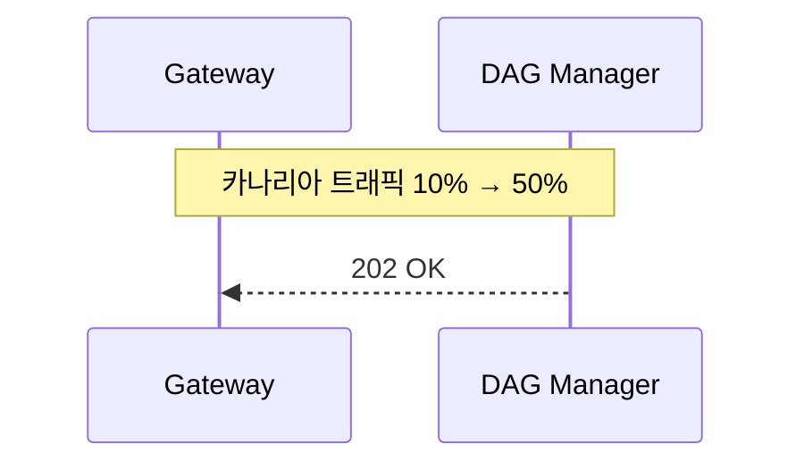

{{ nav_links() }}

# QMTL DAG Manager — 그래프 SSOT와 토픽 오케스트레이션

## 관련 문서
- [아키텍처 개요](README.md)
- [QMTL 아키텍처](architecture.md)
- [게이트웨이](gateway.md)
- [린 브로커리지 모델](lean_brokerage_model.md)
- [QMTL 구현 추적성](implementation_traceability.md)
- [DAG Manager 런타임 및 배포 프로필](../operations/dag_manager_runtime.md)
- [Neo4j 마이그레이션 & 롤백](../operations/neo4j_migrations.md)

추가 참고
- 레퍼런스: [Commit‑Log 설계](../reference/commit_log.md), [TagQuery 사양](../reference/tagquery.md)
- 운영 가이드: [타이밍 컨트롤](../operations/timing_controls.md)

!!! note "런타임과 배포"
    dev/prod 프로필, Neo4j/Kafka/ControlBus 기동 조건, 장애 대응 포인트는 [DAG Manager 런타임 및 배포 프로필](../operations/dag_manager_runtime.md)에서 운영 규칙으로 관리한다.

---

## 0. 역할 요약 & 설계 철학

| 핵심 책임                               | 세부 설명                                                | 관련 섹션        |
| ----------------------------------- | ---------------------------------------------------- | ------------ |
| **Graph DB Single Source of Truth** | Neo4j Property Graph → 모든 전략 노드·토픽·버전 메타가 단일 그래프에 영속 | §1 데이터 모델    |
| **DAG Diff 엔진**                     | 제출 DAG와 Neo4j 그래프 간 구조·해시 비교 → 재사용/신규 노드 판정·토픽 매핑     | §2 Diff 알고리즘 |
| **토픽 오케스트레이션**                       | Idempotent 토픽 생성·TTL·GC·버전 롤아웃, ref‑count 기반 제거      | §3, §4       |
| **버전 관리·롤백**                        | Version Sentinel 노드로 그래프 버전 경계 표시 → 카나리아 트래픽 스플릿·롤백  | §2, §3‑A     |

> **설계 철학:** “계산 그래프 + 메시징 큐”를 **불변 ID**로 연결해 재현성·롤백 가능성을 최우선. 모든 변형은 새 노드·토픽으로 분기하고, 레거시는 TTL+GC로 안전 제거.
> SDK 측에서 실행되는 모든 `compute_fn`은 `NodeCache.view()`가 반환하는 read-only `CacheView` 한 개만을 인자로 받는다.

---

## 0-A. 소유권 및 커밋 로그 설계

- **Ownership** — DAG Manager는 ComputeNode와 Queue 메타데이터의 단일 소스로서 토픽 생성·버전 롤아웃·GC를 전담한다. Gateway는 제출 파이프라인을 조정하지만 그래프 상태를 소유하지 않으며, WorldService는 월드·결정 상태를 유지한다.
- **Commit Log** — 모든 큐는 Redpanda/Kafka의 append-only 토픽으로 구현되며, DAG Manager는 `QueueUpdated` 등 제어 이벤트를 ControlBus 토픽에 발행한다. 토픽 생성·삭제 이력도 관리 로그에 기록되어 장애 시점 복원과 감사(audit)을 지원한다.

> 용어/SSOT 경계: 전역 전략 그래프(GSG, Global Strategy Graph)의 SSOT는 DAG Manager이며 불변(append‑only)입니다. 월드 로컬 객체(World View Graph=WVG: WorldNodeRef, Validation, DecisionsRequest)의 SSOT는 WorldService이고, DAG Manager는 이를 저장하지 않습니다(읽기/쓰기 금지). 용어 정의는 Architecture Glossary(architecture/glossary.md)를 참고하세요.

### 0-A.1 커밋 로그 메시지 키와 파티셔닝

- 파티션 키는 `partition_key(node_id, interval, bucket_ts, compute_key?)`에서 파생됩니다. `compute_key`가 제공되면 결과에 `#ck=<compute_key>` 접미사가 추가되며, `interval`/`bucket_ts`가 비어 있으면 `0`으로 정규화합니다.
- Gateway가 사용하는 전체 Kafka 메시지 키는 다음과 같습니다:

  `"{partition_key(node_id, interval, bucket_ts, compute_key?)}:{input_window_hash}"`

  동일 실행 키에 대해 모든 입력 윈도우를 가로지르는 로그 컴팩션을 허용하면서, 윈도우별 고유성을 유지합니다.

- 컨슈머는 `(node_id, bucket_ts, input_window_hash, compute_key?)` 조합으로 중복을 제거해야 합니다.


---

## 1. 데이터 모델 (Neo4j Property Graph)

### 1.1 노드·관계 스키마

| Label             | 필수 속성                                                           | 선택 속성                                   | 설명                      |
| ----------------- | --------------------------------------------------------------- | --------------------------------------- | ----------------------- |
| `ComputeNode`     | `node_id`(pk), `node_type`, `interval`, `period`, `code_hash`, `schema_compat_id`, `params_canon` | `created_at`, `tags[]`, `owner`, `schema_hash`         | DAG 연산 노드 (지표·전처리·매매 등) |
| `Queue`           | `topic`, `created_at`, `ttl`, `retention_ms`                    | `brokers`, `tag`, `lag_alert_threshold` | Kafka/Redpanda 토픽       |
| `VersionSentinel` | `version`, `commit_hash`, `created_at`                          | `release_tag`, `traffic_weight`         | 버전 경계 · 롤백 포인트          |
| `Artifact`        | `path`, `checksum`, `size`                                      | `framework`, `dtype`                    | 모델·파라미터 파일 등 binary     |

DAG Manager의 `Artifact` 노드는 그래프 메타데이터와 참조 관계만 소유한다. 물리 아티팩트 파일, Feature Artifact Plane, Seamless 산출물의 보존/삭제는 해당 런타임 저장소가 소유하며, DAG Manager GC는 별도 정책이 문서화되기 전까지 이를 삭제하거나 아카이브하지 않는다.

**Relationships**

```
(ComputeNode)-[:EMITS]->(Queue)
(VersionSentinel)-[:HAS]->(ComputeNode)
(Artifact)-[:USED_BY]->(ComputeNode)
```

### 1.1-A 스키마 호환 식별자 필드명

- DAG Manager 내부 표준 필드명은 `schema_compat_id`입니다. Proto(`BufferInstruction`)와 Neo4j 저장 속성도 동일한 이름을 사용합니다.
- 입력 호환을 위해 DAG JSON에는 한시적으로 `schema_id`를 레거시 별칭으로 허용하되, 값은 `schema_compat_id`로 정규화해서 처리합니다. `schema_compat_id`와 `schema_id`가 동시에 존재하고 값이 다르면 정규화 단계에서 오류로 처리합니다(입력 경계에서 거부).
- 기존 Neo4j 데이터가 `schema_id`만 가지고 있다면 아래 쿼리로 백필을 수행합니다.

```cypher
MATCH (c:ComputeNode)
WHERE (c.schema_compat_id IS NULL OR c.schema_compat_id = '')
  AND c.schema_id IS NOT NULL AND c.schema_id <> ''
SET c.schema_compat_id = c.schema_id
```

### 1.2 인덱스 & 제약 조건

아래 제약/인덱스는 초기화시 항상 idempotent(재실행 안전)하도록 `IF NOT EXISTS`를 사용합니다. 운영 환경에서 재배포/재시작 시에도 스키마 초기화 커맨드를 반복 호출할 수 있습니다.

```cypher
// 기본 제약/인덱스
CREATE CONSTRAINT compute_pk IF NOT EXISTS ON (c:ComputeNode) ASSERT c.node_id IS UNIQUE;
CREATE INDEX kafka_topic IF NOT EXISTS FOR (q:Queue) ON (q.topic);

// 성능 최적화 인덱스 (태그 조회, 주기 필터, 버퍼 스캔)
CREATE INDEX compute_tags IF NOT EXISTS FOR (c:ComputeNode) ON (c.tags);
CREATE INDEX queue_interval IF NOT EXISTS FOR (q:Queue) ON (q.interval);
CREATE INDEX compute_buffering_since IF NOT EXISTS FOR (c:ComputeNode) ON (c.buffering_since);
```

운영자의 초기화/내보내기/롤백 커맨드는 [Neo4j 마이그레이션 & 롤백](../operations/neo4j_migrations.md)에서 관리한다.
### 1.3 NodeID 생성 규칙
- NodeID = `blake3:<digest>`이며, 다음의 정규 직렬화 입력을 해시합니다: 
  `(node_type, interval, period, params(분리·정규화), dependencies(node_id 기준 정렬), schema_compat_id, code_hash)`
- 비결정적 필드(타임스탬프, RNG 시드, 환경변수)는 입력에서 제외합니다. 분리 가능한 파라미터는 개별 필드로 나누고, 키 정렬·숫자 정밀도 고정의 정규 JSON으로 직렬화합니다.
- NodeID에는 `world_id`가 포함되면 안 됩니다. 월드 격리는 WVG(World View Graph)와 큐 네임스페이스(예: world `topic_prefix`)의 책임입니다.
- 정규화 보장:
  - 내용이 동일한 파라미터 맵은(삽입/키 순서 무관) 동일한 NodeID로 해시됩니다.
  - 의존성 식별자는 해시 전 사전식으로 정렬하여 업로드 순서가 다이제스트에 영향을 주지 않도록 합니다.
  - 표시용 메타데이터(`name`, `tags`, `metadata` 등)와 비결정적 입력은 해시 전에 제거합니다.
  - `blake3:` 접두사가 없는 NodeID는 Gateway 검증에서 거부됩니다.
  - 충돌 완화: `existing_ids`에 이미 동일 다이제스트가 있을 때 도메인 분리 접미사를 사용한 결정적 재해시(BLAKE3)를 적용합니다(§3.1의 XOF 권고 반영).
- TagQueryNode 정규화:
  - 런타임에 해석된 업스트림 큐 집합은 `dependencies`에 포함하지 않습니다.
  - 대신 질의 명세를 `params_canon`에 포함합니다(정규화된 `query_tags` 정렬, `match_mode`, `interval`).
  - 큐의 동적 발견/확장은 ControlBus 이벤트로 처리되며 NodeID에는 영향을 주지 않습니다.
- `schema_compat_id`를 사용합니다(`schema_hash`가 아님). 경미한 스키마 변경은 새 NodeID를 강제하지 않고 버퍼링되며, 호환 불가일 때만 새 ID가 생성됩니다.
- 표시 전용 메타데이터(표시 이름 `name`, 분류 태그 `tags`)는 NodeID에 포함되지 않습니다. 기능적 파라미터만 `params_canon`에 포함됩니다.
- BLAKE3를 사용합니다. 충돌 대비가 필요할 때는 도메인 분리를 적용한 **BLAKE3 XOF**(더 긴 출력)를 사용하세요. 모든 ID는 `blake3:` 접두사를 가져야 합니다.
- 고유성은 `compute_pk` 제약으로 보장합니다. `schema_compat_id`는 노드 메시지 포맷의 Schema Registry 주요 호환 식별자(major‑compat)를 참조합니다.
- **Schema compatibility:** Minor/Patch 수준의 스키마 변경은 `schema_compat_id`를 유지하여 `node_id`를 보존한다. 실제 바이트 수준 스키마 변경은 선택 속성 `schema_hash`로 추적해 버퍼링/재계산 정책에 활용한다.

### 1.3-A NodeID/TagQuery 결정성 불변식 및 관측 훅
- **동일 사양 → 동일 NodeID**: `(node_type, interval, period, params_canon, dependencies_sorted, schema_compat_id, code_hash)`가 동일하면 업로드 순서나 월드/도메인에 관계없이 하나의 NodeID만 생성된다.
- **세계/도메인 배제**: `world_id`, `execution_domain`, `as_of`, `partition`은 NodeID 입력에 포함되지 않는다. 실행/캐시 격리는 `ComputeKey`(§1.4)·`EvalKey`가 담당하며, NodeID 재사용과 도메인 격리를 혼동하지 않는다.
- **TagQuery 정규화**: NodeID 입력은 정규화된 `query_tags`(정렬·중복 제거), `match_mode`, `interval`만 포함한다. 런타임에 발견된 업스트림 큐 집합은 ControlBus → TagQueryManager 경로로만 전달되며, NodeID에는 절대 포함하지 않는다.
- **스키마/코드 경계**: `schema_compat_id`와 `code_hash`가 바뀔 때만 새 NodeID가 나온다. Minor/patch 스키마 변경은 동일 NodeID를 유지하되 버퍼링·검증 경로에서 처리한다.
- **입력 정규화**: 모든 의존성은 NodeID 기준 사전식 정렬, 파라미터는 숫자 정밀도 고정·불변 JSON 직렬화(키 정렬)로 정규화한다. 비결정적 필드와 표시 전용 메타데이터는 해시 전에 제거한다.

**관측·검증 패턴**
- NodeID 불변식 위반: Gateway가 제출 노드의 정식 NodeID를 재계산하고, 불일치 시 400을 반환하며 `nodeid_checksum_mismatch_total`, `nodeid_missing_fields_total{field,node_type}`, `nodeid_mismatch_total{node_type}`를 증가시킨다(관련 구현: Gateway).
- TagQuery 불변식 위반: TagQueryNode에서 재계산 불일치가 감지되면 Gateway가 `tagquery_nodeid_mismatch_total`을 증가시키고(베스트 에포트) SDK/Runner가 캐시를 무효화하도록 유도한다.
- 도메인 격리: `cross_context_cache_hit_total`(§1.4)을 DAG Manager/SDK 공통 메트릭으로 필수화한다. 값이 0 초과이면 캐시 재사용을 차단하고(정책) 알람으로 승격한다.

NodeID 재계산 드리프트/지연(히스토그램) 및 TagQuery 스펙 해시/해결 큐 카디널리티 메트릭의 추가 구현은 이슈 `#1784`, `#1786`에서 추적한다. 현재 규범 계약은 이 관측 훅의 존재 여부와 무관하게 유효하다.

### 1.4 도메인 범위 ComputeKey (신규)

- 배경: NodeID는 설계상 전역이며 월드에 무관합니다. 캐시 및 런타임 중복 제거에서 월드/도메인 간 재사용이 실수로 발생하지 않도록, 실행/캐싱에는 별도의 ComputeKey를 사용합니다.
- 정의:

  `ComputeKey = blake3(NodeHash ⊕ world_id ⊕ execution_domain ⊕ as_of ⊕ partition)`

  - `NodeHash`는 NodeID(§1.3)가 사용하는 정준 해시입니다.
  - `world_id`는 실행 범위를 특정 월드로 한정합니다. `execution_domain ∈ {backtest,dryrun,live,shadow}`는 백테스트/라이브 분리를 보장합니다.
  - `as_of`는 백테스트를 특정 데이터셋 스냅샷/커밋에 묶으며, 결정적 재현을 위해 필요합니다.
  - `partition`은 멀티 테넌시 또는 전략/포트폴리오 파티션을 위해 선택적으로 사용됩니다.
- 사용:
  - NodeCache 및 모든 계산 중복 제거는 반드시 `node_id`만이 아니라 `ComputeKey`를 키로 사용해야 합니다.
  - 교차 컨텍스트 캐시 히트(동일 `node_id`이지만 `(world_id|execution_domain|as_of|partition)`가 다른 경우)는 위반으로 간주해야 하며, 메트릭 `cross_context_cache_hit_total`로 보고하고 정책에 의해 차단해야 합니다(SLO: 0).
  - 큐 토픽과 NodeID는 변경되지 않습니다. ComputeKey는 토픽 명명에 영향을 주지 않습니다. 운영자는 운영적 격리를 위해 브로커 수준에서 네임스페이스 프리픽스 `{world_id}.{execution_domain}.<topic>`를 추가로 도입할 수 있습니다(WorldService 문서 참조).
  - 계측: DAG Manager와 SDK는 `cross_context_cache_hit_total`을 반드시 내보내야 하며, 값이 0 초과일 경우(치명) 경보를 발송합니다. 해소될 때까지 프로모션 워크플로우는 중단해야 합니다.
  - 완전성: `as_of`는 백테스트/드라이런에서 반드시 비어 있지 않아야 합니다. 이 값은 Gateway가 제공합니다. 값이 없으면 공유 헬퍼 `ComputeContext.evaluate_safe_mode()`(경로: `qmtl/foundation/common/compute_context.py`)가 요청을 compute-only/백테스트 도메인으로 강등하고, 세이프 모드 플래그를 전환하며, 'live' 센티널을 절대 생성하지 않은 채 재사용을 차단합니다.

참고: 이 설계는 NodeID의 안정성을 유지하면서, 월드와 도메인 전반에 걸친 강력한 실행 격리를 제공합니다.

---

## 2. Diff 알고리즘 (v2)

### 2.1 입력·출력 정의

* **Input:** `DiffReq{strategy_id, dag_json, world_id?, execution_domain?, as_of?, partition?, dataset_fingerprint?}` (\~10‑500 KiB)
* **Output:** stream `DiffChunk{queue_map, sentinel_id, buffer_nodes, version, crc32?}`

### 2.2 단계별 상세 로직

1. **Node Pre‑scan** O(N) 

   * 파이썬 `orjson` → DAG dict → topo sort → node\_id list.
2. **DB Fetch** Batch `MATCH (c:ComputeNode WHERE c.node_id IN $list)` → 기존 노드 맵.
3. **Hash Compare**

   | 케이스                 | 처리               | 큐 정책                                             |
   | -------------------- | ---------------- | ------------------------------------------------ |
   | `node_id` 동일          | **재사용**          | 기존 Queue join                                    |
   | Back‑compat 스키마 변경    | **재사용 + 버퍼링 모드** | 큐 lag = history size, 7일 이후 자동 full‑recompute |
   | `node_id` 상이           | **신규 노드·큐**      | `topic_suffix=_v{n}`, TTL inherit                |
4. **Sentinel 삽입** `CREATE (:VersionSentinel{...})‑[:HAS]->(new_nodes)` (옵션)
5. **Queue Upsert**

   * Kafka Admin API는 아키텍처(§2)에 명시된 대로 멱등 토픽 생성이 활성화된 상태로 실행되어야 합니다.
   * gRPC Bulk `CreateTopicsRequest` idempotent.
   * 실패 시 `CREATE_TOPICS→VERIFY→WAIT→BACKOFF` 5단계 재시도를 수행하고,
     VERIFY 단계에서 broker metadata를 조회하여 유사 이름 충돌 여부를 확인한다.
6. **Stream 전송** 100 items/≤1 MiB chunk + ACK window(10).

### 2.3 알고리즘 복잡도

* 그래프 인덱스 hit → O(N) 
* Network Δ ≈ (#chunks × rtt)
* 1k 노드 기준 p95 < 80 ms (λ=50 req/s 시험 환경)

---

### 2‑A. Gateway ↔ DAG Manager 인터페이스 (확장)

| 방향  | Proto | Endpoint                      | Payload         | 응답                 | Retry/Timeout      | 목적               |
| --- | ----- | ----------------------------- | --------------- | ------------------ | ------------------ | ---------------- |
| G→D | gRPC  | `DiffService.Diff`            | `DiffRequest`   | `DiffChunk stream` | backoff 0.5→4 s ×5 | Diff & 토픽 매핑      |
| G→D | gRPC  | `DiffService.AckChunk`        | `ChunkAck`      | `ChunkAck`         | –                  | Diff 스트림 ACK     |
| G→D | gRPC  | `AdminService.Cleanup`        | `CleanupRequest(strategy_id)` | `CleanupResponse` | 1 retry | 수동 GC 트리거(현행 구현에서 전략 ID 미사용) |
| G→D | gRPC  | `AdminService.GetQueueStats`  | `QueueStatsRequest(filter)` | `QueueStats` | 300 ms | 모니터링 |
| G→D | gRPC  | `TagQuery.GetQueues`          | `TagQueryRequest(tags, interval, match_mode)` | `TagQueryReply` | – | 태그 기반 큐 조회 |
| G→D | gRPC  | `HealthCheck.Status`          | `StatusRequest` | `StatusReply`      | 30 s interval      | Liveness         |
| G→D | HTTP  | `/status`                     | –               | 200 + health payload | 30 s interval    | 상태 점검         |
| G→D | HTTP  | `/admin/gc-trigger`           | id              | 202 + `processed[]` | 2 retry          | Manual GC        |
| G→D | gRPC  | `AdminService.RedoDiff`       | `sentinel_id`, `dag_json` | `DiffResult` | manual | 재Diff·롤백 |
| D→G | CB    | `queue` topic                 | queue_update/gc | at-least-once      | –                  | 큐 이벤트         |
|     |       |                               |                 |     |                    | 자세한 절차는 [카나리아 롤아웃 가이드](../operations/canary_rollout.md) 참조 |

참고: `AdminService.Cleanup`과 `/admin/gc-trigger`는 입력 식별자를 받지만, 현재 구현은 전체 GC 배치를 실행하며 해당 ID를 사용하지 않습니다.

### 2‑B. 센티널 트래픽

센티널 가중치 업데이트는 ControlBus의 `sentinel_weight` 이벤트로 게시됩니다. 자세한 내용은 [카나리아 롤아웃 가이드](../operations/canary_rollout.md)를 참조하세요.

---

## 3. 토픽 생성 & 명명 규칙 (확장)

### 3.1 토픽 이름 컨벤션

```
{asset}_{node_type}_{short_hash}_{version}
```

* `short_hash = first 8 of node_id digest` → 충돌 시 길이+2.
* 기본 토픽 설정은 코드의 ``_TOPIC_CONFIG`` 에서 관리되며 ``get_config(topic_type)`` 으로 조회한다.
* `{version}` 값은 `VersionSentinel.version` 혹은 전략 메타데이터(`meta.version`, `meta.strategy_version`)에서 파생되며, 제공되지 않으면 `v1`로 디폴트된다.

### 3.2 QoS & 레플리카 설정

| 토픽 타입        | partitions | rep\_factor | retention | compaction |
| ----------- | ---------- | ----------- | --------- | ---------- |
| Raw (price) | 3          | 3           | 7d        | none       |
| Indicator   | 1          | 2           | 30d       | delete     |
| Trade Exec  | 1          | 3           | 90d       | none       |

---

### 3‑A. 엔드투엔드 상호작용 시나리오 (확장)

*(이전 표 + `RedoDiff` & 카나리아 포함)*

| # | 시나리오                       | 요약                                                                                     |
| - | -------------------------- | -------------------------------------------------------------------------------------- |
| 5 | **RedoDiff for Hotfix**    | 버그 수정 코드 빠르게 패치 → `RedoDiff` gRPC 요청 → 새 토픽 vX.Y.Z‑hotfix 생성 후 스왑                       |

---

### 3‑B. Control Events (QueueUpdated) (New)

DAG Manager는 큐 가용성 및 태그 해상도에 대한 제어‑플레인 업데이트를 발행하여 Gateway가 폴링 없이 실시간으로 SDK를 갱신할 수 있게 합니다.

- 발행자: DAG Manager → ControlBus(내부)
- 이벤트: CloudEvent `type="queue_updated"`, payload `data.type="QueueUpdated"`

```json
{
  "type": "QueueUpdated",
  "tags": ["BTC", "price"],
  "interval": 60,
  "queues": [
    {"queue": "q1", "global": false},
    {"queue": "q2", "global": true}
  ],
  "match_mode": "any",
  "version": 1,
  "etag": "q:BTC.price:60:1",
  "idempotency_key": "queue_updated:BTC.price:60:any:1",
  "ts": "2025-08-28T09:00:00Z"
}
```

의미론(Semantics)
- 파티션 키: `",".join(tags)`를 Kafka key로 사용하며, 브로커 해시로 파티션이 결정됨(동일 키 범위에서만 순서 보장)
- 최소 1회 전달; 컨슈머는 ``etag`` 또는 ``idempotency_key``로 중복 제거
- Gateway는 구독 후 WS로 SDK에 재브로드캐스트; 분기 시 SDK TagQueryManager가 주기적 HTTP 리컨실로 복구
- `QueueUpdated`는 현재 `(tags, interval)`의 사후 큐 집합을 나타낸다. 삭제/아카이브 이유는 별도 `QueueLifecycle` payload로 발행한다.

### 3-C. GC Lifecycle Events (`QueueLifecycle`)

GC가 큐를 삭제하거나 아카이브 대상으로 처리하면 DAG Manager는 같은 ControlBus queue topic에 lifecycle payload를 먼저 발행하고, 이어서 `QueueUpdated`로 사후 큐 집합을 발행한다.

```json
{
  "type": "QueueLifecycle",
  "queue": "sentinel_q",
  "action": "archive",
  "reason": "eligible",
  "tag": "sentinel",
  "interval": 60,
  "archive_status": "archived",
  "version": 1,
  "etag": "ql:sentinel_q:archive:eligible:1",
  "idempotency_key": "queue_lifecycle:sentinel_q:archive:eligible:1",
  "ts": "2025-08-28T09:00:00Z"
}
```

- CloudEvent `type`은 `queue_lifecycle`, payload `data.type`은 `QueueLifecycle`이다.
- `action`은 `drop` 또는 `archive`다. `archive_status`는 `archived`, `missing_client`, `failed` 중 하나다.
- Gateway는 lifecycle 이벤트를 WebSocket `queue_lifecycle` 이벤트로 중계한다. 큐 조회 상태의 SSOT는 여전히 DAG Manager이며, Gateway는 삭제 판단을 직접 하지 않는다.


```mermaid
sequenceDiagram
    participant G as Gateway
    participant D as DAG Manager
    Note over G,D: 카나리아 트래픽 10% → 50%
        D-->>G: 202 OK
```

---

참고: 큐/태그 변경, 트래픽 가중치 등 제어 업데이트는 내부 ControlBus에 게시되며, Gateway가 WebSocket으로 SDK에 중계합니다. 별도의 콜백 인터페이스는 제공하지 않습니다.

## 4. 운영 경계

다음 항목은 DAG Manager의 규범 계약 자체가 아니라 운영 문서에서 관리한다.

- GC/보관 정책, 배치 크기, incident 대응: [DAG Manager 런타임 및 배포 프로필](../operations/dag_manager_runtime.md)
- 관측 지표, 경보, 골든 시그널: [모니터링](../operations/monitoring.md), [Core Loop 골든 시그널](../operations/core_loop_golden_signals.md)
- Neo4j 초기화/롤백 및 서버 설정: [Neo4j 마이그레이션 & 롤백](../operations/neo4j_migrations.md)
- 카나리아/롤백 절차: [카나리아 롤아웃](../operations/canary_rollout.md)

구현 범위와 현재 테스트/운영 자산은 [QMTL 구현 추적성](implementation_traceability.md)에서 추적한다.

{{ nav_links() }}
