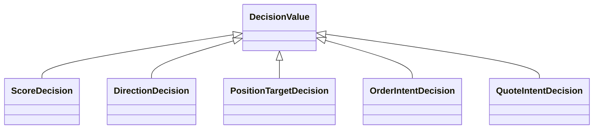
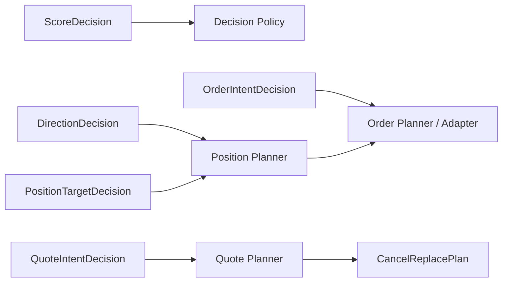

{{ nav_links() }}

# QMTL Decision Algebra

## 관련 문서

- [QMTL 설계 원칙](design_principles.md)
- [QMTL Capability Map](capability_map.md)
- [Semantic Types](semantic_types.md)
- [아키텍처 개요](architecture.md)

## 목적

QMTL은 전략 archetype마다 완전히 다른 의사결정 모델을 두지 않는다.
대신 실행 의도를 공통 algebra로 표현하고,
planner가 그 subtype을 해석해 실행 계획으로 변환하는 구조를 지향한다.

이 문서는 그 공통 decision family를 정의한다.

## 핵심 원칙

- inference와 rule engine은 공통 decision algebra를 출력해야 한다.
- planner는 decision subtype을 입력으로 받아 plan을 생성한다.
- 새로운 전략 방식은 새 archetype enum이 아니라 새 decision subtype 또는 새 planner로 확장한다.
- legality는 decision name이 아니라 semantic type과 planner contract로 판정한다.

## Decision family

## 각 decision subtype

### ScoreDecision

Concept ID: `DEC-SCORE`

실행 전 단계의 점수 또는 신뢰도다.
추후 thresholding, ranking, allocation, quote skew 계산의 입력으로 사용될 수 있다.

예:

- alpha score
- fill probability estimate
- adverse selection risk score

### DirectionDecision

Concept ID: `DEC-DIRECTION`

방향성 판단을 표현한다.
Long/short/flat 또는 buy/sell/hold와 같은 고수준 판단이 여기에 속한다.

### PositionTargetDecision

Concept ID: `DEC-POSITION-TARGET`

원하는 목표 포지션 또는 목표 비중을 표현한다.
Directional 전략의 일반적인 planner 입력이다.

### OrderIntentDecision

Concept ID: `DEC-ORDER-INTENT`

주문 단위의 실행 의도를 표현한다.
Price, quantity, tif, reduce_only, venue hint 등의 주문 의미를 포함할 수 있다.

### QuoteIntentDecision

Concept ID: `DEC-QUOTE-INTENT`

양방향 또는 다중 quote 집합을 표현하는 실행 의도다.
MM은 일반적으로 이 subtype을 중심으로 planner를 구성한다.

예:

- bid/ask quote pair
- inventory-adjusted skewed quotes
- cancel/replace candidate set

## Planner 관계

Decision algebra의 핵심은 decision과 planner를 분리하는 것이다.

### Position Planner

Concept ID: `PLAN-POSITION-PLANNER`

`DirectionDecision` 또는 `PositionTargetDecision`을
`OrderIntentDecision` 또는 order-level plan으로 변환한다.

### Quote Planner

Concept ID: `PLAN-QUOTE-PLANNER`

`QuoteIntentDecision`과 `MutableExecutionState`를 입력으로 받아
유지·취소·수정·신규 발행이 포함된 `CancelReplacePlan`을 생성한다.

이 차이는 archetype 분기가 아니라 planner contract 차이로 표현한다.

## 실행 상태와의 관계

Decision은 실행 의도이고, execution state는 현재 세계의 mutable state다.
둘은 명시적으로 구분한다.

- decision은 “무엇을 하려는가”
- execution state는 “현재 무엇이 열려 있고 체결되었는가”

예:

- inventory는 state다.
- inventory target은 decision이다.
- open quote book은 state다.
- next quote set은 decision 또는 plan이다.

## ML + MM 조합 예시

`ML + MM`은 별도 특수 케이스가 아니라 아래 조합으로 설명된다.

1. Observation: order book, trades, fills
2. Feature Extraction: microstructure features
3. Inference: fair value, fill probability, adverse selection score
4. Decision: `QuoteIntentDecision`
5. Planner: `QuotePlanner`
6. Adapter: venue cancel/replace API
7. State: open quotes, fills, inventory

여기에는 `if mm and ml` 같은 조합별 특례가 필요하지 않다.
ML은 inference capability이고, MM은 quote planning capability이기 때문이다.

## 확장 규칙

새 전략 방식이 들어올 때는 아래 순서로 판단한다.

1. 기존 decision subtype으로 표현 가능한가?
2. 가능하다면 새 planner나 policy만 추가하면 되는가?
3. 불가능하다면 진짜로 새로운 decision family가 필요한가?
4. 필요하다면 새 subtype을 추가하되,
   semantic type과 planner contract를 함께 문서화한다.

새 전략 방식이 들어올 때마다 새 top-level strategy kind를 추가하는 것은
가능한 한 피한다.

## 비목표

Decision algebra는 모든 전략의 내부 사고 과정을 동일하게 만들기 위한 것이 아니다.
목표는 서로 다른 추론 방식이 공통 실행 경계로 수렴할 수 있도록 하는 것이다.

따라서 algebra는 구현 세부를 숨기되,
planner와 policy가 이해할 수 있는 최소 공통 실행 의미를 보존해야 한다.

{{ nav_links() }}
