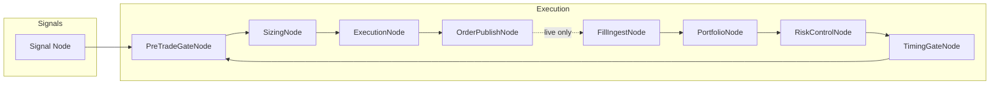
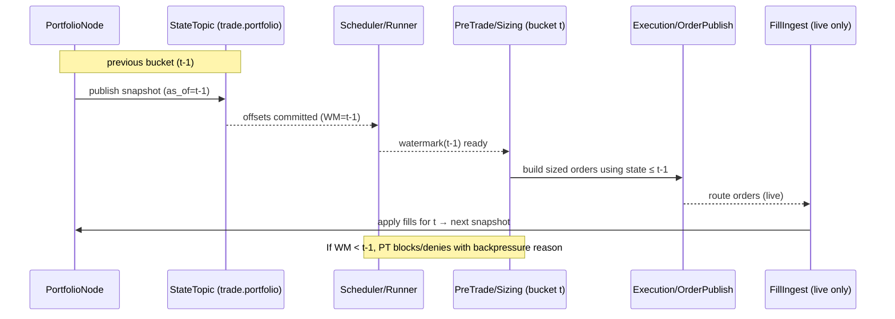
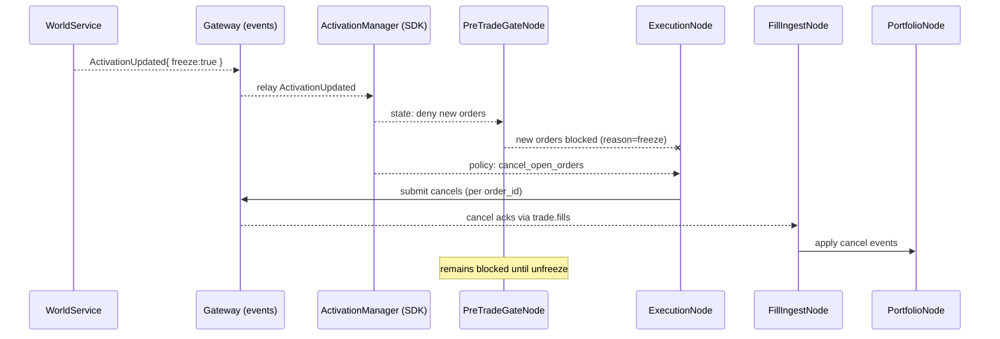
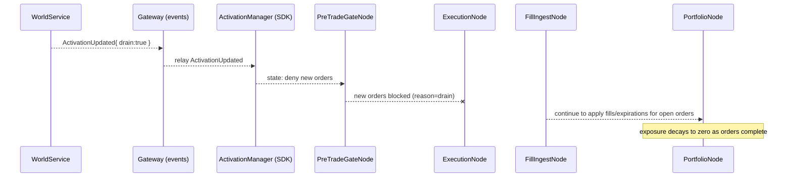

{{ nav_links() }}

# 거래소 노드 세트 — 실행 레이어 구성

## 0. 목적과 Core Loop 상 위치

- 목적: 시그널 이후 트레이드 실행을 재사용 가능한 거래소별 "노드 세트"로 구성하는 방법을 정의해, 전략이 개별 실행 노드를 직접 조합하지 않고도 현실적인 주문 경로를 쉽게 구성하도록 돕습니다.
- Core Loop 상 위치: Core Loop의 **“전략 실행 및 주문 경로”** 단계에서, 신호 노드와 실행/포트폴리오/리스크 노드를 안정적으로 연결하는 표준 실행 레이어를 제공합니다.

본 문서는 시그널 이후 트레이드 실행을 재사용 가능한 거래소별 "노드 세트"로 구성하는 방법을 정의합니다. 전략의 신호 노드 뒤에 이 세트를 연결하면 QMTL의 DAG 의미론과 WS/DM 책임 경계를 유지하면서 실행을 붙일 수 있습니다.

의도
- CCXT 현물 등 거래소 기반의 "트레이딩 시스템" 레시피를 블랙박스 노드 세트로 제공해 공통 구성 요소를 다시 배선하지 않고 빠르게 실행을 붙일 수 있도록 합니다. SDK 조합은 여전히 맞춤 파이프라인을 위해 열려 있습니다.
- 노드 세트를 진정한 블랙박스로 취급합니다. `describe()`/`capabilities()`를 통해서만 포트와 메타데이터를 노출하며, 전략 코드에서 내부 스텝 노드에 직접 접근하지 않습니다.

## 동기

전략이 트레이드 신호를 내보낸 뒤에는 활성화, 프리트레이드 점검, 사이징, 실행, 체결, 포트폴리오, 리스크, 타이밍 간의 피드백이 필요합니다. 이를 단순히 루프로 연결하면 그래프 순환이 생깁니다. QMTL은 지연된 엣지와 이벤트 소싱된 상태 토픽으로 피드백을 모델링해 DAG 불변식을 유지합니다.

목표
- DAG를 비순환으로 유지하고 피드백은 시간 이동 입력으로 표현합니다.
- 거래소 특성을 얇은 커넥터로 캡슐화하고 준비된 노드 세트를 제공합니다.
- 책임을 보존합니다: DAG Manager(큐·그래프), WorldService(활성화·정책), SDK(실행 배선).

비목표
- WS는 주문/체결/포트폴리오 상태를 보유하지 않습니다. 여전히 활성화·정책의 단일 진실 소스로 남습니다.
- DM은 브로커 웹훅을 수집하지 않습니다. 큐를 관리하고 연산을 오케스트레이션합니다.

## 구성 개요



핵심
- 피드백은 실제 사이클이 아닙니다. P는 t−1 시점의 포트폴리오/리스크 스냅샷(또는 압축 상태 토픽)을 소비해 비순환성을 유지하면서 피드백을 가능하게 합니다.
- 시뮬레이트/페이퍼 모드에서는 `ExecutionNode`가 직접 체결을 생성하고, 라이브 모드에서는 거래소/브로커에서 온 체결을 `FillIngestNode`가 수신합니다.

팁
- 암호화폐 거래소의 경우 `make_ccxt_brokerage()`로 CCXT에서 일반 프로파일을 구성해 메이커/테이커 수수료가 반영된 실행 모델을 빠르게 연결할 수 있습니다. Reference → Brokerage API를 참고하세요.

## 사용법

- 노드 세트를 DAG 위의 편의 래퍼로 취급합니다. 신호 뒤에 붙이고 반환된 세트를 전략에 추가하세요. 내부 노드를 골라 쓰지 마세요. 구현 세부는 변경될 수 있습니다.
- 레지스트리를 통해 조합해 레시피 검색성과 공유 테스트 커버리지를 유지하세요.

```python
from qmtl.runtime.nodesets.registry import make

nodeset = make("ccxt_spot", signal, "demo-world", exchange_id="binance")
strategy.add_nodes([price, alpha, signal, nodeset])  # NodeSet을 그대로 추가

# 선택적 메타데이터(내부가 아닌 외부 정보)
info = nodeset.describe()        # { name, entry, exit, nodes[], ports? }
caps = nodeset.capabilities()    # { modes: [...], portfolio_scope: ... }
```

- 고급 재정의를 위해 직접 레시피를 가져올 수 있지만, 가능한 레지스트리 뒤에 머물러 어댑터 생성과 계약 테스트 혜택을 받으세요.

```python
from qmtl.runtime.nodesets.recipes import make_ccxt_spot_nodeset

nodeset = make_ccxt_spot_nodeset(signal, "demo-world", exchange_id="binance")
```

- 레시피는 데코레이터로 등록해 자동 검색을 유지하세요.

```python
from qmtl.runtime.nodesets.registry import nodeset_recipe


@nodeset_recipe("my_adapter")
def make_my_adapter(signal, world_id, **kwargs):
    ...  # NodeSet 반환
```

다른 호출자가 기존 레시피 이름을 재사용하면 레지스트리가 `ValueError`를 발생시켜 무음 섀도잉을 막습니다.

내부 분기
- 필요 시 노드 세트 내부에 분기/조인 노드를 포함할 수 있습니다(예: 사이징 주문과 마켓 데이터를 결합하는 실행 단계). 전략에서는 블랙박스로 다루고, 다중 입력이 필요하면 어댑터의 포트 스펙으로 노출하세요.

컴포넌트 재정의
- 첨부 시 아무 컴포넌트나 재정의해 커스텀 노드를 섞을 수 있습니다.

```python
builder = NodeSetBuilder()
custom_exec = make_my_execution_node(...)
nodeset = builder.attach(signal, world_id="demo", execution=custom_exec)
```

## 레시피, 어댑터, 계약

- `NodeSetRecipe`를 사용해 기본 스텝 배선, 공유 메타데이터(이름, 모드, 설명자), 어댑터 파라미터를 한 곳에 캡처하세요. 헬퍼가 컨텍스트 생성, 리소스 주입, 선택적 오버라이드를 처리합니다.
- `RecipeAdapterSpec`과 `build_adapter()`는 어떤 레시피에서도 `NodeSetAdapter`를 자동으로 만들어 노출되는 포트·모드·어댑터 파라미터가 항상 동기화되도록 합니다.
- 레지스트리 기반 레시피는 `tests/qmtl/runtime/nodesets/test_recipe_contracts.py`의 계약 테스트로 검증됩니다. 새 레시피는 파라미터에 추가해 체인 길이, 설명자 메타데이터, 포트폴리오/weight 함수 주입을 모드별로 확인하세요.
- 레시피 확장 시에는 노드를 수동으로 배선하기보다 `StepSpec.from_factory()`와 `inject_portfolio`, `inject_weight_fn` 같은 주입기를 사용하세요. 내부가 변해도 어댑터와 테스트가 유효하게 유지됩니다.

## 노드 계약

- [PreTradeGateNode]({{ code_url('qmtl/runtime/transforms/execution_nodes.py#L34') }})
  - 입력: 활성화(WS→Gateway), 심볼/시간/공매도 가능 공급자, 계정/매수력
  - 출력: 통과 주문 의도 또는 `RejectionReason`이 포함된 구조화 거절
  - 기반: `qmtl/runtime/sdk/pretrade.py`, `qmtl/foundation/common/pretrade.py`, `qmtl/runtime/brokerage/*`
  - 워터마크 게이팅: `qmtl.runtime.sdk.watermark.WatermarkGate`로 구성(`topic`, `lag`, 활성/비활성). `WatermarkGate.for_mode("simulate"|"paper"|"live")` 기본값을 사용하세요. 시뮬레이트/백테스트는 게이트 비활성, 페이퍼/라이브는 활성입니다.

- [SizingNode]({{ code_url('qmtl/runtime/transforms/execution_nodes.py#L80') }})
  - 입력: 주문 의도, 포트폴리오 스냅샷(t−1)
  - 출력: 헬퍼(value/percent/target_percent)를 활용한 수량 계산 주문
  - 소프트 게이팅: 선택적으로 `weight_fn` 콜백으로 활성화 가중치(`0..1`)를 적용합니다. 노드 세트는 SDK `ActivationManager.weight_for_side(...)`를 기반으로 한 함수를 전달합니다.
  - 기반: `qmtl/runtime/sdk/portfolio.py`, `qmtl/runtime/sdk/activation_manager.py`

- MicroBatchNode
  - 목적: 최신 버킷의 페이로드 리스트를 내보내 항목당 오버헤드를 줄입니다.
  - 사용 위치: 주문 게시(또는 체결 수집) 이후에 배치해 다운스트림 처리를 마이크로 배치합니다.
  - 기반: `qmtl/runtime/pipeline/micro_batch.py`

- ExecutionNode
  - 입력: 사이징된 주문, 마켓 데이터(OHLCV/호가), 브로커리지 프로파일
  - 출력: 시뮬레이트/페이퍼 체결 또는 라이브 모드의 OrderPayload
  - 기반: `qmtl/runtime/brokerage/*`, `qmtl/runtime/sdk/execution_modeling.py`

- OrderPublishNode
  - 입력: OrderPayload
  - 출력: Runner 훅을 통해 라우팅된 주문(HTTP/Kafka/커스텀 서비스)
  - 기반: `qmtl/runtime/transforms/publisher.py`, `qmtl/runtime/sdk/runner.py`

- FillIngestNode
  - 입력: 웹훅→Kafka 또는 클라이언트 폴링으로 들어온 브로커 체결/부분체결/취소 이벤트
  - 출력: 정규화된 체결 스트림

- PortfolioNode
  - 입력: 체결 스트림
  - 출력: 포트폴리오/포지션 스냅샷(압축)과 리스크 피처
  - 기반: `qmtl/runtime/sdk/portfolio.py`
  - 워터마크 토픽: 기본 `trade.portfolio` 토픽에 준비 상태 마커를 방출합니다. 게이트 토픽과 일치하도록 오버라이드하세요.

- RiskControlNode
  - 입력: 포트폴리오 스냅샷, 심볼별 메트릭
  - 출력: 한도/조정 결정(예: 포지션 사이즈 조절)
  - 기반: `qmtl/runtime/sdk/risk_management.py`

- TimingGateNode
  - 입력: 타임스탬프, 캘린더/시간 정책
  - 출력: 허용/거부와 사유, 다음 유효 시간 힌트
  - 기반: `qmtl/runtime/sdk/timing_controls.py`

## 사이클 없는 피드백

DAG 비순환성을 유지하기 위해 두 가지 패턴을 지원합니다.

1) 지연 엣지(t−1 스냅)
- `PortfolioNode`는 `(world_id, scope, symbol)` 키로 스냅샷을 게시합니다.
- `PreTradeGateNode`와 `SizingNode`는 현재 버킷보다 엄격히 이전(`<= t−1`)의 최신 스냅샷만 소비합니다.

2) 이벤트 소싱 상태 토픽
- `trade.portfolio`, `trade.open_orders` 등 압축 토픽을 사용해 노드 시작 시 상태를 재구성합니다.
- 소비자는 파티션 제약 내에서 중복과 재정렬을 처리해야 합니다.

두 옵션 모두 커밋 로그 설계와 호환되며 DM·WS의 단일 진실 소스를 변경하지 않습니다.

## 실행 의미(개선 사항)

!!! note "설계 의도"
- 피드백은 항상 `t−1`만 소비하고, 업스트림 워터마크 뒤에서 버킷 처리를 진행해 DAG 비순환성과 결정성을 유지합니다. 워터마크 게이팅은 시뮬레이트/백테스트에서 기본 비활성, 페이퍼/라이브에서 활성입니다.

- 지연 엣지 계약
  - 포트폴리오/리스크를 소비하는 노드는 명시적으로 시간 오프셋(예: `lag=1`)을 선언하고 이전 버킷 스냅샷만 읽어야 합니다. 이렇게 하면 버킷 경계에서 결정적 평가 순서를 보장하고 숨은 사이클을 막습니다.
  - 스케줄러 워터마크: 업스트림 상태 토픽이 `t−1` 워터마크까지 커밋된 뒤에만 버킷 처리를 진행합니다. 이는 DM 불변식을 바꾸지 않고 노드/스케줄러 인터페이스에 소프트 규칙으로 구현할 수 있습니다.

- 정확히 한 번 경계
  - 주문 제출: 프로듀서와 컨슈머에서 멱등 키가 있는 최소 한 번(at-least-once) 모드입니다. 키에는 `(world_id|strategy_id|symbol|side|ts|client_order_id)`를 포함해야 합니다.
  - 체결 수집: 파티션별 단조 `seq`(또는 `etag`)를 가진 최소 한 번 전달입니다. 컨슈머는 `(order_id, seq)`로 중복을 제거합니다.

- 활성화 가중치 → 사이징(소프트 게이팅)
  - WS가 가중치를 게시하면 `SizingNode`는 원하는 수량에 활성화 가중치(0.0~1.0)를 곱해 노출을 부드럽게 조절합니다.

## 버킷 워터마크 시퀀스

스케줄러는 상태 토픽(`trade.portfolio` 등)이 `t−1`까지 커밋된 후에만 버킷 처리를 진행합니다. 피드백을 소비하는 노드는 `lag=1` 계약을 준수하고 워터마크 이하 스냅샷만 읽어야 합니다.



## 프리즈/드레인 시나리오

WorldService는 활성화 결정을 통해 일시적 거래 중단을 신호할 수 있습니다. 노드 세트는 데이터를 일관되게 유지하면서 모드를 강제해야 합니다.

### 프리즈(즉시 중단 및 취소)

의미
- 즉시 신규 주문을 차단합니다.
- 가능한 빨리 열린 주문을 취소하고 해제 전까지 재진입을 막습니다.



### 드레인(자연스러운 종료)

의미
- 신규 주문을 차단합니다.
- 강제 취소는 하지 않고, 진행 중 주문이 자연스럽게 체결/만료되도록 둡니다.



노트
- 해제: WS가 ActivationUpdated{ freeze:false, drain:false }를 내보내면 `PT`가 재개되고 `EX`는 지연 엣지 계약을 준수하며 다음 버킷에서 새 주문을 수락합니다.
- 지연 체결: 프리즈/드레인 이후 도착한 체결도 회계 무결성을 위해 적용하며, 감사용 태그를 달아야 합니다.
- 변형: 정책이 `drain:"cancel"`을 지정해 모든 주문을 취소하면서 게이트를 닫아둘 수 있습니다. 운영적으로는 완화된 프리즈입니다.

## WorldService와 DAG Manager 경계

- WorldService
  - 활성화/정책을 보유하고 ControlBus에 `ActivationUpdated`(및 결정)를 게시합니다.
  - 주문/체결/포트폴리오 상태를 저장하지 않으며, 노드 세트는 활성화 신호를 구독해 게이트를 강제합니다.
- DAG Manager
  - 그래프/큐를 보유하고 계획/할당을 담당하지만 브로커 웹훅으로 종료하지 않습니다.
  - 체결/포트폴리오 상태 토픽은 SDK 노드가 소비하는 일반 데이터 스트림입니다.

이로써 기존 책임을 유지하면서도 풍부한 실행 흐름을 구현할 수 있습니다.

프리즈/드레인 의미
- WS는 `freeze`(신규 주문 차단) 또는 `drain`(체결/취소만 허용)을 신호할 수 있고, 노드 세트는 이에 따라 동작합니다. PreTradeGateNode는 신규 주문을 거부하고, 정책이 요구하면 ExecutionNode는 열린 주문을 취소합니다.

## 포트폴리오 스코핑

- 거래소 노드 세트는 `portfolio_scope` 옵션을 받아 포트폴리오 상태가 키잉되고 공유되는 방식을 제어합니다.
- `strategy`(기본값): 스냅샷과 체결이 `(world_id, strategy_id, symbol)` 기준으로 키잉되어 각 전략이 독립적인 현금·리스크 한도를 유지합니다.
- `world`: 스냅샷과 체결이 `(world_id, symbol)` 기준으로 키잉되어 동일 월드의 모든 전략이 포트폴리오를 공유합니다.

기본 노드 세트 빌더는 공유 헬퍼를 통해 이 스코프를 얻고, 활성화 가중치 함수(소프트 게이팅)와 `world_id`로 키잉된 적절한 :class:`~qmtl.runtime.sdk.portfolio.Portfolio` 인스턴스를 함께 반환합니다.

`portfolio_scope="world"`일 때 `RiskControlNode`는 참여 전략 전체의 레버리지와 집중도를 평가해 심볼 총 노출이나 전체 레버리지에 대한 교차 전략 한도를 구현할 수 있습니다.

예시:

```python
builder = make_ccxt_node_set(portfolio_scope="world")
```

결정적 키 구성은 두 스코프 모두에서 스냅샷과 체결의 유일성을 보장합니다.

## Gateway 웹훅 & 보안(개선 사항)

- CloudEvents 래핑: 선택적 `/fills` 웹훅은 표준화된 메타데이터(`type`, `source`, `id`, `time`)를 갖춘 CloudEvents 래핑 페이로드를 허용해야 합니다.
- 인증 & RBAC: `world_id`/`strategy_id` 범위의 JWT/HMAC을 사용해 권한 밖 이벤트를 거부합니다.
- 재전송 엔드포인트: 운영자가 안전하게 상태를 복원할 수 있도록 특정 시간 구간의 재전송을 요청할 수 있습니다.

## 운영 모드

- simulate: ExecutionNode가 체결을 시뮬레이션하고 OrderPublishNode는 no-op입니다.
- paper: ExecutionNode가 시뮬레이션하지만 OrderPublishNode가 페이퍼 엔드포인트로도 게시할 수 있습니다.
- live: OrderPublishNode가 주문을 라우팅하고 FillIngestNode가 실제 체결을 소비하며 PortfolioNode가 라이브 손익을 반영합니다.

## API 안정성

- 노드 세트 내부(구체적 노드 클래스·배선)는 공개 API 표면이 아닙니다. 빌더/attach 인터페이스를 사용해 세트를 통째로 DAG에 추가하세요. 내부가 진화해도 전략은 깨지지 않습니다.

## 주문 & 체결 이벤트(참고)

JSON 스키마와 토픽 가이드는 Reference → Order & Fill Events를 참고하세요.

## 보안 & 멱등성

- 웹훅은 게이트웨이가 Kafka에 생산하기 전에 JWT/HMAC으로 인증·검증해야 합니다.
- 멱등 키: `(world_id|strategy_id|symbol|side|ts|client_order_id)`로 구성하고 Runner의 경량 클라이언트 가드를 활용하세요.

## 구현 계획(단계적)

1) PreTradeGateNode, SizingNode, ExecutionNode, FillIngestNode, PortfolioNode, RiskControlNode, TimingGateNode 래퍼를 추가합니다.
2) CCXT-Generic(현물), Binance-Futures(USDT-M), IBKR 유사 빌더를 제공합니다.
3) `trade.orders`, `trade.fills`, `trade.portfolio` 토픽과 JSON 스키마를 참조로 제공합니다.
4) Gateway 선택적 `/fills` 웹훅 → RBAC/서명 검사를 갖춘 Kafka 프로듀서를 연결합니다.
5) 단순 전략을 위한 Runner 선택적 프리트레이드 체인을 토글합니다.

## 신뢰성 & 운영(개선 사항)

- 백프레셔 가드: FillIngest나 PortfolioNode 지연이 임계치를 초과하면 PreTradeGateNode가 표준화된 사유 코드로 신규 주문을 일시 거부할 수 있습니다.
- DLQ/격리: 스키마 검증 실패나 권한 없는 이벤트는 `trade.fills.dlq`로 라우팅해 운영자가 검토 후 재생합니다.
- 회로 차단기: 노드 세트 빌더는 BrokerageClient용 회로 차단/재시도 옵션을 노출해 지속적 실패 시 `paper`로 강등할 수 있습니다.

## 관측성 & 개발 경험(개선 사항)

- 상관관계 트레이싱: 단일 `correlation_id`(예: `client_order_id` 기반)를 `order → publish → ack → fill → portfolio.apply` 전반에 전파하고 OpenTelemetry 스팬을 방출합니다.
- 표준 메트릭: 프리트레이드 거절(`RejectionReason`별), 라우팅 실패, 웹훅 처리량/지연, 포트폴리오 적용 지연, 백프레셔 발생 등에 대한 카운터를 제공합니다.
- 스키마→코드 생성: JSON 스키마(Order/Fill/Portfolio)에서 pydantic/dataclass를 생성해 커넥터/노드의 타입 안전성을 보장합니다.
- 노드 세트 테스트 키트: IOC/FOK, 부분 체결, 재정렬, 다운그레이드/업그레이드 경로, 가짜 웹훅 시뮬레이션에 대한 결정적 골든 테스트를 제공합니다.
- 버전 태깅: 거래소 API 변경 시 안전한 재사용 경계를 위해 노드 세트 버전을 NodeID 입력 해시에 포함합니다.

## 관련 이슈

- RFC: Exchange Node Sets and Feedback Without Cycles (#820)
- Implement Execution-Layer Nodes (PreTrade/Sizing/Execution/FillIngest/Portfolio/Risk/Timing) (#821)
- Node Set: CCXT Generic (Spot) (#822)
- Node Set: Binance Futures (USDT-M) (#823)
- Gateway: /fills Webhook → Kafka (trade.fills) (#824)
- RFC: Delayed Edges, Watermarks, and Exactly-Once Boundaries (#828)
- Gateway Webhook: CloudEvents Envelope and Replay Endpoint (#829)
- Node Set Test Kit and Fake Webhook Simulator (#830)
- Schema → Code Generation for Order/Fill/Portfolio (#831)
- Observability — Order Lifecycle Tracing and Metrics (#832)
- Reliability — Backpressure Guard and DLQ for Fills (#833)
- RouterNode — Multi-Exchange/Symbol Routing (#834)
- Micro-batching for Order Publish and Fill Ingest (#835)
- Activation Weight Propagation and Sizing Integration (#836)
- Scaffold: Exchange Node Set Kit (Builders, Contracts, Stubs) (#837)
- Example Strategy: Signal → CCXT Generic Spot Node Set (#838)
- WS Activation Schema — Freeze/Drain/Weights/Effective Mode (#839)

링크: https://github.com/hyophyop/qmtl/issues

{{ nav_links() }}
