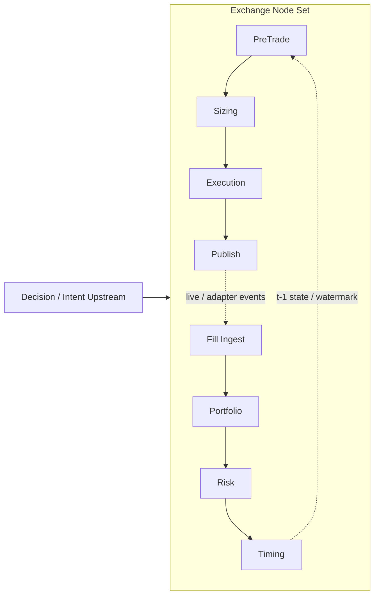

{{ nav_links() }}

# 거래소 노드 세트 — 실행 레이어 구성

## 0. 목적과 Core Loop 상 위치

- 목적: 시그널 이후의 실행 경로를 재사용 가능한 블랙박스 `NodeSet`으로 조합하는 기준을 정의합니다.
- Core Loop 상 위치: Core Loop의 “전략 실행 및 주문 경로” 단계에서 `DecisionValue -> Execution Planning -> Execution Adapters -> Execution State`를 묶는 표준 조합 경계입니다.

이 문서는 거래소 노드 세트를 “특정 전략 archetype용 묶음”이 아니라
새 capability 문서가 정의한 규칙을 실제 실행 체인에 연결하는 블랙박스 조합 단위로 설명합니다.
일반 전략은 내부 노드를 직접 꺼내 쓰기보다 이 문서가 정의하는 공개 표면을 통해 실행을 붙이는 것이 기본입니다.

## 관련 규범 문서

- [QMTL 설계 원칙](design_principles.md)
- [QMTL Capability Map](capability_map.md)
- [QMTL Semantic Types](semantic_types.md)
- [QMTL Decision Algebra](decision_algebra.md)
- [QMTL 구현 추적성](implementation_traceability.md)

## 1. 설계 역할

거래소 노드 세트는 execution capability bundle이다.
즉, 전략이 `OrderIntentDecision` 또는 그에 준하는 실행 의도를 만든 뒤,
그 의도를 실제 주문 게시와 체결 상태 갱신까지 연결하는 블랙박스 경계다.

이 문서에서 말하는 “노드 세트”는 다음을 뜻한다.

- 전략이 내부 실행 노드의 구체적 배선을 알 필요가 없는 조합 단위
- capability-first 설계를 따르는 공개 표면
- 구현 변경이 생겨도 `describe()`와 `capabilities()`를 통해 안정적으로 해석 가능한 경계

반대로 다음은 이 문서의 비목표다.

- `directional`, `ML`, `market making` 같은 archetype을 코어 분기 기준으로 삼는 것
- 내부 실행 노드 클래스와 배선을 공개 API처럼 고정하는 것
- 아직 1급 지원되지 않는 quote lifecycle을 이미 지원하는 것처럼 문서화하는 것

## 2. 규범 계약

아래 표는 거래소 노드 세트가 따라야 하는 핵심 계약과 현재 구현 근거를 함께 정리한 것이다.

| 관심사 | 규범 규칙 | 현재 구현 근거 |
| --- | --- | --- |
| 블랙박스 경계 | 전략은 내부 실행 노드가 아니라 `NodeSet` 공개 표면에 의존해야 함 | [NodeSet / NodeSetBuilder]({{ code_url('qmtl/runtime/nodesets/base.py') }}), [NodeSetAdapter]({{ code_url('qmtl/runtime/nodesets/adapter.py') }}) |
| capability-first 조합 | 노드 세트는 archetype enum이 아니라 planning/state/adapter capability 묶음이어야 함 | [NodeSetRecipe]({{ code_url('qmtl/runtime/nodesets/recipes.py') }}), [registry]({{ code_url('qmtl/runtime/nodesets/registry.py') }}) |
| semantic legality | live order path는 delayed label 출력을 직접 소비할 수 없음 | [`_guard_label_outputs()`]({{ code_url('qmtl/runtime/nodesets/base.py') }}), [test_label_guardrails.py]({{ code_url('tests/qmtl/runtime/nodesets/test_label_guardrails.py') }}) |
| 비순환 피드백 | feedback는 그래프 사이클이 아니라 watermark와 이전 상태를 통해 표현해야 함 | [PreTradeGateNode]({{ code_url('qmtl/runtime/pipeline/execution_nodes/pretrade.py') }}), [PortfolioNode]({{ code_url('qmtl/runtime/pipeline/execution_nodes/portfolio.py') }}) |
| scoped mutable state | 포트폴리오/체결 상태는 `strategy` 또는 `world` 스코프로만 공유해야 함 | [NodeSetOptions]({{ code_url('qmtl/runtime/nodesets/options.py') }}), [resources]({{ code_url('qmtl/runtime/nodesets/resources.py') }}) |

## 3. 구성 개요


```mermaid
flowchart LR
  S["Decision / Intent Upstream"] --> NS

  subgraph NS["Exchange Node Set"]
    PT["PreTrade"]
    SZ["Sizing"]
    EX["Execution"]
    PB["Publish"]
    FI["Fill Ingest"]
    PF["Portfolio"]
    RK["Risk"]
    TG["Timing"]
  end

  PT --> SZ --> EX --> PB
  PB -. "live / adapter events" .-> FI --> PF --> RK --> TG
  TG -. "t-1 state / watermark" .-> PT
```

핵심은 피드백이 “실행 루프”처럼 보이더라도 DAG 내부에서는 숨은 사이클이 아니라는 점이다.
현재 구조에서는 상태 토픽과 워터마크, 그리고 world/portfolio scope를 통해
`MutableExecutionState`를 시간 이동된 입력으로 소비하게 한다.

## 4. 현재 구현 앵커

### 4.1 블랙박스 경계와 빌더

현재 공개 조합 경계의 중심은 다음 구현에 있다.

- [NodeSet]({{ code_url('qmtl/runtime/nodesets/base.py') }}): 내부 노드 묶음을 opaque execution subgraph로 감싼다.
- [`NodeSet.describe()` / `NodeSet.capabilities()`]({{ code_url('qmtl/runtime/nodesets/base.py') }}): 전략이 내부 배선이 아니라 안정적인 메타데이터 표면에 의존하게 한다.
- [NodeSetBuilder]({{ code_url('qmtl/runtime/nodesets/base.py') }}): 기본 step 체인을 구성하고 world/scope/resources를 주입한다.
- [NodeSetOptions]({{ code_url('qmtl/runtime/nodesets/options.py') }}): `mode`, `portfolio_scope`, `activation_weighting`, `label_order_guard` 같은 조합 옵션을 제공한다.

### 4.2 레시피, 어댑터, 레지스트리

현재 built-in 조합 표면은 레시피와 어댑터 계층 위에 있다.

- [NodeSetRecipe / RecipeAdapterSpec]({{ code_url('qmtl/runtime/nodesets/recipes.py') }}): step 배선, descriptor, adapter parameter를 한 곳에 묶는다.
- [NodeSetAdapter / NodeSetDescriptor / PortSpec]({{ code_url('qmtl/runtime/nodesets/adapter.py') }}): 블랙박스 입출력 포트를 노출한다.
- [registry]({{ code_url('qmtl/runtime/nodesets/registry.py') }}): 이름 기반 recipe discovery와 중복 등록 방지를 담당한다.
- [adapters 패키지]({{ code_url('qmtl/runtime/nodesets/adapters/__init__.py') }}): `CcxtSpotAdapter`, `CcxtFuturesAdapter`, `IntentFirstAdapter`, `LabelingTripleBarrierAdapter`를 노출한다.

### 4.3 내장 recipe 표면

현재 문서와 구현이 함께 보장하는 대표 recipe는 아래와 같다.

- [make_intent_first_nodeset]({{ code_url('qmtl/runtime/nodesets/recipes.py') }}): signal과 price를 받아 position intent 계열 경로를 order path로 연결한다.
- [make_ccxt_spot_nodeset]({{ code_url('qmtl/runtime/nodesets/recipes.py') }}): CCXT 기반 spot order path를 조합한다.
- [make_ccxt_futures_nodeset]({{ code_url('qmtl/runtime/nodesets/recipes.py') }}): leverage, reduce-only, margin mode를 포함한 futures order path를 조합한다.
- [make_labeling_triple_barrier_nodeset]({{ code_url('qmtl/runtime/nodesets/recipes.py') }}): 연구/평가용 delayed labeling bundle을 제공한다.

중요한 점:

- 내장 recipe는 현재 `OrderIntentDecision` 계열 경로를 중심으로 설계되어 있다.
- `QuoteIntentDecision`과 `QuotePlanner`를 중심으로 한 market making 전용 node set은 아직 1급 구현이 아니다.

### 4.4 내부 step 체인과 canonical 실행 래퍼

현재 Node Set recipe가 조합하는 canonical 실행 래퍼는
`qmtl/runtime/pipeline/execution_nodes/` 아래 구현이다.

- [PreTradeGateNode]({{ code_url('qmtl/runtime/pipeline/execution_nodes/pretrade.py') }})
- [SizingNode]({{ code_url('qmtl/runtime/pipeline/execution_nodes/sizing.py') }})
- [ExecutionNode]({{ code_url('qmtl/runtime/pipeline/execution_nodes/execution.py') }})
- [OrderPublishNode]({{ code_url('qmtl/runtime/pipeline/execution_nodes/publishing.py') }})
- [FillIngestNode]({{ code_url('qmtl/runtime/pipeline/execution_nodes/fills.py') }})
- [PortfolioNode]({{ code_url('qmtl/runtime/pipeline/execution_nodes/portfolio.py') }})
- [RiskControlNode]({{ code_url('qmtl/runtime/pipeline/execution_nodes/risk.py') }})
- [TimingGateNode]({{ code_url('qmtl/runtime/pipeline/execution_nodes/timing.py') }})
- [RouterNode]({{ code_url('qmtl/runtime/pipeline/execution_nodes/routing.py') }})

보조/호환 계층도 남아 있다.

- [qmtl/runtime/transforms/execution_nodes.py]({{ code_url('qmtl/runtime/transforms/execution_nodes.py') }}): transform-era wrapper와 `activation_blocks_order()` 보조 함수를 유지한다.
- [TradeOrderPublisherNode]({{ code_url('qmtl/runtime/transforms/publisher.py') }}) 같은 transform-era 공개 표면은 여전히 존재하지만, 거래소 노드 세트의 현재 canonical anchor는 pipeline execution nodes다.

## 5. 현재 운영 계약

### 공개 사용 패턴

일반적인 사용 패턴은 레지스트리 또는 어댑터를 통해 노드 세트를 붙이는 것이다.

```python
from qmtl.runtime.nodesets.registry import make

nodeset = make("ccxt_spot", signal, "demo-world", exchange_id="binance")
strategy.add_nodes([price, alpha, signal, nodeset])

info = nodeset.describe()
caps = nodeset.capabilities()
```

고급 재정의가 필요하면 recipe나 builder를 직접 사용할 수 있다.
다만 이 경우에도 전략이 내부 노드 순서에 기대지 않도록 주의한다.

```python
from qmtl.runtime.nodesets.base import NodeSetBuilder
from qmtl.runtime.pipeline.execution_nodes import ExecutionNode

builder = NodeSetBuilder()

def custom_execution(upstream, ctx):
    return ExecutionNode(upstream, execution_model=my_exec_model)

nodeset = builder.attach(signal, world_id="demo-world", execution=custom_execution)
```

### scope와 resource 주입

현재 shared mutable state 경계는 `portfolio_scope`로 조절된다.

- `strategy`: `(world_id, strategy_id, symbol)` 기준의 전략별 상태 격리
- `world`: `(world_id, symbol)` 기준의 world-level 상태 공유

관련 구현과 근거:

- [NodeSetOptions]({{ code_url('qmtl/runtime/nodesets/options.py') }})
- [resources]({{ code_url('qmtl/runtime/nodesets/resources.py') }})
- [test_nodeset_builder_smoke.py]({{ code_url('tests/qmtl/runtime/nodesets/test_nodeset_builder_smoke.py') }})
- [test_nodeset_adapter_descriptor.py]({{ code_url('tests/qmtl/runtime/nodesets/test_nodeset_adapter_descriptor.py') }})

### delayed feedback와 watermark

현재 order path의 비순환 피드백은 주로 다음 조합으로 표현된다.

- [PreTradeGateNode]({{ code_url('qmtl/runtime/pipeline/execution_nodes/pretrade.py') }}): watermark gate를 통해 포트폴리오 상태 준비 여부를 확인한다.
- [PortfolioNode]({{ code_url('qmtl/runtime/pipeline/execution_nodes/portfolio.py') }}): fill 적용 후 watermark topic을 갱신한다.
- [`_shared.py`]({{ code_url('qmtl/runtime/pipeline/execution_nodes/_shared.py') }}): watermark normalisation과 commit-log key 힌트를 제공한다.

현재 테스트 근거:

- [test_pretrade.py]({{ code_url('tests/qmtl/runtime/pipeline/execution_nodes/test_pretrade.py') }})
- [test_portfolio.py]({{ code_url('tests/qmtl/runtime/pipeline/execution_nodes/test_portfolio.py') }})

### live legality와 label guard

현재 live order path에서는 label output이 order path로 직접 연결되지 않도록 guard가 있다.
이것은 “ML은 안 된다”가 아니라 `DelayedStream -> live execution path` 금지라는 semantic rule의 구현이다.

관련 구현과 근거:

- [`_guard_label_outputs()`]({{ code_url('qmtl/runtime/nodesets/base.py') }})
- [NodeSetOptions.label_order_guard]({{ code_url('qmtl/runtime/nodesets/options.py') }})
- [test_label_guardrails.py]({{ code_url('tests/qmtl/runtime/nodesets/test_label_guardrails.py') }})

### gateway / fill ingress 경계

현재 fill ingress 경계는 두 층으로 나뉜다.

- [FillIngestNode]({{ code_url('qmtl/runtime/pipeline/execution_nodes/fills.py') }}): DAG 안에서 external fill stream의 진입점을 나타낸다.
- [Gateway `/fills` route]({{ code_url('qmtl/services/gateway/routes/fills.py') }}): CloudEvents envelope, JWT/HMAC 인증, Kafka publish를 처리한다.

현재 테스트 근거:

- [test_fills.py]({{ code_url('tests/qmtl/runtime/pipeline/execution_nodes/test_fills.py') }})
- [test_fills_webhook.py]({{ code_url('tests/qmtl/services/gateway/test_fills_webhook.py') }})

## 6. 현재 보장되는 테스트 근거

거래소 노드 세트의 현재 공개 계약은 아래 테스트들이 직접 뒷받침한다.

- [test_recipe_contracts.py]({{ code_url('tests/qmtl/runtime/nodesets/test_recipe_contracts.py') }}): recipe 등록, descriptor 포트, mode 메타데이터, sizing/portfolio resource injection
- [test_nodeset_builder_smoke.py]({{ code_url('tests/qmtl/runtime/nodesets/test_nodeset_builder_smoke.py') }}): attach 계약, world scope 공유, StepSpec resource 주입
- [test_nodeset_adapter_descriptor.py]({{ code_url('tests/qmtl/runtime/nodesets/test_nodeset_adapter_descriptor.py') }}): adapter descriptor surface와 capability 노출
- [test_ccxt_recipes.py]({{ code_url('tests/qmtl/runtime/nodesets/test_ccxt_recipes.py') }}): CCXT spot/futures recipe의 publish path 변형
- [test_intent_first.py]({{ code_url('tests/qmtl/runtime/nodesets/test_intent_first.py') }}): intent-first 조합과 default activation/resource 주입
- [test_nodeset_testkit_and_webhook.py]({{ code_url('tests/qmtl/runtime/nodesets/test_nodeset_testkit_and_webhook.py') }}): minimal attach/testkit 및 fake fill webhook shape

## 7. 현재 공백과 비목표

이 문서는 현재 구현이 보장하는 범위와 아직 비어 있는 범위를 함께 드러내야 한다.

현재 공백:

- market making용 `QuoteIntentDecision -> QuotePlanner -> CancelReplacePlan` 경로는 아직 node set 1급 구현이 아니다.
- [ExecutionNode]({{ code_url('qmtl/runtime/pipeline/execution_nodes/execution.py') }})의 시뮬레이션은 요청 가격을 `bid=ask=last`로 둔 단순 모델이다. quote queue, cancel/replace, maker lifecycle은 포함하지 않는다.
- `simulate / paper / live`는 recipe metadata와 일부 guard에서 드러나지만, end-to-end 실행 semantics는 아직 부분 구현이다.
- freeze/drain, replay, DLQ, schema-to-code generation 같은 항목은 설계 의도는 분명하지만 node set 표면에서는 아직 부분적이다.

비목표:

- Node Set 내부 배선을 공개 API로 고정하는 것
- MM이나 ML 조합을 조합별 특례로 문서화하는 것
- 현재 없는 capability를 이미 production-supported인 것처럼 서술하는 것

{{ nav_links() }}
