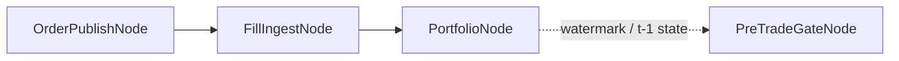

{{ nav_links() }}

# 실행 레이어 노드

## 0. 목적과 Core Loop 상 위치

- 목적: 실행 레이어를 구성하는 개별 노드를 capability 기준으로 설명하고, 현재 구현 근거와 한계를 함께 정리합니다.
- Core Loop 상 위치: Core Loop의 “전략 실행 및 주문 경로” 단계에서 order path, execution state, risk/policy가 어떻게 연결되는지 설명하는 레퍼런스입니다.

이 문서는 개별 execution capability reference다.
일반 전략에서는 보통 [거래소 노드 세트](exchange_node_sets.md)를 먼저 사용하고,
여기서는 그 내부에 들어가는 canonical 래퍼 노드의 역할과 구현 상태를 확인하는 용도로 읽는 것이 좋다.

## 관련 문서

- [거래소 노드 세트](exchange_node_sets.md)
- [QMTL Capability Map](capability_map.md)
- [QMTL Semantic Types](semantic_types.md)
- [QMTL Decision Algebra](decision_algebra.md)
- [QMTL 구현 추적성](implementation_traceability.md)

## 1. 읽는 법

이 문서는 각 노드를 다음 관점으로 설명한다.

- 설계 역할: capability map과 decision algebra 안에서의 위치
- semantic contract: causal live path, mutable state, command boundary와의 관계
- 현재 구현: 실제 코드 파일
- 테스트 근거: 현재 보장되는 동작
- 알려진 한계: 아직 1급 지원이 아닌 부분

중요한 원칙:

- legality는 `strategy_type`이 아니라 semantic type으로 해석해야 한다.
- execution node는 개별 전략 archetype 전용 클래스가 아니라 planning/state/adapter/policy capability의 현재 구현이다.
- fan-in 자체는 일반 `Node` 기능이지만, 이 문서에서는 execution capability와 직접 연결되는 경우만 다룬다.

## 2. capability 관점의 위치

| 노드 | 주 capability | 주 semantic 입력 | 주 출력 | canonical 구현 |
| --- | --- | --- | --- | --- |
| PreTradeGateNode | Risk / Policy | causal order-like input, activation/account state | pass-through order 또는 rejection | [pretrade.py]({{ code_url('qmtl/runtime/pipeline/execution_nodes/pretrade.py') }}) |
| SizingNode | Execution Planning | decision/order intent, portfolio state | sized order | [sizing.py]({{ code_url('qmtl/runtime/pipeline/execution_nodes/sizing.py') }}) |
| ExecutionNode | Execution Planning | sized order, execution model | simulated fill 또는 downstream order payload | [execution.py]({{ code_url('qmtl/runtime/pipeline/execution_nodes/execution.py') }}) |
| OrderPublishNode | Execution Adapters | command-ready order payload | gateway/commit-log friendly payload | [publishing.py]({{ code_url('qmtl/runtime/pipeline/execution_nodes/publishing.py') }}) |
| FillIngestNode | Observation | external fill stream | normalized fill stream ingress | [fills.py]({{ code_url('qmtl/runtime/pipeline/execution_nodes/fills.py') }}) |
| PortfolioNode | Execution State | fill stream | mutable portfolio snapshot | [portfolio.py]({{ code_url('qmtl/runtime/pipeline/execution_nodes/portfolio.py') }}) |
| RiskControlNode | Risk / Policy | sized order, portfolio state | adjusted order 또는 rejection | [risk.py]({{ code_url('qmtl/runtime/pipeline/execution_nodes/risk.py') }}) |
| TimingGateNode | Risk / Policy | timestamped order | allow/deny order | [timing.py]({{ code_url('qmtl/runtime/pipeline/execution_nodes/timing.py') }}) |
| RouterNode | Execution Adapters 보조 | order payload | route-tagged payload | [routing.py]({{ code_url('qmtl/runtime/pipeline/execution_nodes/routing.py') }}) |

보조 유틸리티:

- [order_types.py]({{ code_url('qmtl/runtime/pipeline/order_types.py') }}): `OrderIntent`, `SizedOrder`, `GatewayOrderPayload`, `FillPayload` 같은 typed payload 계약
- [`_shared.py`]({{ code_url('qmtl/runtime/pipeline/execution_nodes/_shared.py') }}): watermark gate 정규화, commit-log key 힌트, 안전한 보조 호출
- [MicroBatchNode]({{ code_url('qmtl/runtime/pipeline/micro_batch.py') }}): downstream batching을 위한 orchestration 유틸리티

## 3. 노드별 레퍼런스

### PreTradeGateNode

- 설계 역할: execution path 초입에서 activation, brokerage, account, watermark readiness를 검사하는 policy gate
- semantic contract:
  - causal order-like input만 허용
  - `DelayedStream` legality는 upstream node set guard에서 먼저 차단
  - watermark가 준비되지 않으면 rejection을 반환해 hidden cycle을 막음
- 현재 구현: [pretrade.py]({{ code_url('qmtl/runtime/pipeline/execution_nodes/pretrade.py') }})
- 관련 테스트:
  - [test_pretrade.py]({{ code_url('tests/qmtl/runtime/pipeline/execution_nodes/test_pretrade.py') }})
  - [test_pretrade_metrics.py]({{ code_url('tests/qmtl/runtime/sdk/test_pretrade_metrics.py') }})
- 알려진 한계:
  - 현재는 order-level activation/account checks 중심이다.
  - market making용 quote-set legality나 cancel/replace-specific gate는 별도 1급 계약이 아니다.

### SizingNode

- 설계 역할: `DecisionValue` 또는 order intent를 실제 수량으로 변환하는 planning 단계
- semantic contract:
  - `Portfolio`는 `MutableExecutionState`로 주입된다.
  - weight function은 activation policy를 soft gating으로 반영한다.
- 현재 구현: [sizing.py]({{ code_url('qmtl/runtime/pipeline/execution_nodes/sizing.py') }})
- 관련 테스트:
  - [test_sizing.py]({{ code_url('tests/qmtl/runtime/pipeline/execution_nodes/test_sizing.py') }})
  - [test_sizing_weight_integration.py]({{ code_url('tests/qmtl/runtime/sdk/test_sizing_weight_integration.py') }})
- 알려진 한계:
  - 현재 planning은 order quantity 해석 중심이다.
  - quote ladder, inventory skew, cancel/replace planning은 이 노드의 책임이 아니다.

### ExecutionNode

- 설계 역할: sized order를 execution model에 태워 시뮬레이션하거나 downstream publish payload로 넘기는 단계
- semantic contract:
  - planner 이후 단계이므로 `CommandValue`에 가까운 payload를 만든다.
  - execution model이 없으면 payload를 그대로 통과시킨다.
- 현재 구현: [execution.py]({{ code_url('qmtl/runtime/pipeline/execution_nodes/execution.py') }})
- 관련 테스트:
  - [test_execution_node.py]({{ code_url('tests/qmtl/runtime/pipeline/execution_nodes/test_execution_node.py') }})
- 알려진 한계:
  - 현재 시뮬레이션은 `requested_price`를 `bid=ask=last`로 사용하고 `MARKET` 주문으로 처리하는 단순 모델이다.
  - maker queue, stale quote, partial requote 같은 market making 현실성은 표현하지 못한다.

### OrderPublishNode

- 설계 역할: command-ready order를 gateway/commit-log 경계로 넘기고, 필요한 메타데이터를 보강하는 adapter node
- semantic contract:
  - execution side effect는 이 노드 이후에 발생한다.
  - order payload는 `GatewayOrderPayload`로 정규화된다.
- 현재 구현: [publishing.py]({{ code_url('qmtl/runtime/pipeline/execution_nodes/publishing.py') }})
- 관련 테스트:
  - [test_publishing.py]({{ code_url('tests/qmtl/runtime/pipeline/execution_nodes/test_publishing.py') }})
  - [test_trade_order_publisher.py]({{ code_url('tests/qmtl/runtime/transforms/test_trade_order_publisher.py') }})는 transform-era 공개 표면의 별도 근거다.
- 알려진 한계:
  - 현재는 lightweight submit/commit-log 경계에 초점이 있다.
  - retry policy, circuit breaker, venue-specific ack lifecycle은 외부 adapter 또는 상위 orchestration의 책임이다.

### FillIngestNode

- 설계 역할: external fill stream이 DAG로 들어오는 observation boundary
- semantic contract:
  - 외부 시스템에서 이미 인증/정규화된 fill 이벤트가 들어온다고 가정한다.
  - fill payload 자체의 mutable state 갱신은 하지 않는다.
- 현재 구현: [fills.py]({{ code_url('qmtl/runtime/pipeline/execution_nodes/fills.py') }})
- 관련 테스트:
  - [test_fills.py]({{ code_url('tests/qmtl/runtime/pipeline/execution_nodes/test_fills.py') }})
  - [test_fills_webhook.py]({{ code_url('tests/qmtl/services/gateway/test_fills_webhook.py') }})
- 알려진 한계:
  - 현재 노드 구현은 `StreamInput` 래퍼다.
  - CloudEvents parsing, JWT/HMAC auth, Kafka publish는 DAG 밖 gateway 경계에서 처리된다.

### PortfolioNode

- 설계 역할: fill stream을 portfolio snapshot으로 바꾸는 execution state 갱신 노드
- semantic contract:
  - `MutableExecutionState`를 직접 갱신한다.
  - watermark topic을 갱신해 후속 order path가 `t-1` 상태를 참조하게 한다.
- 현재 구현: [portfolio.py]({{ code_url('qmtl/runtime/pipeline/execution_nodes/portfolio.py') }})
- 관련 테스트:
  - [test_portfolio.py]({{ code_url('tests/qmtl/runtime/pipeline/execution_nodes/test_portfolio.py') }})
  - [test_portfolio.py]({{ code_url('tests/qmtl/runtime/sdk/test_portfolio.py') }})
- 알려진 한계:
  - 현재 snapshot은 cash와 positions 중심이다.
  - open quote book, venue ack state, inventory bands 같은 richer MM state는 아직 별도 1급 구조가 아니다.

### RiskControlNode

- 설계 역할: sized order를 portfolio/risk manager 기준으로 조정하거나 거부하는 policy node
- semantic contract:
  - mutable portfolio state를 읽되, 그 자체를 새 state object로 발행하지는 않는다.
  - risk violation은 rejection payload로 명시한다.
- 현재 구현: [risk.py]({{ code_url('qmtl/runtime/pipeline/execution_nodes/risk.py') }})
- 관련 테스트:
  - [test_risk.py]({{ code_url('tests/qmtl/runtime/pipeline/execution_nodes/test_risk.py') }})
  - [test_risk_integration.py]({{ code_url('tests/qmtl/runtime/sdk/risk_management/test_risk_integration.py') }})
- 알려진 한계:
  - 현재 리스크는 포지션/레버리지/집중도 중심이다.
  - maker inventory skew, per-side quote exposure, quote age 같은 MM 전용 정책은 아직 없다.

### TimingGateNode

- 설계 역할: 시장 시간과 캘린더 정책을 기준으로 실행 가능 시점을 제한하는 policy node
- semantic contract:
  - timestamped causal order input을 받아 allow/deny를 반환한다.
  - state mutation을 직접 일으키지 않는다.
- 현재 구현: [timing.py]({{ code_url('qmtl/runtime/pipeline/execution_nodes/timing.py') }})
- 관련 테스트:
  - [test_timing.py]({{ code_url('tests/qmtl/runtime/pipeline/execution_nodes/test_timing.py') }})
- 알려진 한계:
  - 현재 regular-hours 중심 controller다.
  - venue microstructure-aware timing, quote freshness windows는 별도 planner/policy가 필요하다.

### RouterNode 및 MicroBatchNode

- 설계 역할:
  - [RouterNode]({{ code_url('qmtl/runtime/pipeline/execution_nodes/routing.py') }}): order payload에 route 힌트를 붙이는 orchestration utility
  - [MicroBatchNode]({{ code_url('qmtl/runtime/pipeline/micro_batch.py') }}): publish/fill downstream 처리를 batching하는 유틸리티
- 관련 테스트:
  - [test_trade_order_publisher.py]({{ code_url('tests/qmtl/runtime/transforms/test_trade_order_publisher.py') }})는 routing/publish 경계의 transform-era 예시를 제공한다.
- 알려진 한계:
  - 이 노드들은 execution semantics 자체보다 orchestration 편의에 가깝다.

## 4. 조합 예시

### intent-first order path

이 경로는 현재 directional/order-intent 중심의 canonical path다.
대부분의 built-in node set은 이 구조를 조금씩 변형해 사용한다.

### live feedback / watermark path

이 조합은 feedback를 DAG cycle로 만들지 않고,
`PortfolioNode`가 갱신한 상태를 `PreTradeGateNode`가 준비도 신호로 읽게 한다.

## 5. 이전 경로와의 관계

현재 execution-layer 문서의 canonical 구현은 `qmtl/runtime/pipeline/execution_nodes/`다.
다만 transform-era 표면도 여전히 남아 있다.

- [qmtl/runtime/transforms/execution_nodes.py]({{ code_url('qmtl/runtime/transforms/execution_nodes.py') }}): 예전 wrapper와 `activation_blocks_order()` 같은 보조 함수를 유지한다.
- [TradeOrderPublisherNode]({{ code_url('qmtl/runtime/transforms/publisher.py') }})는 runner/transforms 중심 공개 표면이다.

문서상 원칙:

- 새 설계 논의와 현재 canonical 앵커는 pipeline execution nodes 기준으로 적는다.
- transform-era 구현은 호환 또는 별도 공개 표면으로만 언급한다.

## 6. 현재 공백

이 문서는 개별 실행 노드의 현재 상태를 드러내는 것이 목적이므로, 공백도 명시한다.

- `QuoteIntentDecision`, `QuotePlanner`, `CancelReplacePlan`을 직접 다루는 노드는 아직 없다.
- MM과 ML의 조합은 capability 관점에서는 자연스럽지만, 현재 구현은 order-intent 중심이다.
- richer execution state와 quote lifecycle이 필요하면 새 planner/state contract를 추가해야지 기존 노드에 조합별 예외를 덧붙이면 안 된다.

{{ nav_links() }}
