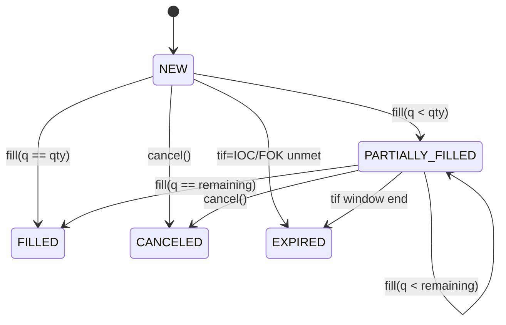

{{ nav_links() }}

# 실행 상태 머신과 TIF 정책

## 0. 목적과 Core Loop 상 위치

- 목적: 백테스트 및 페이퍼 트레이딩에서의 실행 상태 머신을 개괄하고, 미체결·부분 체결·Time‑In‑Force(GTC/IOC/FOK) 의미론을 정리합니다.
- Core Loop 상 위치: Core Loop의 “전략 실행 결과 → 주문/체결 상태 추적” 단계에 대한 기준 모델로, 시뮬레이션·리플레이에서 어떤 상태 전이가 일어나는지 설명합니다.

본 문서는 백테스트 및 페이퍼 트레이딩에서의 실행 상태 머신을 개괄합니다. 특히 유지되는 미체결 주문, 부분 체결, Time-In-Force(GTC/IOC/FOK) 의미론을 다룹니다.

## 상태 머신

## 상태 전이

| 현재 상태 | 이벤트 | 다음 상태 |
|-----------|--------|-----------|
| NEW | fill(q < qty) | PARTIALLY_FILLED |
| NEW | fill(q == qty) | FILLED |
| NEW | cancel() | CANCELED |
| NEW | tif unmet | EXPIRED |
| PARTIALLY_FILLED | fill(q < remaining) | PARTIALLY_FILLED |
| PARTIALLY_FILLED | fill(q == remaining) | FILLED |
| PARTIALLY_FILLED | cancel() | CANCELED |
| PARTIALLY_FILLED | tif window end | EXPIRED |

## TIF 예시

- GTC: 남은 수량은 체결 또는 취소될 때까지 바를 넘어 유지됩니다.
- IOC: 즉시 체결을 시도하며, 남은 수량은 취소되어 주문이 **EXPIRED**로 이동합니다.
- FOK: 전체 주문을 즉시 체결하거나 취소합니다. 한 번의 시도에서 전량 체결되지 않으면 체결 수량이 0인 채 **EXPIRED**로 전이됩니다.

참고: [Brokerage API](../reference/api/brokerage.md), [Lean Brokerage Model](lean_brokerage_model.md)
