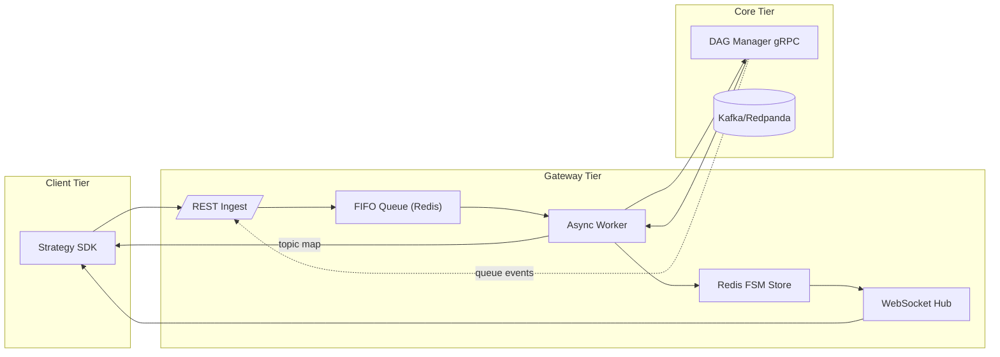

{{ nav_links() }}

# QMTL Gateway — 종합 기술 명세서

*Research‑Driven Draft v1.2 — 2025‑06‑10*

## S0‑A. Core Loop 정렬 요약

- Gateway는 `/strategies` 제출을 받아 DAG Manager Diff/큐 매핑과 WorldService 프록시를 조합해 **compute_context `{world_id, execution_domain, as_of, partition}`**를 구성하고, Core Loop의 **단일 진입점 + 결정/큐 이벤트 브리지** 역할만 수행한다.
- ExecutionDomain/ComputeKey/EvalKey 규범은 `architecture.md`·`worldservice.md`·본 문서에서 동일하게 서술되며, 제출 메타의 도메인 힌트보다 WS 결정을 항상 우선한다.
- WS의 Decision/Activation/Allocation 결과와 Gateway의 상태 캐시/스트림 중계가 Runner/CLI `SubmitResult` 및 운영자용 CLI(예: world status, allocations)와 동일한 표면(필드·에러·TTL 의미)으로 이어진다.

## 관련 문서
- [Architecture Overview](README.md)
- [QMTL Architecture](architecture.md)
- [DAG Manager](dag-manager.md)
- [WorldService](worldservice.md)
- [ControlBus](controlbus.md)
- [Lean Brokerage Model](lean_brokerage_model.md)

추가 참고
- 운영 가이드: [리스크 관리](../operations/risk_management.md), [타이밍 컨트롤](../operations/timing_controls.md)
- 레퍼런스: [Brokerage API](../reference/api/brokerage.md), [Commit‑Log 설계](../reference/commit_log.md), [World/Activation API](../reference/api_world.md)

> 이 확장판은 기존 문서 대비 약 75% 분량이 늘었으며, 연구 중심의 엄밀한 기술 명세 형식을 채택했습니다. 모든 위협 모델, 공식 API 계약, 지연 분포, CI/CD 의미론을 완전하게 기술합니다.
> 표기: **Sx** = 섹션, **Rx** = 요구사항, **Ax** = 가정.

---

## S0 · 시스템 컨텍스트와 목표

Gateway는 일시적인 전략 제출과 DAG Manager가 관리하는 영속적 그래프 상태 사이의 **운영 경계**에 위치합니다. 설계 목표는 다음과 같습니다:

| ID     | Goal                                                         | Metric                    |
| ------ | ------------------------------------------------------------ | ------------------------- |
|  G‑01  | Diff submission queuing **loss‑free** under 1 k req/s burst  | `lost_requests_total = 0` |
|  G‑02  | **≤ 150 ms** p95 end‑to‑end latency (SDK POST → Warm‑up ack) | `gateway_e2e_latency_p95` |
|  G‑03  | 동시 제출 간 Kafka 토픽 중복 0                              | 불변 조건 §S3             |
|  G‑04  | 상태 업데이트 WebSocket 선형 전송(≥ 500 msg/s)              | WS 부하 테스트            |

**Ax‑1** SDK 노드는 정규 해싱 규칙을 준수합니다(Architecture §1.1 참조).
**Ax‑2** Neo4j causal 클러스터는 단일 리더 일관성을 노출하며, 리드 리플리카는 지연될 수 있습니다.
**Ax‑3** Gateway는 `{ world_id, execution_domain, as_of, partition }` 컴퓨트 컨텍스트를 구성해 하위 서비스로 전달합니다. SDK는 이 컨텍스트를 선택하지 않으며, Gateway가 WorldService 결정(및 필요 시 제출 메타데이터)에서 도출합니다. DAG Manager는 이를 통해 도메인 스코프 ComputeKey를 파생하고, WorldService는 정책 권한/적용에 사용합니다. 이 계약의 정식 구현은 `qmtl/foundation/common/compute_context.py`에 있으며, 커밋 로그 직렬화/다운그레이드 추적/인제스트 흐름용 Redis 매핑을 담당하는 `StrategyComputeContext`(`qmtl/services/gateway/submission/context_service.py`)로 래핑됩니다.

**사용자 관점 설계 의도:** Gateway는 “전략 로직에만 집중하면 시스템이 알아서 최적화하고 수익을 낸다”는 QMTL의 핵심 가치를 **네트워크 경계에서 보장하는 역할**을 합니다.
- SDK 사용자는 `Runner.submit(MyStrategy)` 또는 단순 REST 호출만으로 전략을 제출하고, Gateway는 **WorldService/DAG Manager 복잡도를 숨긴 채** 필요한 컨텍스트를 자동 구성합니다.
- 새로운 엔드포인트나 메타데이터를 추가할 때도, 먼저 “전략 작성/제출 플로우가 더 복잡해지지 않는가?”를 검토하고, 가능하면 **기본값·추론·프리셋**으로 해결하도록 합니다.
- 하위 호환성을 위해 구/신 경로를 장기간 병존시키지 않고, 한 시점에는 항상 하나의 **정식 엔드포인트 집합**만을 유지합니다(호환 레이어는 명시적 마이그레이션 기간 후 제거).

### 비목표
- Gateway는 월드 정책 결정을 계산하지 않으며, 월드/큐의 SSOT가 아닙니다.
- Gateway는 브로커리지 실행을 관리하지 않고, 요청 중재와 제어 이벤트 중계만 담당합니다.

---

## S1 · Functional Decomposition



참고: 간결성을 위해 이 분해도에서 WorldService와 ControlBus는 생략했습니다. 월드 프록시와 불투명 이벤트 스트림 인계는 §S6을 참고하세요. 전체 시스템에서는 Gateway가 ControlBus를 구독하고 WorldService API를 프록시합니다.

---

## S2 · API Contract (**OpenAPI 3.1 excerpt**)

```yaml
paths:
  /strategies:
    post:
      summary: Submit local DAG for execution
      requestBody:
        content:
          application/json:
            schema: { $ref: '#/components/schemas/StrategySubmit' }
      responses:
        '202': { $ref: '#/components/responses/Ack202' }
  /strategies/{id}/status:
    get:
      parameters:
        - in: path
          name: id
          schema: { type: string }
      responses:
        '200': { $ref: '#/components/responses/Status200' }
  /queues/by_tag:
    get:
      summary: Fetch queues matching tags and interval
      parameters:
        - in: query
          name: tags
          schema: { type: string }
        - in: query
          name: interval
          schema: { type: integer }
        - in: query
          name: match_mode
          schema: { type: string, enum: [any, all] }
          description: |
            Preferred tag matching mode.
      responses:
        '200':
          description: Queue list
          content:
            application/json:
              schema:
                type: object
                properties:
                  queues:
                    type: array
                    items:
                      type: object
                      properties:
                        queue: { type: string }
                        global: { type: boolean }
```
Clients SHOULD specify ``match_mode`` to control tag matching behavior. When
omitted, Gateway defaults to ``any`` for backward compatibility.

**Example Request (compressed 32 KiB DAG JSON omitted)**

```http
POST /strategies HTTP/1.1
Authorization: Bearer <jwt>
Content‑Encoding: gzip
Content‑Type: application/json
{
  "dag_json": "<base64>",
  "meta": {
    "user": "quant.alice",
    "desc": "BTC scalper",
    "execution_domain": "backtest",
    "as_of": "2025-01-01T00:00:00Z",
    "partition": "tenant-a"
  },
  "world_ids": ["crypto_mom_1h", "crypto_alt_1h"]
}
```

> **Backtests & dry-runs:** When `meta.execution_domain` resolves to `backtest` or
> `dryrun` (including aliases such as `compute-only`, `paper`, or `sim`), callers
> MUST include `meta.as_of`. Gateway downgrades missing values to compute-only
> backtests, enters safe mode, and records the event via
> `strategy_compute_context_downgrade_total{reason="missing_as_of"}`. The
> downgrade reasons are defined by the shared `DowngradeReason` enum in
> `qmtl/foundation/common/compute_context.py` to keep replay and commit-log behavior in
> sync. When WorldService is unreachable the submission also enters safe mode
> with downgrade reason `decision_unavailable`, ensuring live domains cannot
> execute without an authoritative decision envelope.

`meta.execution_domain`는 호출자 힌트일 뿐 최종 도메인은 WorldService의 `effective_mode`
결과를 Gateway가 정규화한 값입니다. 별칭 매핑은 `compute-only/validate → backtest`,
`paper/sim → dryrun`, `live → live`, `shadow`(운영자 전용)이며, WS 결정이 없거나 오래된
상태에서 `live` 요청은 compute-only(backtest)로 강등됩니다.

**Example Queue Lookup**

```http
GET /queues/by_tag?tags=t1,t2&interval=60&match_mode=any HTTP/1.1
Authorization: Bearer <jwt>
```

| HTTP Status         | Meaning                                 | Typical Cause      |
| ------------------- | --------------------------------------- | ------------------ |
|  202 Accepted       |  Ingest successful, StrategyID returned | Nominal            |
|  400 Bad Request   |  CRC mismatch between SDK and Gateway  | NodeID CRC failure  |
|  409 Conflict       |  Duplicate StrategyID within TTL        | Same DAG re‑submit |
|  422 Unprocessable  |  Schema validation failure              | DAG JSON invalid    |

---

## S3 · Exactly‑Once Execution (Node×Interval×Bucket)

This section summarizes the once‑and‑only‑once layer required by issue #544.

- Ownership: For each execution key `(node_id, interval, bucket_ts)`, a single worker acquires ownership before executing. Gateway uses a DB advisory lock (Postgres `pg_try_advisory_lock`) with optional Kafka‑based coordination.
- Commit log: Results are published via a transactional, idempotent Kafka producer to a compacted topic. The message value is `(node_id, bucket_ts, input_window_hash, payload)`.
- Message key: The Kafka message key is built as `"{partition_key(node_id, interval, bucket_ts)}:{input_window_hash}"` ensuring compaction on a stable prefix while preserving uniqueness per input window.
- Deduplication: Downstream consumers deduplicate on the triple `(node_id, bucket_ts, input_window_hash)` and increment `commit_duplicate_total` when duplicates are observed.
- Owner handoff metric: Gateway increments `owner_reassign_total` when a different worker takes ownership of the same execution key mid‑bucket (best‑effort reporting).

Acceptance tests cover: (a) two workers competing for the same key yield exactly one commit with zero duplicates, and (b) owner takeover increments `owner_reassign_total` once.


## S3 · Deterministic FIFO & Idempotency

**Invariant R‑3.1** At most one Worker may pop a given StrategyID. Implemented by:
`SETNX("lock:{id}", worker_id, "NX", "PX", 60000)`

### S4 · Architecture Alignment

The architecture document (§3) defines the deterministic NodeID used across Gateway and DAG Manager. Each NodeID is computed as `blake3:<digest>` over the **canonical serialization** of `(node_type, interval, period, params(split & canonical), dependencies(sorted by node_id), schema_compat_id (stable across minor/patch), code_hash)`. Non-deterministic fields are excluded; the `blake3:` prefix is mandatory, and BLAKE3 XOF may be used for strengthening. Gateway must generate the same IDs before calling the DiffService.

Clarifications
- NodeID MUST NOT include `world_id`. World isolation is enforced at the WVG layer and via world-scoped queue namespaces (e.g., `topic_prefix`), not in the global ID.
- TagQueryNode canonicalization: do not include the dynamically resolved upstream queue set in `dependencies`. Instead, capture the query spec in `params_canon` (normalized `query_tags` sorted, `match_mode`, and `interval`). Runtime queue discovery and growth are delivered via ControlBus → SDK TagQueryManager; NodeID remains stable across discoveries.
- Gateway는 `node_type`, `code_hash`, `config_hash`, `schema_hash`, `schema_compat_id`가 빠진 제출을 `E_NODE_ID_FIELDS`로 거부하며, 제공된 `node_id`가 정규 `compute_node_id()` 출력과 다를 경우 `E_NODE_ID_MISMATCH`를 반환합니다. 두 오류 모두 SDK 클라이언트가 BLAKE3 계약에 따라 DAG를 재생성할 수 있도록 실행 가능한 힌트를 포함합니다.

인제스트 직후, Gateway는 전략 코드 변경 없이 롤백과 카나리아 트래픽 제어를 조율할 수 있도록 DAG에 `VersionSentinel` 노드를 삽입합니다. 이 동작은 기본 활성화되어 있으며 ``insert_sentinel`` 구성으로 제어합니다. ``--no-sentinel`` 플래그로 비활성화할 수 있습니다.

!!! note "Design intent"
- TagQuery canonicalization keeps `NodeID` stable; dynamic queue discovery is a runtime concern (ControlBus → SDK TagQueryManager), not part of canonical hashing.
- Execution domains are derived centrally by Gateway from WorldService decisions (see §S0) and propagated via the shared `ComputeContext`; SDK treats the result as input only.
- VersionSentinel is default-on to enable rollout/rollback/traffic-split without strategy changes; disable only in low‑risk, low‑frequency environments.

Gateway는 AOF가 활성화된 Redis에 FSM을 영속화하고, 중요한 이벤트를 PostgreSQL WAL(Write-Ahead Log)에도 미러링합니다. 이는 아키텍처(§2)에서 설명한 Redis 장애 시나리오를 완화합니다.

When resolving `TagQueryNode` dependencies, the Runner's **TagQueryManager**
invokes ``resolve_tags()`` which issues a ``/queues/by_tag`` request. Gateway
consults DAG Manager for queues matching `(tags, interval)` and returns the list
so that TagQueryNode instances remain network‑agnostic and only nodes lacking
upstream queues execute locally.

Gateway also listens (via ControlBus) for `sentinel_weight` CloudEvents emitted by DAG Manager. Upon receiving an update, the in-memory routing table is adjusted and the new weight broadcast to SDK clients via WebSocket. The effective ratio per version is exported as the Prometheus gauge `gateway_sentinel_traffic_ratio{version="<id>"}`.

WorldService에서 발행하는 `rebalancing_planned` ControlBus 이벤트 역시 Gateway가 중복을 제거한 뒤 WebSocket `rebalancing` 토픽(CloudEvent 타입 `rebalancing.planned`)으로 중계하며, 계획 건수와 자동 실행 시도를 나타내는 지표(`rebalance_plans_observed_total`, `rebalance_plan_last_delta_count`, `rebalance_plan_execution_attempts_total`, `rebalance_plan_execution_failures_total`)를 기록한다.

### S5 · Reliability Checklist

* **NodeID CRC 파이프라인** – SDK가 전송한 `node_id`와 Gateway가 재계산한 값이
  diff 요청 및 응답의 `crc32` 필드로 상호 검증된다. CRC 불일치가 발생하면 HTTP 400으로 반환된다.
* **TagQueryNode 런타임 확장** – Gateway가 새 `(tags, interval)` 큐를 발견하면
  `tagquery.upsert` CloudEvent를 발행하고 Runner의 **TagQueryManager**가 이를
  수신해 노드 버퍼를 자동 초기화한다.
* **Local DAG Fallback Queue** – DAG Manager가 응답하지 않을 때 제출된 전략 ID는
  메모리에 임시 저장되며 서비스가 복구되면 Redis 큐로 플러시된다.
* **Sentinel Traffic Δ 확인 루프** – `traffic_weight` 변경 후 Gateway 라우팅
  테이블과 SDK 로컬 라우터가 5초 이내 동기화됐는지를 `sentinel_skew_seconds`
  지표로 측정한다.

### Gateway CLI 옵션

Gateway 서비스를 실행합니다. ``--config`` 플래그는 선택입니다:

```bash
# 기본값으로 시작
qmtl service gateway

# 구성 파일 지정
qmtl service gateway --config qmtl/examples/qmtl.yml
```

제공하면, 명령은 모든 서버 파라미터를 위해 ``qmtl/examples/qmtl.yml``의 ``gateway`` 섹션을 읽습니다. ``--config``를 생략하면 SQLite와 인메모리 Redis 대체를 사용하는 기본값으로 서비스가 시작됩니다. 샘플 파일에는 실제 클러스터를 가리키도록 ``redis_dsn``을 설정하는 방법이 예시되어 있습니다. ``redis_dsn``이 없으면 인메모리 대체를 자동 사용합니다. 주석이 풍부한 구성 템플릿은 파일을 참고하세요. ``insert_sentinel: false`` 설정은 자동 ``VersionSentinel`` 삽입을 비활성화합니다.

사용 가능한 플래그:

- ``--config`` – 구성 파일 경로(선택)
- ``--no-sentinel`` – 자동 ``VersionSentinel`` 삽입 비활성화
- ``--allow-live`` – 라이브 거래 가드 비활성화(``X-Allow-Live: true`` 요구 해제)

### 구성 검증 흐름

`qmtl config validate` 명령은 `qmtl.foundation.config_validation` 모듈이 제공하는 작은 헬퍼와 함께 섹션별 검사를 순차적으로 수행하여 다층 안정성을 확보합니다.

1. **스키마 검증 (`schema`):** `UnifiedConfig` 데이터 클래스를 기준으로 `validate_config_structure`가 각 섹션과 필드 타입을 확인하고, 설명적인 `ValidationIssue`를 반환합니다. 타입 불일치 메시지는 `list[str]`처럼 사람이 읽기 쉬운 문구를 포함합니다.
2. **Gateway 연결 검증 (`gateway`):** `_validate_gateway_redis`, `_validate_gateway_database`, `_check_controlbus`, `_validate_gateway_worldservice`와 같은 헬퍼가 Redis, 데이터베이스, ControlBus, WorldService를 순차적으로 점검합니다. `--offline` 플래그가 설정되면 네트워크 의존 검사만 경고로 바꾸고 실제 연결을 시도하지 않습니다.
3. **DAG Manager 연결 검증 (`dagmanager`):** `_validate_dagmanager_neo4j`, `_validate_dagmanager_kafka`, `_validate_dagmanager_controlbus`가 각각 Neo4j, Kafka, ControlBus를 확인하고, 실패/경고 정보를 모아 반환합니다. helper 분리를 통해 각각의 사이클로매틱 복잡도를 Radon 기준 B 이하로 유지합니다.

각 섹션의 `ValidationIssue`는 표 형식 테이블과 JSON(`--json`) 출력으로 제공되며, `severity="error"`가 하나라도 있으면 CLI가 종료 코드 1로 멈춥니다.

---

## S4 · Ownership & Commit‑Log Design

- **Ownership** — Gateway는 제출 요청 큐(FIFO)와 전략별 FSM만을 관리하며, 그래프나 큐, 월드 상태의 단일 소스는 아니다. Diff 이후 생성되는 토픽과 그 생명주기는 DAG Manager가 소유하고, 월드 정책과 활성 상태는 WorldService가 책임진다.
- **Commit Log** — 모든 전략 제출은 처리 전에 `gateway.ingest` 토픽(Redpanda/Kafka)에 append된다. Gateway는 오프셋을 Redis에 저장해 재시도 시점을 복원하며, DAG Manager와 WorldService가 발행하는 ControlBus 이벤트를 구독해 SDK로 중계한다. 이러한 로그 기반 경계는 장애 시 재생(replay)과 감사를 가능하게 한다.

---

## S6 · Worlds Proxy & Event Stream (New)

Gateway remains the single public boundary for SDKs. It proxies WorldService endpoints and provides an opaque event stream descriptor to SDKs; it does not compute world policy itself.

### Worlds Proxy

- Proxied endpoints → WorldService:
  - ``GET /worlds/{id}/decide`` → DecisionEnvelope (cached with TTL/etag)
  - ``GET /worlds/{id}/activation`` → ActivationEnvelope (fail‑safe: inactive on stale)
  - ``POST /worlds/{id}/evaluate`` / ``POST /worlds/{id}/apply`` (operator‑only)
- Caching & TTLs:
  - Per‑world decision cache honors envelope TTL (default 300s if unspecified); stale decisions → safe fallback (compute‑only, orders gated OFF)
  - Activation cache: stale/unknown → orders gated OFF; ActivationEnvelope MAY include `state_hash` for quick divergence checks
- Circuit breakers & budgets: Gateway periodically polls WorldService and DAG Manager status to drive circuit breakers.
- `/status` exposes circuit breaker states for dependencies, including WorldService.

- 전략 제출과 월드:
  - 클라이언트는 `world_id`(단일) 또는 `world_ids[]`(다중)를 포함할 수 있습니다. Gateway는 각 월드에 대해 **WorldStrategyBinding(WSB)**을 upsert하고, WVG에서 해당 `WorldNodeRef(root)`가 존재하도록 보장합니다. 실행 모드는 여전히 WorldService 결정만으로 정해집니다.
  - `gateway.worldservice_url`이 설정되어 있거나 `WorldServiceClient`가 주입된 경우, 제출 헬퍼는 `POST /worlds/{world_id}/bindings`로 각 바인딩을 WorldService에 미러링합니다. 중복 바인딩은 HTTP 409를 반환하며 성공으로 간주합니다. 일시 오류는 로깅되지만 인제스트를 차단하지 않습니다.
  - Gateway는 `DecisionEnvelope.effective_mode`를 ExecutionDomain으로 매핑해 중계하는 봉투에 기록합니다: `validate → backtest(주문 게이트 기본 OFF)`, `compute-only → backtest`, `paper/sim → dryrun`, `live → live`. 동일 매핑은 프록시된 ActivationEnvelope에도 적용되어, WorldService가 필드를 생략하더라도 클라이언트가 명시적 `execution_domain`을 받도록 합니다. `shadow`는 예약된 값으로 운영자가 명시적으로 요청해야 합니다. SDK/Runner는 이 매핑을 입력으로만 취급합니다.
  - Gateway는 diff/ingest 요청과 함께 `{ world_id, execution_domain, as_of(백테스트 시), partition }` 컴퓨트 컨텍스트를 전달하여 DAG Manager가 도메인 스코프 ComputeKey를 파생하고 캐시를 도메인별로 격리하도록 합니다. 호출자가 백테스트 메타데이터를 제공하지 않으면, Gateway는 WS에서 컨텍스트를 도출하거나 선택 필드를 생략합니다. DAG Manager는 안전한 기본값과 컨텍스트 스코프 격리를 적용합니다.
  - HTTP `/strategies` 플로우는 `qmtl/services/gateway/submission/`의 합성 가능한 서비스들(예: `SubmissionPipeline`)로 구현됩니다. DAG 디코딩/검증, 노드 ID 검증, 컴퓨트 컨텍스트 정규화, diff 실행, TagQuery 폴백 각 단계는 집중 커버리지를 가지며, 향후 변경이 관련 모듈에만 영향을 주도록 의도되었습니다.
  - 백테스트/드라이런 제출은 `as_of`(데이터셋 커밋)를 반드시 포함해야 하며, `dataset_fingerprint`를 포함할 수 있습니다. 누락 시 Gateway는 요청을 거부하거나 데이터셋 혼합을 피하기 위해 compute‑only 모드로 강등합니다.

### 이벤트 스트림 디스크립터(Event Stream Descriptor)

SDK는 Gateway로부터 불투명(opaque) WebSocket 디스크립터를 받아 ControlBus 세부를 알지 못한 채 실시간 제어 업데이트를 구독합니다.

```
POST /events/subscribe
{ "world_id": "crypto_mom_1h", "strategy_id": "...", "topics": ["activation", "queues"] }
→ { "stream_url": "wss://gateway/ws/evt?ticket=...", "token": "<jwt>", "topics": ["activation"], "expires_at": "..." }
```

- Gateway는 내부 ControlBus를 구독하고 디스크립터 URL을 통해 SDK로 이벤트를 중계합니다.
- 순서는 키(월드 또는 태그+인터벌) 단위로 보장됩니다. 컨슈머는 ``etag``/``run_id``로 중복 제거합니다. 각 토픽의 첫 메시지는 전체 스냅샷이거나 `state_hash`를 포함하는 것이 바람직합니다.
- **공개 범위:** 이 디스크립터는 현재 ActivationManager, TagQueryManager 등 SDK 내부용입니다. 사용자 대상의 범용
  CLI/SDK 구독 헬퍼는 아직 없으므로, 안정화된 표면이 제공될 때까지 `qmtl status`, `GET /worlds/{id}` 같은
  Gateway/WorldService 엔드포인트를 폴링하세요.

토큰(JWT) 클레임(위임 WS 또는 향후 용도):
- `aud`: `controlbus`
- `sub`: user/service identity
- `world_id`, `strategy_id`, `topics`: subscription scope
- `jti`, `iat`, `exp`: idempotency and keying. Key ID (`kid`) is conveyed in the JWT header.

토큰 갱신
- 클라이언트는 동일 연결에서 `{ "type": "refresh", "token": "<jwt>" }`를 보내 만료 임박 토큰을 갱신할 수 있습니다.
- 성공 시 Gateway는 스코프/토픽을 제자리에서 업데이트하고 `{ "type": "refresh_ack" }`을 반환합니다.
- 실패 시 `ws_refresh_failed` 이벤트를 내보내고 정책 코드 1008로 소켓을 종료합니다.

### 강등 및 페일세이프 정책(요약)

- WorldService 비가용:
  - ``/decide`` → 캐시된 DecisionEnvelope이 신선하면 사용, 아니면 안전 기본값(compute‑only)
  - ``/activation`` → 비활성
- 이벤트 스트림 비가용:
  - 제공된 ``fallback_url``로 재연결; SDK는 주기적으로 HTTP 동기화를 수행할 수 있습니다.
- 라이브 가드: 명시적 동의 없이는 라이브 거래를 거부합니다.
  - 활성화 시 호출자는 헤더 ``X-Allow-Live: true``를 포함해야 합니다.
  - ``--allow-live``로 Gateway를 시작하면 테스트용으로 가드가 비활성화됩니다.
- 2‑단계 Apply 핸드셰이크: `Freeze/Drain` 동안 Gateway는 모든 주문 발행을 차단해야 합니다(OrderPublishNode 출력 억제). 스위치 후 `freeze=false`가 반영된 `ActivationUpdated` 이벤트를 수신한 뒤에만 차단을 해제합니다.
- 아이덴티티 전파: Gateway는 호출자 아이덴티티(JWT subject/claims)를 WorldService로 전달하고, WorldService는 감사 로그에 기록합니다.

참고: World API 레퍼런스(reference/api_world.md) 및 스키마(reference/schemas.md).

{{ nav_links() }}
- 상태 (2025‑09):
  - 파티션 키는 `qmtl/services/dagmanager/kafka_admin.py:partition_key(node_id, interval, bucket)`에 정의되어 커밋 로그 라이터에서 사용됩니다.
  - 트랜잭셔널 커밋 로그 라이터/컨슈머가 구현되어 있으며(`qmtl/services/gateway/commit_log.py`, `qmtl/services/gateway/commit_log_consumer.py`), 중복 제거와 메트릭을 제공합니다.
  - OwnershipManager는 Postgres 어드바이저리 락을 폴백으로 사용해 Kafka 소유권을 조정하며(`qmtl/services/gateway/ownership.py`), 핸드오프 시 `owner_reassign_total`을 기록합니다.
  - 큐가 전역 소유인 경우 SDK/Gateway 통합은 로컬 실행을 건너뜁니다(`qmtl/services/gateway/worker.py` 참조).
  - 카오스/소크 스타일의 중복 제거 테스트가 `tests/qmtl/services/gateway/test_commit_log_soak.py`에 존재합니다.
