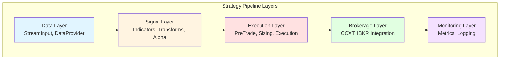

{{ nav_links() }}

# 레이어드 템플릿 시스템 아키텍처

## 관련 문서
- [Architecture Overview](README.md)
- [Strategy Development Workflow](../guides/strategy_workflow.md)
- [SDK Tutorial](../guides/sdk_tutorial.md)

---

## 개요

QMTL의 프로젝트 초기화 시스템은 단일 템플릿 방식에서 **레이어 기반 조립식 아키텍처**로 진화합니다. 전략 개발의 각 단계(데이터 공급, 신호 생성, 실행, 브로커리지)를 독립 레이어로 분리해 사용자가 필요한 구성 요소만 선택적으로 조합할 수 있게 합니다.

### 설계 목표

1. **관심사의 분리**: 각 레이어는 단일 책임을 가지고 독립적으로 관리됩니다.
2. **재사용성**: DAG 부분 재사용이라는 QMTL 철학과 일치합니다.
3. **점진적 학습**: 초보자가 단계별로 전략을 구축하며 학습할 수 있습니다.
4. **유연성**: 연구·백테스트·프로덕션 목적에 맞는 구성을 선택할 수 있습니다.
5. **유지보수성**: 레이어별 독립 관리로 복잡도 폭발을 방지합니다.

---

## 아키텍처 개요

### 레이어 구조



### 레이어별 책임

| 레이어 | 책임 | 주요 구성 요소 |
|--------|------|----------------|
| **Data** | 데이터 공급 및 수집 | StreamInput, HistoryProvider, DataProvider |
| **Signal** | 알파 생성 및 신호 변환 | Indicators, Transforms, Alpha Logic |
| **Execution** | 주문 실행 및 관리 | PreTradeGate, Sizing, ExecutionNode |
| **Brokerage** | 거래소 통합 | CCXT, IBKR, Custom Brokers |
| **Monitoring** | 관측 및 메트릭 수집 | Metrics, Event Recorder, Logging |

---

## CLI 인터페이스 설계

### 명령어 구조

```
qmtl project
  ├── init                  # 새 프로젝트 생성
  │   ├── --preset          # 프리셋 선택 (빠른 시작)
  │   ├── --layers          # 레이어 직접 선택
  │   └── --path            # 프로젝트 경로
  ├── layer                 # 기존 프로젝트 레이어 관리
  │   ├── add               # 레이어 추가
  │   │   ├── <layer>       # 추가할 레이어 (위치 인자)
  │   │   ├── --path        # 프로젝트 경로 (기본값: 현재 디렉터리)
  │   │   └── --template    # 사용할 템플릿 선택
  │   ├── list              # 레이어 및 템플릿 메타데이터 출력
  │   │   ├── --show-templates  # 템플릿 목록 표시
  │   │   └── --show-requires   # 템플릿 의존 패키지 표시
  │   └── validate          # 프로젝트 구조 검증
  │       └── --path        # 검증할 프로젝트 경로 (기본값: 현재 디렉터리)
  └── list-presets          # 프리셋 설명 출력
```

### 사용 예시

#### 1. 프리셋 기반 초기화 (빠른 시작)

```bash
# 사용 가능한 프리셋 확인
qmtl project list-presets

# 간단한 백테스팅 전략
qmtl project init --path my_backtest --preset minimal

# 프로덕션 준비 전략
qmtl project init --path my_prod --preset production

# 연구용 전략
qmtl project init --path my_research --preset research
```

#### 2. 레이어 선택 초기화 (커스텀)

```bash
# 데이터와 신호만 포함
qmtl project init --path my_strategy --layers data,signal

# 실행 레이어 추가
qmtl project init --path my_strategy --layers data,signal,execution

# 모든 레이어 포함
qmtl project init --path my_strategy --layers data,signal,execution,brokerage,monitoring
```

#### 3. 점진적 레이어 추가

```bash
# 기존 프로젝트에 실행 레이어 추가
cd my_strategy
qmtl project layer add execution

# 브로커리지 레이어 추가 (특정 템플릿 선택)
qmtl project layer add brokerage --template ccxt_binance

# 모니터링 레이어 추가
qmtl project layer add monitoring

# 사용 가능한 레이어 및 템플릿 확인
qmtl project layer list --show-templates --show-requires

# 프로젝트 구조 검증
qmtl project layer validate --path my_strategy
```

---

## 프리셋 정의

### Minimal (최소 구성)

**목적**: 백테스팅 및 연구
**레이어**: `data`, `signal`

```yaml
# qmtl/examples/presets/minimal.yml
name: minimal
description: "Minimal strategy for backtesting and research"
layers:
  - data
  - signal
templates:
  data: "templates/layers/data/stream_input.py"
  signal: "templates/layers/signal/single_indicator.py"
config:
  include_sample_data: true
  include_notebooks: true
```

**생성되는 구조**:
```
my_backtest/
├── strategy.py           # 진입점
├── qmtl.yml             # 설정
├── layers/
│   ├── data/
│   │   └── providers.py  # StreamInput 구현
│   └── signal/
│       └── indicators.py # 지표 계산
├── data/                # 샘플 데이터
│   └── sample_ohlcv.csv
└── tests/
    └── test_strategy.py
```

### Production (프로덕션)

**목적**: 실전 트레이딩
**레이어**: `data`, `signal`, `execution`, `brokerage`, `monitoring`

```yaml
# qmtl/examples/presets/production.yml
name: production
description: "Production-ready trading strategy with full execution pipeline"
layers:
  - data
  - signal
  - execution
  - brokerage
  - monitoring
templates:
  data: "templates/layers/data/ccxt_provider.py"
  signal: "templates/layers/signal/multi_indicator.py"
  execution: "templates/layers/execution/nodeset.py"
  brokerage: "templates/layers/brokerage/ccxt_binance_futures.py"
  monitoring: "templates/layers/monitoring/metrics.py"
config:
  include_backend_templates: true
  include_docker_compose: true
```

**생성되는 구조**:
```
my_prod/
├── strategy.py
├── qmtl.yml
├── layers/
│   ├── data/
│   │   ├── providers.py      # CCXT DataProvider
│   │   └── seamless.py       # Seamless 통합
│   ├── signal/
│   │   ├── indicators.py     # 복수 지표
│   │   └── alpha.py          # 알파 로직
│   ├── execution/
│   │   ├── pretrade.py       # PreTradeGate
│   │   ├── sizing.py         # Sizing
│   │   └── executor.py       # ExecutionNode
│   ├── brokerage/
│   │   └── binance.py        # Binance 통합
│   └── monitoring/
│       ├── metrics.py        # 메트릭 수집
│       └── alerts.py         # 알림 설정
├── templates/
│   ├── local_stack.example.yml
│   └── backend_stack.example.yml
├── docker-compose.yml
└── tests/
```

### Research (연구용)

**목적**: 알파 연구 및 분석
**레이어**: `data`, `signal`, `monitoring`

```yaml
# qmtl/examples/presets/research.yml
name: research
description: "Research-focused strategy with analysis tools"
layers:
  - data
  - signal
  - monitoring
templates:
  data: "templates/layers/data/questdb_provider.py"
  signal: "templates/layers/signal/research.py"
  monitoring: "templates/layers/monitoring/analysis.py"
config:
  include_notebooks: true
  include_sample_data: true
  include_docs: true
```

### Execution-Only (실행 전용)

**목적**: 외부 신호 기반 실행
**레이어**: `execution`, `brokerage`

```yaml
# qmtl/examples/presets/execution-only.yml
name: execution-only
description: "Execution layer for external signals"
layers:
  - execution
  - brokerage
templates:
  execution: "templates/layers/execution/signal_consumer.py"
  brokerage: "templates/layers/brokerage/multi_exchange.py"
config:
  signal_source: "external"
```

---

## 레이어 템플릿 구조

### 템플릿 디렉터리 구조

```
qmtl/examples/templates/layers/
├── data/
│   ├── stream_input.py          # 기본 StreamInput
│   ├── ccxt_provider.py         # CCXT DataProvider
│   ├── questdb_provider.py      # QuestDB 히스토리
│   └── seamless_provider.py     # Seamless 통합
├── signal/
│   ├── single_indicator.py      # 단일 지표 전략
│   ├── multi_indicator.py       # 복수 지표 전략
│   ├── branching.py             # 분기 전략
│   ├── state_machine.py         # 상태 머신
│   └── research.py              # 연구용 알파
├── execution/
│   ├── nodeset.py               # NodeSet 기반 실행
│   ├── pretrade.py              # PreTradeGate 단독
│   ├── sizing.py                # Sizing 전략
│   └── signal_consumer.py       # 외부 신호 소비
├── brokerage/
│   ├── ccxt_binance_spot.py     # Binance 현물
│   ├── ccxt_binance_futures.py  # Binance 선물
│   ├── ibkr.py                  # Interactive Brokers
│   └── multi_exchange.py        # 다중 거래소
└── monitoring/
    ├── metrics.py               # 메트릭 수집
    ├── alerts.py                # 알림 설정
    └── analysis.py              # 분석 도구
```

### 레이어 메타데이터

각 레이어는 메타데이터 파일을 포함합니다.

```yaml
# qmtl/examples/templates/layers/data/metadata.yml
layer: data
description: "Data ingestion and streaming layer"
dependencies: []
provides:
  - StreamInput
  - HistoryProvider
  - DataProvider
templates:
  - name: stream_input
    file: stream_input.py
    description: "Basic StreamInput with configurable interval"
    complexity: beginner
  - name: ccxt_provider
    file: ccxt_provider.py
    description: "CCXT-based data provider for exchange data"
    complexity: intermediate
    requires:
      - ccxt
```

---

## 구현 전략

### Phase 1: 기존 호환성 유지

1. **`--strategy` → `--preset` 마이그레이션**
   - `--strategy`는 사용 중단 경고 후 `--preset`으로 리다이렉션합니다.
   - 기존 템플릿을 프리셋으로 변환합니다.

2. **레이어 인프라 구축**
   - `qmtl/interfaces/layers/` 모듈을 생성합니다.
   - 레이어 로더와 검증 로직을 구현합니다.

3. **하위 호환성 보장**
   ```bash
   # 기존 방식 (계속 작동)
   qmtl project init --path test --strategy general
   # Warning: --strategy is deprecated, use --preset instead

   # 새 방식
   qmtl project init --path test --preset general
   ```

### Phase 2: 레이어 시스템 구현

1. **레이어 템플릿 생성**
   - 레이어별 기본 템플릿을 구현합니다.
   - 메타데이터 파일을 작성합니다.

2. **레이어 조합 엔진**
   ```python
   # qmtl/interfaces/layers/composer.py
   class LayerComposer:
       def compose(self, layers: List[str], dest: Path) -> None:
           """레이어를 조합하여 프로젝트 생성"""

       def add_layer(self, layer: str, dest: Path) -> None:
           """기존 프로젝트에 레이어 추가"""

       def validate(self, dest: Path) -> ValidationResult:
           """프로젝트 구조 검증"""
   ```

3. **CLI 명령어 구현**
   - `qmtl project layer add`
   - `qmtl project layer list`
   - `qmtl project layer validate`

### Phase 3: 프리셋 확장

1. **기본 프리셋 구현**
   - minimal, production, research, execution-only

2. **사용자 정의 프리셋 지원**
   ```bash
   # 프로젝트 로컬 프리셋
   qmtl project init --preset ./my-presets/custom.yml

   # 프리셋을 템플릿으로 저장
   qmtl project save-preset --name my-preset
   ```

3. **프리셋 공유 메커니즘**
   - 프리셋을 Git 저장소로 공유합니다.
   - 커뮤니티 프리셋 레지스트리를 마련합니다.

---

## 검증 및 제약사항

### 레이어 의존성 검증

레이어 간 의존성을 검증해 유효한 조합만 허용합니다.

```python
# 의존성 그래프
LAYER_DEPENDENCIES = {
    "data": [],
    "signal": ["data"],
    "execution": ["signal"],
    "brokerage": ["execution"],
    "monitoring": [],  # 모든 레이어와 독립적
}

def validate_layer_combination(layers: List[str]) -> ValidationResult:
    """레이어 조합의 유효성 검증"""
    for layer in layers:
        deps = LAYER_DEPENDENCIES.get(layer, [])
        missing = set(deps) - set(layers)
        if missing:
            return ValidationResult(
                valid=False,
                error=f"Layer '{layer}' requires: {missing}"
            )
    return ValidationResult(valid=True)
```

### 레이어 충돌 방지

동일 레이어를 중복 추가하지 못하도록 방지합니다.

```python
def detect_layer_conflicts(existing: List[str], new: str) -> bool:
    """레이어 충돌 감지"""
    if new in existing:
        raise LayerConflictError(
            f"Layer '{new}' already exists. "
            f"Use --force to replace."
        )
```

---

## 마이그레이션 가이드

### 기존 사용자를 위한 가이드

#### 기존 템플릿 → 새 프리셋 매핑

| 기존 `--strategy` | 새 `--preset` | 레이어 조합 |
|-------------------|---------------|-------------|
| `general` | `minimal` | data, signal |
| `single_indicator` | `minimal` | data, signal |
| `multi_indicator` | `minimal` | data, signal |
| `branching` | `research` | data, signal, monitoring |
| `state_machine` | `research` | data, signal, monitoring |

#### 마이그레이션 도구

현재 CLI에는 자동 변환 명령이 포함되어 있지 않습니다. 위 매핑을 참고해 `qmtl project init --preset ...` 또는 `--layers ...` 조합을 사용해 새 프로젝트를 생성하고, 기존 코드와 설정을 단계적으로 옮기세요. (향후 `qmtl project migrate` 명령을 제공할 계획입니다.)

---

## 향후 확장 계획

### 1. 레이어 플러그인 시스템

사용자가 커스텀 레이어를 등록하고 공유합니다.

```python
# ~/.qmtl/layers/custom_layer/
qmtl project register-layer --path ./custom_layer

# 등록된 레이어 사용
qmtl project init --layers data,signal,custom_layer
```

### 2. 대화형 프로젝트 생성

```bash
qmtl project init --interactive

? Select your use case:
  > Backtesting
    Production Trading
    Research & Analysis

? Select data source:
  > CCXT Exchange
    QuestDB
    CSV Files

? Include execution layer? (Y/n)
```

### 3. 레이어 템플릿 마켓플레이스

커뮤니티가 기여한 레이어 템플릿을 검색하고 설치합니다.

```bash
qmtl templates search "machine learning"
qmtl templates install ml-signal-layer
qmtl project init --layers data,ml-signal-layer
```

---

## 핵심 이점 요약

1. **유연성**: 필요한 구성 요소만 선택해 프로젝트를 생성할 수 있습니다.
2. **단순성**: 프리셋으로 빠르게 시작하고 레이어로 세밀하게 제어합니다.
3. **확장성**: 새 레이어 추가 및 기존 레이어 조합으로 무한히 확장할 수 있습니다.
4. **유지보수성**: 레이어별 독립 관리로 복잡도를 통제합니다.
5. **학습 곡선**: 레이어를 단계적으로 추가하면서 학습할 수 있습니다.
6. **재사용성**: QMTL의 DAG 재사용 철학과 완벽히 일치합니다.
7. **커뮤니티**: 레이어 공유와 협업을 촉진합니다.

---

## 참고 자료

- [Architecture Overview](README.md)
- [Strategy Development Workflow](../guides/strategy_workflow.md)
- [Exchange Node Sets](exchange_node_sets.md)
- [Execution Nodes](execution_nodes.md)
- [SDK Tutorial](../guides/sdk_tutorial.md)

---

**문서 버전**: 1.0
**최종 검토**: 2025-10-18
**다음 검토 예정**: 2025-11-18
