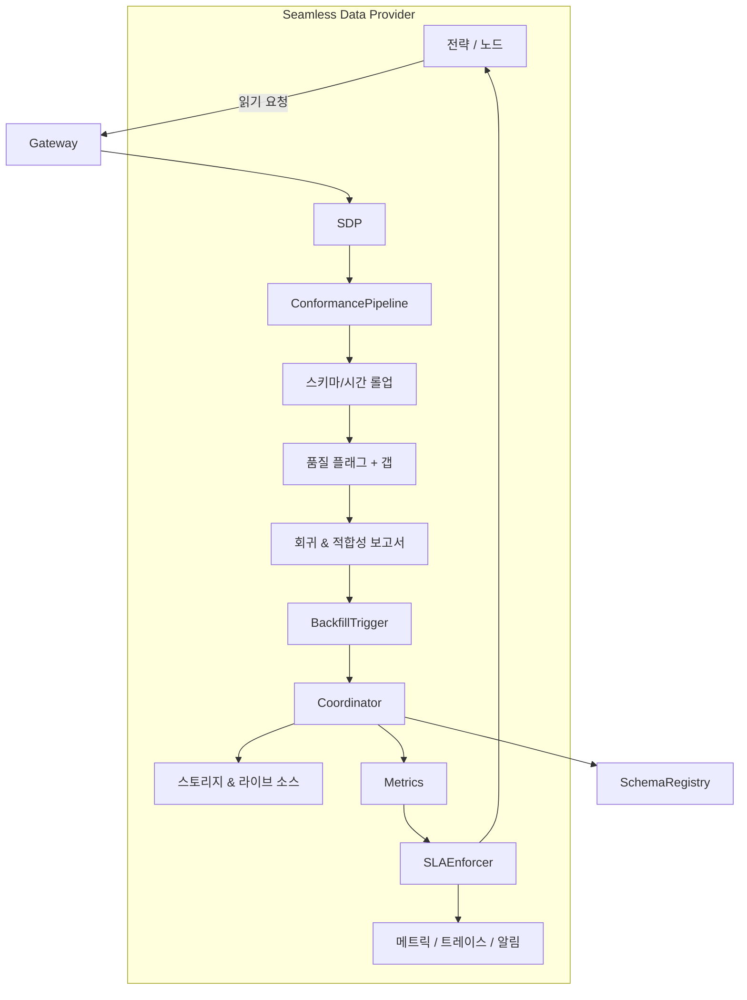

# 심리스 데이터 프로바이더 v2 아키텍처

> **상태:** 심리스 데이터 프로바이더 v2 아키텍처는 런타임에 정식 적용되었습니다. 분산 백필 코디네이터가 인프로세스 스텁을 대체했고, `SLAPolicy` 예산이 강제되며, 아래에서 언급하는 관측 지표가 기본으로 방출됩니다. 남은 로드맵은 핵심 서비스 공백이 아니라 스키마 거버넌스와 대시보드 다듬기에 집중합니다.

심리스 데이터 프로바이더(SDP)는 초기 설계 문서에서 설명한 프로토타입을 넘어, 요청이 들어오는 순간부터 데이터 품질·백필 SLA·스키마 안전성을 보장하는 프로덕션 시스템으로 진화했습니다. 아래 절에서는 현재도 진행 중인 기능을 명시해 독자가 런타임이 제공하는 보증을 과대평가하지 않도록 합니다.

## 상위 흐름



요청은 게이트웨이에 들어와 심리스 데이터 프로바이더에서 정규화된 후 적합성 파이프라인을 통과하고, 데이터가 반환되기 전에 각 단계가 명시적인 산출물(플래그, 보고서, 메트릭)을 방출해 하류 시스템이 응답의 완결성을 추론할 수 있도록 합니다.

## 적합성 파이프라인

`ConformancePipeline`은 세 단계로 동작합니다. 호출자는 여전히 명시적으로 `ConformancePipeline` 인스턴스를 넘겨 옵트인하지만, 런타임은 데이터 경로와 함께 구조화된 보고서를 방출합니다. 각 단계는 다음과 같습니다.

1. **스키마 롤업**은 표준 레지스트리 스키마를 기준으로 관측치를 집계하여 누락된 컬럼이나 잘못된 열거형이 클라이언트에 도달하기 전에 차단합니다.
2. **시간 롤업**은 심볼과 그레뉼러리티별 완전성 윈도우를 계산해 스토리지와 라이브 데이터를 정렬된 바 형태로 혼합할 수 있게 합니다.
3. **품질 플래그와 보고서**는 `qmtl://observability/seamless/<node>`에 게시되는 회귀 다이제스트를 생성하고 감사 목적에 맞춰 보관합니다.

2025년 9월 런타임 업데이트 이후 `EnhancedQuestDBProvider`를 통해 파이프라인이 기본 활성화됩니다. 정규화 경고는 반환된 보고서를 통해 계속 노출되며, 파이프라인에서 발생한 모든 경고 또는 플래그는 `ConformancePipelineError`를 발생시킵니다. 단, 공급자를 `partial_ok=True`로 인스턴스화하면 정규화된 프레임을 반환하고 `SeamlessDataProvider.last_conformance_report`를 통해 보고서를 제공해 레지스트리 롤아웃이 끝날 때까지 차단 동작을 지연할 수 있습니다.

## 분산 백필 코디네이터

`QMTL_SEAMLESS_COORDINATOR_URL`이 설정되면 분산 코디네이터가 기본값으로 사용됩니다. SDK는 `DistributedBackfillCoordinator`를 인스턴스화해 Raft 서비스와 리스를 협상하고, URL이 없거나 서비스에 접근할 수 없는 경우에만 기존 인메모리 가드로 폴백합니다. 프로덕션 구현은 다음 기능을 제공합니다.

- **정렬된 리스**를 통해 중복 요청이 동일 작업을 공유하도록 하여 백필 중복을 제거합니다.
- **리스 만료 텔레메트리**와 자동 실패 신호를 통해 작업 중단 시 정체된 클레임을 감지합니다.
- **부분 완료 추적**으로 `backfill_completion_ratio{node_id,interval,lease_key}` 게이지를 프로메테우스에 방출하고 `seamless.backfill` 구조화 로그를 기록합니다.
- **복구 훅**이 실패한 리스를 재처리 대상으로 표시해 모든 샤드가 완료되거나 명시적 위반을 보고하도록 보장합니다.

소비자는 더 이상 코디네이터 스텁을 제공할 필요가 없습니다. 환경 설정으로 서비스를 활성화하면 분산 경로가 작동합니다.

## SLA 집행

모든 심리스 요청에서 `SLAPolicy` 예산이 존중됩니다. 프로바이더는 스토리지, 백필, 라이브 피드, 전체 요청에 사용한 시간을 추적하고 `seamless_sla_deadline_seconds{node_id,phase}` 히스토그램에 기록합니다. 구성된 예산을 초과하면 런타임은 `SeamlessSLAExceeded`를 발생시키고 `seamless.sla`에 위반을 기록하며 호출자가 우아하게 강등할 수 있도록 실패를 노출합니다. 정책은 동기식 갭 바의 최대 개수도 제한할 수 있으며, 위반 시 동일한 예외를 `sync_gap` 단계로 발생시킵니다.

트레이싱 훅은 향후 스팬 정보를 풍부하게 할 준비가 되어 있고, 현재는 메트릭과 예외 동작이 활성화되어 있습니다.

## 스키마 레지스트리 거버넌스

스키마 검증은 아직 최선의 노력 수준입니다. 런타임은 호출자가 스키마 정의를 제공할 수 있는 도구를 노출하지만 중앙 레지스트리를 조회하지는 않습니다. 목표 상태는 두 가지 모드를 도입하는 것입니다.

- **카나리** 검증은 요청을 미러링하고 호환성 진단을 기록하지만 차단하지 않습니다.
- **스트릭트** 검증은 승인된 스키마와 다른 페이로드가 반환되는 즉시 응답을 차단합니다.

현재는 소비자별로 모드 전환을 수동으로 수행해야 하며 감사 로그, 레지스트리 통합, 스키마 번들 핑거프린팅 자동화가 없습니다.

## 관측 지표

프로메테우스는 위에서 설명한 코디네이터 및 SLA 메트릭과 기존 적합성 카운터를 함께 노출합니다. 운영 가이드에서 언급한 Jsonnet 대시보드는 이 메트릭만으로 바로 렌더링할 수 있습니다. 스키마 레지스트리 작업이 완료되면 트레이싱 스팬 속성이 더욱 풍부해지겠지만, 코디네이터와 SLA 계측을 위해 추가 변경은 필요하지 않습니다.

## 검증 & 실패 주입 테스트 스위트

Seamless v2는 본 문서의 약속을 뒷받침하는 회귀 스위트를 제공합니다.

- **커버리지 대수 프로퍼티 테스트**는 `merge_coverage`와 `compute_missing_ranges`를 Hypothesis 기반 시나리오로 실행해 구간 경계와 누락 범위 계산이 결합법칙을 만족하며 손실이 없음을 보증합니다.
- **실패 주입 테스트**는 코디네이터 리스 손실, SLA 데드라인 초과, 스키마 불일치를 시뮬레이션해 런타임이 예상대로 `SeamlessSLAExceeded` 또는 `ConformancePipelineError`를 노출하는지 확인합니다.
- **관측 스냅샷**은 백필 동안 방출되는 프로메테우스 카운터와 구조화 로그 필드(`node_id`, `interval`, `start`, `end`)를 보호합니다.

다음 명령으로 로컬이나 CI에서 스위트를 실행할 수 있습니다.

```
uv run -m pytest -W error -n auto \
  tests/qmtl/runtime/sdk/test_history_coverage_property.py \
  tests/qmtl/runtime/sdk/test_seamless_provider.py
```

위 명령은 새로운 회귀가 배포 전에 드러나도록 CI 심리스 작업에도 연결되어 있습니다.

## 다음 단계

이제 팀은 분산 코디네이터로 워크로드를 마이그레이션하고 SLA 알림을 연동할 수 있으며 추가 런타임 릴리스를 기다릴 필요가 없습니다. 남은 스키마 거버넌스 이정표는 #1150–#1152 이슈를 추적하면 되고, 본 문서에서 설명한 코디네이터와 SLA 작업은 완료되었습니다.
